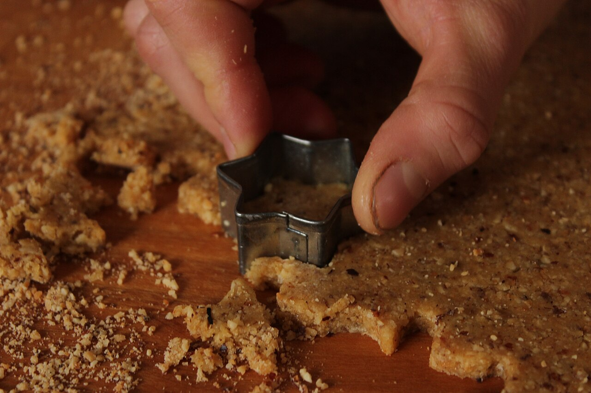

# Classes and objects

*A class is the blueprint; an object is a real thing built from it. Define a class, create objects — new in Java, ClassName() in Python — and give each one its starting values with a constructor (Java constructor / Python __init__). One blueprint, many independent objects.*

> Until now your programs have been loose collections of variables and functions — a `name` here, a
> `greet()` there, nothing holding them together. But real software is full of *things*: users, orders,
> test cases, browser pages. Each thing bundles some data with some behaviour, and object-oriented
> programming is simply the tool for describing those things once and stamping out as many as you need.
> This matters directly to your testing future: the Page Object Model — the pattern every Selenium
> framework is built on — is nothing but classes and objects wearing a QA badge. Learn what a class is
> (a blueprint), what an object is (a thing built from that blueprint), and how a constructor gives each
> new object its starting values, and you've unlocked the single biggest idea in both Java and Python.

> **In real life**
>
> A class is **a cookie cutter, and objects are the cookies.** The cutter itself is not a cookie — you
> can't eat it — but it defines the *shape* every cookie will have. Press it into dough once, you get a
> cookie; press it five times, you get five separate cookies, each decorated differently, each eaten (or
> dropped) without affecting the others. That's the relationship: the
> **class**: A blueprint or template that defines what data (fields) and behaviour (methods) its objects will have. The class itself is just the definition — you create objects (instances) from it, and each object gets its own copy of the data.
> is the one cutter, written once; each object is one cookie stamped from it, with its own icing (its own
> data). When code says `new User("Sajan")` in Java or `User("Sajan")` in Python, that's one press of the
> cutter — a fresh, independent cookie. Change one cookie's icing and the cutter, and every other cookie,
> stays exactly as it was.

## A class is a blueprint, an object is a thing built from it

A class *describes* a kind of thing; an object *is* one of those things. You write the class once, then
create (instantiate) as many objects from it as you like.

**Python:**
```python
class User:                      # the blueprint
    def __init__(self, name):
        self.name = name         # each object gets its own name

alice = User("Alice")            # object #1 -- ClassName(...) creates it
bob = User("Bob")                # object #2, completely separate
print(alice.name)                # Alice
print(bob.name)                  # Bob
```

**Java:**
```java
class User {                     // the blueprint
    String name;
    User(String name) {          // the constructor
        this.name = name;
    }
}

User alice = new User("Alice");  // object #1 -- new creates it
User bob = new User("Bob");      // object #2, completely separate
System.out.println(alice.name);  // Alice
System.out.println(bob.name);    // Bob
```

Notice what's the same and what differs. Both languages define the class once and create objects by
'calling' it with starting values. Java needs the keyword `new` in front (`new User("Alice")`); Python
just calls the class like a function (`User("Alice")`). And by near-universal convention, **class names
are Capitalized** (`User`, `LoginPage`) while variables stay lowercase — that's how you tell blueprint
from cookie at a glance.


*Photo: cookie cutter in dough — Wikimedia Commons, CC BY-SA 3.0. [Source](https://commons.wikimedia.org/wiki/File:Making_cookies_15.jpg)*
- **The cutter = the class** — The metal cutter defines the shape every cookie will have, but it is not itself a cookie. That's a class: User defines what every user object will carry (a name, say), yet writing the class creates zero objects — just the blueprint. One cutter, one definition.
- **Each cut shape = an instance (object)** — Every star the cutter stamps out is one object — an instance of the class. In Java that press is 'new User("Alice")'; in Python it's 'User("Alice")'. Each press makes a brand-new, independent object; the act is called instantiation.
- **The rolled dough = the memory objects live in** — The dough is the raw material each cookie is carved from — the memory your objects occupy. Press the cutter and a fresh object is stamped out of it; every instance takes its own space and holds its own field values (alice.name is 'Alice' while bob.name is 'Bob').
- **Swap the cutter once = change every future object** — Change the cutter and every cookie stamped afterward gets the new shape (ones already cut are unchanged). Edit the class — add a field, fix a method — and all objects created after get it. One definition drives many instances: fix it in one place.

## The constructor: giving each object its starting values

A freshly stamped cookie needs icing; a freshly created object needs starting values. That's the
constructor's job — a special piece of code that **runs automatically when the object is created**:

```python
class TestCase:
    def __init__(self, title, priority):   # runs on TestCase(...)
        self.title = title
        self.priority = priority

tc = TestCase("Login with valid password", "high")
print(tc.title)      # Login with valid password
print(tc.priority)   # high
```

In Python the constructor is always named `__init__` (two underscores each side), and its first
parameter is `self` — the object being set up (much more on `self` next note). In Java the constructor
is a method with **the same name as the class and no return type**:

```java
class TestCase {
    String title;
    String priority;

    TestCase(String title, String priority) {   // runs on new TestCase(...)
        this.title = title;
        this.priority = priority;
    }
}
```

Either way, the values you pass at creation time — `TestCase("Login...", "high")` — land in the
constructor's parameters, and the constructor stores them on the new object. If you try to create the
object without the values the constructor requires, both languages stop you with an error. That's a
feature: a constructor is your guarantee that **no object exists half-built**.

**From blueprint to living objects. Press Play.**

1. **Write the class (the blueprint)** — class User: ... defines what every user object will have — here, a name. At this point NO objects exist. A class definition is pure description, like a cookie cutter hanging on the wall: shape defined, zero cookies baked.
2. **Create an object (instantiate)** — alice = User('Alice') in Python, or User alice = new User('Alice') in Java. This is the press of the cutter: the program allocates a fresh object in memory and immediately hands it to the constructor for setup.
3. **The constructor runs automatically** — You never call __init__ or the Java constructor by name — creation triggers it. It receives the values you passed ('Alice') and stores them on the new object: self.name = name (Python) or this.name = name (Java). The object leaves the constructor fully set up.
4. **Create more objects from the same class** — bob = User('Bob') stamps a second cookie. The class is written once; you instantiate as often as you like. Ten users, a thousand test cases — one blueprint each, any number of objects.
5. **Each object is independent** — alice.name is 'Alice'; bob.name is 'Bob'. Each object owns its own copy of the fields, so changing one never touches another. The variable (alice) is just a name pointing at the object — the object itself lives in memory with its own data.

*Try it — define a class and stamp out objects in Python. Press Run.*

```python
class User:
    def __init__(self, name, role):
        # runs automatically when you write User(...)
        self.name = name
        self.role = role

# create objects: just call the class like a function
alice = User("Alice", "tester")
bob = User("Bob", "developer")

print("alice:", alice.name, "-", alice.role)   # alice: Alice - tester
print("bob:  ", bob.name, "-", bob.role)       # bob:   Bob - developer

# each object is independent: change one, the other is untouched
alice.role = "senior tester"
print("after promotion:")
print("alice:", alice.role)                    # senior tester
print("bob:  ", bob.role)                      # developer (unchanged)

# the class and the object are different things
print(type(alice))                             # <class '__main__.User'>
```

Here's the **same in Java** — note the `new` keyword, the constructor named after the class, and the
type (`User`) on the variable:

*Try it — define a class and stamp out objects in Java. Press Run.*

```java
class User {
    String name;
    String role;

    User(String name, String role) {   // constructor: same name as class
        this.name = name;
        this.role = role;
    }
}

public class Main {
    public static void main(String[] args) {
        // create objects with new
        User alice = new User("Alice", "tester");
        User bob = new User("Bob", "developer");

        System.out.println("alice: " + alice.name + " - " + alice.role);
        System.out.println("bob:   " + bob.name + " - " + bob.role);

        // each object is independent
        alice.role = "senior tester";
        System.out.println("after promotion:");
        System.out.println("alice: " + alice.role);   // senior tester
        System.out.println("bob:   " + bob.role);     // developer (unchanged)
    }
}
```

> **Tip**
>
> Keep the vocabulary straight and the whole topic gets easier: the **class** is the definition (written
> once, Capitalized); an **object** — also called an *instance* — is one thing created from it; and
> **instantiating** is the act of creating (`new User(...)` in Java, `User(...)` in Python). A quick
> self-check that you've got it: the class `User` is to `alice` what the word 'recipe' is to an actual
> cake on your table. And file this away for your automation future: in the Page Object Model you'll write
> `class LoginPage` once, then instantiate it in every test that touches the login screen — same cutter,
> fresh cookie per test.

### Your first time: First time? Build your first class

- [ ] Define an empty-ish class and read it back — In the Python playground, look at the class User block. Notice it creates nothing by itself — it's a description. Rename it to Tester and update the two creation lines to match. Class defined, still zero objects: that's the blueprint stage.
- [ ] Instantiate two objects — alice = User('Alice', 'tester') and bob = User('Bob', 'developer'). Each call stamps a fresh object. In Java the same act needs the new keyword: new User(...). Add a third person — a User('you', 'learner') — and print their name.
- [ ] Watch the constructor run — Add a print('creating a user!') as the first line inside __init__ (or the Java constructor). Run it: the message appears once per object created, and you never called the constructor by name. Creation triggers it — that's the 'automatic setup' guarantee.
- [ ] Prove objects are independent — Change alice.role and print both roles. Bob's is untouched. Each object holds its own copy of the data — this is the fact that makes objects useful: one blueprint, many separate things, no crosstalk.
- [ ] Break it on purpose — Try creating a user with no arguments: User(). Python complains about missing arguments; Java refuses to compile. That's the constructor protecting you — no object gets built without the values it needs. Read the error so you'll recognise it in the wild.

Fifteen minutes and you can define a class, instantiate objects from it, and explain why the constructor exists — the foundation everything else in this chapter stands on.

- **“TypeError: User() missing 1 required positional argument (Python).”**
  Your __init__ demands arguments you didn't supply — User('Alice') when __init__ wants name AND role. Count the parameters after self and pass exactly that many at creation. Java's version of this is a compile error: 'constructor User in class User cannot be applied to given types.' Same cause, same fix: match the constructor's parameter list.
- **“My object has no attributes — AttributeError: 'User' object has no attribute 'name'.”**
  Usually a misspelled constructor. Python only treats __init__ (two underscores EACH side) as the constructor — write _init_ or __int__ and it's just an ignored method, so no fields ever get set. Check the spelling, and check you wrote self.name = name (storing on the object) rather than just name = name (storing into a local variable that vanishes).
- **“Java says 'cannot find symbol' when I create the object.”**
  Three usual suspects: the class name is misspelled at the creation site (new Usr(...)), the class isn't defined in (or imported into) the file you're using it from, or you forgot new entirely — User alice = User('Alice') doesn't compile; Java always needs new ClassName(...). Python has no new; adding it there is a syntax error.
- **“I changed one object and another one changed too.”**
  You probably have two variable names pointing at ONE object, not two objects. bob = alice doesn't create a second user — it makes bob another name for the same object, so alice.role = 'x' shows up via bob as well. To get a genuinely separate object you must instantiate again: bob = User('Bob', ...). Two presses of the cutter, not two labels on one cookie.

### Where to check

Debugging class and object creation:

- **Is it a class or an object you're holding?** — `User` (Capitalized) is the blueprint; `alice` is an instance. Calling methods on the class when you meant the object (or vice versa) is a classic slip. `print(type(x))` in Python tells you what x really is.
- **Constructor spelling** — Python: exactly `__init__`, first parameter `self`. Java: exactly the class name, no return type (adding `void` silently turns it into an ordinary method).
- **Argument count** — the values you pass at creation must match the constructor's parameters (after `self` in Python). Missing-argument errors point here.
- **Did you actually instantiate twice?** — `b = a` copies the *reference*, not the object. Two independent objects require two creation calls.
- **Storing on the object?** — inside the constructor it must be `self.name = name` / `this.name = name`. A bare `name = name` sets nothing on the object.

### Worked example: the two users who were secretly one — a missing instantiation, traced

A beginner writes code to model two users, but every change to one 'user' mysteriously hits the other:

```python
class User:
    def __init__(self, name):
        self.name = name

alice = User("Alice")
bob = alice              # BUG: no second User(...) call
bob.name = "Bob"
print(alice.name)        # Bob   -- wait, Alice got renamed?!
```

1. **The symptom:** renaming `bob` also renamed `alice`. The two variables seem entangled — change one,
   the other follows.
2. **Count the instantiations:** `User(...)` appears exactly **once**. One press of the cookie cutter
   means one cookie exists, no matter how many variables you create afterwards.
3. **What `bob = alice` really did:** it didn't build a user — it made `bob` a second name for the *same
   object* `alice` points at. One object, two labels. So `bob.name = "Bob"` rewrote the only user's
   name, and `alice.name` shows the same change because it *is* the same object.
4. **The fix — instantiate a second object:**
   ```python
   alice = User("Alice")
   bob = User("Bob")     # a second press of the cutter
   print(alice.name)     # Alice
   print(bob.name)       # Bob
   ```
5. **Why this trips people up:** with simple values it feels different — `b = a` on numbers behaves like
   a copy. With objects, variables hold *references* (arrows pointing at the object), and assignment
   copies the arrow, not the thing. Java behaves the same way: `User bob = alice;` is one object, two
   references.
6. **Tester's angle:** this exact bug appears in test code constantly — two tests 'sharing' a page
   object or a test-data object that one test mutates, making the *other* test fail mysteriously. When a
   test only fails when run after another test, suspect shared objects. The cure is the one above: fresh
   instantiation per test, so every test gets its own cookie.

> **Common mistake**
>
> Confusing the blueprint with the thing built from it. The class is not an object: writing `class User`
> creates zero users, and trying to use the class directly — `User.name` in Python, or calling instance
> behaviour on the class in Java — either errors or does something you didn't mean. The paired mistakes
> are all cousins of this one: forgetting `new` in Java (`User u = User("A")` won't compile), misspelling
> Python's `__init__` so the constructor silently never runs and your object has no attributes, and
> writing `bob = alice` believing it creates a second object when it only creates a second *name* for the
> first one. Keep the cookie-cutter picture in your head: the class is the cutter, every object needs its
> own press, and a variable is just a sticky label on one particular cookie.

**Quiz.** You write class Dog with a constructor that takes a name, then run: a = Dog('Rex') and b = Dog('Rex'). How many Dog objects exist, and are a and b the same object?

- [ ] One object — since both dogs have the same name, Python and Java reuse it
- [x] Two objects — each Dog('Rex') call is a separate instantiation, so a and b are independent even though their data looks identical
- [ ] Zero objects until you call a method on one of them
- [ ] Two objects in Java (because of new) but one object in Python

*Every constructor call stamps a brand-new object — two calls, two objects — regardless of whether the data inside happens to match. a and b are two separate dogs that both happen to be named 'Rex': change a's name and b is untouched. Identical-looking data does not mean identical object. (Contrast with b = a, which creates NO new object — just a second reference to the first one.) This distinction between 'same object' and 'equal-looking data' will come back throughout your testing career, from == vs .equals() in Java to why tests must not share mutable objects.*

- **Class** — The blueprint: a definition of what data (fields) and behaviour (methods) its objects will have. Written once, Capitalized by convention (User, LoginPage). Defining a class creates zero objects.
- **Object (instance)** — One concrete thing created from a class, with its own copy of the fields. alice and bob can both be Users with different data. Objects from the same class are independent of each other.
- **Instantiation** — The act of creating an object from a class. Java: new User('Alice') — the new keyword is required. Python: User('Alice') — call the class like a function. Each call creates a fresh, separate object.
- **Constructor** — Special code that runs automatically when an object is created, setting its starting values. Java: a method named exactly after the class, with no return type. You never call it directly — creation triggers it.
- **__init__ (Python)** — Python's constructor: def __init__(self, ...). Two underscores each side; first parameter is self (the new object). Misspell it and it silently becomes an ordinary method — the object ends up with no attributes set.
- **Reference vs new object** — b = a copies the reference (arrow), not the object — one cookie, two labels. Only a constructor call makes a new object. If changing one 'object' changes another, you almost certainly have two names for one object.

### Challenge

Build a tiny model of your QA world. (1) Define a class `Tester` with a constructor taking `name` and
`speciality` — do it in Python first, then mirror it in Java (remember `new`, and the constructor named
after the class). (2) Instantiate three testers with different specialities and print each one's details.
(3) Add a `print` inside the constructor and confirm it fires exactly three times — once per
instantiation, never called by name. (4) Deliberately trigger two errors and read them: create a Tester
with missing arguments, and (Python) misspell `__init__` as `_init_` then try to access a field.
(5) Write two sentences: what is the difference between `t2 = t1` and `t2 = Tester(...)`, and why would
the first one make two tests interfere with each other? Nail that and you've truly separated blueprint
from cookie.

### Ask the community

> Classes question: I defined a class in [Python/Java] but [creating an object errors / my object has no attributes / two objects seem linked]. Here's my class and the line where I create the object [paste both], plus the exact error. What am I missing?

Paste the whole class, not just the error — constructor bugs (misspelled `__init__`, wrong parameter
count, missing `new` in Java) live in the definition, and the creation line alone doesn't show them. If
two objects seem linked, show every line where you assigned one object variable to another: `b = a` is
one object with two names, and that's the answer nine times out of ten.

- [Python docs — classes (tutorial)](https://docs.python.org/3/tutorial/classes.html)
- [Dev.java — objects, classes, and interfaces](https://dev.java/learn/oop/)
- [Python OOP 1: Classes and Instances — Corey Schafer](https://www.youtube.com/watch?v=ZDa-Z5JzLYM)

🎬 [Classes and instances — the blueprint and the cookies — Corey Schafer](https://www.youtube.com/watch?v=ZDa-Z5JzLYM) (15 min)

- A class is a blueprint: it defines what data and behaviour its objects will have, but is not itself one of them. Defining a class creates zero objects — it's the cookie cutter, not a cookie.
- An object (instance) is one concrete thing created from a class, with its own independent copy of the fields. One class, any number of objects; changing one object never touches another.
- Creation syntax differs: Java requires new (new User('Alice')); Python calls the class like a function (User('Alice')). Both trigger the constructor automatically — you never call it by name.
- The constructor sets each new object's starting values: Java's is a method named exactly after the class (no return type); Python's is __init__ with self first. Wrong arguments at creation = immediate error, which is the constructor protecting you from half-built objects.
- b = a does NOT create a second object — it copies the reference, giving one object two names. Only another constructor call makes another object. 'Two things changing together' almost always means two labels on one cookie.


---
_Source: `packages/curriculum/content/notes/a-first-language-deeper/object-oriented-basics/classes-and-objects.mdx`_
