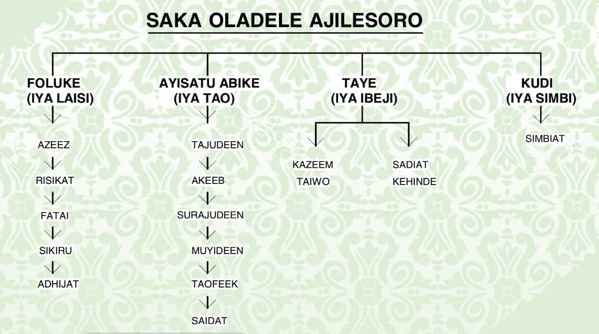

# Inheritance

*One class can build on another: Java extends, Python parentheses after the class name. The child inherits every field and method, overrides what it needs to change, and reaches the parent with super. When an 'is-a' relationship truly fits, inheritance kills duplication — when it doesn't, skip it.*

> You've written a `BankAccount` class. Now you need a `SavingsAccount` — identical, plus an interest
> rate. Do you copy the whole class and edit it? You already know how that story ends: two copies drift
> apart, a bug fixed in one survives in the other, and future-you curses past-you. Inheritance is the
> language's answer: declare that `SavingsAccount` *is a* `BankAccount`, and it receives every field and
> method for free — you write only what's new or different. This is also a pattern you'll live inside as
> an automation engineer: nearly every test framework has a `BaseTest` or `BasePage` that all others
> extend, so login and setup exist in exactly one place. Learn `extends` (Java), the parentheses
> (Python), overriding, and `super` — and just as importantly, learn when *not* to reach for any of it.

> **In real life**
>
> Inheritance is **a family tree, read downward.** A child inherits from a parent — eye colour, surname,
> the family recipes — without anyone re-writing them from scratch. In code,
> **inheritance**: A relationship where one class (the child or subclass) is built on another (the parent or superclass), automatically receiving all its fields and methods. The child can add new members or override inherited ones. Declared with extends in Java, parentheses in Python.
> means `SavingsAccount` inherits everything `BankAccount` has, then adds its own twist — like a child
> who has the family nose but their own laugh. The child can also *override*: grandma's recipe, but with
> less sugar — same dish name, different execution, and `super` is how you still consult grandma's
> original while making your version. One caution the analogy carries well: you inherit from family, not
> from convenient strangers. A class should only extend another when it truly IS one of those — not just
> because it wants to borrow a few useful methods.

## extends and (Base): building a child class

Declare the parent once, and the child names it — `extends` in Java, parentheses in Python. Everything
the parent defines, the child automatically has:

**Python:**
```python
class Animal:                        # parent (base / superclass)
    def __init__(self, name):
        self.name = name

    def eat(self):
        print(self.name, "is eating")

class Dog(Animal):                   # child: Dog IS-An Animal
    def fetch(self):
        print(self.name, "fetches the ball")

rex = Dog("Rex")
rex.eat()        # inherited from Animal -- Dog never defined it
rex.fetch()      # Dog's own addition
```

**Java:**
```java
class Animal {
    String name;
    Animal(String name) { this.name = name; }
    void eat() { System.out.println(name + " is eating"); }
}

class Dog extends Animal {           // child: Dog IS-An Animal
    Dog(String name) { super(name); }   // pass name up to the parent
    void fetch() { System.out.println(name + " fetches the ball"); }
}
```

Read the declaration as the sentence it encodes: `class Dog extends Animal` / `class Dog(Animal)` means
**'a Dog is an Animal.'** That *is-a* test is the gatekeeper for the whole feature — if the sentence
sounds wrong ('a Car is an Engine'? no — a car *has* an engine), inheritance is the wrong tool, and you
want a plain field instead (that alternative is called *composition*). One Java detail to notice
already: the child's constructor calls `super(name)` to run the parent's constructor. Hold that thought
— it's where inheritance most often bites, and the next section deals with it head-on.


*Photo: Ajilesoro family tree — Wikimedia Commons, CC BY-SA 4.0. [Source](https://commons.wikimedia.org/wiki/File:Ajilesoro_Family_Tree(SAKA_OLADELE_AJILESORO).jpg)*
- **The ancestor at the top = the base class** — The topmost person is the parent class (also called base class or superclass): Animal, BankAccount, BasePage. It defines the traits everyone below will share. It's a complete, usable class in its own right — parents exist even without children.
- **The branch line = extends / (Base)** — Each line down the tree is the inheritance declaration: class Dog extends Animal in Java, class Dog(Animal) in Python. The line means IS-A: everything below the line is a kind of the thing above it, and receives all its fields and methods automatically.
- **Inherited traits = fields and methods for free** — The child has the family nose without re-growing it: Dog can call eat() and use name although Dog's own body never defines them. That's the payoff — shared behaviour written once at the top, available to every descendant.
- **The child's own traits = new members** — Each person also has traits nobody above them has: Dog adds fetch(). A child class = everything inherited PLUS its own additions. If a child adds nothing and changes nothing, it didn't need to exist.
- **Same trait, done differently = overriding** — Grandma's recipe, less sugar: a child can redefine an inherited method with the same name — Dog overriding speak() to bark. Callers still just say speak(); which version runs depends on the actual object. super lets the override still call the parent's original.

## Overriding and super: change the behaviour, keep the connection

Inheriting a method as-is is nice; *changing* it is where the power lives. A child can **override** an
inherited method by defining one with the same name — its version wins for its objects:

```python
class Animal:
    def speak(self):
        print("...some generic animal noise...")

class Dog(Animal):
    def speak(self):                 # override: same name, new behaviour
        print("Woof!")

class Cat(Animal):
    def speak(self):
        print("Meow!")

for pet in [Dog(), Cat(), Animal()]:
    pet.speak()      # Woof! Meow! ...some generic animal noise...
```

Notice the loop: it calls `speak()` on each object without knowing or caring which kind it holds, and
each object answers in its own voice. That 'right version picks itself' behaviour is called
*polymorphism* — a big word for a simple, pleasant fact.

Sometimes the child doesn't want to *replace* the parent's behaviour but to *extend* it — do everything
the parent does, plus more. That's `super`: a handle on the parent's version. It matters most in
constructors. If a child defines its own constructor, the parent's setup doesn't happen by magic — the
child must invoke it:

```python
class SavingsAccount(BankAccount):
    def __init__(self, owner, rate):
        super().__init__(owner)      # run the parent's setup FIRST
        self.rate = rate             # then add the child's own field
```

Java is stricter about the same rule: `super(owner);` must be the **first line** of the child's
constructor, and if the parent has no zero-argument constructor, the compiler refuses to build the
child until you write that call. Python won't stop you — it just lets the parent's fields silently not
exist, and you crash later. Both languages, one law: **the parent sets up its part first; the child
builds on top.** Family tree, remember — you can't be born before your parents.

**How a method call climbs the family tree. Press Play.**

1. **A call arrives on a child object** — rex.eat() — rex is a Dog. The language needs to find an eat method to run. It doesn't matter that Dog never defined one; the search is about to handle that.
2. **Look in the child class first** — Dog is checked first. If Dog defines eat(), that version runs — this is why overriding works: the child's version is found before the parent's and wins. Dog has no eat(), so the search continues.
3. **Climb to the parent** — Animal is checked next — and it has eat(). That inherited method runs, with self/this still being rex, so it prints rex's own name. Not found there either? The climb continues upward until the tree runs out (then: AttributeError / compile error).
4. **Override = intercept the climb** — Now call rex.speak() where Dog overrides speak(). The search stops at Dog — 'Woof!' — and Animal's version never runs. Same call on a Cat finds Cat's meow. One method name, per-class behaviour: polymorphism.
5. **super = deliberately go up one level** — Inside Dog's override, super().speak() (Python) or super.speak() (Java) skips Dog's own version and runs Animal's — 'do the generic thing, THEN my extras.' In constructors this is law: the child calls super's constructor so the parent's fields exist before the child adds its own.

*Try it — inherit, override, and call super in Python. Press Run.*

```python
class BankAccount:
    def __init__(self, owner):
        self.owner = owner
        self.balance = 0

    def deposit(self, amount):
        self.balance = self.balance + amount

    def describe(self):
        print(self.owner, "->", self.balance)

class SavingsAccount(BankAccount):        # SavingsAccount IS-A BankAccount
    def __init__(self, owner, rate):
        super().__init__(owner)           # parent sets owner + balance
        self.rate = rate                  # child adds its own field

    def add_interest(self):               # child-only behaviour
        self.balance = self.balance + int(self.balance * self.rate)

    def describe(self):                   # override, extending the parent
        super().describe()                # reuse the parent's printing...
        print("  (savings, rate", self.rate, ")")

plain = BankAccount("Alice")
savings = SavingsAccount("Bob", 0.10)

plain.deposit(100)          # defined once in the parent...
savings.deposit(100)        # ...inherited for free by the child
savings.add_interest()      # child-only method

plain.describe()            # Alice -> 100
savings.describe()          # Bob -> 110, plus the savings line

print(isinstance(savings, BankAccount))   # True -- a savings IS-A account
```

Here's the **same in Java** — `extends`, `super(...)` as the constructor's first line, and
`@Override` (a safety annotation that makes the compiler verify you really are overriding):

*Try it — inherit, override, and call super in Java. Press Run.*

```java
class BankAccount {
    String owner;
    int balance = 0;

    BankAccount(String owner) { this.owner = owner; }

    void deposit(int amount) { balance = balance + amount; }

    void describe() { System.out.println(owner + " -> " + balance); }
}

class SavingsAccount extends BankAccount {   // IS-A BankAccount
    double rate;

    SavingsAccount(String owner, double rate) {
        super(owner);            // MUST be first: parent sets up its part
        this.rate = rate;
    }

    void addInterest() { balance = balance + (int)(balance * rate); }

    @Override
    void describe() {            // override, extending the parent
        super.describe();        // reuse the parent's printing...
        System.out.println("  (savings, rate " + rate + ")");
    }
}

public class Main {
    public static void main(String[] args) {
        BankAccount plain = new BankAccount("Alice");
        SavingsAccount savings = new SavingsAccount("Bob", 0.10);

        plain.deposit(100);
        savings.deposit(100);    // inherited from the parent
        savings.addInterest();   // child-only

        plain.describe();        // Alice -> 100
        savings.describe();      // Bob -> 110, plus the savings line
    }
}
```

> **Tip**
>
> Before you write `extends`, say the sentence out loud: **'X is a Y.'** A `SavingsAccount` is a
> `BankAccount` — inherit. A `LoginPage` is a `BasePage` — inherit. But a `Car` is not an `Engine`, and a
> `UserService` is not a `Database` — those are *has-a* relationships, so give the class a field instead
> (composition). The professional rule of thumb is 'composition over inheritance': keep trees shallow
> (one, maybe two levels), inherit only for genuine is-a, and never extend a class just to borrow a handy
> method. Your automation future has the perfect legitimate example waiting: every test class extending
> `BaseTest` so browser setup and teardown exist in exactly one place — is-a, shallow, and boring in the
> best way.

### Your first time: First time? Grow a class tree

- [ ] Extend a class and use something you never wrote — In the Python playground: SavingsAccount defines no deposit method, yet savings.deposit(100) works. That's inheritance earning its keep — the method lives once, in the parent. Try calling describe on both objects and spot which parts come from where.
- [ ] Add a child-only member — add_interest exists only on SavingsAccount. Call it on savings — fine. Now try plain.add_interest() and read the AttributeError: inheritance flows DOWN the tree, never up. Parents don't get their children's traits.
- [ ] Override a method — SavingsAccount.describe replaces the parent's version for savings objects, while plain still uses the original. Change the override's extra print and rerun. Same method name, per-class behaviour — say 'polymorphism' once, out loud, and move on.
- [ ] Trace the super calls — Two supers in the file: super().__init__(owner) in the constructor (parent sets owner and balance before the child adds rate) and super().describe() in the override (do the parent's printing, then add a line). Comment out the constructor's super call and run — the AttributeError you get is the most common inheritance bug in Python.
- [ ] Apply the is-a test — Check isinstance(savings, BankAccount) — True; a savings account IS-A bank account, so extending was right. Now judge: should class Car extend Engine? Say the sentence — 'a car is an engine' — feel it fail, and write Car with an engine FIELD instead. You now know when to inherit and when not to.

Twenty minutes and you can build a child class, override with intent, wire super correctly, and — rarest of beginner skills — decline to use inheritance where it doesn't belong.

- **“AttributeError: 'SavingsAccount' object has no attribute 'balance' (Python).”**
  Your child defined __init__ but never called super().__init__(...), so the parent's constructor never ran and the fields it would have created (owner, balance) don't exist. Python won't warn you at definition time — it crashes on first use. Fix: first line of the child's __init__ is super().__init__(the parent's args).
- **“Java: 'constructor Animal in class Animal cannot be applied to given types' — in my CHILD class.”**
  Java auto-inserts a call to the parent's ZERO-argument constructor at the top of every child constructor. If the parent only has, say, Animal(String name), that auto-call fails and the child won't compile until you write super(name) yourself — and it must be the first statement. Read this error as: 'your parent needs arguments; pass them up with super(...)'.
- **“My override never runs — the parent's version executes instead (Java).”**
  Nine times out of ten the signature doesn't match: a typo in the name (descibe), or different parameter types — so you accidentally created a NEW method instead of overriding. This is exactly what @Override exists for: put it on the method and the compiler errors if it isn't a real override. In Python the equivalent slip is misspelling the method name; there's no annotation, so check spelling against the parent.
- **“Everything inherits from everything and I can't follow my own code any more.”**
  Not a crash — a design smell, and worth catching early. Deep trees (Manager extends Employee extends Person extends Entity...) make behaviour impossible to trace: every method call is a mystery climb. Apply the is-a test to each link; where you inherited just to reuse a method, flatten it — hold the other object as a field (composition) and call it explicitly. Shallow trees, honest sentences.

### Where to check

Debugging inheritance behaviour:

- **Did the parent's constructor run?** — child defines `__init__`/a constructor? Then it must call `super().__init__(...)` / `super(...)` (Java: first line, mandatory when the parent lacks a no-arg constructor). Missing parent fields = it didn't run.
- **Which version of the method executed?** — add a print at the top of both parent and child versions. The child is checked first; the parent runs only if the child has no match. Surprises here mean a signature mismatch.
- **Override spelled exactly right?** — same name, same parameters. Java: add `@Override` and let the compiler check. Python: diff the names by eye; `spek` quietly creates a new method.
- **Is-a actually true?** — if you're fighting the hierarchy, question the link: `X extends Y` should read 'X is a Y' without squinting. If it reads 'X uses a Y', switch to a field.
- **Inheritance only flows down** — calling a child-only method on a parent object fails correctly. Check which class the object was constructed from, not just the variable's name.

### Worked example: the savings account with no balance — a missing super call, traced

A learner extends the working `BankAccount` and the child instantly crashes:

```python
class BankAccount:
    def __init__(self, owner):
        self.owner = owner
        self.balance = 0

class SavingsAccount(BankAccount):
    def __init__(self, owner, rate):
        self.rate = rate           # BUG: parent's __init__ never called

s = SavingsAccount("Bob", 0.10)
s.deposit_ready = True
print(s.rate)                      # 0.1  -- child's own field is fine
print(s.balance)                   # AttributeError: no attribute 'balance'
```

1. **The symptom:** `s.rate` works but `s.balance` doesn't exist — the object is half-built. The
   child's own field made it; the inherited ones are missing.
2. **Who creates `balance`?** The *parent's* `__init__` — that's the only place `self.balance = 0` is
   written. Fields aren't copied from the class definition by magic; they exist because constructor
   code ran and set them.
3. **And did it run?** No. The moment `SavingsAccount` defined its *own* `__init__`, it **replaced**
   the inherited one (it's an override, like any other method!). Python ran only the child's version,
   which sets `rate` and nothing else. No error at that point — just an object missing half its fields.
4. **The fix — hand setup up the tree first:**
   ```python
   class SavingsAccount(BankAccount):
       def __init__(self, owner, rate):
           super().__init__(owner)    # parent creates owner and balance
           self.rate = rate           # child adds its own
   ```
   Now the object has all three fields.
5. **How Java handles the same trap:** it refuses to let you fall in. A child constructor must invoke
   `super(...)` first — and if the parent has no zero-argument constructor, forgetting the call is a
   *compile error*, not a runtime surprise. Same rule in both languages, different enforcement: parents
   set up before children.
6. **Tester's angle:** 'works for the base case, crashes for the subclass' is a real-world bug family —
   the premium user hits an error the free user never sees, because the extended path skipped shared
   setup. When a class hierarchy is involved, test the children, not just the parent: inherited code
   paths plus overridden setup are exactly where half-built objects hide.

> **Common mistake**
>
> Defining a child constructor and forgetting the parent exists. The instant your child class writes its
> own `__init__` (or Java constructor), the parent's setup no longer runs automatically — a constructor
> override replaces, it doesn't add. Python lets the mistake through silently and hands you an
> AttributeError later, far from the cause; Java blocks it at compile time whenever the parent needs
> arguments. The rule that fixes it everywhere: **first line of a child constructor calls super with the
> parent's arguments** — `super().__init__(owner)` / `super(owner)`. The sibling mistakes: overriding
> with a typo in the name (you created a new method; use `@Override` in Java to get caught), expecting
> inheritance to flow upward (parents never get child members), and extending a class merely to borrow a
> method when no is-a relationship exists — that one compiles fine and costs you months later.

**Quiz.** class Cat(Animal) defines its own __init__(self, name, lives) and its own speak(). Which statement about what Cat inherits and runs is correct?

- [ ] Cat objects automatically run Animal's __init__ first, then their own — constructors chain by magic
- [x] Cat's __init__ REPLACES Animal's, so unless it calls super().__init__(name), the fields Animal's constructor creates won't exist; and cat.speak() runs Cat's version because the child's definition is found first
- [ ] Cat cannot override speak() unless Animal marks it overridable
- [ ] Calling super().__init__(name) would create a second, separate Animal object inside the Cat

*A constructor is overridden like any other method: once Cat defines __init__, Animal's version no longer runs on its own, and every field Animal's constructor would have set simply never exists — hence the classic AttributeError. super().__init__(name) fixes it by running the parent's setup ON THE SAME object (no second object is created — self is still the one cat). And for speak(), the method search checks the child class first, so Cat's version wins for cat objects; no permission or marking needed in Python (Java similarly overrides by matching signature, with @Override as an optional compiler check). One rule to keep: parents set up first, via super, then children add their part.*

- **Inheritance** — A child class is built on a parent, automatically receiving all its fields and methods. Java: class Dog extends Animal. Python: class Dog(Animal). Use it only when 'child IS-A parent' is genuinely true.
- **Parent / child (super / sub class)** — The parent (base, superclass) defines shared members once; each child (subclass) inherits them and adds or changes its own. Inheritance flows down only — parents never see child members.
- **Override** — Child redefines an inherited method with the same name and parameters; its version wins for its objects. Typo in the name = accidental NEW method. Java's @Override makes the compiler verify it's real.
- **super** — A handle on the parent's version: super().method() (Python) / super.method() (Java) runs the parent's code from inside an override — 'do the parent's part, then mine.' Essential in constructors.
- **The constructor rule** — A child that defines its own constructor must call the parent's: super().__init__(args) first thing (Python convention; Java enforces super(args) as the literal first statement). Skip it: Python = missing fields at runtime; Java = compile error.
- **is-a vs has-a** — extends means IS-A (SavingsAccount is a BankAccount). If the true sentence is HAS-A or USES-A (Car has an Engine), use a field instead — composition. Never inherit just to borrow methods; prefer shallow trees.

### Challenge

Model test cases with a tree. (1) Write a parent class `TestCase` with a constructor taking `title`, a
field `status` starting at `'not run'`, and a method `run()` that sets status to `'passed'` and prints
`running: ` plus the title. (2) Create a child `ApiTestCase` adding an `endpoint` field — constructor
takes both, and passes `title` up with super (Python and Java both; in Java confirm it refuses to
compile without the super call). (3) Override `run()` in the child so it prints the endpoint too but
still does everything the parent's run does — via super, not copy-paste. (4) Make a list holding one of
each, loop over it calling `run()`, and watch each object use its own version. (5) Verdict time: should
`ApiTestCase` extend `TestCase`? Should `TestCase` extend `HttpClient` to 'get' request methods? Answer
both with the is-a sentence — one yes, one emphatically no — and you've learned the judgment half of
inheritance.

### Ask the community

> Inheritance question: my child class in [Python/Java] [is missing the parent's fields / never runs my override / won't compile at the constructor]. Here are both classes [paste parent and child] and the exact error. What's broken?

Always paste parent AND child — inheritance bugs live in the relationship, not in one class. If fields
are missing, show the child's constructor: a missing super call is the usual culprit. If an override
'never runs', copy both method signatures next to each other; a one-letter difference means you created
a new method instead of overriding.

- [Python docs — inheritance](https://docs.python.org/3/tutorial/classes.html#inheritance)
- [Dev.java — inheritance, overriding, and super](https://dev.java/learn/inheritance/)
- [Python OOP 4: Inheritance — Creating Subclasses — Corey Schafer](https://www.youtube.com/watch?v=RSl87lqOXDE)

🎬 [Inheritance — subclasses, override, and super — Corey Schafer](https://www.youtube.com/watch?v=RSl87lqOXDE) (19 min)

- Inheritance lets a child class receive all of a parent's fields and methods without rewriting them: class Dog extends Animal (Java), class Dog(Animal) (Python). Shared code lives once, at the top of the tree.
- The declaration encodes an IS-A sentence — and that's the test for using it. 'SavingsAccount is a BankAccount': inherit. 'Car is an Engine': false — that's HAS-A, so use a field (composition) instead.
- A child can override any inherited method by redefining it with the same name and signature; the child's version wins for its objects, and calls pick the right version automatically (polymorphism). Java's @Override catches signature typos.
- super reaches the parent's version from inside the child: extend behaviour instead of replacing it. In constructors it's the law — the child calls super with the parent's args FIRST, or the parent's fields never get set (Python: runtime AttributeError; Java: often a compile error).
- Use inheritance sparingly: shallow trees, genuine is-a only, never just to borrow a method. The pattern you'll meet professionally — every test class extending BaseTest so setup lives in one place — is inheritance used exactly right.


---
_Source: `packages/curriculum/content/notes/a-first-language-deeper/object-oriented-basics/inheritance.mdx`_
