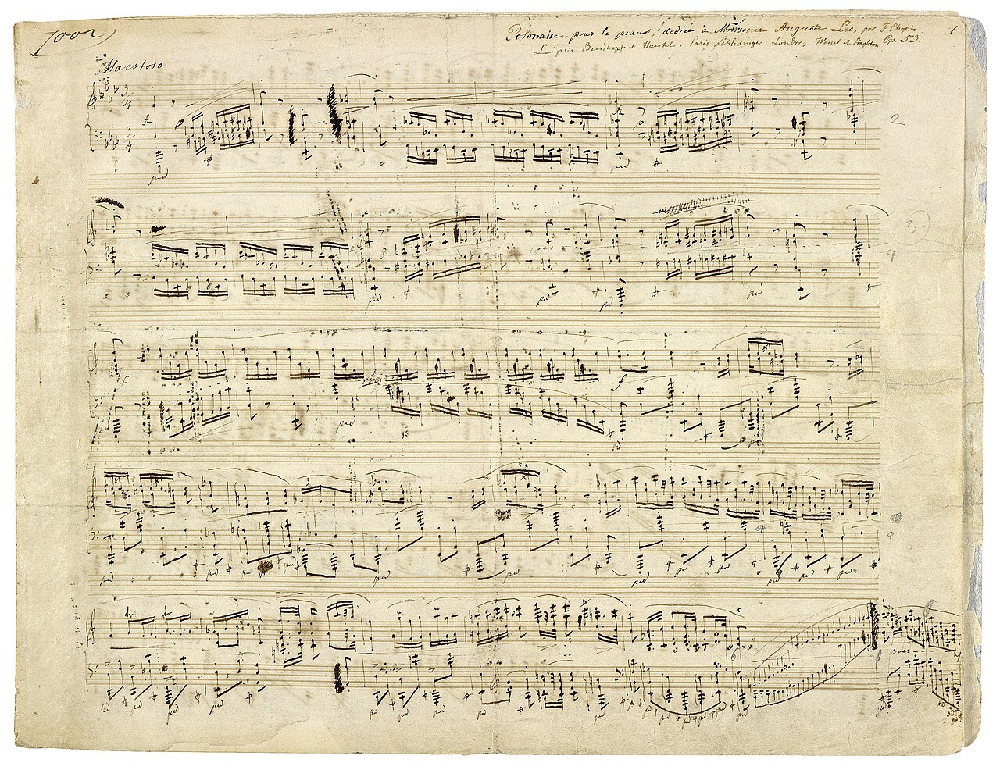

# Java syntax tour

*A guided tour of Java's grammar: semicolons that end statements, braces that group blocks, types before names, and the class-and-main wrapper every program needs. The strict punctuation that trips up beginners — and why it's strict.*

> Java has a reputation for being 'wordy,' and it's fair: before your first real line runs, you write a class,
> a `main` method, and a pile of braces and semicolons. To a beginner that ceremony feels like noise — but it's
> grammar, and once you can read it, Java stops looking like a wall of punctuation and starts looking like a
> very orderly language. This note is a tour of that grammar: the semicolon that ends every statement, the
> braces that group blocks, the 'type-before-name' way you declare things, and the class-and-`main` frame every
> program sits inside. Most beginner Java errors aren't logic bugs at all — they're a missing semicolon, a
> mismatched brace, or a capital letter in the wrong place. Learn the punctuation rules and a whole category of
> 'why won't it compile?' frustration disappears, and the wordiness reveals itself as structure you can rely on.

> **In real life**
>
> Java's grammar is **a page of sheet music.** Nothing is optional: a clef and time signature set things up
> before a single note, bar lines divide the music into measures, and every notehead sits on an exact line or
> space. A musician can't just start playing from a blank page — the notation has to be *complete and correct*
> first. That's
> **syntax**: The grammar rules of a language — the exact punctuation and structure code must follow (semicolons, braces, keywords, capitalisation). Break a syntax rule and the code won't compile or run, even if the logic is perfectly fine.:
> the semicolon is Java's bar line (it ends each statement), the braces are the brackets that group a passage,
> and the class-and-`main` header is the clef and time signature you must set up before any real code. Java is
> strict notation — precise, a little formal, and unforgiving of a missing mark — which is exactly why, once
> it's right, it runs without ambiguity.

## The four pillars: semicolons, braces, types, and the wrapper

Here is a tiny complete Java program. Every piece of its ceremony is doing a job:

```java
public class Main {                       // 1. the class wrapper -- every program lives in a class
    public static void main(String[] args) {  // 2. main -- where the program STARTS
        int count = 3;                    // 3. type before name; the SEMICOLON ends the statement
        String greeting = "Hi";           //    another statement, another semicolon
        for (int i = 0; i < count; i++) { // 4. BRACES group the loop's body
            System.out.println(greeting + " " + i);
        }
    }
}
```

Four rules cover most of it. **Semicolons** end statements — every complete instruction finishes with `;`,
like a period ending a sentence. **Braces** group blocks — everything a loop, method, or class contains sits
inside a matched pair of `{` and `}`. **Types come before names** — you write `int count` (the type `int`,
then the name `count`), not just `count`, because Java wants to know the kind of each value up front. And the
**class-and-`main` wrapper** is the frame: every program is a class, and running one starts at its `main`
method. Python needs none of this ceremony — which is exactly the contrast we'll draw.


*Manuscript: Chopin, Polonaise Op. 53 — Wikimedia Commons, public domain. [Source](https://commons.wikimedia.org/wiki/File:Chopin_polonaise_Op._53.jpg)*
- **The score = a program in strict notation** — A full page of music is a program written in an exact notation — every symbol has a required place and meaning, and a musician reads it precisely. Java syntax is like this: rigid, precise, and complete-or-nothing. That strictness is what lets the computer run it with zero ambiguity.
- **A bar line = a semicolon** — The vertical bar lines end each measure, marking where one unit finishes and the next begins. In Java the semicolon does exactly that for statements: every complete instruction ends with one. Forget it and the statements run together — a compile error, just as music with no bar lines is a jumble.
- **The clef & time signature = the class/main wrapper** — Before any note, the clef and time signature (and the 'Maestoso' marking) set up how to read everything that follows. Java's class and main() header do the same job: you declare the frame before any real code. You can't just start with a statement floating free — it has to live inside the wrapper.
- **A measure = braces grouping a block** — Bar lines carve the music into measures — grouped units of notes. Java's braces do the grouping: everything inside a matched pair belongs to that loop, method, or class. Every opening brace needs its closing partner; a mismatched pair is one of the most common Java compile errors.
- **Every symbol is exact = Java's strictness** — A notehead on the wrong line is a wrong pitch; a sharp changes the note. Java is just as exact: it's case-sensitive (int is not Int, main is not Main), types must match, and punctuation must be right. Tiny differences change or break the meaning — which is why most beginner errors are syntax, not logic.

## Java's ceremony vs Python's minimalism

The clearest way to see Java's syntax is next to Python doing the same job. Both print `Hi 0`, `Hi 1`,
`Hi 2`:

**Java** — class, `main`, types, braces, semicolons:
```java
public class Main {
    public static void main(String[] args) {
        int count = 3;
        for (int i = 0; i < count; i++) {
            System.out.println("Hi " + i);
        }
    }
}
```

**Python** — none of that ceremony; indentation and newlines do the structuring:
```python
count = 3
for i in range(count):
    print("Hi", i)
```

Same logic, wildly different amounts of scaffolding. Java states everything explicitly: the type of every
variable, where each statement ends (`;`), where each block begins and ends (`{ }`), and the class/`main`
frame. Python leaves it implicit: no type declarations, no semicolons, no braces — a colon and indentation
mark a block, and a newline ends a statement. Neither is 'better'; Java's explicitness catches certain
mistakes at compile time, while Python's minimalism is faster to write. Knowing both, you read the *shape* of
either language at a glance.

**Reading a line of Java syntax. Press Play.**

1. **Running starts at main** — public static void main(String[] args) is the fixed entry point — when you run the program, Java looks for main and starts there. The exact spelling matters (lowercase main, that signature); a typo and Java can't find where to begin.
2. **Declare with type before name** — int count = 3 reads 'make an int named count, set to 3'. The type comes first because Java is statically typed — it wants to know each variable's kind up front, which lets it catch type errors before the program even runs.
3. **End each statement with a semicolon** — int count = 3; -- the semicolon marks the end of the statement, like a period. Java doesn't use line breaks to end statements (you could write two on one line), so the semicolon is how it knows one instruction finished and the next begins.

*Try it — the anatomy of a Java program. Press Run.*

```java
public class Main {
    public static void main(String[] args) {
        // types before names; semicolons end statements
        int count = 3;
        String greeting = "Hi";

        // braces group the loop body
        for (int i = 0; i < count; i++) {
            System.out.println(greeting + " " + i);
        }

        // case-sensitive: 'int' works, 'Int' would not; 'main' not 'Main'
        boolean done = true;
        System.out.println("done? " + done);
    }
}
```

Here's the **same program in Python** — notice everything Java made explicit is gone; a colon and indentation
carry the structure:

*Try it — the same logic in Python (no ceremony). Press Run.*

```python
# no class, no main, no types, no semicolons, no braces
count = 3
greeting = "Hi"

for i in range(count):          # colon + indentation mark the block
    print(greeting, i)

done = True
print("done?", done)
```

> **Tip**
>
> When Java won't compile, suspect syntax before logic — most beginner errors are punctuation. Check three
> things in order: a missing semicolon at the end of a statement (the error often points at the NEXT line,
> because Java only notices when the next token is wrong); a mismatched brace (count your `{` and `}` — every
> opener needs a closer, and your editor's bracket-matching will highlight the pair); and capitalisation
> (`int` not `Int`, `main` not `Main`, `String` not `string` — Java is case-sensitive). Let your editor
> auto-indent and auto-close braces; the ceremony becomes muscle memory fast, and then it fades into the
> background and you just read the logic.

### Your first time: First time? Read the ceremony

- [ ] Run the Java program and find each part — Point at the class, the main method, a type-before-name declaration (int count), a semicolon, and a matched brace pair. Every bit of 'ceremony' is one of the four rules. Naming them turns the wall of punctuation into readable structure.
- [ ] Compare it to the Python version — The Python program does the identical thing with no class, no main, no types, no semicolons, no braces. Seeing them side by side shows you exactly what Java's syntax is FOR — being explicit — and what Python trades it for: brevity.
- [ ] Break a semicolon on purpose (in your head) — Imagine deleting the semicolon after int count = 3. Java would report an error — often on the NEXT line, which confuses beginners. Knowing the error can point one line late saves real debugging time.
- [ ] Mismatch a brace (mentally) — Remove one closing brace and Java says something like 'reached end of file while parsing'. That message means a brace is unbalanced. Count openers vs closers, or lean on your editor's bracket highlighting to find the orphan.
- [ ] Notice the case-sensitivity — int is a type; Int is not. main is the entry point; Main is just a name. String not string. Java treats different capitalisation as different words entirely. A surprising number of 'cannot find symbol' errors are just a wrong capital letter.

Ten minutes and Java's punctuation stops being noise — you can read the class, main, statements, and blocks as ordinary structure.

- **“';' expected — but my line looks fine.”**
  You missed a semicolon, usually on the line ABOVE where the error points. Java reports the problem when it hits the next token that doesn't fit, so the real fix is often one line up. Add the missing ';' at the end of the previous statement. Every complete statement needs one — declarations, assignments, method calls — though lines ending in an opening brace (like a for header or class line) do NOT.
- **“cannot find symbol / class Main is public, should be declared in a file named Main.java.”**
  Two classics. 'cannot find symbol' is often a capitalisation typo — Java is case-sensitive, so Int, Main, string, or Println won't match the real int, main, String, println. And a public class must live in a file matching its name (public class Main -> Main.java). Check your capitals and your filename.
- **“Main method not found / my program compiles but won't run.”**
  The entry point must be spelled exactly: public static void main(String[] args). A wrong signature (Main with a capital, main(String args) without the [], missing static) means Java compiles the class but can't find where to START running. Copy the main signature exactly until it's memorized — it's a fixed incantation, not something to improvise.

### Where to check

Debugging Java syntax:

- **Missing semicolon?** — the error often points at the NEXT line; add `;` to the end of the statement above. Every statement needs one (but not lines ending in `{`).
- **Unbalanced braces?** — count `{` vs `}`; use bracket-matching. 'end of file while parsing' means one is missing.
- **Capitalisation** — Java is case-sensitive: `int` not `Int`, `main` not `Main`, `String` not `string`. 'cannot find symbol' is often a wrong capital.
- **The main signature** — `public static void main(String[] args)` exactly, or the program won't run.
- **Filename** — a `public class Foo` must be in `Foo.java`.

### Worked example: the program that wouldn't compile — three syntax errors, traced

A beginner's first Java program throws compile errors before it can run. Let's fix the syntax one message at
a time:

```java
public class Main {
    public static void Main(String[] args) {   // error 1: capital M
        int count = 3                            // error 2: missing semicolon
        System.out.println("count is " + count)  // error 3: missing semicolon
    }
}
```

1. **First error — 'Main method not found':** the method is `Main` with a capital M, but the entry point must
   be lowercase `main`. Java compiled the class but can't find where to start. Fix: rename `Main` to `main`.
   Case matters — `Main` and `main` are different identifiers entirely.
2. **Second error — ';' expected:** after fixing the name, Java reports a missing semicolon. The line
   `int count = 3` has no `;`, so the statement never 'ends' and Java trips on the next line. Fix: add the
   semicolon: `int count = 3;`.
3. **Third error — ';' expected again:** the `println` call also lacks its semicolon. Every statement needs
   one. Fix: `System.out.println("count is " + count);`.
4. **The corrected program:**
   ```java
   public class Main {
       public static void main(String[] args) {
           int count = 3;
           System.out.println("count is " + count);
       }
   }
   ```
   Now it compiles and prints `count is 3`. None of the original errors were about *logic* — the program's
   intent was fine throughout; only its grammar was wrong.
5. **Why beginners hit this wall:** Java surfaces syntax mistakes at compile time, all at once, with terse
   messages — daunting at first. But the flip side is a gift: these mistakes are caught BEFORE the program
   runs, not discovered by a user later. The compiler is a strict proofreader.
6. **Tester's angle:** compile errors are the cheapest bugs there are — found instantly, by the machine,
   before anything ships. A tester's instinct ('what could be wrong here?') applied to your own syntax makes
   you faster: read the error, note which line and which rule (semicolon, brace, capital), and fix in
   seconds. Reading compiler messages well is a real, learnable skill, not a nuisance.

> **Common mistake**
>
> Treating Java's syntax errors as mysterious when they're almost always one of a small handful of punctuation
> slips: a missing semicolon (the error usually points at the next line), unbalanced braces ('end of file while
> parsing'), a capitalisation typo (`Int`/`Main`/`string` — Java is case-sensitive), or a wrong `main` signature
> so the program compiles but won't run. The deeper mistake is assuming a compile error means your logic is
> broken — it doesn't; the grammar is just incomplete, and the logic may be perfect. Read the message, note the
> line and the rule, and fix the punctuation. Lean on your editor (auto-indent, bracket-matching, auto-closing
> braces) so the ceremony becomes automatic. Java's strictness feels like friction at first, but it's the
> compiler catching your mistakes for free, before a single user ever sees them — which, to a tester, is exactly
> where you want bugs caught.

**Quiz.** In Java, what ends a statement, and what groups a block of code?

- [ ] A newline ends a statement; indentation groups a block (like Python)
- [x] A semicolon (;) ends a statement; a matched pair of braces { } groups a block
- [ ] A period ends a statement; parentheses group a block
- [ ] Nothing is required; Java figures it out

*In Java, a semicolon (;) ends each statement — every complete instruction finishes with one, like a period ending a sentence — and a matched pair of braces { } groups a block (a loop body, a method, a class). This is different from Python, where a newline ends a statement and indentation marks a block. Java does NOT use newlines or indentation to structure code (indentation is purely for human readability); it uses semicolons and braces, which is why a missing semicolon or an unbalanced brace is such a common Java compile error. Getting these two right — plus correct capitalisation and the class/main wrapper — clears most beginner syntax problems.*

- **Syntax** — The grammar rules code must follow — punctuation, structure, capitalisation. Break a rule and it won't compile, even if the logic is right. Most beginner Java errors are syntax, not logic.
- **Semicolon (;)** — Ends every Java statement, like a period ends a sentence. Declarations, assignments, method calls all need one (but NOT lines ending in an opening brace). A missing ; is the #1 Java error — and it often points at the next line.
- **Type before name** — Java declares with the type first: 'int count = 3', 'String name'. Java is statically typed — it wants each variable's kind up front, which lets it catch type errors at compile time. Python omits types entirely.
- **Class + main wrapper** — Every Java program lives in a class, and running starts at 'public static void main(String[] args)' — spelled exactly. No code floats at the top level (unlike Python). A wrong main signature compiles but won't run.
- **Case-sensitive** — Java treats different capitalisation as different words: int != Int, main != Main, String != string, println != Println. Many 'cannot find symbol' errors are just a wrong capital letter.

### Challenge

Read the grammar. (1) Run the Java program and point at the class, main, a type declaration, a semicolon, and
a matched brace pair. (2) Compare it line-for-line with the Python version — list what Java requires that
Python doesn't. (3) In the worked example, name the three syntax errors and their fixes. (4) Explain why a
missing semicolon error can point at the wrong (next) line. (5) Write one sentence: what ends a statement and
what groups a block in Java? If you can say 'a semicolon ends a statement and a matched pair of braces groups a
block', you can read Java's punctuation instead of fighting it.

### Ask the community

> Java syntax question: my code won't compile with [paste the exact error and the line it points to]. Here's the code [paste it]. What syntax rule did I miss?

Paste the EXACT compiler message and line number — Java's errors are precise once you know them. "';' expected"
is a missing semicolon (check the line above). "reached end of file" is an unbalanced brace. "cannot find
symbol" is often a capitalisation typo. Include the whole small program so the class/main wrapper is visible.

- [dev.java — getting started (Java syntax basics)](https://dev.java/learn/getting-started/)
- [Java tutorial — language basics (syntax)](https://docs.oracle.com/javase/tutorial/java/nutsandbolts/)
- [Java syntax — structure, semicolons, braces — W3Schools](https://www.youtube.com/watch?v=VR9IZcPOijY)

🎬 [Java syntax tour — statements, blocks & the main wrapper — W3Schools](https://www.youtube.com/watch?v=VR9IZcPOijY) (5 min)

- Java syntax rests on four rules: a semicolon ends every statement, a matched pair of braces { } groups a block, the type comes before the name in a declaration (int count), and every program lives in a class and starts at main.
- Most beginner Java errors are syntax, not logic: a missing semicolon (the error often points at the next line), unbalanced braces ('end of file while parsing'), or a capitalisation typo (Java is case-sensitive: int not Int, main not Main).
- The main entry point must be spelled exactly — public static void main(String[] args) — or the program compiles but won't run. And a public class must live in a file matching its name.
- Python does the same jobs with far less ceremony: no class/main, no type declarations, no semicolons, no braces — a colon and indentation mark blocks, and a newline ends a statement. Java trades brevity for explicitness that catches mistakes early.
- Read compiler messages as a skill: note the line and which rule (semicolon, brace, capital, main signature) and fix the punctuation. The strictness is the compiler catching your mistakes for free, before any user sees them.


---
_Source: `packages/curriculum/content/notes/a-first-language-deeper/syntax-essentials/java-syntax-tour.mdx`_
