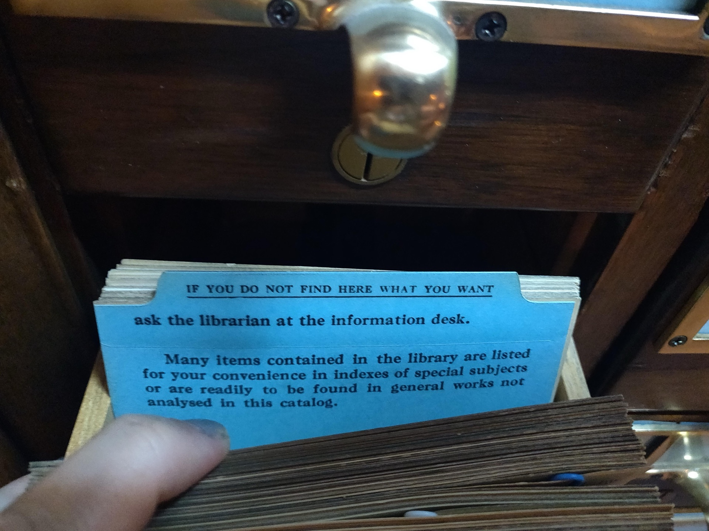

# LinkedIn for QA

*A LinkedIn profile is a search index before it's a page anyone reads. Write the headline, about section, and skills list around the exact terms a recruiter searches for QA and test engineer roles.*

> A recruiter searching LinkedIn's talent pool for "QA" or "test engineer" is not reading profiles in order -
> they are typing terms into a search box and looking at whichever profiles LinkedIn's index surfaces first.
> A profile that never says "QA," "test automation," or "manual testing" in the headline or skills list can be
> a perfectly good candidate and still never appear in that search at all.

> **In real life**
>
> A drawer of index cards in an old card catalog is only as useful as the words printed on its guide cards
> and subject headings. A librarian does not read every card in the drawer to answer a question - they go
> straight to the drawer and the card labeled with the exact subject the question is about. A book that is
> brilliant but filed under the wrong heading, or no heading at all, might as well not be in the library for
> that reader. A LinkedIn profile works the same way: recruiters search by heading, not by reading every
> profile that exists, and a profile filed under the wrong words never gets pulled from the drawer.

**LinkedIn for QA**: LinkedIn for QA is writing a LinkedIn profile's headline, about section, and skills list around the specific, searchable terms a recruiter uses to find QA and test engineer candidates, so the profile surfaces in that search instead of relying on someone reading it directly.

## The headline is the label on the drawer

LinkedIn's default headline is the current job title, which for someone early in QA might read "Student"
or "Aspiring Software Tester" - neither term a recruiter searches. A headline like "QA Tester | Manual &
Automated Testing | Selenium, Java, API Testing" states the exact subject headings a recruiter's search is
looking for, in the one line that shows up next to a name in every search result and every comment.

## The about section earns the click, once found

Once a profile surfaces in a search, the about section is what decides whether a recruiter clicks through
further or moves to the next result. It should state, in the first two or three lines, what kind of tester
this is and what they've actually tested - the same "state the pitch first" rule that applies to a
portfolio README, applied here to a summary paragraph instead.

## Skills are the actual search index

LinkedIn's skills section is not decoration - it is indexed and searchable, and it is where a recruiter's
exact query terms get matched. "Manual Testing," "Test Case Design," "Selenium WebDriver," "API Testing,"
and "Bug Tracking" are all real, specific terms recruiters search for; "Team Player" and "Fast Learner" are
not, and take up a skills slot that could hold something a search actually looks for.

> **Tip**
>
> Search LinkedIn itself for "QA tester" or "test automation" and read the headlines of the first ten
> profiles that come up. Those headlines are the exact vocabulary the search rewards - borrow the real
> overlap with actual experience, not the whole list.

> **Common mistake**
>
> Do not leave the headline on its LinkedIn default of a school name or "Open to Work," and do not fill the
> skills section with soft-skill adjectives instead of testing terms. Neither one contains a word a recruiter's
> QA search is actually looking for, so the profile stays invisible to that search regardless of how strong
> the experience underneath it is.


*Inside a card catalog at the Indiana State Library - TBurmeister (WMF), Wikimedia Commons, CC BY-SA 4.0. [Source](https://commons.wikimedia.org/wiki/File:Inside_a_card_catalog_at_the_Indiana_State_Library_-_ask_the_librarian.jpg)*
- **A labeled drawer, not a mystery box** — The brass handle sits on a drawer that is labeled before it is ever opened - the same job a headline does before a recruiter opens the full profile.
- **The guide card, stating the rule up front** — 'If you do not find here what you want' - a plain, upfront statement of what this drawer covers, the same job an about section's first two lines should do.
- **"Listed... in indexes of special subjects"** — The card describes exactly how this library is searchable - by named subject headings, the same role a skills list plays in a recruiter's keyword search.
- **A thick stack of near-identical cards** — Hundreds of cards look alike from the side - only the ones filed under the right heading get found by a specific search, the same as a profile with the wrong or missing keywords.

**How a recruiter's search actually reaches a profile**

1. **A search term is typed in** — "QA tester," "test automation," "manual QA" - specific words, not a job description read start to finish.
2. **LinkedIn's index matches headline and skills** — Profiles containing those exact terms surface first; profiles that never used them don't.
3. **The headline gets read in the results list** — Before any click, the headline alone has to say what kind of tester this is.
4. **The about section earns the deeper look** — Only after the search and the headline have already worked does anyone read further.

*A LinkedIn keyword-match simulator (Python)*

```python
recruiter_search_terms = ["qa tester", "test automation", "manual testing"]

profile_headline = "QA Tester | Manual and Automated Testing | Selenium, Java, API Testing"
profile_skills = ["Manual Testing", "Test Case Design", "Selenium WebDriver", "API Testing", "Bug Tracking"]

headline_lower = profile_headline.lower()
skills_lower = " ".join(profile_skills).lower()

matched_terms = []
for term in recruiter_search_terms:
    in_headline = term in headline_lower
    in_skills = any(word in skills_lower for word in term.split())
    if in_headline or in_skills:
        matched_terms.append(term)

checks = {
    "headline_contains_qa_or_test_word": ("qa" in headline_lower or "testing" in headline_lower),
    "skills_list_has_no_vague_soft_skills": all(s not in profile_skills for s in ["Team Player", "Fast Learner"]),
    "majority_of_search_terms_matched": len(matched_terms) >= 2,
}
for name, passed in checks.items():
    print(name + "=" + ("PASS" if passed else "FAIL"))
result = "PASS" if all(checks.values()) else "FAIL"
assert result == "PASS", "profile would not surface for a recruiter's QA search"
print("RESULT=" + result)
```

*A LinkedIn keyword-match simulator (Java)*

```java
import java.util.Arrays;
import java.util.LinkedHashMap;
import java.util.List;
import java.util.Map;

public class Main {
    public static void main(String[] args) {
        List<String> recruiterSearchTerms = Arrays.asList("qa tester", "test automation", "manual testing");

        String profileHeadline = "QA Tester | Manual and Automated Testing | Selenium, Java, API Testing";
        List<String> profileSkills = Arrays.asList(
            "Manual Testing", "Test Case Design", "Selenium WebDriver", "API Testing", "Bug Tracking"
        );

        String headlineLower = profileHeadline.toLowerCase();
        String skillsLower = String.join(" ", profileSkills).toLowerCase();

        int matchedCount = 0;
        for (String term : recruiterSearchTerms) {
            boolean inHeadline = headlineLower.contains(term);
            boolean inSkills = false;
            for (String word : term.split(" ")) {
                if (skillsLower.contains(word)) {
                    inSkills = true;
                    break;
                }
            }
            if (inHeadline || inSkills) matchedCount++;
        }

        boolean noVagueSkills = !profileSkills.contains("Team Player") && !profileSkills.contains("Fast Learner");

        Map<String, Boolean> checks = new LinkedHashMap<>();
        checks.put("headline_contains_qa_or_test_word", headlineLower.contains("qa") || headlineLower.contains("testing"));
        checks.put("skills_list_has_no_vague_soft_skills", noVagueSkills);
        checks.put("majority_of_search_terms_matched", matchedCount >= 2);

        boolean ok = true;
        for (Map.Entry<String, Boolean> e : checks.entrySet()) {
            System.out.println(e.getKey() + "=" + (e.getValue() ? "PASS" : "FAIL"));
            ok &= e.getValue();
        }
        String result = ok ? "PASS" : "FAIL";
        if (!result.equals("PASS")) throw new AssertionError("profile would not surface for a recruiter's QA search");
        System.out.println("RESULT=" + result);
    }
}
```

### Your first time: Rebuild a LinkedIn profile around what recruiters actually search

- [ ] Search LinkedIn for the target role's real terms — "QA tester," "test automation engineer," "manual QA" - read what the top results use in their own headlines.
- [ ] Rewrite the headline with those terms — Replace a default title or vague phrase with the specific role and tools - QA Tester, Selenium, API Testing, whatever is actually true.
- [ ] Open with the pitch in the about section — First two or three lines: what kind of tester this is and what's actually been tested, before anything else.
- [ ] Rebuild the skills list around real search terms — Swap soft-skill adjectives for specific, searchable tools and practices - the terms a recruiter's search box would actually contain.

- **The headline still reads the LinkedIn default - a school name, or nothing at all.**
  Replace it with the target role and two or three real tools or practices - the exact words a recruiter's search is looking for.
- **The skills list is full of "Team Player," "Hardworking," "Fast Learner."**
  Swap them for specific, searchable QA terms - Manual Testing, Test Case Design, Selenium WebDriver, API Testing - whatever is actually true.
- **The about section opens with a greeting or a life story before saying what kind of tester this is.**
  Move the pitch to the first two lines. A recruiter who found the profile through search is deciding whether to keep reading in the first few seconds.

### Where to check

- The profile's headline and skills section, read as if searching cold for the exact terms a recruiter would use.
- The about section's first two lines only, checked for whether they state what kind of tester this is.
- [[resume-and-applications/the-qa-resume/skills-and-keywords-ats]] for the same keyword-matching logic applied to a resume against an ATS.
- [[a-portfolio-that-gets-interviews/profiles/github-profile-polish]] for keeping the story consistent once a recruiter clicks through to the linked GitHub profile.

### Worked example: the same profile, before and after a keyword pass

1. Before: headline reads "Student at State University," about section opens with "Hi! I'm passionate about
   technology and love learning new things," and the skills list is "Team Player, Communication, Fast
   Learner."
2. A search for "QA tester" on LinkedIn never surfaces this profile - none of those words appear anywhere
   searchable on it.
3. After: headline becomes "QA Tester | Manual & Automated Testing | Selenium, Java, API Testing." The about
   section opens with "QA tester focused on manual and automated testing for web applications - built and
   documented a full regression suite covering an e-commerce checkout flow."
4. The skills list is rebuilt around Manual Testing, Test Case Design, Selenium WebDriver, API Testing, and
   Bug Tracking - five terms a recruiter's actual search is looking for, instead of five that aren't.

**Quiz.** Why does LinkedIn's skills section matter more than it might look like it does?

- [ ] It only affects how the profile looks to profile visitors, not search
- [x] It is indexed and searchable - it's where a recruiter's exact query terms get matched against a profile
- [ ] Skills are hidden from recruiters entirely
- [ ] It replaces the need for a headline

*LinkedIn's skills section is part of what a recruiter's search actually indexes. Filling it with real, specific QA terms - not vague soft-skill adjectives - is what makes a profile surface for a search in the first place.*

- **The card catalog analogy** — A librarian searches by subject heading, not by reading every book - a LinkedIn recruiter searches by keyword, not by reading every profile. The wrong heading means never being found.
- **What the headline has to do** — State the role and real tools in the one line that shows up in every search result and comment - not a default title or a vague phrase.
- **Why 'Team Player' doesn't help in the skills list** — It isn't a term a recruiter's QA search actually contains. A specific tool or practice - Selenium WebDriver, API Testing - is what gets matched.

### Challenge

Search LinkedIn for the exact role you're targeting and read the headlines of the first ten results. Rewrite your own headline and skills list using the real overlap between those terms and your actual experience.

- [LinkedIn Help - Create a good LinkedIn profile](https://www.linkedin.com/help/linkedin/answer/a554351)
- [LinkedIn Help - Recruiter and Recruiter Lite search filters and definitions](https://www.linkedin.com/help/linkedin/answer/a414428/)
- [How to Make Your LinkedIn Profile Discoverable to Recruiters (6 Hidden Strategies)](https://www.youtube.com/watch?v=beGvKHnZU80)

🎬 [How to Make Your LinkedIn Profile Discoverable to Recruiters (6 Hidden Strategies)](https://www.youtube.com/watch?v=beGvKHnZU80) (9 min)

- A LinkedIn profile is a search index before it's a page anyone reads - it has to contain the words a recruiter actually searches.
- The headline is the one line visible in every search result and comment - fill it with the real role and real tools.
- The skills section is indexed and searchable - specific QA terms belong there, not vague soft-skill adjectives.
- Once a profile surfaces in a search, the about section's first lines decide whether the recruiter keeps reading.


## Related notes

- [[Notes/resume-and-applications/the-qa-resume/skills-and-keywords-ats|Skills & keywords (ATS)]]
- [[Notes/a-portfolio-that-gets-interviews/profiles/github-profile-polish|GitHub profile polish]]
- [[Notes/a-portfolio-that-gets-interviews/profiles/personal-brand-basics|Personal brand basics]]


---
_Source: `packages/curriculum/content/notes/a-portfolio-that-gets-interviews/profiles/linkedin-for-qa.mdx`_
