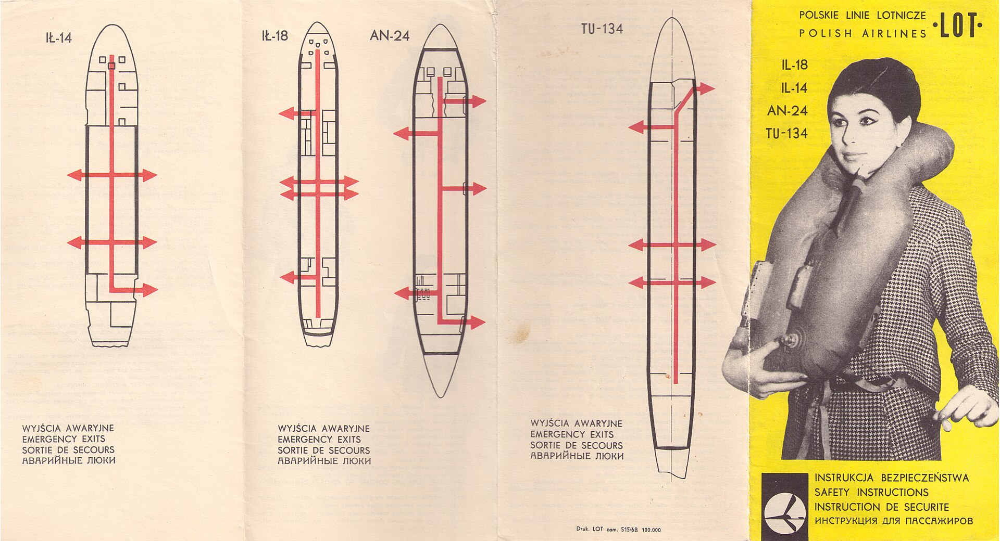

# Architecture diagrams

*One clear diagram of a test pyramid, a CI pipeline, or a system under test does more for a portfolio in three seconds than a page of prose does in three minutes - clarity beats complexity every time.*

> A reviewer scanning a portfolio repo will look at one diagram if it's simple enough to parse in a few seconds,
> and skip a paragraph explaining the same thing if it isn't. A test pyramid shape, a CI pipeline with four
> boxes and three arrows, or a one-page system diagram earns that few seconds of attention. A dense engineering
> diagram with twenty boxes and crossing lines does not - it reads as effort spent in the wrong direction.

> **In real life**
>
> An airline safety card explaining emergency exits for four different aircraft types doesn't use a paragraph
> of instructions for each one. It uses a single simplified outline of the fuselage and a few bold arrows
> pointing at the exits, repeated once per aircraft. Nobody studies rivets or wiring on that card in the ninety
> seconds before takeoff - the diagram works precisely because it dropped everything except the outline and the
> arrows. A portfolio's architecture diagram needs to make that same trade.

**Architecture diagram**: A portfolio architecture diagram is a single, deliberately simplified visual - a test pyramid, a CI pipeline flow, or a system-under-test overview - built to be understood in a few seconds by a reviewer with no prior context, rather than a complete or exhaustive technical diagram.

## Pick one shape, not the whole system

A test pyramid with three labeled layers, a CI pipeline with build, test, and deploy boxes connected by
arrows, or a one-page box diagram of the system under test with the pieces the test suite actually touches -
any one of these communicates more than an unlabeled screenshot of the codebase. Pick the one shape that
matches what the repo actually demonstrates, and leave the rest out.

## Fewer boxes, bigger labels

A diagram a reviewer has to zoom into is a diagram that loses them before they finish reading it. Keep the
box count low enough that the whole thing is legible at normal screen size, and label each box with a plain
noun phrase - "checkout API," "test runner," "CI pipeline" - instead of internal class names only the author
recognizes.

## One caption, stated once

A one-sentence caption under the diagram - what it shows and why it's shaped that way - does the job that a
paragraph of surrounding prose would otherwise need to do. State it once, directly under the image, instead of
repeating the same explanation in the README text above and below it.

> **Tip**
>
> Test the diagram on someone who has never seen the project: if they can't say what it shows within about ten
> seconds, simplify it again. A diagram that needs a guided tour to understand has failed at the one job it had.

> **Common mistake**
>
> Do not paste in a full, exhaustive architecture diagram exported straight from a design tool - every service,
> every table, every internal module - and call it the portfolio diagram. Density that serves an engineering
> onboarding doc is the opposite of what a thirty-second portfolio skim needs.


*LOT 1968 safety instruction card (front) - LOT Polish Airlines, Wikimedia Commons, public domain. [Source](https://commons.wikimedia.org/wiki/File:LOT_1968_safety_instruction_card_(front).jpg)*
- **One simple outline, not a blueprint** — Each aircraft gets a single stripped-down fuselage shape - no rivets, no wiring, no fuel lines - just the outline a passenger needs in the time available.
- **A few big arrows carry the whole message** — Red arrows pointing at exits do the entire job that paragraphs of evacuation instructions would otherwise need. Clarity beats completeness under time pressure.
- **One caption, repeated per diagram - not reworded** — 'Emergency exits' in the same four languages under every outline. A portfolio diagram's caption should be this consistent, stated once and reused, not rewritten each time.
- **The cover states scope before anyone studies the arrows** — The yellow panel names which aircraft the card covers in one glance - the same job a diagram's title and legend should do before the reviewer traces a single line.

**Building one diagram a reviewer actually reads**

1. **Pick the one shape that matches the repo** — Test pyramid, CI pipeline, or a system-under-test overview - not all three at once.
2. **Cut boxes until it's legible at normal size** — Fewer boxes, bigger labels, plain nouns instead of internal names.
3. **Add one caption, stated once** — What it shows and why it's shaped that way, directly under the image.
4. **Test it on someone with zero context** — If they can't explain it back in ten seconds, simplify again.

*A diagram-complexity scorer favoring simplicity (Python)*

```python
diagram = {
    "box_count": 5,
    "arrow_count": 6,
    "has_legend": True,
    "has_one_sentence_caption": True,
    "diagram_count": 1,
}

complexity_budget = 12
complexity_score = diagram["box_count"] + diagram["arrow_count"]

checks = {
    "under_complexity_budget": complexity_score <= complexity_budget,
    "has_legend": diagram["has_legend"],
    "has_one_sentence_caption": diagram["has_one_sentence_caption"],
    "single_diagram_not_a_wall_of_them": diagram["diagram_count"] == 1,
}
for name, passed in checks.items():
    print(name + "=" + ("PASS" if passed else "FAIL"))
result = "PASS" if all(checks.values()) else "FAIL"
assert result == "PASS", "diagram rejected"
print("RESULT=" + result)
```

*A diagram-complexity scorer favoring simplicity (Java)*

```java
import java.util.LinkedHashMap;
import java.util.Map;

public class Main {
    public static void main(String[] args) {
        int boxCount = 5;
        int arrowCount = 6;
        boolean hasLegend = true;
        boolean hasOneSentenceCaption = true;
        int diagramCount = 1;

        int complexityBudget = 12;
        int complexityScore = boxCount + arrowCount;

        Map<String, Boolean> checks = new LinkedHashMap<>();
        checks.put("under_complexity_budget", complexityScore <= complexityBudget);
        checks.put("has_legend", hasLegend);
        checks.put("has_one_sentence_caption", hasOneSentenceCaption);
        checks.put("single_diagram_not_a_wall_of_them", diagramCount == 1);

        boolean ok = true;
        for (Map.Entry<String, Boolean> e : checks.entrySet()) {
            System.out.println(e.getKey() + "=" + (e.getValue() ? "PASS" : "FAIL"));
            ok &= e.getValue();
        }
        String result = ok ? "PASS" : "FAIL";
        if (!result.equals("PASS")) throw new AssertionError("diagram rejected");
        System.out.println("RESULT=" + result);
    }
}
```

### Your first time: Build one architecture diagram for a portfolio repo

- [ ] Pick one shape — Test pyramid, CI pipeline flow, or a system-under-test overview - whichever matches what the repo demonstrates.
- [ ] Cut it down to a handful of boxes — Plain-noun labels, legible at normal screen size, no internal class names.
- [ ] Write one caption — A single sentence under the image stating what it shows and why it's shaped that way.
- [ ] Test it on a stranger — If they can't explain the diagram back in about ten seconds, simplify it again.

- **The diagram has to be zoomed in to read any label.**
  Cut boxes until the whole thing is legible at normal screen size - density that needs zooming has already lost the reviewer.
- **Three different diagrams try to explain three different things at once.**
  Pick the one shape that matters most for this repo and cut the other two, or split them into separate, clearly captioned images.
- **A stranger can't explain the diagram back after looking at it.**
  Remove boxes and arrows until the shape alone tells the story, then add the caption back in one sentence.

### Where to check

- The diagram at normal screen size, on the device a reviewer is actually likely to use.
- Whether a person with zero context can restate what the diagram shows within about ten seconds.
- [[a-portfolio-that-gets-interviews/the-3-repo-portfolio/repo-2-ui-automation-suite]] for the automation repo this kind of diagram most often documents.
- [[a-portfolio-that-gets-interviews/show-your-work/demo-gifs-and-reports]] for the recording and report that pair naturally with a simple architecture diagram.

### Worked example: the same system, two diagrams

1. First attempt: a full export from a design tool showing every microservice, every database table, and
   every internal queue - twenty-three boxes, crossing lines, illegible at normal zoom.
2. Second attempt: three boxes - "Test runner," "BuggyAPI," "CI pipeline" - connected by three labeled arrows,
   with one caption underneath: "How the suite runs on every push."
3. A reviewer who has never seen the repo explains the second diagram back correctly in about eight seconds.
4. The first diagram accurately represents more of the system - and communicates less of it to a first-time
   reader, which is the only reader a portfolio diagram has to serve.

**Quiz.** What should a portfolio's architecture diagram optimize for?

- [ ] Representing every service and table in the system for completeness
- [x] Being understood by a first-time reviewer within a few seconds
- [ ] Matching the diagramming style used internally at large companies
- [ ] Including as many boxes as needed so nothing looks left out

*A portfolio diagram is read by someone with zero context and little time. One simplified shape - a test pyramid, a pipeline, a system overview - that they can explain back in seconds does more work than an exhaustive, accurate diagram nobody has time to parse.*

- **The airline safety card analogy** — A safety card conveys emergency exits for four aircraft using one simplified outline and a few arrows each - not paragraphs of instructions. A good architecture diagram makes the same trade.
- **What to cut first** — Boxes and lines that only matter to someone who already knows the system - keep the shape a first-time reader needs, drop the rest.
- **The ten-second test** — Show the diagram to someone with no context. If they can't explain it back within about ten seconds, simplify it again.

### Challenge

Take an existing diagram from one of your projects and cut it down to the fewest boxes that still tell the whole story, then add one caption sentence underneath.

- [Martin Fowler - The Test Pyramid](https://martinfowler.com/bliki/TestPyramid.html)
- [Mermaid - diagrams from simple text, no drawing tool needed](https://mermaid.js.org/)
- [Test Automation Framework Architecture & Brief Explanation](https://www.youtube.com/watch?v=y_Dc-7jevy0)

🎬 [Test Automation Framework Architecture & Brief Explanation](https://www.youtube.com/watch?v=y_Dc-7jevy0) (20 min)

- One simplified diagram - a test pyramid, a CI pipeline, or a system overview - communicates faster than a page of prose.
- Cut boxes and lines until the whole thing is legible at normal screen size with plain-noun labels.
- One caption, stated once directly under the image, replaces repeated explanation in surrounding text.
- Test every diagram on someone with zero context - if they can't explain it back in ten seconds, simplify again.


## Related notes

- [[Notes/a-portfolio-that-gets-interviews/show-your-work/packaging-buggyshop-and-buggyapi-work|Packaging BuggyShop / BuggyAPI work]]
- [[Notes/a-portfolio-that-gets-interviews/the-3-repo-portfolio/repo-2-ui-automation-suite|Repo 2: UI automation suite]]
- [[Notes/system-design-for-testers/from-architecture-to-test-strategy/what-to-test-at-which-layer|What to test at which layer]]


---
_Source: `packages/curriculum/content/notes/a-portfolio-that-gets-interviews/show-your-work/architecture-diagrams.mdx`_
