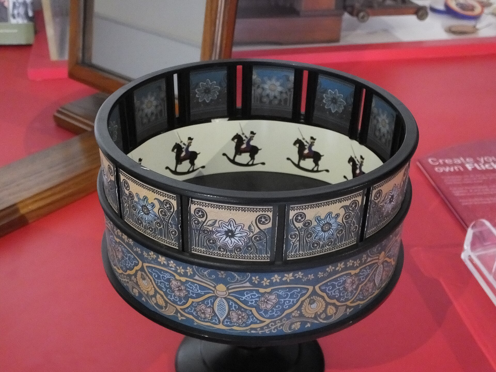

# Demo GIFs & reports

*A short GIF of a test run plus a clean HTML or Allure-style report proves a suite actually works. A static screenshot only proves a screen existed once - motion and a real report are harder to fake and easier to trust.*

> A single screenshot of a green terminal proves a screen looked like that once, at some point, possibly after
> edits. A short GIF of a suite actually running, next to a link to the real HTML report it produced, proves the
> suite runs - because a reviewer can watch it happen and then click through to the same evidence the terminal
> was showing.

> **In real life**
>
> A zoetrope's picture strip does nothing sitting still - a rider on a horse, drawn four times with a slightly
> different leg position each time, is just four flat pictures. Spin the drum and look through the slots, and
> the sequence becomes a horse that gallops. No single frame in that strip could ever show the gallop by itself;
> the motion only exists across the sequence. A GIF of a test run does for a portfolio what the spinning drum
> does for the strip - the same evidence, shown in motion, proving the thing actually runs instead of just
> describing that it does.

**Demo GIF**: A demo GIF is a short, looping screen recording of a test suite actually executing, paired with a link to the clean HTML or Allure-style report the run produced - offered together as evidence that the suite works, rather than a single static screenshot claimed to represent it.

## Show the run, not just the result

A GIF a few seconds long, showing a command starting, tests executing, and a pass count appearing, proves
the suite runs on demand. A screenshot of only the final green summary proves nothing about how it got there -
it could be from any run, edited or not, at any point in the project's history.

## Link the real report next to the GIF

The GIF is the trailer; the actual report is the evidence. A clean, linked HTML or Allure-style report that
a reviewer can open and click through - individual test names, timings, and any failures - backs up what the
GIF only gestures at in a few seconds.

## Keep the file small and the report honest

A GIF bloated past a few megabytes loads slowly enough that a reviewer gives up before it plays. A report
that only ever shows green, with failures quietly filtered out, reads as staged the moment a reviewer notices
there isn't a single red row anywhere in the project's history.

> **Tip**
>
> Record the GIF at a size and frame rate that keeps the file small - a shorter, smaller GIF that loads instantly
> beats a longer, heavier one that stalls on a slow connection. The report link carries the detail; the GIF only
> needs to carry the motion.

> **Common mistake**
>
> Do not publish a report that has been curated to remove every failing test from its history, or a GIF that
> was clearly edited to skip the parts that looked slow or uncertain. A report with zero failures ever, on a
> project with any real history, reads as staged rather than clean.


*Leeds Industrial Museum zoetrope - Clem Rutter, Wikimedia Commons, CC BY-SA 3.0. [Source](https://commons.wikimedia.org/wiki/File:Leeds_Industrial_Museum_zoetrope_7125.JPG)*
- **The sequence, not a single frame** — Four repeated riders, each a little different from the last. Any one panel alone is a still picture - only the sequence carries the motion, the same way only a running GIF proves a suite runs.
- **Slots that only work while it's spinning** — The viewing slits show nothing useful on a drum that isn't moving - the same way a static screenshot shows nothing about whether the suite runs today.
- **Decoration outside, evidence inside** — The painted exterior is presentation; the strip of images inside is what actually proves the motion. A portfolio's polish should point at real evidence the same way.
- **A sign inviting the viewer to make their own** — A nearby placard reading 'create your own flick' - the same move a portfolio should make: don't just describe the trick, hand the reviewer a working one to watch.

**Pairing a GIF with a real report**

1. **Record the run, start to pass count** — A few seconds showing the command starting and the suite actually executing.
2. **Keep the file small** — A short, low frame-rate GIF that loads instantly beats a long, heavy one that stalls.
3. **Link the full report next to it** — The GIF is the trailer; the linked HTML or Allure-style report is the evidence.
4. **Leave real failures visible in the history** — A report with zero failures ever reads as curated, not clean.

*A demo-asset completeness checker (Python)*

```python
assets = {
    "has_gif_of_passing_run": True,
    "gif_size_mb": 3,
    "has_html_report_link": True,
    "report_shows_pass_and_fail_detail": True,
}

size_budget_mb = 5

checks = {
    "has_motion_evidence_not_just_a_screenshot": assets["has_gif_of_passing_run"],
    "gif_under_size_budget": assets["gif_size_mb"] <= size_budget_mb,
    "report_linked": assets["has_html_report_link"],
    "report_shows_real_detail_not_just_green": assets["report_shows_pass_and_fail_detail"],
}
for name, passed in checks.items():
    print(name + "=" + ("PASS" if passed else "FAIL"))
result = "PASS" if all(checks.values()) else "FAIL"
assert result == "PASS", "demo assets rejected"
print("RESULT=" + result)
```

*A demo-asset completeness checker (Java)*

```java
import java.util.LinkedHashMap;
import java.util.Map;

public class Main {
    public static void main(String[] args) {
        boolean hasGifOfPassingRun = true;
        int gifSizeMb = 3;
        boolean hasHtmlReportLink = true;
        boolean reportShowsPassAndFailDetail = true;

        int sizeBudgetMb = 5;

        Map<String, Boolean> checks = new LinkedHashMap<>();
        checks.put("has_motion_evidence_not_just_a_screenshot", hasGifOfPassingRun);
        checks.put("gif_under_size_budget", gifSizeMb <= sizeBudgetMb);
        checks.put("report_linked", hasHtmlReportLink);
        checks.put("report_shows_real_detail_not_just_green", reportShowsPassAndFailDetail);

        boolean ok = true;
        for (Map.Entry<String, Boolean> e : checks.entrySet()) {
            System.out.println(e.getKey() + "=" + (e.getValue() ? "PASS" : "FAIL"));
            ok &= e.getValue();
        }
        String result = ok ? "PASS" : "FAIL";
        if (!result.equals("PASS")) throw new AssertionError("demo assets rejected");
        System.out.println("RESULT=" + result);
    }
}
```

### Your first time: Add a demo GIF and a linked report to a project

- [ ] Record a short run — A command starting, the suite executing, and a pass count appearing - a few seconds is enough.
- [ ] Compress it down — Keep the GIF small enough to load instantly, even on a slower connection.
- [ ] Generate and publish the real report — An HTML or Allure-style report a reviewer can click through, not just a summary line.
- [ ] Link the report directly under the GIF — The GIF earns the glance; the report is where the reviewer verifies it.

- **The GIF takes several seconds to load or stutters badly.**
  Re-record at a smaller size or lower frame rate - a shorter, lighter GIF that loads instantly beats a longer one that stalls.
- **The published report shows a perfect pass count with no failures anywhere in its history.**
  Leave real failures visible, or generate the report from an actual run instead of a hand-picked one - a spotless history reads as staged.
- **There's a GIF but no linked report behind it.**
  Publish the actual HTML or Allure-style report and link it directly under the GIF - the recording alone is a claim, the report is the evidence.

### Where to check

- The GIF's file size and load time on a normal connection, not just on the machine that recorded it.
- The linked report itself, clicked through to individual test names and timings, not just its summary line.
- [[a-portfolio-that-gets-interviews/the-3-repo-portfolio/repo-3-api-suite-and-ci]] for the CI run that should be producing this exact report.
- [[a-portfolio-that-gets-interviews/show-your-work/architecture-diagrams]] for the diagram that can sit alongside this GIF and report in the same README.

### Worked example: a screenshot replaced by a GIF and a report

1. Original evidence: one screenshot of a terminal showing "47 passed" in green, with no timestamp and no
   link to anything else.
2. Replacement: an eight-second GIF showing the suite command running, tests executing one by one, and the
   same pass count appearing live.
3. Directly under the GIF, a link to the actual HTML report from that run - clickable by test name, showing
   real timings.
4. A reviewer who watches the GIF and clicks the report link has now seen the suite run and inspected the
   real result - neither of which the original screenshot could offer.

**Quiz.** Why is a GIF of a test run more persuasive than a single static screenshot?

- [ ] GIFs are more visually decorative than screenshots
- [x] A GIF shows the suite actually executing, which a still image of a final result cannot prove
- [ ] GIFs are required by most CI providers
- [ ] A screenshot takes longer to create than a GIF

*A screenshot can only show a moment that may have been edited or cherry-picked. A GIF shows the run happening across time, and a linked report backs it with the real, clickable detail behind that run.*

- **The zoetrope analogy** — A static picture strip shows nothing until the drum spins - only the sequence carries motion, the same way only a running GIF proves a suite actually runs.
- **GIF vs. report** — The GIF is the trailer that earns a glance; the linked HTML or Allure-style report is the evidence a reviewer actually verifies.
- **A red flag in a published report** — A report with zero failures anywhere in its history reads as curated rather than clean.

### Challenge

Record an eight-to-twelve-second GIF of one of your test suites running, publish the real report it produces, and link the report directly under the GIF in the README.

- [ScreenToGif - free, open-source screen-to-GIF recorder](https://www.screentogif.com/)
- [Allure Report - official documentation](https://allurereport.org/docs/)
- [Allure Report - For Selenium & Cucumber With Screenshot](https://www.youtube.com/watch?v=cVqkPITqmB4)

🎬 [Allure Report - For Selenium & Cucumber With Screenshot](https://www.youtube.com/watch?v=cVqkPITqmB4) (14 min)

- A GIF of a test run proves the suite executes; a static screenshot only proves a screen looked like that once.
- Pair the GIF with a linked, real HTML or Allure-style report a reviewer can click through for detail.
- Keep the GIF small enough to load instantly, and keep the report's history honest rather than curated to all-green.
- The GIF earns the glance; the linked report is what actually gets verified.


## Related notes

- [[Notes/a-portfolio-that-gets-interviews/show-your-work/architecture-diagrams|Architecture diagrams]]
- [[Notes/a-portfolio-that-gets-interviews/the-3-repo-portfolio/repo-3-api-suite-and-ci|Repo 3: API suite + CI]]
- [[Notes/a-portfolio-that-gets-interviews/show-your-work/what-recruiters-actually-open|What recruiters actually open]]


---
_Source: `packages/curriculum/content/notes/a-portfolio-that-gets-interviews/show-your-work/demo-gifs-and-reports.mdx`_
