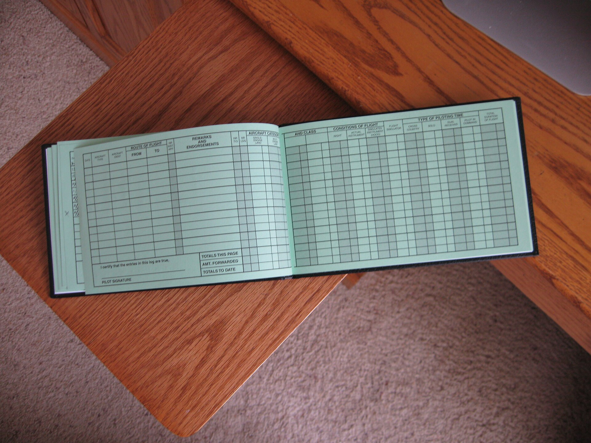

# Packaging BuggyShop / BuggyAPI work

*Practice work done against this platform's own BuggyShop and BuggyAPI sandboxes can anchor a real portfolio piece - as long as it is labeled as structured practice, not dressed up as production experience it isn't.*

> A learner who spends three weeks finding seeded bugs across a UI sandbox and a REST API has real, demonstrable
> skill to show a reviewer. The temptation is to write it up as if it were a production project shipped for a
> company. That single choice - honest label or borrowed credibility - decides whether a technical interviewer
> trusts everything else on the page or starts checking every other line for the same exaggeration.

> **In real life**
>
> A private pilot's logbook never records a flight as just "flew." Every entry sits in a column - dual received
> with an instructor in the seat, solo, or pilot in command - and at the bottom of every page the pilot signs a
> line stating the entries are true. Nobody reads a hundred hours of dual instruction as worthless; the honesty
> of the categorization is what makes the total hours mean anything at all. A portfolio entry works the same
> way: label the practice hours as practice hours, and the real skill they represent still counts.

**Packaging practice work**: Packaging practice work is writing up a project built against this platform's own BuggyShop or BuggyAPI sandbox so it reads as a credible, honestly labeled demonstration of testing skill - naming the sandbox, the number and kind of bugs found, and the method used - without implying it was professional or production work.

## Name the sandbox, don't hide it

State plainly that the project targets BuggyShop or BuggyAPI - this platform's practice applications - rather
than writing around the fact in a way that lets a reader assume something else. "A UI regression suite built
against a practice e-commerce sandbox with intentionally seeded defects" is both accurate and still
impressive; it tells a reviewer exactly what kind of environment produced the results, which is what lets them
trust the results at all.

## Report the real number, not a vague adjective

"Found several bugs" tells a reviewer nothing checkable. "Identified 11 of 14 seeded defects across the
checkout and account flows, filed as structured bug reports with repro steps" is specific, and specific claims
about a labeled practice environment read as more credible than vague claims about an unlabeled one - because
there is nothing left to wonder about.

## The skill demonstrated is real even though the app is practice

A seeded bug still has to be found through the same techniques a production bug would need: boundary
analysis, negative testing, reading a diff of expected versus actual behavior. Writing the project up honestly
does not diminish that skill - it just refuses to claim a different, unearned kind of experience alongside it.

> **Tip**
>
> Open the write-up with one sentence that states the sandbox, the scope, and the method - then let the specific
> bug count and the linked report do the persuading. A reviewer trusts a modest, specific claim about practice
> work far more than a big claim they can't check.

> **Common mistake**
>
> Do not write "led QA for an e-commerce platform" or "owned the API test strategy for a production service" when
> the actual project is a solo run through this platform's own practice sandbox. The moment a technical
> interviewer asks one follow-up question about deployment, on-call, or real users, that sentence collapses -
> and it takes the credibility of every other line with it.


*Pilot logbook (pages) - Basil Newburn, Wikimedia Commons, CC BY-SA 3.0. [Source](https://commons.wikimedia.org/wiki/File:Pilot_logbook_(pages).jpg)*
- **Dual received, solo, and pilot in command - separate columns** — The log does not just say 'flew' - it separates supervised practice time from solo time, so nobody mistakes one for the other later.
- **A signed certification, not a boast** — 'I certify that the entries in this log are true,' with a signature line underneath. The honesty is built into the format, not left to the pilot's mood.
- **Totals carried forward, not one flashy entry** — Totals this page, amount forwarded, totals to date - a running, checkable tally, the same discipline a portfolio write-up needs across every project listed.
- **Blank rows waiting to be filled in honestly** — The format only works if every column gets an accurate entry, row by row - structured practice logged as structured practice, nothing inflated.

**Writing up a practice-sandbox project honestly**

1. **Name the sandbox and the scope** — State BuggyShop or BuggyAPI by name, and which flows or endpoints were covered.
2. **State the method** — Boundary analysis, negative testing, exploratory charters - whatever techniques actually drove the work.
3. **Report the specific, checkable result** — A bug count against a known total, linked to structured reports - not an adjective.
4. **Let the skill speak without borrowing a title it didn't earn** — Practice work, honestly labeled, is still real evidence of real testing skill.

*A portfolio-piece honesty checker (Python)*

```python
portfolio_blurb = {
    "labeled_as_practice_work": True,
    "names_the_real_skill_shown": True,
    "claims_production_experience": False,
    "links_to_checkable_evidence": True,
}

score = 0
score += 1 if portfolio_blurb["labeled_as_practice_work"] else 0
score += 1 if portfolio_blurb["names_the_real_skill_shown"] else 0
score += 1 if portfolio_blurb["links_to_checkable_evidence"] else 0
score -= 1 if portfolio_blurb["claims_production_experience"] else 0

checks = {
    "honestly_labeled_as_practice": portfolio_blurb["labeled_as_practice_work"],
    "names_a_real_skill_not_just_a_label": portfolio_blurb["names_the_real_skill_shown"],
    "makes_no_false_production_claim": not portfolio_blurb["claims_production_experience"],
    "score_at_least_3": score >= 3,
}
for name, passed in checks.items():
    print(name + "=" + ("PASS" if passed else "FAIL"))
result = "PASS" if all(checks.values()) else "FAIL"
assert result == "PASS", "portfolio blurb rejected"
print("RESULT=" + result)
```

*A portfolio-piece honesty checker (Java)*

```java
import java.util.LinkedHashMap;
import java.util.Map;

public class Main {
    public static void main(String[] args) {
        Map<String, Boolean> blurb = new LinkedHashMap<>();
        blurb.put("labeled_as_practice_work", true);
        blurb.put("names_the_real_skill_shown", true);
        blurb.put("claims_production_experience", false);
        blurb.put("links_to_checkable_evidence", true);

        int score = 0;
        score += blurb.get("labeled_as_practice_work") ? 1 : 0;
        score += blurb.get("names_the_real_skill_shown") ? 1 : 0;
        score += blurb.get("links_to_checkable_evidence") ? 1 : 0;
        score -= blurb.get("claims_production_experience") ? 1 : 0;

        Map<String, Boolean> checks = new LinkedHashMap<>();
        checks.put("honestly_labeled_as_practice", blurb.get("labeled_as_practice_work"));
        checks.put("names_a_real_skill_not_just_a_label", blurb.get("names_the_real_skill_shown"));
        checks.put("makes_no_false_production_claim", !blurb.get("claims_production_experience"));
        checks.put("score_at_least_3", score >= 3);

        boolean ok = true;
        for (Map.Entry<String, Boolean> e : checks.entrySet()) {
            System.out.println(e.getKey() + "=" + (e.getValue() ? "PASS" : "FAIL"));
            ok &= e.getValue();
        }
        String result = ok ? "PASS" : "FAIL";
        if (!result.equals("PASS")) throw new AssertionError("portfolio blurb rejected");
        System.out.println("RESULT=" + result);
    }
}
```

### Your first time: Write up a BuggyShop or BuggyAPI project honestly

- [ ] Name the sandbox in the first sentence — BuggyShop or BuggyAPI, by name, plus which flows or endpoints were in scope.
- [ ] State the method used — Boundary analysis, negative testing, exploratory charters - whatever actually drove the work.
- [ ] Report a specific, checkable number — Bugs found against a known total, linked to structured reports a reviewer can open.
- [ ] Reread it for any borrowed claim — Strip out any phrase that would only be true of a professional production role.

- **The write-up says 'owned QA for an e-commerce platform' for a solo BuggyShop project.**
  Rewrite it as what it is: a structured practice project against a labeled sandbox, with the specific skill and result stated plainly.
- **A reviewer asks about production deployment or real users and the story falls apart.**
  That question only lands because the write-up implied something it wasn't. Fix the framing before the interview, not during it.
- **The bug count is vague - 'found a lot of issues' - with nothing linked.**
  Replace it with the real number against the known total, linked to the actual filed reports.

### Where to check

- The project write-up's opening sentence, checked for whether it names the sandbox honestly.
- Every bug count claimed, checked against the actual filed reports it should link to.
- [[a-portfolio-that-gets-interviews/the-3-repo-portfolio/readmes-that-sell]] for how that same honesty applies to a full README, not just a project summary.
- [[a-portfolio-that-gets-interviews/show-your-work/demo-gifs-and-reports]] for the recording and report that back this kind of write-up with real evidence.

### Worked example: the same project, two ways

1. Overstated: "Led quality assurance for a production e-commerce platform, ensuring a flawless checkout
   experience for customers."
2. Honest and still impressive: "Structured practice project against BuggyShop, this platform's seeded-bug
   e-commerce sandbox - identified 11 of 14 seeded defects across checkout and account flows using boundary
   analysis and negative testing, filed as structured bug reports with repro steps and severity."
3. The second version names the sandbox, states the method, and reports a specific number - a technical
   interviewer can ask any follow-up question about it without the story changing.
4. The first version survives exactly one follow-up question before it stops matching what actually happened.

**Quiz.** What makes a BuggyShop or BuggyAPI project a credible portfolio piece?

- [ ] Describing it as production experience so it sounds more impressive
- [x] Naming the sandbox honestly, stating the method, and reporting a specific checkable result
- [ ] Leaving out which app it was built against so the reader assumes something bigger
- [ ] Using as many strong adjectives as possible to describe the outcome

*A reviewer trusts a modest, specific claim about labeled practice work far more than an inflated claim about unlabeled work. The skill demonstrated is real either way - only the honesty of the label is in question.*

- **The pilot logbook analogy** — A logbook separates dual, solo, and pilot-in-command time and requires a signed certification - honest categorization is what makes the total hours mean anything.
- **What to state first** — Name the sandbox - BuggyShop or BuggyAPI - and the scope, in the opening sentence, before any claim about results.
- **Overstated vs. honest** — 'Led QA for a production platform' overstates a solo sandbox project. 'Identified 11 of 14 seeded defects using boundary analysis' is specific, checkable, and still impressive.

### Challenge

Write a two-sentence portfolio summary for a BuggyShop or BuggyAPI project you've done: name the sandbox, state the method, and report one specific, checkable number.

- [Resume Genius - How to List Projects on a Resume](https://resumegenius.com/blog/resume-help/projects-on-resume)
- [GitHub Docs - Best Practices for Repositories](https://docs.github.com/en/repositories/creating-and-managing-repositories/best-practices-for-repositories)
- [Stand Out as a QA Engineer: How to Build an Exciting QA Portfolio](https://www.youtube.com/watch?v=og9Hd9EOwFI)

🎬 [Stand Out as a QA Engineer: How to Build an Exciting QA Portfolio](https://www.youtube.com/watch?v=og9Hd9EOwFI) (10 min)

- Practice work against BuggyShop or BuggyAPI is real evidence of real testing skill - as long as it's labeled honestly.
- Name the sandbox, state the method, and report a specific, checkable result instead of a vague adjective.
- Never borrow a production or professional claim the project didn't earn - one follow-up question exposes it.
- A modest, specific, honest claim about practice work is more persuasive than an inflated claim a reviewer can't check.


## Related notes

- [[Notes/a-portfolio-that-gets-interviews/the-3-repo-portfolio/readmes-that-sell|READMEs that sell]]
- [[Notes/a-portfolio-that-gets-interviews/show-your-work/architecture-diagrams|Architecture diagrams]]
- [[Notes/a-portfolio-that-gets-interviews/show-your-work/demo-gifs-and-reports|Demo GIFs & reports]]


---
_Source: `packages/curriculum/content/notes/a-portfolio-that-gets-interviews/show-your-work/packaging-buggyshop-and-buggyapi-work.mdx`_
