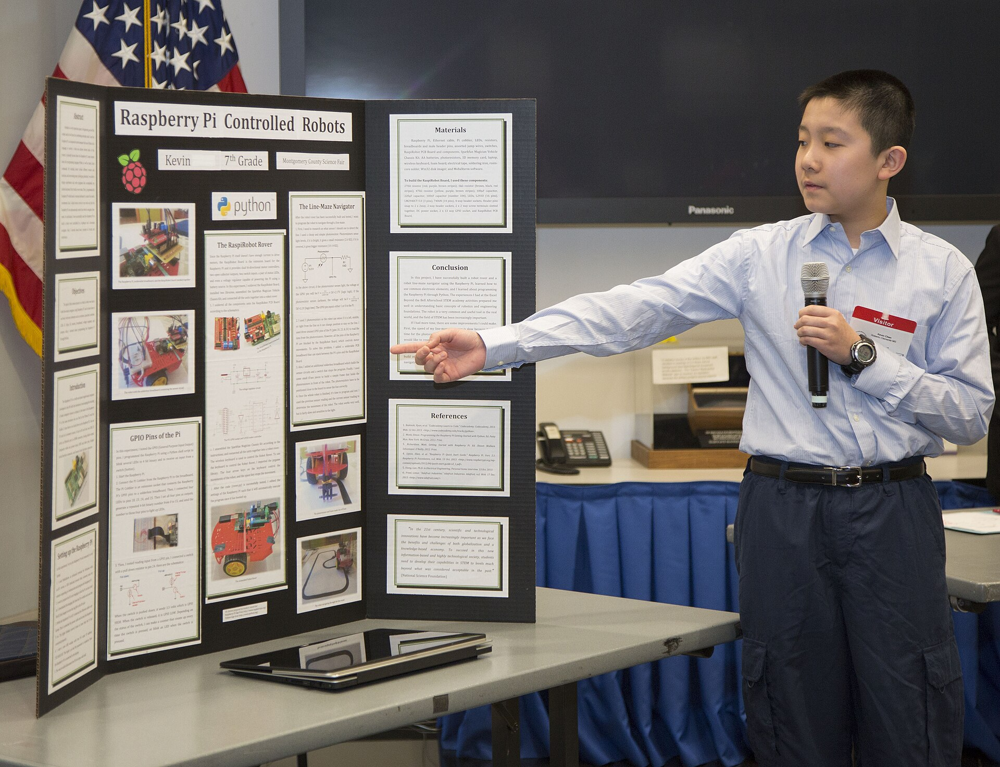

# What recruiters actually open

*Most portfolios get a thirty-to-sixty-second skim: the pinned repo description and the README's first screen. Deep code only gets read later, by a technical interviewer verifying what the skim already decided was worth a closer look.*

> Every hour a recruiter spends deciding who moves forward is split across dozens of candidates, not devoted to
> one. A portfolio gets a skim measured in seconds, not a careful read - and the file that gets that skim is the
> pinned repo's one-line description and the README's opening screen, not the test files three folders deep that
> took the longest to write.

> **In real life**
>
> A judge walking a school science-fair gym floor gives each poster board a few seconds - the big title, maybe
> one photo - before deciding whether to stop and ask the presenter a question. The judge is not being lazy;
> there are eighty boards and one afternoon. A recruiter skims a portfolio the same way: the pinned repo
> description and the README's opening line are the poster's title and headline photo. The deep code, like the
> presenter's full binder of notes, only gets inspected at the boards that earned a second look.

**What recruiters actually open**: What recruiters actually open refers to the small, predictable surface of a portfolio - the pinned repo's one-line description and a README's first screen - that gets read during an initial thirty-to-sixty-second skim, as distinct from the deep code a technical interviewer verifies later, only for candidates that skim already flagged as worth a closer look.

## The skim has a fixed, small budget

Thirty to sixty seconds is a realistic total budget for a first look at a portfolio - not per repo, often for
the whole profile. Whatever states the pitch has to do it inside that budget, because nothing past it gets
read on this pass.

## The pinned description is the headline

Three pinned repos with clear one-line descriptions - what each one demonstrates, in a phrase - do more work
in the skim than any amount of polish buried in a README's middle section. That line is frequently the only
sentence actually read before a decision to click through or move on.

## Deep code is for the second look, not the first

A technical interviewer reading the actual test files, the framework structure, and the commit history is a
different reader with a different job: verifying, in detail, what the first skim already decided looked
promising. Writing the deepest, cleverest code will not compensate for a first screen that never earned that
second look at all.

> **Tip**
>
> Write the pinned repo description and the README's first line as if they were the only two sentences anyone
> would ever read - because for a large share of the people who see the profile, they are.

> **Common mistake**
>
> Do not assume that if the code is good enough, someone will eventually find it. A first screen that fails to
> state the pitch loses most readers before they ever open a single file - the quality of the code three
> folders down never gets the chance to matter.


*NRC Honors Montgomery County Science Fair Students in Rockville, Md. - U.S. Nuclear Regulatory Commission, Wikimedia Commons, CC BY 2.0. [Source](https://commons.wikimedia.org/wiki/File:NRC_Honors_Montgomery_County_Science_Fair_Students_in_Rockville,_Md._(13537087363).jpg)*
- **The headline, readable from across the room** — The big title is the poster's entire pitch, legible before anyone walks close enough to read a single paragraph - a pinned repo description does the same job on a profile.
- **A dense block of text nobody reads standing up** — The full written section is there for the judge who stops - it is not what earns the stop in the first place.
- **Conclusion, placed where a skimmer's eye lands** — Positioned close to where the eye lands after the title - the same reason a README's proof belongs in the first screen, not several sections down.
- **A live demo waiting on the table** — Ready to actually run - proof on standby for the judge, or interviewer, who stops long enough to ask for it.

**What actually gets read, in order**

1. **The pinned repo's one-line description** — Often the only sentence read across an entire profile in the first pass.
2. **The README's first screen** — State what the project demonstrates here, or it likely never gets read at all.
3. **A closer look, for repos that earned it** — A slightly longer skim of structure, badges, and evidence - still not deep code.
4. **Deep code, by a technical interviewer later** — Read in detail only for candidates the earlier skim already flagged as worth it.

*A recruiter attention-budget simulator (Python)*

```python
sections = [
    "repo_name_and_pinned_description",
    "readme_first_screen",
    "file_tree_skim",
    "deep_code_read",
]
seconds_cost = {
    "repo_name_and_pinned_description": 5,
    "readme_first_screen": 20,
    "file_tree_skim": 10,
    "deep_code_read": 60,
}
states_the_pitch = {
    "repo_name_and_pinned_description": True,
    "readme_first_screen": True,
    "file_tree_skim": False,
    "deep_code_read": True,
}
attention_budget_seconds = 45

elapsed = 0
pitch_found = False
reached = {}
for name in sections:
    cost = seconds_cost[name]
    if elapsed + cost <= attention_budget_seconds:
        elapsed += cost
        reached[name] = True
        if states_the_pitch[name]:
            pitch_found = True
    else:
        reached[name] = False

checks = {
    "pitch_lands_within_attention_budget": pitch_found,
    "readme_first_screen_reached_before_budget_ran_out": reached["readme_first_screen"],
    "deep_code_read_not_reached_within_budget": not reached["deep_code_read"],
}
for name, passed in checks.items():
    print(name + "=" + ("PASS" if passed else "FAIL"))
result = "PASS" if all(checks.values()) else "FAIL"
assert result == "PASS", "portfolio pitch missed the attention budget"
print("RESULT=" + result)
```

*A recruiter attention-budget simulator (Java)*

```java
import java.util.LinkedHashMap;
import java.util.Map;

public class Main {
    public static void main(String[] args) {
        String[] sections = {
            "repo_name_and_pinned_description",
            "readme_first_screen",
            "file_tree_skim",
            "deep_code_read",
        };
        Map<String, Integer> secondsCost = new LinkedHashMap<>();
        secondsCost.put("repo_name_and_pinned_description", 5);
        secondsCost.put("readme_first_screen", 20);
        secondsCost.put("file_tree_skim", 10);
        secondsCost.put("deep_code_read", 60);

        Map<String, Boolean> statesThePitch = new LinkedHashMap<>();
        statesThePitch.put("repo_name_and_pinned_description", true);
        statesThePitch.put("readme_first_screen", true);
        statesThePitch.put("file_tree_skim", false);
        statesThePitch.put("deep_code_read", true);

        int attentionBudgetSeconds = 45;
        int elapsed = 0;
        boolean pitchFound = false;
        Map<String, Boolean> reached = new LinkedHashMap<>();

        for (String name : sections) {
            int cost = secondsCost.get(name);
            if (elapsed + cost <= attentionBudgetSeconds) {
                elapsed += cost;
                reached.put(name, true);
                if (statesThePitch.get(name)) {
                    pitchFound = true;
                }
            } else {
                reached.put(name, false);
            }
        }

        Map<String, Boolean> checks = new LinkedHashMap<>();
        checks.put("pitch_lands_within_attention_budget", pitchFound);
        checks.put("readme_first_screen_reached_before_budget_ran_out", reached.get("readme_first_screen"));
        checks.put("deep_code_read_not_reached_within_budget", !reached.get("deep_code_read"));

        boolean ok = true;
        for (Map.Entry<String, Boolean> e : checks.entrySet()) {
            System.out.println(e.getKey() + "=" + (e.getValue() ? "PASS" : "FAIL"));
            ok &= e.getValue();
        }
        String result = ok ? "PASS" : "FAIL";
        if (!result.equals("PASS")) throw new AssertionError("portfolio pitch missed the attention budget");
        System.out.println("RESULT=" + result);
    }
}
```

### Your first time: Audit a portfolio for what actually gets read

- [ ] Read only the pinned repo descriptions — Thirty seconds, no clicking through. Do they each state what the project demonstrates?
- [ ] Read only the README's first screen — Stop scrolling at the fold. Is the pitch stated before any setup instruction?
- [ ] Time the whole pass — If the real pitch of any project only appears after sixty seconds of reading, move it earlier.
- [ ] Leave deep code for last — Polish the code, but never assume it will be read before the first screen earns that.

- **A pinned repo has no description, or a generic one like 'my project.'**
  Write a one-line pitch stating what the project demonstrates - target, tool, and scope - in the pinned description itself.
- **The project's actual strength only becomes clear in a test file three folders deep.**
  Surface that strength in the README's first screen. Nothing that deep gets read on a first pass.
- **A candidate assumes strong code will eventually be discovered on its own.**
  Fix the first screen instead. A skim that never states the pitch means the strong code underneath is never reached at all.

### Where to check

- The pinned repo descriptions across a profile, read cold with a sixty-second timer and nothing else opened.
- The README's first screen only, checked for whether it states the pitch before any setup instruction.
- [[a-portfolio-that-gets-interviews/the-3-repo-portfolio/readmes-that-sell]] for how to write that first screen so it earns the second look.
- [[a-portfolio-that-gets-interviews/show-your-work/demo-gifs-and-reports]] for the kind of linked evidence that belongs inside that same first screen.

### Worked example: the same profile, read two ways

1. A recruiter's first pass: three pinned repos, each description read in about five seconds, then the
   README first screen of whichever one sounds most relevant - roughly forty-five seconds total, across the
   entire profile.
2. Nothing past that first screen gets opened on this pass; the candidate either moves forward or doesn't
   based only on what those forty-five seconds contained.
3. A technical interviewer's later pass: the same repo, but now the test files, the framework structure, and
   the commit history all get read in detail - verifying what the first pass only skimmed.
4. The deepest code in the repo only gets that second, careful read because the first forty-five seconds
   already earned it.

**Quiz.** What does a technical interviewer's read of a portfolio repo typically verify?

- [ ] Whether the pinned description exists at all
- [x] What an initial thirty-to-sixty-second skim already decided looked promising
- [ ] Whether the README has a title
- [ ] Nothing - interviewers read the same way recruiters do

*A recruiter's skim and a technical interviewer's deep read are different passes with different jobs. The skim decides what's worth a closer look from the pinned description and README first screen; the deep read verifies that decision in detail later.*

- **The science-fair judge analogy** — A judge gives each poster a few seconds - the title, maybe one photo - before deciding whether to stop. A recruiter skims a pinned description and README the same way.
- **What actually gets read first** — The pinned repo's one-line description and the README's opening screen - often the only two things read on the first pass.
- **Skim vs. deep read** — The skim decides what looks promising; the deep code read, done later by a technical interviewer, verifies that decision in detail.

### Challenge

Time yourself reading only your own pinned repo descriptions and README first screens, sixty seconds total. Rewrite whichever one fails to state its pitch in that pass.

- [HR Dive - Eye-Tracking Study Shows Recruiters Look at Resumes for 7 Seconds](https://www.hrdive.com/news/eye-tracking-study-shows-recruiters-look-at-resumes-for-7-seconds/541582/)
- [GitHub Community - Using GitHub as a Portfolio When Applying for Jobs](https://github.com/orgs/community/discussions/169760)
- [What do recruiters look at on your GitHub profile?](https://www.youtube.com/shorts/go8Rjzh1ZwY)

🎬 [What do recruiters look at on your GitHub profile?](https://www.youtube.com/shorts/go8Rjzh1ZwY) (1 min)

- A portfolio's first pass is a thirty-to-sixty-second skim, not a careful read - budget every sentence accordingly.
- The pinned repo description and the README's first screen are what actually get read on that pass.
- Deep code only gets read later, by a technical interviewer verifying what the first skim already flagged.
- Strong code buried past the first screen never gets the chance to matter if the first screen doesn't earn a second look.


## Related notes

- [[Notes/a-portfolio-that-gets-interviews/the-3-repo-portfolio/readmes-that-sell|READMEs that sell]]
- [[Notes/a-portfolio-that-gets-interviews/show-your-work/demo-gifs-and-reports|Demo GIFs & reports]]
- [[Notes/resume-and-applications/the-qa-resume/structure-that-works|Structure that works]]


---
_Source: `packages/curriculum/content/notes/a-portfolio-that-gets-interviews/show-your-work/what-recruiters-actually-open.mdx`_
