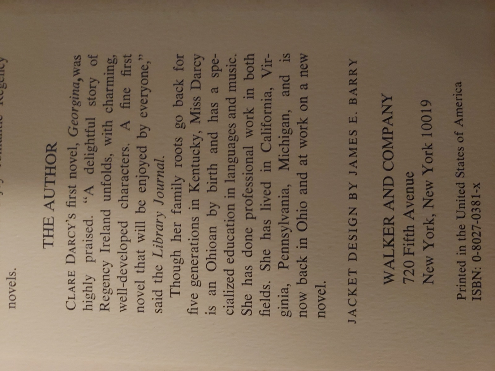

# READMEs that sell

*The README is read before the code. Lead with what the project demonstrates and how to see it working - a live report, a badge, a GIF - and push setup instructions below the fold instead of in front of it.*

> A hiring manager decides whether a repository is worth a closer look before they clone it, before they
> run it, often before they scroll past the first screen. The README is the only part of the project
> guaranteed to be read. A wall of installation steps in that first screen loses the reader before they
> ever learn what the project is for.

> **In real life**
>
> Standing in a bookstore aisle, a reader picks up a novel and reads the two paragraphs on the back cover
> before deciding whether to open to page one. Nobody starts by reading page three hundred, and nobody
> reads the back cover expecting the entire plot - it exists purely to earn the next thirty seconds of
> attention. A README does the same job for a repository: it is not the codebase and it is not a full
> manual, it is the two paragraphs that decide whether anyone opens the first file at all.

**README that sells**: A README that sells is the first-screen portion of a project's README - written to be read in under thirty seconds - that states what the project demonstrates, links directly to evidence it works (a report, a badge, a recording), and defers setup instructions and deep detail until after that pitch, rather than leading with them.

## Lead with what it proves, not how to install it

The first few lines should answer one question: what does this repository demonstrate about how I
test? "A UI automation suite for an e-commerce checkout flow, using Page Object Model, covering the
happy path and four edge cases, running in CI on every push" tells a reviewer everything they need to
decide whether to keep reading. "Clone the repo, then run `npm install`..." as the opening line tells
them nothing about why they should bother.

## Link to evidence, don't just claim it

A live CI status badge, a link to the last passing report, or a short GIF of the suite running is worth
more than an adjective. "Robust test suite" is a claim; a green badge linking to an actual workflow run
is proof. Put the proof within the first screen, not three hundred lines down past a wall of
configuration steps nobody has read yet.

## Order the rest by who's still reading

After the pitch and the proof: what it covers, how to run it (for the reviewer who wants to verify
locally), and only then anything else - architecture notes, design decisions, a longer explanation.
Someone who read the first screen and kept scrolling has already decided you're worth their time; write
for that reader, not for the one who bounced already.

> **Tip**
>
> Read your own README as if you had thirty seconds and no context. If the first screen doesn't answer
> "what does this prove" and "how do I see it working," move content down until it does.

> **Common mistake**
>
> Do not open with a wall of prerequisites - Node version, database setup, environment variables -
> before saying one sentence about what the project actually demonstrates. That ordering assumes the
> reader has already decided to invest time, which is exactly the decision the README's opening is
> supposed to earn.


*'Cecily' by Clare Darcy, back jacket - Wikimedia Commons, CC BY-SA 4.0. [Source](https://commons.wikimedia.org/wiki/File:%27Cecily%27_by_Clare_Darcy_back_jacket.jpg)*
- **A heading, not an instruction manual** — The flap opens by orienting the reader in one glance, the same job a README's title line and one-sentence pitch should do before anything else.
- **A quoted outside review - borrowed trust** — A pull-quote from a named publication does work a plain claim can't. A CI badge or a linked passing report is a README's version of the same borrowed trust.
- **Specific, checkable credentials** — Concrete facts, not vague praise. 'Covers four edge cases and runs in CI on every push' persuades the way specifics always do; 'comprehensive test suite' does not.
- **Publisher details and ISBN - fine print stays at the bottom** — Necessary information, deliberately placed last. Setup instructions and dependency versions belong in a README too - just below the pitch, not in front of it.

**Ordering a README that actually gets read**

1. **One sentence: what does this repo demonstrate** — Written for a reader with thirty seconds and zero context.
2. **Proof, linked, in the first screen** — A CI badge, a report link, or a short GIF - not an adjective.
3. **What it covers, then how to run it** — For the reader who's still here and wants to verify locally.
4. **Everything else, below the fold** — Architecture notes and deep detail, for the reader who's already decided to stay.

*A README-quality scorer against a rubric (Python)*

```python
readme_sections_present = {
    "one_line_pitch": True,
    "what_it_demonstrates": True,
    "how_to_run": True,
    "link_to_results_or_report": True,
    "wall_of_setup_before_pitch": False,
}

score = 0
score += 1 if readme_sections_present["one_line_pitch"] else 0
score += 1 if readme_sections_present["what_it_demonstrates"] else 0
score += 1 if readme_sections_present["how_to_run"] else 0
score += 1 if readme_sections_present["link_to_results_or_report"] else 0
score -= 1 if readme_sections_present["wall_of_setup_before_pitch"] else 0

checks = {
    "has_one_line_pitch": readme_sections_present["one_line_pitch"],
    "leads_with_pitch_not_setup": not readme_sections_present["wall_of_setup_before_pitch"],
    "links_to_evidence": readme_sections_present["link_to_results_or_report"],
    "score_at_least_3": score >= 3,
}
for name, passed in checks.items():
    print(name + "=" + ("PASS" if passed else "FAIL"))
result = "PASS" if all(checks.values()) else "FAIL"
assert result == "PASS", "README rejected"
print("RESULT=" + result)
```

*A README-quality scorer against a rubric (Java)*

```java
import java.util.LinkedHashMap;
import java.util.Map;

public class Main {
    public static void main(String[] args) {
        Map<String, Boolean> readme = new LinkedHashMap<>();
        readme.put("one_line_pitch", true);
        readme.put("what_it_demonstrates", true);
        readme.put("how_to_run", true);
        readme.put("link_to_results_or_report", true);
        readme.put("wall_of_setup_before_pitch", false);

        int score = 0;
        score += readme.get("one_line_pitch") ? 1 : 0;
        score += readme.get("what_it_demonstrates") ? 1 : 0;
        score += readme.get("how_to_run") ? 1 : 0;
        score += readme.get("link_to_results_or_report") ? 1 : 0;
        score -= readme.get("wall_of_setup_before_pitch") ? 1 : 0;

        Map<String, Boolean> checks = new LinkedHashMap<>();
        checks.put("has_one_line_pitch", readme.get("one_line_pitch"));
        checks.put("leads_with_pitch_not_setup", !readme.get("wall_of_setup_before_pitch"));
        checks.put("links_to_evidence", readme.get("link_to_results_or_report"));
        checks.put("score_at_least_3", score >= 3);

        boolean ok = true;
        for (Map.Entry<String, Boolean> e : checks.entrySet()) {
            System.out.println(e.getKey() + "=" + (e.getValue() ? "PASS" : "FAIL"));
            ok &= e.getValue();
        }
        String result = ok ? "PASS" : "FAIL";
        if (!result.equals("PASS")) throw new AssertionError("README rejected");
        System.out.println("RESULT=" + result);
    }
}
```

### Your first time: Rewrite your first README to actually sell the project

- [ ] Write the one-sentence pitch first — What does this repo demonstrate - target, tool, and what it covers - in one sentence.
- [ ] Link real evidence into the first screen — A CI badge, a report link, or a short GIF of a passing run.
- [ ] Move every setup step below the pitch and the proof — Prerequisites and install steps are necessary, not first.
- [ ] Read it cold, with a thirty-second timer — If you can't state what the repo proves by the end of the first screen, reorder it.

- **The README opens with Node version, database setup, and environment variables.**
  Move all of it below a one-sentence pitch and a link to proof. Setup instructions are for the reader who already decided to stay.
- **The README claims 'comprehensive test coverage' with nothing linked to back it up.**
  Replace the adjective with a fact and a link - the actual number of cases covered, or a badge linking to the real CI run.
- **A reviewer skims for ten seconds and closes the tab.**
  That ten seconds is the entire budget. Confirm the first screen alone answers what the project demonstrates and where the proof is, with nothing else required to find it.

### Where to check

- The rendered README exactly as GitHub displays it, reading only the first screen before scrolling.
- Every badge and link in that first screen, confirmed to actually resolve to live evidence.
- [[a-portfolio-that-gets-interviews/the-3-repo-portfolio/repo-3-api-suite-and-ci]] for the CI status badge this README should link to.
- [[a-portfolio-that-gets-interviews/the-3-repo-portfolio/repo-1-documented-manual-project]] for what the pitch should say when the repo is a manual project instead of automation.

### Worked example: the same repo, reordered

1. The original README opens with "Requirements: Python 3.11, pip, a virtual environment..." for eleven
   lines before mentioning what the project even tests.
2. The new opening line: "API regression suite for a task-management service - covers create, read,
   update, and delete plus three negative cases, running automatically in CI on every push."
3. A CI status badge sits directly under that line, linking to the actual passing workflow run.
4. The original eleven lines of setup instructions move to a "Running it locally" section, several
   screens down, exactly where a reader who wants to verify it will look for them.

**Quiz.** What should the very first screen of a portfolio README establish?

- [ ] Every dependency and environment variable required to run the project
- [x] What the project demonstrates, plus a link to visible proof it works
- [ ] A complete list of every file in the repository
- [ ] The author's full resume and contact information

*The first screen is read by people deciding whether to invest more time. Stating what the project demonstrates and linking real proof - a badge, a report, a recording - earns that time; a list of prerequisites does not.*

- **What a README's first screen should do** — State what the project demonstrates and link real evidence it works, before any setup instructions appear.
- **The bookstore back-cover analogy** — The back cover isn't the whole novel - it exists purely to earn the next thirty seconds of attention, the same job a README's opening does for a repo.
- **Claim vs. proof** — 'Robust test suite' is a claim. A CI badge linking to a real, passing workflow run is proof - always prefer the link.

### Challenge

Take an existing repo's README and rewrite its first screen to lead with a one-sentence pitch and a link to real evidence, moving every setup instruction below it.

- [Make a README - what a good README includes](https://www.makeareadme.com/)
- [Awesome README - a curated list of excellent READMEs](https://github.com/matiassingers/awesome-readme)
- [How To Write A README People Actually Read](https://www.youtube.com/watch?v=fDJNt67xdvQ)

🎬 [How To Write A README People Actually Read](https://www.youtube.com/watch?v=fDJNt67xdvQ) (8 min)

- The README is the one part of a portfolio project guaranteed to be read - lead it with what the project proves.
- Link real evidence - a badge, a report, a recording - instead of describing quality with adjectives.
- Setup instructions and deep detail belong after the pitch, for the reader who already decided to stay.
- Read your own README cold with a thirty-second timer before trusting it to do its job.


## Related notes

- [[Notes/a-portfolio-that-gets-interviews/the-3-repo-portfolio/repo-1-documented-manual-project|Repo 1: documented manual project]]
- [[Notes/a-portfolio-that-gets-interviews/the-3-repo-portfolio/repo-3-api-suite-and-ci|Repo 3: API suite + CI]]
- [[Notes/version-control-with-git/github-and-pull-requests/pushing-to-github|Pushing to GitHub]]


---
_Source: `packages/curriculum/content/notes/a-portfolio-that-gets-interviews/the-3-repo-portfolio/readmes-that-sell.mdx`_
