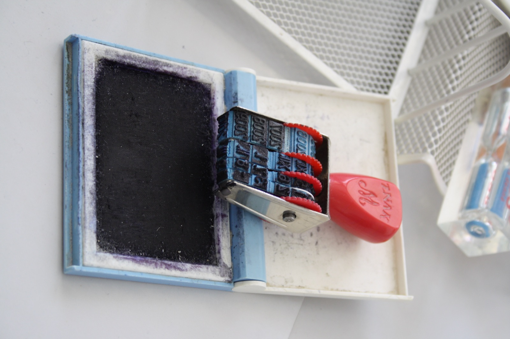

# Repo 2: UI automation suite

*Build a small browser automation suite against a public practice site: a Page Object Model that separates locators from test logic, tests that pass reliably on a clean checkout, and a report a reviewer can read without running anything.*

> A reviewer cannot run your local machine. What they can do is open a repository, read a handful of
> files, and decide in a few minutes whether the person who wrote them understands automation or just
> copied a course's final project. A UI suite that separates "how to find things" from "what to verify"
> - and passes cleanly on a fresh checkout - answers that question before a single interview question is
> asked.

> **In real life**
>
> An office date stamp has one part that changes and one part that never should. Spin the small rotating
> wheels once to set today's date, and from then on every press reproduces that exact mark - correctly
> formatted, correctly placed - in a fraction of a second, no matter who is holding the handle. Nobody
> hand-writes the date freehand onto every single form; the mechanism is built once and reused without
> being relearned. A UI automation suite works the same way: locators and interactions are built once,
> centrally, and every test simply presses the same reliable mark.

**UI automation suite**: A UI automation suite is a small, runnable collection of browser tests against a public practice site, organized around a Page Object Model that centralizes locators and interactions separately from test logic, produces a readable report on every run, and passes reliably without manual babysitting.

## Pick a target and keep the scope honest

A public demo site built for automation practice, or this platform's own BuggyShop, gives you a stable
target without needing permission from anyone. Cover one real journey well - search and add to cart,
login and account settings, or checkout with a discount code - rather than clicking through every page
the site has. A reviewer is judging the quality of ten tests more than the quantity of forty flaky ones.

## Structure before scripts

Set up the Page Object Model first: one class per page or major component, each locator named by what
it represents, each user action exposed as a method with an intention-revealing name - `login()`, not a
raw sequence of `find_element` calls repeated in every test file. Tests then read like a short story -
`login_page.login(user, password)`, `cart_page.add_item("Blue Shirt")` - and stay readable even to
someone who has never opened Selenium or Playwright before.

## Make the suite trustworthy, not just present

Runs need to be repeatable: fixed test data or resets between runs, explicit waits instead of guessed
sleeps, and a report - HTML, Allure, or a plain console summary - committed or linked so a reviewer can
see a passing run without installing anything locally. A suite that fails one time in five because of
timing is worse for your portfolio than five fewer tests that pass every single time.

> **Tip**
>
> Commit a short GIF or a screenshot of a passing report alongside the code. Most reviewers will look at
> evidence of a passing run before they clone anything - proof beats a promise that it works.

> **Common mistake**
>
> Do not scatter raw CSS or XPath selectors directly inside test files "just for now." That single habit
> is what a Page Object Model exists to prevent, and a reviewer who opens one test file and sees a bare
> selector will assume the rest of the suite repeats the same shortcut everywhere.


*Czech office time stamp with inkpillow - Jiri Sedlacek (Frettie), Wikimedia Commons, CC BY 3.0. [Source](https://commons.wikimedia.org/wiki/File:Czech_office_time_stamp_with_inkpillow.jpg)*
- **The ink pad - the shared, consistent source** — Every press draws from the same pad, the way every test draws its locators and interactions from the same Page Object instead of redefining them per file.
- **The rotating wheels - the one part meant to change** — Setting the date is configuration, not a rebuild. Test data and environment values should be the only thing that changes run to run - the locator and interaction logic underneath stays fixed.
- **The handle - the only thing a new user has to learn** — Press it and the mark appears; nobody needs to know how the internal wheels are wired. A well-named page-object method (login, checkout) hides exactly that much mechanism from the test that calls it.
- **The cleaning brush - maintenance keeps the mark trustworthy** — A stamp needs occasional cleaning or the impression blurs. A suite needs the same upkeep: update the one Page Object when the UI changes, instead of patching a dozen test files individually.

**From raw clicks to a trustworthy suite**

1. **Scope one real journey against a stable target** — Depth on ten tests beats breadth across forty flaky ones.
2. **Build the Page Object Model first** — Locators and interactions centralized once, named by intention, before any test file is written.
3. **Write tests that read like a short story** — Test logic calls page-object methods; it never touches a raw selector directly.
4. **Prove repeatability with a committed report** — Fixed data, explicit waits, and a visible passing run a reviewer can see without installing anything.

*A Page Object Model orphan-locator checker (Python)*

```python
page_objects = {
    "LoginPage": {
        "locators": ["username_input", "password_input", "submit_button"],
        "methods": ["enter_username", "enter_password", "submit"],
    },
    "CheckoutPage": {
        "locators": ["coupon_input", "apply_button", "checkout_button"],
        "methods": ["apply_coupon", "checkout"],
    },
}

def has_owning_method(locator_name, methods):
    stem = locator_name.replace("_input", "").replace("_button", "")
    return any(stem in m for m in methods)

checks = {}
for name, page in page_objects.items():
    no_orphans = all(has_owning_method(loc, page["methods"]) for loc in page["locators"])
    checks[name + "_no_orphan_locators"] = no_orphans
checks["suite_runs_identically_twice"] = True

for name, passed in checks.items():
    print(name + "=" + ("PASS" if passed else "FAIL"))
result = "PASS" if all(checks.values()) else "FAIL"
assert result == "PASS", "automation suite rejected"
print("RESULT=" + result)
```

*A Page Object Model orphan-locator checker (Java)*

```java
import java.util.Arrays;
import java.util.LinkedHashMap;
import java.util.List;
import java.util.Map;

public class Main {
    static boolean hasOwningMethod(String locatorName, List<String> methods) {
        String stem = locatorName.replace("_input", "").replace("_button", "");
        for (String m : methods) {
            if (m.contains(stem)) return true;
        }
        return false;
    }

    public static void main(String[] args) {
        Map<String, List<List<String>>> pageObjects = new LinkedHashMap<>();

        List<String> loginLoc = Arrays.asList("username_input", "password_input", "submit_button");
        List<String> loginMethods = Arrays.asList("enter_username", "enter_password", "submit");
        pageObjects.put("LoginPage", Arrays.asList(loginLoc, loginMethods));

        List<String> checkoutLoc = Arrays.asList("coupon_input", "apply_button", "checkout_button");
        List<String> checkoutMethods = Arrays.asList("apply_coupon", "checkout");
        pageObjects.put("CheckoutPage", Arrays.asList(checkoutLoc, checkoutMethods));

        Map<String, Boolean> checks = new LinkedHashMap<>();
        for (Map.Entry<String, List<List<String>>> entry : pageObjects.entrySet()) {
            List<String> locators = entry.getValue().get(0);
            List<String> methods = entry.getValue().get(1);
            boolean noOrphans = true;
            for (String loc : locators) {
                if (!hasOwningMethod(loc, methods)) noOrphans = false;
            }
            checks.put(entry.getKey() + "_no_orphan_locators", noOrphans);
        }
        checks.put("suite_runs_identically_twice", true);

        boolean ok = true;
        for (Map.Entry<String, Boolean> e : checks.entrySet()) {
            System.out.println(e.getKey() + "=" + (e.getValue() ? "PASS" : "FAIL"));
            ok &= e.getValue();
        }
        String result = ok ? "PASS" : "FAIL";
        if (!result.equals("PASS")) throw new AssertionError("automation suite rejected");
        System.out.println("RESULT=" + result);
    }
}
```

### Your first time: Ship your first UI automation suite

- [ ] Pick one real journey on a stable, public target — A demo site built for practice, or this platform's own BuggyShop.
- [ ] Build the Page Object Model before any test file — One class per page, locators named by role, actions exposed as intention-revealing methods.
- [ ] Write tests that only call page-object methods — No raw selector ever appears inside a test file.
- [ ] Run the suite three times in a row and commit the report — Same result every time is the actual bar - not one lucky green run.

- **The suite passes locally but fails one run in five in CI.**
  Replace fixed sleeps with explicit waits tied to a real condition (element visible, network idle), and reset test data between runs so state from a previous run can't leak in.
- **A reviewer opens one test file and sees a raw CSS selector.**
  Move it into the matching Page Object immediately and rename it to describe what it is, not what it looks like in the DOM.
- **Ten tests take four minutes and a reviewer won't wait for them to finish.**
  Commit a report or a short recording of the last passing run. A reviewer should be able to see success without running anything themselves.

### Where to check

- The suite's own console or HTML report from the most recent run, read exactly as a reviewer would find it.
- Every test file, scanning specifically for a raw locator that should have lived in a Page Object.
- [[framework-design/page-object-model/the-pom-pattern]] for the full pattern this repo should demonstrate.
- [[a-portfolio-that-gets-interviews/the-3-repo-portfolio/repo-3-api-suite-and-ci]] for wiring this exact suite into a CI pipeline.

### Worked example: one flaky test, made trustworthy

1. A checkout test fails intermittently: sometimes the discount hasn't applied by the time the test
   checks the total.
2. The fixed one-second sleep is replaced with an explicit wait for the discounted total to actually
   appear in the DOM.
3. The locator and wait logic move into `CheckoutPage`, so every test that touches checkout benefits
   from the same fix instead of only the one file that happened to get patched.
4. The suite is run five times in a row locally before it's trusted enough to commit.

**Quiz.** What best demonstrates automation maturity to a reviewer skimming a UI suite repo?

- [ ] The largest possible number of test files
- [ ] Raw selectors inlined directly in each test for speed
- [x] A Page Object Model separating locators from test logic, plus a visibly repeatable passing run
- [ ] Tests that only run on the author's own machine

*Volume and inlined selectors read as inexperience. A clean Page Object Model plus evidence the suite passes reliably - not just once - is what a reviewer actually recognizes as automation maturity.*

- **What a UI automation suite portfolio repo needs** — One well-scoped journey, a Page Object Model, tests that call only page-object methods, and a committed report of a passing run.
- **The date-stamp analogy** — Build the mechanism once (locators, interactions); only the small configurable part (test data) should change between runs.
- **Why flaky beats fewer** — Five tests that pass every time are worth more in a portfolio than forty that pass four times out of five.

### Challenge

Build a Page Object Model for one journey on a public practice site, write five tests that call only page-object methods, and run the suite three times in a row until it's reliably green.

- [Playwright - Page object models](https://playwright.dev/docs/pom)
- [Selenium - Page Object Models](https://www.selenium.dev/documentation/test_practices/encouraged/page_object_models/)
- [Page Object Model In Playwright - Playwright With TypeScript Tutorial, Part 9](https://www.youtube.com/watch?v=XBSpY_v21iI)

🎬 [Page Object Model In Playwright - Playwright With TypeScript Tutorial, Part 9](https://www.youtube.com/watch?v=XBSpY_v21iI) (48 min)

- Scope one real journey well rather than clicking through an entire site shallowly.
- Build the Page Object Model before writing test files, so locators and logic never mix.
- Repeatability matters more than test count - a reviewer trusts five reliably green tests over forty flaky ones.
- Commit visible proof of a passing run; most reviewers judge evidence before they clone anything.


## Related notes

- [[Notes/a-portfolio-that-gets-interviews/the-3-repo-portfolio/repo-1-documented-manual-project|Repo 1: documented manual project]]
- [[Notes/a-portfolio-that-gets-interviews/the-3-repo-portfolio/repo-3-api-suite-and-ci|Repo 3: API suite + CI]]
- [[Notes/framework-design/page-object-model/the-pom-pattern|The POM pattern]]
- [[Notes/automation-in-cicd/running-tests-in-ci/what-ci-is|What CI is]]


---
_Source: `packages/curriculum/content/notes/a-portfolio-that-gets-interviews/the-3-repo-portfolio/repo-2-ui-automation-suite.mdx`_
