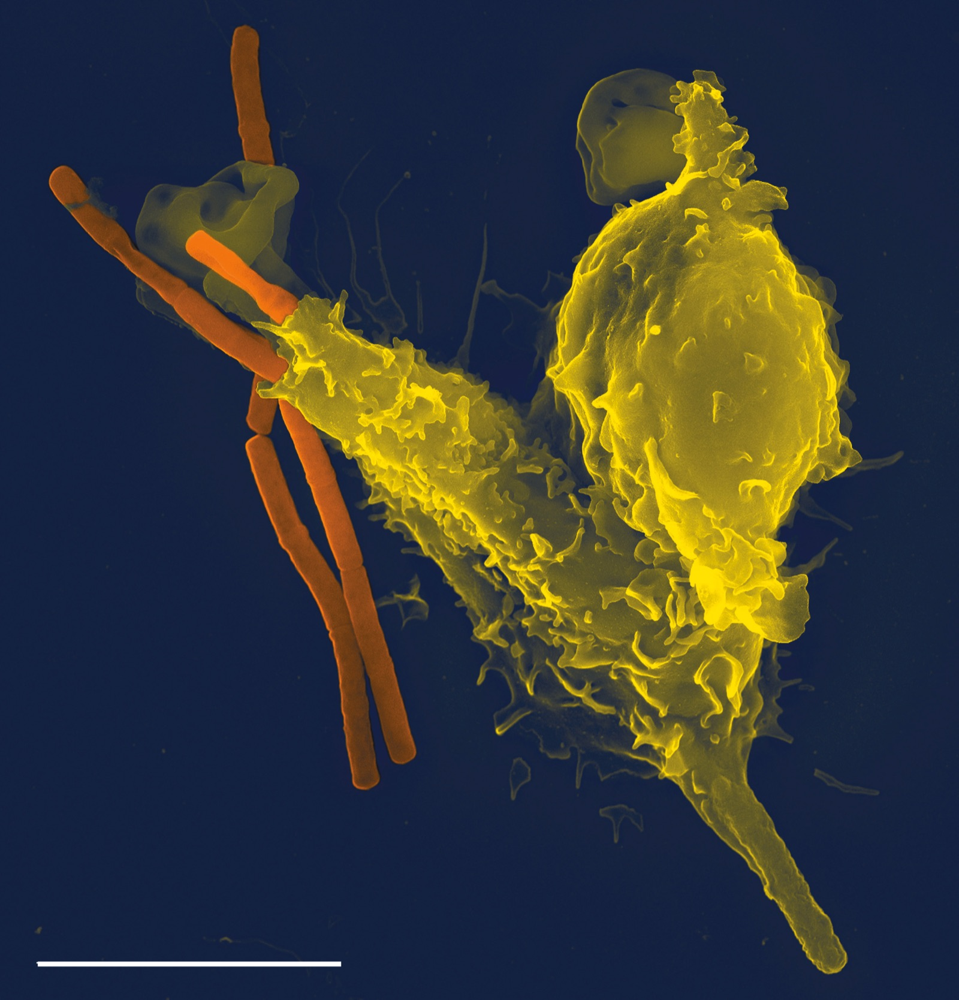

# Repo 3: API suite + CI

*Build an API test suite - REST Assured, pytest, or Postman/Newman - and wire it into GitHub Actions so it runs automatically on every push, proving you understand regression as a habit, not a manual chore.*

> A local API test that only ever ran on your own laptop proves you can write a request. A green
> checkmark next to a pull request, produced by a workflow that fired automatically the moment code was
> pushed, proves something a reviewer actually hires for: that regressions get caught the same day they
> happen, without anyone remembering to run anything by hand.

> **In real life**
>
> A neutrophil does not wait for an annual physical to notice a bacterial invader. It patrols
> continuously, recognizes a threat within minutes of contact, and responds automatically, every time,
> without anyone scheduling the response. A once-a-year checkup would catch the same infection eventually
> - long after it had already done damage. An API suite wired into CI is the patrolling cell, not the
> annual checkup: it checks the system on every single push, the moment a change lands, not on whatever
> schedule a human remembers to run it.

**API suite wired into CI**: An API suite wired into CI is an automated collection of API tests - built with a tool such as REST Assured, pytest and requests, or Postman with Newman - that a continuous integration workflow executes automatically on every push or pull request, reporting pass or fail without any manual trigger.

## Pick a stack and a real target

REST Assured (Java), pytest with `requests` (Python), or Postman collections run headlessly through
Newman are all legitimate, recognizable choices - pick whichever matches the stack you're presenting
yourself for. Point it at a public practice API or this platform's own TaskFlight, and cover one
resource properly: create, read, update, delete, plus a handful of negative cases like a missing
required field or an invalid ID, rather than skimming the surface of every endpoint that exists.

## Wire it into a workflow, not just a script

A GitHub Actions workflow file in `.github/workflows/` that checks out the code, installs dependencies,
and runs the suite on every `push` and `pull_request` is the entire technical bar - it does not need to
be elaborate. What matters is that it fires without a human remembering to trigger it, and that its
result - pass or fail - shows up directly on the commit or the pull request where anyone can see it.

## Make failure visible and specific

A red workflow run that just says "1 test failed" with no further detail wastes the exact evidence CI
exists to produce. Configure the test runner to output which assertion failed and on which request, and
consider publishing a simple report artifact - JUnit XML, an HTML summary, or Newman's own reporter -
so a reviewer opening the Actions tab sees precisely what broke and why, not just a red X.

> **Tip**
>
> Add a status badge to the README linking straight to the latest workflow run. A green badge at the very
> top of the page is proof of a working CI pipeline before a reviewer has read a single line of code.

> **Common mistake**
>
> Do not commit a workflow file that only runs `on: workflow_dispatch` (manual trigger) and call it
> "CI." The entire point being demonstrated is automatic, unattended execution on every push - a
> manually triggered workflow demonstrates a script with extra steps, not continuous integration.


*Neutrophil with anthrax - Volker Brinkmann, Wikimedia Commons, CC BY 2.5. [Source](https://commons.wikimedia.org/wiki/File:Neutrophil_with_anthrax_copy.jpg)*
- **The bacteria - a regression on no fixed schedule** — A change that breaks an endpoint doesn't wait for a convenient time either; it arrives with whatever push introduced it, at any hour.
- **First contact - engaged automatically, within minutes** — The immune response fires without being scheduled. A CI trigger on push works the same way: the suite runs the moment the code lands, with nobody deciding to run it.
- **The neutrophil body - one automated check, not the whole defense** — This single cell is part of a larger system. One API suite in CI is one layer of a testing strategy, not a replacement for the others - it catches what it's scoped to catch, reliably, every time.
- **The scale bar - exact, not eyeballed** — A real measurement, stated precisely. A good CI report does the same: which assertion failed, on which request, not a vague 1 test failed.

**From a local script to a CI-wired API suite**

1. **Cover one resource properly** — Create, read, update, delete, plus real negative cases - depth over endpoint-count.
2. **Add a workflow file triggered on push and pull_request** — No manual step; the suite must fire on its own the moment code lands.
3. **Surface specific failures, not a vague red X** — Assertion-level detail and a committed or linked report artifact.
4. **Put a live status badge at the top of the README** — Proof of a working pipeline visible before a reviewer reads any code.

*A CI-config presence checker (Python)*

```python
repo_files = [".github/workflows/api-tests.yml", "README.md", "tests/test_orders_api.py", "requirements.txt"]
workflow_triggers = ["push", "pull_request"]
workflow_steps = ["checkout", "setup-python", "pip install -r requirements.txt", "pytest tests/"]

checks = {
    "workflow_file_present": ".github/workflows/api-tests.yml" in repo_files,
    "triggers_on_push": "push" in workflow_triggers,
    "runs_test_command": any("pytest" in step for step in workflow_steps),
    "readme_present": "README.md" in repo_files,
}
for name, passed in checks.items():
    print(name + "=" + ("PASS" if passed else "FAIL"))
result = "PASS" if all(checks.values()) else "FAIL"
assert result == "PASS", "CI-wired API suite rejected"
print("RESULT=" + result)
```

*A CI-config presence checker (Java)*

```java
import java.util.Arrays;
import java.util.LinkedHashMap;
import java.util.List;
import java.util.Map;

public class Main {
    public static void main(String[] args) {
        List<String> repoFiles = Arrays.asList(".github/workflows/api-tests.yml", "README.md", "tests/test_orders_api.py", "requirements.txt");
        List<String> workflowTriggers = Arrays.asList("push", "pull_request");
        List<String> workflowSteps = Arrays.asList("checkout", "setup-python", "pip install -r requirements.txt", "pytest tests/");

        Map<String, Boolean> checks = new LinkedHashMap<>();
        checks.put("workflow_file_present", repoFiles.contains(".github/workflows/api-tests.yml"));
        checks.put("triggers_on_push", workflowTriggers.contains("push"));
        boolean runsTestCommand = false;
        for (String step : workflowSteps) {
            if (step.contains("pytest")) runsTestCommand = true;
        }
        checks.put("runs_test_command", runsTestCommand);
        checks.put("readme_present", repoFiles.contains("README.md"));

        boolean ok = true;
        for (Map.Entry<String, Boolean> e : checks.entrySet()) {
            System.out.println(e.getKey() + "=" + (e.getValue() ? "PASS" : "FAIL"));
            ok &= e.getValue();
        }
        String result = ok ? "PASS" : "FAIL";
        if (!result.equals("PASS")) throw new AssertionError("CI-wired API suite rejected");
        System.out.println("RESULT=" + result);
    }
}
```

### Your first time: Ship your first CI-wired API suite

- [ ] Pick a stack and cover one resource properly — Create, read, update, delete, plus a few real negative cases.
- [ ] Add a workflow file that triggers on push and pull_request — No manual dispatch-only trigger - it must fire on its own.
- [ ] Confirm it actually fires without you touching anything — Push a trivial change and watch the Actions tab run the suite unattended.
- [ ] Add a status badge to the top of the README — A live, linked badge is the fastest proof a reviewer will see.

- **The workflow only runs when you click Run workflow manually.**
  Add push and pull_request to the on: trigger list. Manual-only execution isn't continuous integration; it's a remote button.
- **A pull request shows a red X with no further detail.**
  Configure the runner to print which assertion failed on which request, and publish a report artifact so the failure is diagnosable from the Actions tab alone.
- **The suite passes locally but the CI run fails immediately on setup.**
  Pin dependency versions in requirements.txt or the project file, and match the CI runner's language version to what you tested locally - environment drift is the most common CI-only failure.

### Where to check

- The Actions tab on the actual GitHub repository, confirming the workflow fired on the most recent push without a manual trigger.
- The workflow YAML file itself, specifically its `on:` block and the exact test command it runs.
- [[api-test-automation/api-tests-in-ci-newman/newman-and-ci-pipeline]] for the Newman-specific version of this same pipeline.
- [[a-portfolio-that-gets-interviews/the-3-repo-portfolio/readmes-that-sell]] for where the CI status badge should live on the page.

### Worked example: a regression caught the same day it shipped

1. A change to the orders endpoint quietly drops a required field from the response.
2. The push triggers the workflow automatically; the API suite's schema assertion for that field fails
   within two minutes.
3. The pull request shows a red status check with the exact assertion and endpoint named in the log,
   before anyone requests a manual review.
4. The fix ships in the same pull request; nobody needed to remember to test orders by hand.

**Quiz.** What makes an API suite count as 'wired into CI' rather than just a local script?

- [ ] It has more than fifty test cases
- [ ] It requires a teammate to run it manually before every release
- [x] It executes automatically on every push or pull request without a manual trigger
- [ ] It is written in the same language as the application

*The defining property is automatic, unattended execution tied to the repository's own push and pull-request events - not test count or language choice. A workflow that only runs on manual dispatch is a script with a UI, not CI.*

- **What repo 3 needs beyond working tests** — A GitHub Actions workflow triggered on push and pull_request, plus a visible, specific report of what passed or failed.
- **The immune-system analogy** — Continuous, automatic surveillance beats a scheduled annual check - CI on every push is the patrol, not the once-a-year physical.
- **Why a manual-dispatch-only workflow doesn't count** — The whole point is unattended execution; a button someone has to remember to press isn't continuous integration.

### Challenge

Write an API suite covering one resource's create, read, update, and delete plus two negative cases, then add a GitHub Actions workflow that runs it automatically on every push.

- [GitHub Docs - GitHub Actions quickstart](https://docs.github.com/en/actions/writing-workflows/quickstart)
- [Postman - Command line integration with Newman](https://learning.postman.com/docs/collections/using-newman-cli/command-line-integration-with-newman/)
- [Unit testing Python code using Pytest + GitHub Actions](https://www.youtube.com/watch?v=0aEJBygCn5Q)

🎬 [Unit testing Python code using Pytest + GitHub Actions](https://www.youtube.com/watch?v=0aEJBygCn5Q) (23 min)

- A local API script proves you can write requests; a CI-wired suite proves regressions get caught automatically.
- The workflow must trigger on push and pull_request - manual-only dispatch isn't continuous integration.
- Specific, assertion-level failure detail is what makes a red X actually useful to a reviewer.
- A live status badge at the top of the README is the fastest proof of a working pipeline a reviewer will see.


## Related notes

- [[Notes/a-portfolio-that-gets-interviews/the-3-repo-portfolio/repo-2-ui-automation-suite|Repo 2: UI automation suite]]
- [[Notes/a-portfolio-that-gets-interviews/the-3-repo-portfolio/readmes-that-sell|READMEs that sell]]
- [[Notes/api-test-automation/api-tests-in-ci-newman/newman-and-ci-pipeline|Newman + CI pipeline]]
- [[Notes/automation-in-cicd/github-actions/workflow-basics|Workflow basics]]


---
_Source: `packages/curriculum/content/notes/a-portfolio-that-gets-interviews/the-3-repo-portfolio/repo-3-api-suite-and-ci.mdx`_
