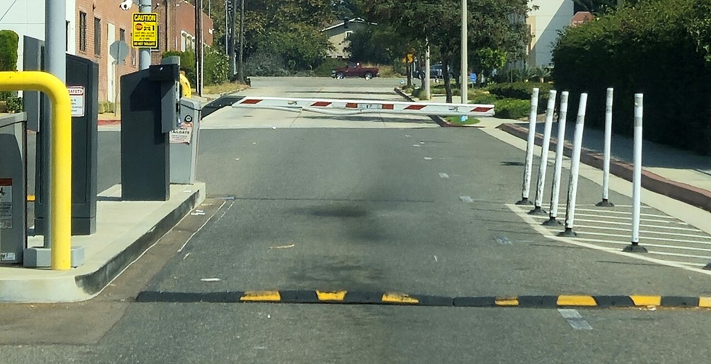

# CI a11y checks

*Wire axe-core into the pipeline itself - jest-axe at the component level, Playwright/Cypress + axe at the page level, Lighthouse CI for score budgets - so a regression blocks the merge automatically instead of waiting for someone to remember to scan.*

> A manual axe DevTools scan only runs when someone remembers to click the button. Wire the exact same
> `axe-core` engine into the CI pipeline instead - as a `jest-axe` unit assertion, a `cypress-axe` or
> Playwright e2e check, or a Lighthouse CI score budget - and every pull request gets scanned
> automatically, with no human in the loop to forget. A regression that would have shipped quietly now
> fails the build before it ever reaches main.

> **In real life**
>
> A boom barrier at a gated lot does not ask the driver to remember to check in - the moment a car
> without clearance rolls up, the arm is already down, blocking the lane automatically. Nobody has to
> remember to enforce it; the enforcement is built into the road itself. A CI accessibility gate is the
> exact same shift: instead of a scan someone has to remember to run, the check becomes a permanent
> part of the road every change has to drive down.

**A CI accessibility gate**: A CI accessibility gate is an automated accessibility check - typically axe-core run through jest-axe, cypress-axe, @axe-core/playwright, or a Lighthouse CI score assertion - wired into the build pipeline so it runs on every pull request and fails the build on a violation, rather than depending on a human to run a manual scan.

## Three layers, three points in the pipeline

**Component-level, in unit tests**: `jest-axe` runs `axe-core` against a single rendered component in
isolation - fast, runs on every test suite execution, and catches a violation the moment a component
is written, before it ever reaches a full page. **Page-level, in end-to-end tests**: `cypress-axe` or
`@axe-core/playwright` runs the same engine against a fully rendered, fully-scripted page during an
e2e run - closer to what a real user's browser sees, catching issues that only exist once components
are assembled together (a layout-level contrast problem, a focus order across a whole flow).
**Score-level, as a budget**: Lighthouse CI (`@lhci/cli`) runs Lighthouse's accessibility audit against
built pages and asserts a minimum score, or that the score does not regress from the previous build -
useful as a broad trend signal even though its rule subset is smaller than full `axe-core`.

## Choosing what actually blocks the merge

Every violation `axe-core` reports carries an impact level - `minor`, `moderate`, `serious`,
`critical`. Gating on every single one, including `minor`, produces enough noise that teams start
ignoring the gate entirely or reflexively silencing it. The pattern that holds up in practice: fail
the build on `serious` and `critical` violations, and report `moderate`/`minor` as warnings visible in
the CI output without blocking the merge. That keeps the gate meaningful - a red build always means a
real, high-confidence problem - while still surfacing the lower-severity findings for a human to
triage on their own schedule instead of being forced to fix them under merge pressure.

> **Tip**
>
> Put the component-level `jest-axe` check first in the pipeline, before the slower e2e/Lighthouse
> stages. A unit-level a11y failure is usually the cheapest and fastest signal to get back - catching it
> in seconds beats waiting for a multi-minute e2e suite to fail on the same root cause.

> **Common mistake**
>
> Treating a green CI a11y gate as equivalent to "accessible." A CI check enforces the exact same
> rule-based, provable-violation-only ceiling as a manual axe DevTools scan - it is a regression
> tripwire for the catchable ~20-40% of issues, not a substitute for the manual and assistive-tech
> testing pass the rest still needs.


*Closed parking lot boom barrier — Epolk, CC BY-SA 4.0, via Wikimedia Commons. [Source](https://commons.wikimedia.org/wiki/File:Closed_parking_lot_boom_barrier.jpg)*
- **The barrier arm - the CI a11y gate itself** — Blocks automatically the instant a rule fires, exactly like a merge that fails on a serious or critical axe-core violation - no human has to remember to enforce it.
- **The gate motor - the pipeline running the check** — The barrier only ever responds to what its own sensor reports. A CI gate is exactly as good as the rule set wired into it, no better.
- **The speed bump before the gate** — A cheaper, earlier check - like a fast jest-axe unit assertion - that catches some problems before a change ever reaches the slower, fuller e2e or Lighthouse stage.
- **Traffic already on the other side** — Code that shipped before this gate existed. A new CI a11y check protects everything merged after it - it says nothing about what already passed through.

**One pull request through a layered CI a11y gate**

1. **jest-axe runs against changed components** — Fastest signal - fails in seconds if a single component regresses, before any e2e suite even starts.
2. **cypress-axe / Playwright + axe run on full pages** — Catches assembly-level issues that only exist once components combine - a focus order across a whole flow, a layout contrast problem.
3. **Lighthouse CI asserts the accessibility score budget** — Confirms the broader trend did not regress, using its own curated rule subset as a second signal.
4. **Serious/critical violations block the merge; moderate/minor are logged as warnings** — The build stays red only for high-confidence problems - lower-severity findings surface without forcing an emergency fix.

*A CI a11y gate decision (Python)*

```python
build_results = [
    {"stage": "jest-axe (component)", "violations": [
        {"rule": "color-contrast", "impact": "serious", "component": "PriceTag"},
    ]},
    {"stage": "cypress-axe (e2e)", "violations": [
        {"rule": "landmark-one-main", "impact": "moderate", "component": "CheckoutPage"},
    ]},
    {"stage": "lighthouse-ci (score budget)", "score": 91, "min_score": 90},
]

BLOCKING_IMPACTS = {"serious", "critical"}

build_failed = False
warnings = []

for result in build_results:
    if "violations" in result:
        for v in result["violations"]:
            if v["impact"] in BLOCKING_IMPACTS:
                build_failed = True
                print("[BLOCKING] " + result["stage"] + ": " + v["rule"] +
                      " (" + v["impact"] + ") on " + v["component"])
            else:
                warnings.append(result["stage"] + ": " + v["rule"] + " (" + v["impact"] + ") on " + v["component"])
    elif "score" in result:
        if result["score"] < result["min_score"]:
            build_failed = True
            print("[BLOCKING] " + result["stage"] + ": score " + str(result["score"]) +
                  " below minimum " + str(result["min_score"]))
        else:
            print("[PASS] " + result["stage"] + ": score " + str(result["score"]) +
                  " meets minimum " + str(result["min_score"]))

print("")
if warnings:
    print("Warnings (not blocking):")
    for w in warnings:
        print("  " + w)

print("")
print("BUILD FAILED" if build_failed else "BUILD PASSED")
```

*A CI a11y gate decision (Java)*

```java
import java.util.*;

public class Main {
    static class Violation {
        String rule, impact, component;
        Violation(String rule, String impact, String component) {
            this.rule = rule; this.impact = impact; this.component = component;
        }
    }

    public static void main(String[] args) {
        Set<String> blockingImpacts = new HashSet<>(Arrays.asList("serious", "critical"));
        boolean buildFailed = false;
        List<String> warnings = new ArrayList<>();

        // jest-axe stage
        List<Violation> componentViolations = new ArrayList<>();
        componentViolations.add(new Violation("color-contrast", "serious", "PriceTag"));
        for (Violation v : componentViolations) {
            if (blockingImpacts.contains(v.impact)) {
                buildFailed = true;
                System.out.println("[BLOCKING] jest-axe (component): " + v.rule + " (" + v.impact + ") on " + v.component);
            } else {
                warnings.add("jest-axe (component): " + v.rule + " (" + v.impact + ") on " + v.component);
            }
        }

        // cypress-axe stage
        List<Violation> e2eViolations = new ArrayList<>();
        e2eViolations.add(new Violation("landmark-one-main", "moderate", "CheckoutPage"));
        for (Violation v : e2eViolations) {
            if (blockingImpacts.contains(v.impact)) {
                buildFailed = true;
                System.out.println("[BLOCKING] cypress-axe (e2e): " + v.rule + " (" + v.impact + ") on " + v.component);
            } else {
                warnings.add("cypress-axe (e2e): " + v.rule + " (" + v.impact + ") on " + v.component);
            }
        }

        // lighthouse-ci stage
        int score = 91, minScore = 90;
        if (score < minScore) {
            buildFailed = true;
            System.out.println("[BLOCKING] lighthouse-ci (score budget): score " + score + " below minimum " + minScore);
        } else {
            System.out.println("[PASS] lighthouse-ci (score budget): score " + score + " meets minimum " + minScore);
        }

        System.out.println();
        if (!warnings.isEmpty()) {
            System.out.println("Warnings (not blocking):");
            for (String w : warnings) System.out.println("  " + w);
        }

        System.out.println();
        System.out.println(buildFailed ? "BUILD FAILED" : "BUILD PASSED");
    }
}
```

### Your first time: Add a first a11y check to a pipeline

- [ ] Add jest-axe to one component's existing test file — A single `expect(await axe(container)).toHaveNoViolations()` assertion is enough to prove the wiring works before expanding coverage.
- [ ] Run it locally and intentionally break something — Remove an aria-label or drop contrast on a test element and confirm the assertion actually fails - a check that cannot fail is not testing anything.
- [ ] Add the same check to the CI workflow file — Confirm it runs on every pull request, not just on-demand or on a schedule.
- [ ] Decide and document the blocking threshold up front — Serious/critical block, moderate/minor warn - written down before the first false alarm forces the decision under pressure.

- **The CI a11y gate is red on almost every pull request, including ones with no visible a11y-related changes.**
  Check the blocking threshold - if minor/moderate violations are set to block, pre-existing issues in shared components will fail unrelated PRs constantly. Narrow blocking to serious/critical and clear the backlog of lower-severity issues separately.
- **jest-axe passes locally but the same component fails in the e2e cypress-axe check.**
  Expected in some cases - jest-axe tests the component in isolation with mock data, while the e2e check runs it assembled inside the real page with real data and real surrounding layout, which can surface issues that only exist in that fuller context.
- **A team disables the a11y gate after too many false-alarm blocks.**
  That is a threshold and triage problem, not a reason to remove the gate - fix the blocking-impact configuration and clear the existing violation backlog first, then re-enable it.

### Where to check

- The exact impact-level threshold configured for each stage - confirm serious/critical actually block and moderate/minor genuinely only warn, rather than assuming the defaults match the team's intent.
- Whether the e2e-level check runs against the fully assembled, real-data page - a check pointed only at a static storybook build will miss issues that depend on real content.
- [[accessibility-testing/automated-a11y-audits/axe-devtools-and-lighthouse]] for the manual version of the exact same engine these CI checks automate.
- [[accessibility-testing/automated-a11y-audits/what-automation-catches-vs-misses]] for why a fully green CI a11y gate still is not a substitute for a manual and assistive-tech testing pass.
- [[automation-in-cicd/running-tests-in-ci/what-ci-is]] for how this gate fits alongside a suite's other automated checks.

### Worked example: a contrast regression caught before it ever reached a human

1. A developer updates a design token, dropping a "muted text" color's contrast ratio from 4.8:1 to
   3.2:1 - visually a subtle, easy-to-miss shift on a busy page.
2. The change ships as part of a larger PR with dozens of files touched; no manual accessibility scan
   is run, because nothing about the PR description mentions accessibility at all.
3. The `jest-axe` component suite runs automatically as part of CI and immediately fails: `color-
   contrast` violation, `serious` impact, on the `MutedText` component - the exact token that changed.
4. The PR is blocked from merging with the specific rule, impact level, and component named directly
   in the CI output - no investigation needed to find what broke.
5. The developer reverts the token change in the same PR, CI goes green, and the regression never
   reaches production. No accessibility expert had to be in the room for this catch to happen.

**Quiz.** Why does this note recommend blocking the merge only on 'serious' and 'critical' axe-core violations, rather than every violation including 'minor'?

- [ ] Minor violations are not real accessibility issues and can be safely ignored forever
- [x] Blocking on every severity level tends to produce enough noise that teams start ignoring or disabling the gate entirely - narrowing to high-confidence violations keeps a red build meaningful
- [ ] axe-core only supports blocking on serious and critical impacts technically
- [ ] Moderate and minor violations are always false positives

*Minor violations are still real findings worth fixing - they are reported as warnings, not ignored. The reasoning is about gate credibility: a build that turns red for every low-severity nuance trains a team to stop trusting or start bypassing the gate, which defeats its purpose. Reserving 'blocking' for serious/critical keeps a red build a reliable, high-confidence signal.*

- **A CI accessibility gate** — An automated a11y check - jest-axe, cypress-axe/Playwright+axe, or Lighthouse CI - wired into the pipeline so it runs on every PR and fails the build on a violation, with no human needed to remember to run a scan.
- **The three CI a11y layers** — Component-level (jest-axe, fastest), page-level e2e (cypress-axe / @axe-core/playwright, catches assembly issues), and score-level (Lighthouse CI budget, broad trend signal).
- **The blocking-threshold pattern that holds up in practice** — Fail the build on serious/critical axe-core violations; report moderate/minor as non-blocking warnings - keeps red builds meaningful instead of training teams to ignore the gate.
- **What a green CI a11y gate does NOT prove** — The same ceiling as any automated scan - it catches the rule-based, provable-violation slice only. It is a regression tripwire, not a substitute for manual and assistive-tech testing.

### Challenge

Add a jest-axe (or equivalent) check to one real component's test suite in a project you have access to. Intentionally introduce a violation, confirm the test fails with the correct rule and impact named, then fix it and confirm the test passes again.

- [jest-axe — GitHub](https://github.com/nickcolley/jest-axe)
- [Lighthouse CI — GitHub](https://github.com/GoogleChrome/lighthouse-ci)
- [Chrome for Developers — Automated testing with aXe (A11ycasts #15)](https://www.youtube.com/watch?v=jC_7NnRdYb0)

🎬 [Chrome for Developers — Automated testing with aXe (A11ycasts #15)](https://www.youtube.com/watch?v=jC_7NnRdYb0) (7 min)

- A CI a11y gate wires the same axe-core engine a manual scan uses directly into the pipeline, so it runs on every PR automatically instead of depending on someone remembering to check.
- Three layers cover different scope: jest-axe (component, fastest), cypress-axe/Playwright+axe (assembled page, e2e), Lighthouse CI (score budget, broad trend).
- Blocking on serious/critical while warning on moderate/minor keeps a red build a reliable, high-confidence signal instead of noise the team learns to ignore.
- A CI gate inherits the exact same automation ceiling as any manual scan - it is a regression tripwire for the catchable slice, not a substitute for manual and assistive-tech testing.
- A new gate protects only what merges after it exists - it says nothing about accessibility debt already shipped before the check was added.


## Related notes

- [[Notes/accessibility-testing/automated-a11y-audits/axe-devtools-and-lighthouse|axe DevTools & Lighthouse]]
- [[Notes/accessibility-testing/automated-a11y-audits/what-automation-catches-vs-misses|What automation catches vs misses]]
- [[Notes/automation-in-cicd/running-tests-in-ci/what-ci-is|What CI is]]


---
_Source: `packages/curriculum/content/notes/accessibility-testing/automated-a11y-audits/ci-a11y-checks.mdx`_
