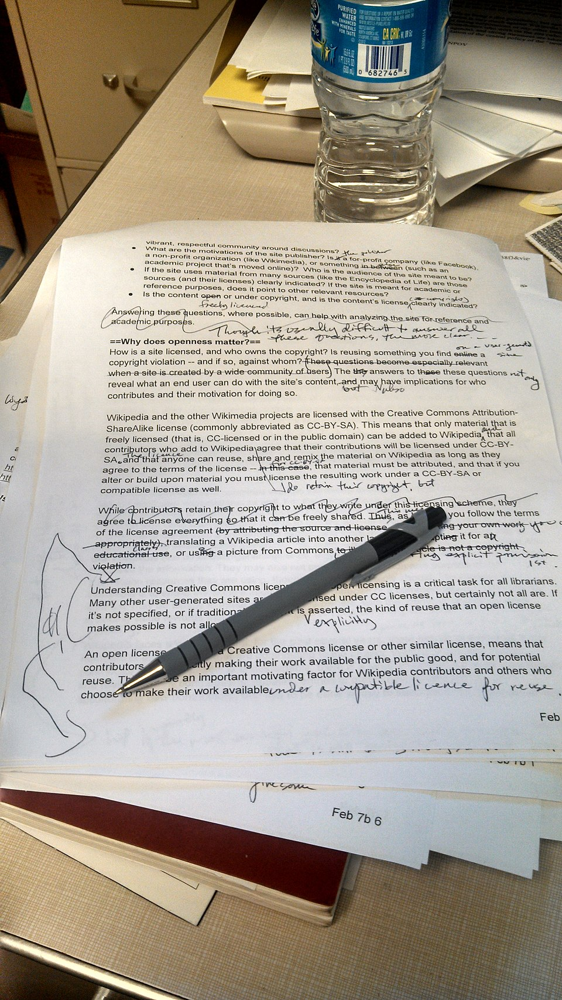

# WAVE

*WebAIM's WAVE drops its findings straight onto the live page as colored icons instead of a separate report - trading a clean list for exact, in-context location.*

> Paste a URL into wave.webaim.org and the page loads back inside the tool - except now it is dotted
> with small red, yellow, and green icons sitting directly next to the exact heading, image, or form
> field each one is about. No separate report to cross-reference, no line numbers to hunt down in the
> DOM: the finding and the broken element are the same click.

> **In real life**
>
> A proofreader has two ways to hand back a marked-up manuscript. One is a typed list: "page 3,
> paragraph 2, missing comma." The other is a red pen used directly on the page itself - a caret
> where the comma should go, a circle around the awkward phrase, a note in the margin pointing at the
> exact word. Both catch the same errors. Only one lets you see the mistake and its fix in the same
> glance, without flipping back and forth between the list and the page. WAVE is the red pen.

**WAVE**: WAVE (Web Accessibility Evaluation Tool) is WebAIM's free automated accessibility checker that overlays its findings as colored icons directly on the rendered page next to the exact element each finding is about, rather than in a separate report list - available as a hosted tool at wave.webaim.org or a Chrome/Firefox/Edge browser extension.

## Same job, different display

WAVE runs the same category of automated, rule-based checks as axe DevTools and Lighthouse - missing
alt text, unlabeled form fields, empty headings, insufficient contrast - and inherits the exact same
ceiling: it can only prove violations against a fixed rule set, and stays silent on anything requiring
judgment. What WAVE changes is *where the result lands*. Instead of a panel list separate from the
page, it injects an icon into the page itself, at the exact spot the flagged element sits, so the
finding and the visual context arrive together.

## Reading the icon system

WAVE's icons sort into a small number of categories, each a different color: **red** icons are
Errors - definite violations, like a missing form label or empty link; **yellow** icons are Alerts -
likely problems that need a human look, like a suspicious alt attribute (`alt="image123.jpg"`) or a
skipped heading level; **green** icons are Features - something done right, like a properly
associated label, shown so a reviewer can confirm the positive alongside the negative; and a separate
**Contrast Errors** category flags text where the measured color ratio fails WCAG's minimum. A
companion **Structure/Order** view (toggled separately from the icon overlay) shows the page's
heading outline and reading order as an overlay of its own, for checking hierarchy at a glance.

> **Tip**
>
> Turn on WAVE's "Structure" panel alongside the icon overlay, not instead of it. Icons show individual
> element-level violations; the structure/heading-outline view shows whether the page's overall
> document hierarchy makes sense - a page can pass every individual icon check and still jump from an
> `<h2>` straight to an `<h4>`, which the outline view surfaces immediately and the icon list does not.

> **Common mistake**
>
> Reading a page with a lot of green Feature icons as evidence it is more accessible than one with
> fewer. Feature icons only appear where WAVE can detect something present and correctly wired up - a
> sparser page with fewer interactive elements naturally shows fewer icons of every color, positive
> and negative alike.


*Example of copyedited manuscript — Phoebe, CC BY-SA 3.0, via Wikimedia Commons. [Source](https://commons.wikimedia.org/wiki/File:Example_of_copyedited_manuscript.jpg)*
- **The reviewer, mid-pass** — WAVE still needs a human reading the overlay it produces - the icons point at problems, they do not resolve the judgment calls on their own.
- **An inline correction, on the line itself** — This is WAVE's whole approach: the mark sits exactly where the problem is, on the actual content, not on a separate page of notes.
- **A margin note pointing at the exact spot** — Same role as a WAVE icon - it does not just say something is wrong, it points at precisely which word or element is at fault.
- **Unmarked printed text** — Everything the reviewer read and found no issue with - equivalent to elements WAVE's icon overlay passes over with no marker at all.

**One WAVE pass**

1. **Load a URL into WAVE (hosted tool or extension)** — WAVE fetches and renders the page, then runs its rule checks against the live DOM.
2. **Icons appear directly on the page** — Red for Errors, yellow for Alerts, green for Features, a separate icon for Contrast Errors - each sitting next to its exact element.
3. **Click an icon to see its detail** — The sidebar explains the specific rule, the WCAG criterion, and why this element triggered it.
4. **Toggle the Structure view for the heading outline** — A second overlay shows document hierarchy and reading order, independent of the per-element icons.

*A WAVE-style icon overlay simulator (Python)*

```python
elements = [
    {"pos": 1, "tag": "h1", "text": "Welcome"},
    {"pos": 2, "tag": "img", "alt": None},
    {"pos": 3, "tag": "img", "alt": "image0912.jpg"},
    {"pos": 4, "tag": "h4", "text": "Skips from h1 to h4"},
    {"pos": 5, "tag": "input", "label": "Email address"},
    {"pos": 6, "tag": "a", "href": "#", "text": ""},
    {"pos": 7, "tag": "p", "contrast_ratio": 2.1},
]

icons = []

for el in elements:
    if el["tag"] == "img" and el.get("alt") is None:
        icons.append({"pos": el["pos"], "color": "red", "kind": "Error", "detail": "Missing alternative text"})
    elif el["tag"] == "img" and el.get("alt", "").endswith((".jpg", ".png")):
        icons.append({"pos": el["pos"], "color": "yellow", "kind": "Alert", "detail": "Suspicious alt text (looks like a filename)"})
    if el["tag"] == "h4":
        icons.append({"pos": el["pos"], "color": "yellow", "kind": "Alert", "detail": "Skipped heading level"})
    if el["tag"] == "input" and el.get("label"):
        icons.append({"pos": el["pos"], "color": "green", "kind": "Feature", "detail": "Properly labeled form field"})
    if el["tag"] == "a" and el.get("text", "") == "":
        icons.append({"pos": el["pos"], "color": "red", "kind": "Error", "detail": "Empty link"})
    if "contrast_ratio" in el and el["contrast_ratio"] < 4.5:
        icons.append({"pos": el["pos"], "color": "red", "kind": "Contrast Error", "detail": "Text contrast ratio " + str(el["contrast_ratio"]) + ":1, below 4.5:1 minimum"})

icons.sort(key=lambda i: i["pos"])

print("Page overlay, in reading order:")
for icon in icons:
    print("  [pos " + str(icon["pos"]) + "] (" + icon["color"] + ") " + icon["kind"] + ": " + icon["detail"])

print("")
for color in ["red", "yellow", "green"]:
    count = len([i for i in icons if i["color"] == color])
    if count:
        print(color + ": " + str(count) + " icon(s)")
```

*A WAVE-style icon overlay simulator (Java)*

```java
import java.util.*;

public class Main {
    static class Elem {
        int pos; String tag, alt, label, text; Double contrastRatio;
        Elem(int pos, String tag) { this.pos = pos; this.tag = tag; }
    }
    static class Icon {
        int pos; String color, kind, detail;
        Icon(int pos, String color, String kind, String detail) {
            this.pos = pos; this.color = color; this.kind = kind; this.detail = detail;
        }
    }

    public static void main(String[] args) {
        List<Elem> elements = new ArrayList<>();
        Elem e1 = new Elem(1, "h1"); e1.text = "Welcome"; elements.add(e1);
        Elem e2 = new Elem(2, "img"); e2.alt = null; elements.add(e2);
        Elem e3 = new Elem(3, "img"); e3.alt = "image0912.jpg"; elements.add(e3);
        Elem e4 = new Elem(4, "h4"); e4.text = "Skips from h1 to h4"; elements.add(e4);
        Elem e5 = new Elem(5, "input"); e5.label = "Email address"; elements.add(e5);
        Elem e6 = new Elem(6, "a"); e6.text = ""; elements.add(e6);
        Elem e7 = new Elem(7, "p"); e7.contrastRatio = 2.1; elements.add(e7);

        List<Icon> icons = new ArrayList<>();

        for (Elem el : elements) {
            if (el.tag.equals("img") && el.alt == null) {
                icons.add(new Icon(el.pos, "red", "Error", "Missing alternative text"));
            } else if (el.tag.equals("img") && el.alt != null && (el.alt.endsWith(".jpg") || el.alt.endsWith(".png"))) {
                icons.add(new Icon(el.pos, "yellow", "Alert", "Suspicious alt text (looks like a filename)"));
            }
            if (el.tag.equals("h4")) {
                icons.add(new Icon(el.pos, "yellow", "Alert", "Skipped heading level"));
            }
            if (el.tag.equals("input") && el.label != null) {
                icons.add(new Icon(el.pos, "green", "Feature", "Properly labeled form field"));
            }
            if (el.tag.equals("a") && el.text != null && el.text.isEmpty()) {
                icons.add(new Icon(el.pos, "red", "Error", "Empty link"));
            }
            if (el.contrastRatio != null && el.contrastRatio < 4.5) {
                icons.add(new Icon(el.pos, "red", "Contrast Error", "Text contrast ratio " + el.contrastRatio + ":1, below 4.5:1 minimum"));
            }
        }

        icons.sort(Comparator.comparingInt(i -> i.pos));

        System.out.println("Page overlay, in reading order:");
        for (Icon icon : icons) {
            System.out.println("  [pos " + icon.pos + "] (" + icon.color + ") " + icon.kind + ": " + icon.detail);
        }

        System.out.println();
        for (String color : new String[]{"red", "yellow", "green"}) {
            long count = icons.stream().filter(i -> i.color.equals(color)).count();
            if (count > 0) {
                System.out.println(color + ": " + count + " icon(s)");
            }
        }
    }
}
```

### Your first time: Run a first WAVE pass on one real page

- [ ] Go to wave.webaim.org and paste in a public page URL — No install needed - the hosted version renders the page inside the tool immediately.
- [ ] Scan the page for icon color, not just count — A handful of red Errors matters more than a large number of green Features - triage by color first.
- [ ] Click three or four icons of different colors — The sidebar explains the exact rule and criterion behind each one, same depth as axe DevTools.
- [ ] Toggle the Structure panel — Compare the heading outline it shows against what the page visually implies - mismatches are easy to miss by eye alone.

- **WAVE shows almost no icons on a page that feels cluttered and hard to use.**
  Expected - WAVE only marks provable rule violations, the same ceiling every automated tool has. A clean overlay is not proof of a good experience; follow with a manual pass.
- **The same page shows different icon counts between the hosted wave.webaim.org tool and the browser extension.**
  The hosted tool fetches a static render of the page; the extension runs against the live, fully-scripted DOM in your browser - dynamic content loaded after page load will differ between the two.
- **A yellow Alert icon on suspicious alt text turns out to be correct.**
  Alerts are flagged for human review, not confirmed violations - an alt attribute that looks like a raw filename might be exactly the right description if that literally is the chart's filename-based title. Confirm before treating every Alert as a bug.

### Where to check

- Any page with dynamically loaded or client-rendered content, using the browser extension rather than the hosted tool so the scan sees the real DOM.
- The Structure/Order view specifically for heading hierarchy, since icon-level checks alone will not catch a skipped or reordered heading level.
- [[accessibility-testing/automated-a11y-audits/axe-devtools-and-lighthouse]] for a second automated tool worth cross-checking results against - same rule category, different display and slightly different rule coverage.
- [[accessibility-testing/automated-a11y-audits/what-automation-catches-vs-misses]] for exactly which categories of issue no automated overlay, WAVE included, can detect.
- [[accessibility-testing/manual-a11y-testing/screen-readers-nvda-voiceover]] for the manual pass that confirms whether WAVE's green Feature icons actually sound right, not just parse correctly.

### Worked example: a product page with a clean WAVE overlay and a confusing form

1. WAVE's icon overlay on a product page shows one yellow Alert (a redundant alt text) and zero red
   Errors - every image has alt text, every input has a green Feature icon confirming a label.
2. A manual screen-reader pass on the same page's "Add to cart" form reveals the quantity input's
   label reads "Quantity" and the size dropdown's label reads "Size" - both technically correct,
   both present, both wired up exactly right.
3. The confusion is elsewhere: the size dropdown's *options* are visually laid out in a 2D grid
   (S top-left, XL bottom-right) that sighted users scan spatially, but a screen reader announces
   them only in flat DOM order, which does not match the visual grid at all.
4. WAVE had nothing to flag - every individual element passed its rules. The mismatch between visual
   spatial layout and DOM/announcement order is a judgment call, not a rule violation.
5. Report: "WAVE overlay clean, but the size-selector grid's visual layout and its screen-reader
   announcement order do not match - a screen reader user cannot reliably tell which option is 'the
   one in the top-right' the way a sighted user can." The fix targets exactly what the icons missed.

**Quiz.** On a WAVE overlay, what does a yellow Alert icon mean, as opposed to a red Error icon?

- [ ] The issue is less severe and can be safely ignored
- [x] The issue is a likely problem WAVE cannot fully confirm and needs a human look, unlike a red Error's definite rule violation
- [ ] The element passed every check WAVE ran against it
- [ ] The page will not load correctly for any user until it is fixed

*Red Errors are provable rule violations - WAVE is certain. Yellow Alerts flag something that often indicates a real problem (like alt text that looks like a raw filename) but requires a human to confirm, since the rule alone cannot tell a genuinely bad case from a coincidentally fine one.*

- **WAVE** — WebAIM's free automated accessibility checker that overlays findings as colored icons directly on the rendered page next to the flagged element, instead of in a separate report list.
- **WAVE's icon colors** — Red = Error (definite violation), Yellow = Alert (likely problem, needs human review), Green = Feature (something done correctly), plus a separate Contrast Errors category.
- **What WAVE changes versus axe DevTools/Lighthouse** — Not the rule category checked - the same automated, rule-based ceiling applies - but where the result appears: in-context on the page itself, rather than in a separate panel list.
- **WAVE's Structure/Order view** — A separate overlay from the per-element icons, showing the page's heading outline and reading order - catches hierarchy problems the icon checks alone would miss.

### Challenge

Run WAVE on one page and count icons by color. Pick one yellow Alert specifically (not a red Error) and manually confirm whether it represents a real problem or a coincidentally fine case - explain which, and why the rule alone could not tell.

- [WebAIM — WAVE Web Accessibility Evaluation Tool](https://wave.webaim.org/)
- [WebAIM — Web Accessibility Evaluation Guide](https://webaim.org/articles/evaluationguide/)
- [How to use the WAVE Evaluation tool](https://www.youtube.com/watch?v=LEr99RWRvY8)

🎬 [How to use the WAVE Evaluation tool](https://www.youtube.com/watch?v=LEr99RWRvY8) (6 min)

- WAVE runs the same category of automated, rule-based checks as axe DevTools and Lighthouse, with the same ceiling - it proves only what a fixed rule set can prove.
- What WAVE changes is location: findings appear as colored icons directly on the live page, next to the exact element, instead of in a separate report.
- Red = Error (certain violation), Yellow = Alert (needs human confirmation), Green = Feature (confirmed correct) - triage by color, not icon count.
- The Structure/Order view is a separate overlay for heading hierarchy and reading order - per-element icons alone will not catch a skipped heading level.
- A clean WAVE overlay proves the same thing a clean axe or Lighthouse scan proves: no rule fired - not that a human has confirmed the page actually works.


## Related notes

- [[Notes/accessibility-testing/automated-a11y-audits/axe-devtools-and-lighthouse|axe DevTools & Lighthouse]]
- [[Notes/accessibility-testing/automated-a11y-audits/what-automation-catches-vs-misses|What automation catches vs misses]]
- [[Notes/accessibility-testing/manual-a11y-testing/screen-readers-nvda-voiceover|Screen readers (NVDA / VoiceOver)]]


---
_Source: `packages/curriculum/content/notes/accessibility-testing/automated-a11y-audits/wave.mdx`_
