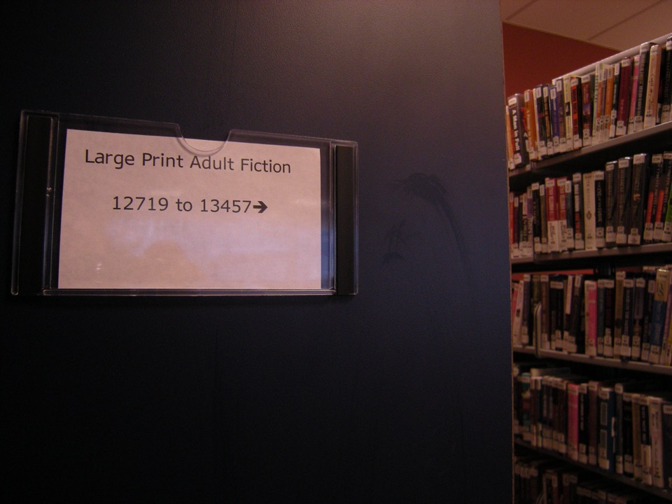

# Contrast & zoom / reflow

*Three checks: color contrast ratio meets WCAG thresholds, text resizes to 200% without losing content or function, and layout reflows to one column at 400% zoom with no horizontal scrolling.*

> Turn the brightness down, step into harsher light, or simply be one of the enormous number of people
> with low vision, and a page's contrast stops being a design opinion and becomes the difference between
> readable and unreadable. Zoom to 400% and the same page has to still work - not just get bigger, but
> actually reorganize so nobody has to scroll sideways to finish a single line of text.

> **In real life**
>
> A public library keeps a large-print edition of its most popular titles on a separate shelf. That
> edition is not simply the standard book photocopied bigger at the same page size - it is deliberately
> re-set, re-paginated, and re-flowed into a single, comfortably sized column a reader can follow straight
> down the page without ever losing their place sideways. Blowing the original page up without re-flowing
> it would just run text off both edges. Sufficient contrast works the same way: a library sign printed
> in bold pale letters on a dark background is legible in a dim aisle precisely because someone measured
> that contrast on purpose, rather than assuming "it looks fine to me" was good enough.

**Contrast, zoom, and reflow testing**: Contrast testing measures the luminance ratio between text and its background against WCAG's numeric thresholds - 4.5:1 for normal text and 3:1 for large text at the AA level. Zoom testing confirms text can be resized up to 200% without loss of content or functionality. Reflow testing confirms that at 400% zoom (equivalent to a 320px-wide viewport), content reorganizes into a single column that reads top to bottom with no horizontal scrolling required to read a line of text.

## Contrast is a calculation, not an impression

WCAG defines contrast as an exact, computable ratio between the relative luminance of foreground text
and its background, not a subjective judgment. The AA threshold is 4.5:1 for normal text and 3:1 for
large text (roughly 18pt or 14pt bold and above); AAA raises those to 7:1 and 4.5:1. A famous, genuinely
borderline real-world example is medium gray text (`#767676`) on a white background, which lands right
around 4.5:1 - close enough that a tiny shade darker fails and a tiny shade lighter passes. "It looks
readable to me" settles nothing; running the actual numbers does.

## 200% resize and 400% reflow are two different checks

Resizing text to 200% (in the browser, not a screen magnifier) must not cause any loss of content or
functionality - nothing should get clipped, overlapped, or become unreachable. Reflow goes further: at
400% zoom, equivalent to viewing on a 320px-wide viewport, a responsive layout is expected to collapse
down to a single column that reads naturally top to bottom, with no horizontal scrolling needed to read
an ordinary line of text. A page that merely gets proportionally bigger at 400% without reorganizing -
forcing side-to-side scrolling to read one sentence - fails reflow even if every word is still, in
principle, present somewhere on the page.

> **Tip**
>
> Use the browser's actual zoom control (Ctrl/Cmd and plus, repeated) rather than a screen magnifier
> utility for these checks - zoom changes the effective viewport width and triggers real responsive
> layout behavior, which is exactly what reflow testing needs to observe.

> **Common mistake**
>
> Eyeballing contrast instead of measuring it. Two colors that look "close enough" to a designer's monitor
> under office lighting can sit well under 4.5:1 in an actual calculation - always run a real contrast
> checker against the two exact hex values in use, not a visual guess.


*WTBBL large print stacks — Wikimedia Commons, CC BY-SA 3.0. [Source](https://commons.wikimedia.org/wiki/File:WTBBL_large_print_stacks_01.jpg)*
- **'Large Print Adult Fiction'** — A deliberately re-set, separate edition - not the ordinary page just scaled up - the same distinction that separates real reflow from simply zooming in.
- **The call-number range and arrow** — A single, coherent path guiding a reader to exactly the right shelf - reflowed content still has to lead somewhere real and navigable, not just appear larger.
- **Pale bold text on a dark background** — A real, working example of a high enough contrast ratio to stay legible even in dim aisle lighting - measured, not assumed.
- **Ordinary-sized book spines nearby** — The tightly packed default format sitting right next to its deliberately reflowed alternative - the two are genuinely different experiences, not one page at two zoom levels.

**Three checks, in order**

1. **Calculate contrast ratio for real text and background pairs** — 4.5:1 for normal text, 3:1 for large text at AA - a real number, not an impression.
2. **Zoom text to 200% in the browser** — Confirm nothing is clipped, overlapped, or becomes unreachable - all content and function must still be there.
3. **Zoom further to 400%** — Equivalent to a 320px viewport - the layout is expected to reflow into a single column.
4. **Confirm no horizontal scrolling is needed to read a line** — Reflow specifically means side-to-side scrolling is gone for ordinary reading, not just that words still exist somewhere.

*A WCAG contrast-ratio and reflow calculator (Python)*

```python
def channel_luminance(c):
    c_srgb = c / 255.0
    if c_srgb <= 0.03928:
        return c_srgb / 12.92
    return ((c_srgb + 0.055) / 1.055) ** 2.4

def relative_luminance(r, g, b):
    return 0.2126 * channel_luminance(r) + 0.7152 * channel_luminance(g) + 0.0722 * channel_luminance(b)

def contrast_ratio(rgb1, rgb2):
    l1 = relative_luminance(*rgb1)
    l2 = relative_luminance(*rgb2)
    lighter = max(l1, l2)
    darker = min(l1, l2)
    return (lighter + 0.05) / (darker + 0.05)

pairs = [
    ("White text on brand blue", (255, 255, 255), (30, 86, 160)),
    ("Classic gray-on-white body text", (118, 118, 118), (255, 255, 255)),
    ("Light gray on white (common failure)", (170, 170, 170), (255, 255, 255)),
    ("Black on yellow banner", (0, 0, 0), (255, 255, 0)),
]

for label, fg, bg in pairs:
    ratio = contrast_ratio(fg, bg)
    aa_normal = ratio >= 4.5
    aaa_normal = ratio >= 7.0
    aa_large = ratio >= 3.0
    aaa_large = ratio >= 4.5
    print(label + ": ratio = " + str(round(ratio, 2)) + ":1")
    print("  Normal text - AA (1.4.3): " + ("PASS" if aa_normal else "FAIL") + ", AAA (1.4.6): " + ("PASS" if aaa_normal else "FAIL"))
    print("  Large text  - AA (1.4.3): " + ("PASS" if aa_large else "FAIL") + ", AAA (1.4.6): " + ("PASS" if aaa_large else "FAIL"))
    print("")

zoom_widths = [1280, 640, 320]
base_width = 1280
print("Reflow check at increasing zoom (1.4.10, single column required by 400%):")
for w in zoom_widths:
    zoom_pct = round(base_width / w * 100)
    columns_needed = 1 if zoom_pct >= 400 else 2
    print("  Effective viewport " + str(w) + "px (" + str(zoom_pct) + "% zoom): expected layout = " + str(columns_needed) + " column(s)")
```

*A WCAG contrast-ratio and reflow calculator (Java)*

```java
public class Main {
    static double channelLuminance(int c) {
        double cSrgb = c / 255.0;
        if (cSrgb <= 0.03928) return cSrgb / 12.92;
        return Math.pow((cSrgb + 0.055) / 1.055, 2.4);
    }

    static double relativeLuminance(int r, int g, int b) {
        return 0.2126 * channelLuminance(r) + 0.7152 * channelLuminance(g) + 0.0722 * channelLuminance(b);
    }

    static double contrastRatio(int[] rgb1, int[] rgb2) {
        double l1 = relativeLuminance(rgb1[0], rgb1[1], rgb1[2]);
        double l2 = relativeLuminance(rgb2[0], rgb2[1], rgb2[2]);
        double lighter = Math.max(l1, l2);
        double darker = Math.min(l1, l2);
        return (lighter + 0.05) / (darker + 0.05);
    }

    static double round2(double v) {
        return Math.round(v * 100.0) / 100.0;
    }

    public static void main(String[] args) {
        String[] labels = {
            "White text on brand blue",
            "Classic gray-on-white body text",
            "Light gray on white (common failure)",
            "Black on yellow banner"
        };
        int[][] fgs = {
            {255, 255, 255},
            {118, 118, 118},
            {170, 170, 170},
            {0, 0, 0}
        };
        int[][] bgs = {
            {30, 86, 160},
            {255, 255, 255},
            {255, 255, 255},
            {255, 255, 0}
        };

        for (int i = 0; i < labels.length; i++) {
            double ratio = contrastRatio(fgs[i], bgs[i]);
            boolean aaNormal = ratio >= 4.5;
            boolean aaaNormal = ratio >= 7.0;
            boolean aaLarge = ratio >= 3.0;
            boolean aaaLarge = ratio >= 4.5;
            System.out.println(labels[i] + ": ratio = " + round2(ratio) + ":1");
            System.out.println("  Normal text - AA (1.4.3): " + (aaNormal ? "PASS" : "FAIL") + ", AAA (1.4.6): " + (aaaNormal ? "PASS" : "FAIL"));
            System.out.println("  Large text  - AA (1.4.3): " + (aaLarge ? "PASS" : "FAIL") + ", AAA (1.4.6): " + (aaaLarge ? "PASS" : "FAIL"));
            System.out.println();
        }

        int[] zoomWidths = {1280, 640, 320};
        int baseWidth = 1280;
        System.out.println("Reflow check at increasing zoom (1.4.10, single column required by 400%):");
        for (int w : zoomWidths) {
            long zoomPct = Math.round(baseWidth / (double) w * 100);
            int columnsNeeded = zoomPct >= 400 ? 1 : 2;
            System.out.println("  Effective viewport " + w + "px (" + zoomPct + "% zoom): expected layout = " + columnsNeeded + " column(s)");
        }
    }
}
```

### Your first time: Run all three checks on one real page

- [ ] Pick the two or three most-used text/background color pairs — Calculate the real contrast ratio for each rather than judging by eye.
- [ ] Zoom the browser to 200% — Confirm every piece of content and every function is still present and reachable, nothing clipped or overlapped.
- [ ] Zoom further to 400% — Confirm the layout actually reorganizes into a single column rather than just growing bigger in place.
- [ ] Try to read one full sentence at 400% — If reading it requires scrolling sideways even once, reflow has failed regardless of what the layout looks like at rest.

- **Gray body text looks fine on a designer's monitor but a contrast checker flags it as failing.**
  Trust the calculated ratio over visual impression - monitor brightness, ambient light, and individual vision all vary far more than most people assume.
- **At 400% zoom, the layout is bigger but still requires horizontal scrolling to read a sentence.**
  This fails reflow specifically - the fix is a responsive breakpoint that actually collapses to one column at that effective viewport width, not just larger text at the existing width.
- **200% zoom causes a button or piece of text to disappear off the edge of its container.**
  This is a loss of content or functionality at 200% resize - check for a fixed-width or overflow: hidden container that was never tested at larger text sizes.

### Where to check

- The exact hex values of every real text-and-background pair in use, run through an actual contrast calculator rather than judged visually.
- Content and functionality at 200% browser zoom specifically, watching for anything clipped, overlapped, or unreachable.
- Layout at 400% zoom (equivalent to a 320px viewport), specifically for single-column reflow with no horizontal scrolling to read a line.
- [[accessibility-testing/manual-a11y-testing/focus-order-and-visible-focus]] since a reflowed, zoomed layout still has to preserve a sensible focus order and a visible indicator.
- [[accessibility-testing/why-accessibility-matters/wcag-2-2-a-aa-aaa]] for exactly which conformance level each of these three checks belongs to.

### Worked example: a page that passed 200% zoom and still failed reflow

1. A product page is zoomed to 200% in the browser. Every piece of text and every button is still
   present, readable, and reachable - nothing clipped, nothing overlapping. This check passes cleanly.
2. The same page is zoomed further, to 400%, equivalent to a 320px-wide viewport.
3. The layout does not reorganize - it stays in the same multi-column arrangement, just larger, and
   reading a single product description sentence now requires scrolling right, then back left, several
   times.
4. 200% resize passed. 400% reflow fails, because the two are genuinely separate requirements with
   different thresholds for what counts as acceptable.
5. Report: "Page passes 200% zoom (no content loss) but fails reflow at 400% - layout does not collapse
   to a single column, forcing horizontal scrolling to read ordinary text." The fix is a responsive
   breakpoint the existing design never accounted for at that effective width.

**Quiz.** A page passes cleanly at 200% browser zoom - nothing is clipped or lost. At 400% zoom, the layout is proportionally bigger but still requires horizontal scrolling to read one sentence. What does this note say about that result?

- [ ] It passes overall, since 200% already succeeded
- [x] It fails reflow specifically - 200% resize and 400% reflow are separate checks with separate thresholds, and getting bigger without reorganizing into a single column does not satisfy reflow
- [ ] It only matters if the text is also low contrast
- [ ] Reflow is optional as long as all the words are technically present somewhere on the page

*The note treats 200% resize (no content or function lost) and 400% reflow (single-column layout, no horizontal scrolling) as two independent checks. Passing one says nothing about the other - a layout that just scales up without reorganizing fails reflow even with zero content loss.*

- **Contrast ratio thresholds (AA)** — 4.5:1 for normal text, 3:1 for large text (roughly 18pt or 14pt bold and above).
- **200% resize check** — Text can be resized to 200% in the browser with no loss of content or functionality - nothing clipped, overlapped, or unreachable.
- **400% reflow check** — At 400% zoom (equivalent to a 320px viewport), layout reorganizes into a single column with no horizontal scrolling needed to read a line of text.
- **Why 'it looks fine' is not a valid contrast check** — Monitor brightness and individual vision vary enormously - only a calculated ratio against exact hex values gives a real answer.

### Challenge

Pick one real page. Calculate the real contrast ratio for its two most-used text colors, then zoom the browser to 200% and separately to 400%. Report each of the three checks - contrast, 200% resize, 400% reflow - as an independent pass or fail with the specific evidence for each.

- [WebAIM — Contrast Checker](https://webaim.org/resources/contrastchecker/)
- [W3C — Understanding SC 1.4.10: Reflow](https://www.w3.org/WAI/WCAG21/Understanding/reflow.html)
- [W3C — Understanding SC 1.4.4: Resize Text](https://www.w3.org/WAI/WCAG21/Understanding/resize-text.html)
- [How to test for Color Contrast — TPGI & WebAIM](https://www.youtube.com/watch?v=D8TPUqbhRmA)

🎬 [How to test for Color Contrast — TPGI & WebAIM](https://www.youtube.com/watch?v=D8TPUqbhRmA) (7 min)

- Contrast is a calculated ratio against exact hex values - 4.5:1 normal text and 3:1 large text at AA - never a visual judgment call.
- 200% resize (no content or function lost) and 400% reflow (single-column layout, no horizontal scrolling) are two separate, independently testable requirements.
- A layout that just scales up bigger at 400% without reorganizing into one column still fails reflow, even with zero content loss.
- Use the browser's real zoom control for these checks, not a screen magnifier utility, since zoom is what actually triggers responsive layout behavior.
- A borderline contrast ratio right at a threshold deserves a real calculation and a clear pass/fail call, not a guess.


## Related notes

- [[Notes/accessibility-testing/manual-a11y-testing/focus-order-and-visible-focus|Focus order & visible focus]]
- [[Notes/accessibility-testing/manual-a11y-testing/screen-readers-nvda-voiceover|Screen readers (NVDA / VoiceOver)]]
- [[Notes/accessibility-testing/why-accessibility-matters/wcag-2-2-a-aa-aaa|WCAG 2.2 A / AA / AAA]]


---
_Source: `packages/curriculum/content/notes/accessibility-testing/manual-a11y-testing/contrast-and-zoom-reflow.mdx`_
