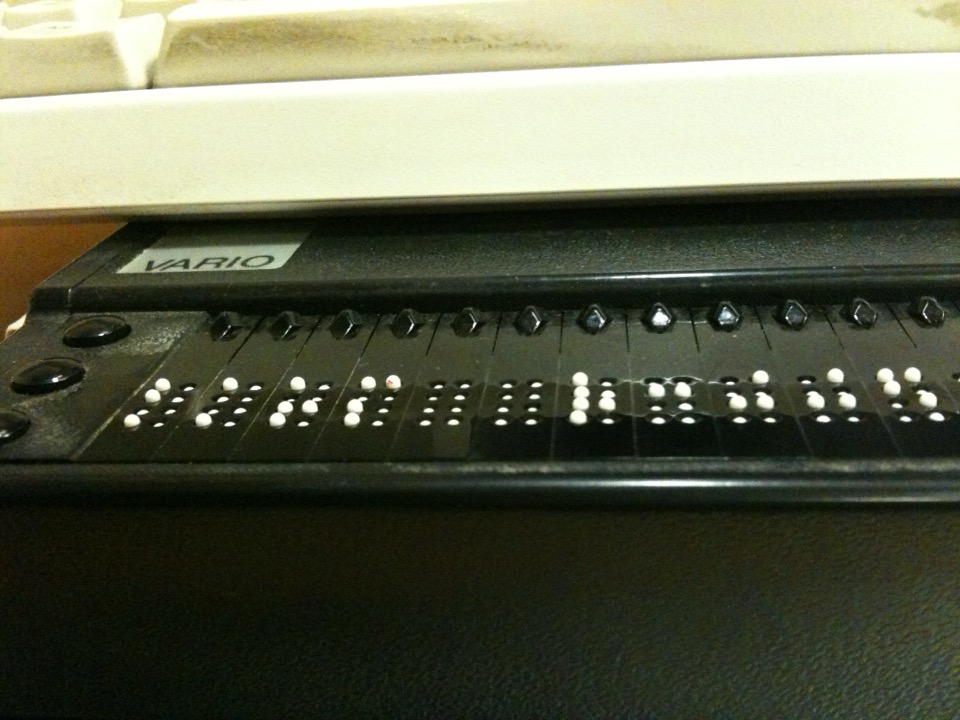

# Screen readers (NVDA / VoiceOver)

*NVDA on Windows and VoiceOver built into macOS/iOS are the two screen readers testers pair most often - NVDA with Chrome or Firefox, VoiceOver with Safari - to hear what a page actually announces.*

> Close your eyes, turn on a screen reader, and try to complete the exact task a sighted user just did
> without looking at the screen once. Whatever gets announced out loud, in whatever order it arrives, is
> the entire product for that pass - and it is very often not what the visual design implies at all.

> **In real life**
>
> Two conference interpreters stand in separate booths, each narrating the exact same live speech to a
> different audience through headphones. Both trained under different schools, both fluent, both
> genuinely accurate - and yet one pauses at different points than the other, orders a speaker's asides
> differently, and handles an unlabeled chart on the projector screen differently, because neither
> interpreter can see anything the speaker did not actually say out loud. Testing with only one
> interpreter's rendition would never reveal what the other interpreter's audience is actually hearing.
> NVDA and VoiceOver are exactly those two interpreters - genuinely different screen readers, each with
> its own conventions, and a real test listens to both.

**NVDA and VoiceOver**: NVDA (NonVisual Desktop Access) is a free, open-source screen reader for Windows, commonly paired with Chrome or Firefox. VoiceOver is Apple's screen reader, built directly into macOS and iOS at no extra cost, commonly paired with Safari. Both convert on-screen content into synthesized speech or braille output, but each has its own announcement conventions, keyboard commands, and quirks - testing with only one misses real differences the other's users experience.

## Why both, not just one

NVDA and VoiceOver are not interchangeable stand-ins for "a screen reader" - they are genuinely
different pieces of software with different rendering engines behind them, different default verbosity,
and different conventions for things like how a heading level, a form field's required state, or a
live region update gets announced. A page can sound clear and complete in NVDA and still confuse
VoiceOver users, or the reverse, because the underlying accessibility tree gets interpreted differently
by each. The pairing matters too: NVDA is tested overwhelmingly with Chrome or Firefox on Windows,
VoiceOver with Safari on macOS or iOS, because that is how real users actually run them.

## What an announcement-order pass actually listens for

The accessible name of each control - is it announcing "Add wheelbarrow to cart" or just the generic
word "button"? The reading order - does a screen reader move through content in the order that actually
makes sense, or does visual CSS positioning disagree with the underlying markup order? And decorative
content - does an empty, purely visual icon get correctly skipped, or does the screen reader announce
something meaningless and distracting for every single one on the page?

> **Tip**
>
> Turn the screen off, or turn your monitor's brightness all the way down, for at least one full pass.
> It is far too easy to let your eyes silently fill in gaps that the actual announcement never provided,
> which hides exactly the bugs a real screen reader user would hit.

> **Common mistake**
>
> Treating "I tested it in NVDA" and "I tested it in VoiceOver" as the same claim. They are two separate,
> equally necessary passes - a fix that resolves an NVDA announcement bug does not guarantee VoiceOver
> announces the same content correctly, since the two are independent implementations.


*Refreshable Braille display, 2010 — Wikimedia Commons, CC0. [Source](https://commons.wikimedia.org/wiki/File:Refreshable_Braille_display_2010_0123.JPG)*
- **The computer keyboard above** — Screen reader output starts here - NVDA or VoiceOver still requires a real keyboard for every command and every navigation key.
- **The VARIO branding** — This is one specific hardware braille display; the software actually deciding what gets sent to it is the screen reader, NVDA or VoiceOver, running on the computer.
- **Cursor-routing buttons** — Pressing one jumps the text cursor straight to that exact braille cell - a direct, physical equivalent of clicking a specific point in a line of text.
- **A row of raised braille cells** — This is the announcement, made physical - the same content NVDA or VoiceOver would otherwise speak out loud, rendered instead as touch.

**A two-screen-reader pass on one task**

1. **Pick one real, complete task** — Something with a clear success state - add an item to a cart, submit a form, find a piece of information.
2. **Complete it in NVDA with Chrome or Firefox** — Write down every accessible name and every point where the announcement order surprised you.
3. **Complete the identical task in VoiceOver with Safari** — Same task, same success state - note anywhere the two screen readers diverged.
4. **Compare the two transcripts directly** — A difference here usually points to a real, fixable ambiguity in the underlying markup, not just a screen reader quirk.

*A screen-reader announcement-order simulator (Python)*

```python
nodes = [
    {"tag": "h1", "level": 1, "text": "Garden Supplies", "aria_label": None, "alt": None, "aria_hidden": False},
    {"tag": "img", "level": None, "text": None, "aria_label": None, "alt": "", "aria_hidden": False},
    {"tag": "img", "level": None, "text": None, "aria_label": None, "alt": "Red wheelbarrow, six cubic feet capacity", "aria_hidden": False},
    {"tag": "button", "level": None, "text": "Add to cart", "aria_label": "Add wheelbarrow to cart", "alt": None, "aria_hidden": False},
    {"tag": "span", "level": None, "text": "Duplicate sale banner", "aria_label": None, "alt": None, "aria_hidden": True},
    {"tag": "button", "level": None, "text": None, "aria_label": None, "alt": None, "aria_hidden": False},
    {"tag": "img", "level": None, "text": None, "aria_label": None, "alt": None, "aria_hidden": False},
]

announcements = []
warnings = []

for i, n in enumerate(nodes):
    if n["aria_hidden"]:
        continue

    if n["tag"] == "img" and n["alt"] == "":
        continue

    accessible_name = n["aria_label"] or n["alt"] or n["text"]

    if accessible_name is None:
        if n["tag"] == "img":
            warnings.append("Node " + str(i) + " (img): missing alt attribute - screen reader will announce filename or nothing useful")
        else:
            warnings.append("Node " + str(i) + " (" + n["tag"] + "): no accessible name - screen reader will announce only the role")
        accessible_name = "[unlabeled " + n["tag"] + "]"

    if n["tag"] == "h1":
        announcements.append("Heading level " + str(n["level"]) + ": " + accessible_name)
    elif n["tag"] == "img":
        announcements.append("Image: " + accessible_name)
    elif n["tag"] == "button":
        announcements.append("Button: " + accessible_name)
    else:
        announcements.append(accessible_name)

print("Announcement order:")
for i, a in enumerate(announcements, start=1):
    print("  " + str(i) + ". " + a)

print("")
skipped = 0
for n in nodes:
    if n["aria_hidden"] or (n["tag"] == "img" and n["alt"] == ""):
        skipped += 1
print("Skipped nodes (aria-hidden or decorative empty-alt image): " + str(skipped))

print("")
if warnings:
    print("Warnings:")
    for w in warnings:
        print("  " + w)
else:
    print("Warnings: none")

print("")
print("Total nodes: " + str(len(nodes)))
print("Announced: " + str(len(announcements)))
print("Warnings raised: " + str(len(warnings)))
```

*A screen-reader announcement-order simulator (Java)*

```java
import java.util.*;

public class Main {
    static class Node {
        String tag;
        Integer level;
        String text;
        String ariaLabel;
        String alt;
        boolean ariaHidden;
        Node(String tag, Integer level, String text, String ariaLabel, String alt, boolean ariaHidden) {
            this.tag = tag;
            this.level = level;
            this.text = text;
            this.ariaLabel = ariaLabel;
            this.alt = alt;
            this.ariaHidden = ariaHidden;
        }
    }

    public static void main(String[] args) {
        List<Node> nodes = new ArrayList<>();
        nodes.add(new Node("h1", 1, "Garden Supplies", null, null, false));
        nodes.add(new Node("img", null, null, null, "", false));
        nodes.add(new Node("img", null, null, null, "Red wheelbarrow, six cubic feet capacity", false));
        nodes.add(new Node("button", null, "Add to cart", "Add wheelbarrow to cart", null, false));
        nodes.add(new Node("span", null, "Duplicate sale banner", null, null, true));
        nodes.add(new Node("button", null, null, null, null, false));
        nodes.add(new Node("img", null, null, null, null, false));

        List<String> announcements = new ArrayList<>();
        List<String> warnings = new ArrayList<>();

        for (int i = 0; i < nodes.size(); i++) {
            Node n = nodes.get(i);
            if (n.ariaHidden) continue;
            if (n.tag.equals("img") && "".equals(n.alt)) continue;

            String accessibleName = n.ariaLabel != null ? n.ariaLabel : (n.alt != null ? n.alt : n.text);

            if (accessibleName == null) {
                if (n.tag.equals("img")) {
                    warnings.add("Node " + i + " (img): missing alt attribute - screen reader will announce filename or nothing useful");
                } else {
                    warnings.add("Node " + i + " (" + n.tag + "): no accessible name - screen reader will announce only the role");
                }
                accessibleName = "[unlabeled " + n.tag + "]";
            }

            if (n.tag.equals("h1")) {
                announcements.add("Heading level " + n.level + ": " + accessibleName);
            } else if (n.tag.equals("img")) {
                announcements.add("Image: " + accessibleName);
            } else if (n.tag.equals("button")) {
                announcements.add("Button: " + accessibleName);
            } else {
                announcements.add(accessibleName);
            }
        }

        System.out.println("Announcement order:");
        for (int i = 0; i < announcements.size(); i++) {
            System.out.println("  " + (i + 1) + ". " + announcements.get(i));
        }

        System.out.println();
        int skipped = 0;
        for (Node n : nodes) {
            if (n.ariaHidden || (n.tag.equals("img") && "".equals(n.alt))) skipped++;
        }
        System.out.println("Skipped nodes (aria-hidden or decorative empty-alt image): " + skipped);

        System.out.println();
        if (!warnings.isEmpty()) {
            System.out.println("Warnings:");
            for (String w : warnings) System.out.println("  " + w);
        } else {
            System.out.println("Warnings: none");
        }

        System.out.println();
        System.out.println("Total nodes: " + nodes.size());
        System.out.println("Announced: " + announcements.size());
        System.out.println("Warnings raised: " + warnings.size());
    }
}
```

### Your first time: Complete one task in both NVDA and VoiceOver

- [ ] Install NVDA (free) and pair it with Chrome or Firefox — Turn off the monitor, or turn brightness fully down, before starting.
- [ ] Complete one real task by listening alone — Write down the accessible name announced for every control you land on.
- [ ] Repeat the identical task in VoiceOver with Safari — macOS and iOS ship VoiceOver already installed - no download needed.
- [ ] Diff the two transcripts — Any place the two screen readers disagree is worth investigating in the underlying markup, not dismissing as a quirk.

- **An icon-only button announces only the word 'button' with no name.**
  Add an accessible name - an aria-label or visually hidden text - so the screen reader has something real to say beyond the bare role.
- **NVDA reads a page cleanly but VoiceOver skips or mis-announces the same content.**
  Treat this as a genuine, separate bug - do not assume a fix verified in one screen reader automatically holds in the other.
- **A decorative icon with an empty alt still gets announced with a distracting filename.**
  Confirm the alt attribute is truly present and empty, not simply missing - a missing alt and an empty alt are read completely differently.

### Where to check

- The accessible name of every control, not just its visible label - aria-label and alt can silently override what a sighted user reads.
- Whether announcement order matches the order a sighted user would naturally read the page in.
- Both NVDA-with-Chrome-or-Firefox and VoiceOver-with-Safari, as two separate, non-substitutable passes.
- [[accessibility-testing/manual-a11y-testing/keyboard-only-navigation]] since a screen reader user is also, by necessity, a keyboard-only user.
- [[accessibility-testing/why-accessibility-matters/disabilities-and-assistive-tech]] for the broader landscape of assistive technology this note's two tools belong to.

### Worked example: a product page that sounded fine until VoiceOver was actually tried

1. An "Add to cart" pass in NVDA with Chrome sounds completely correct: "Button, Add wheelbarrow to
   cart."
2. The same product page is opened in Safari with VoiceOver for a second, independent pass.
3. VoiceOver announces only "Button" at the exact same control - no name at all.
4. Inspection shows the accessible name was set through a technique NVDA's rendering happened to
   tolerate but VoiceOver's accessibility tree interpreted differently, leaving the name blank there.
5. Report: "Add-to-cart button has no accessible name in VoiceOver/Safari, though NVDA/Chrome announces
   it correctly - this is a screen-reader-specific gap, not a general fix-once bug." Both screen readers
   get re-tested after the fix, not just the one that originally failed.

**Quiz.** A page's Add to cart button announces its full name correctly in NVDA with Chrome. What does this note say about whether that also guarantees VoiceOver announces it correctly?

- [ ] Yes - all screen readers interpret the same underlying markup identically
- [x] No - NVDA and VoiceOver are separate implementations with their own conventions, so each needs its own independent pass
- [ ] Only if the page also passes in Firefox
- [ ] Only for icon-only buttons, not text buttons

*The note's interpreter analogy and worked example both make the same point: NVDA and VoiceOver are genuinely different pieces of software, and a result verified in one is evidence about that one screen reader - not a guarantee about the other.*

- **NVDA** — A free, open-source screen reader for Windows, most commonly paired with Chrome or Firefox for testing.
- **VoiceOver** — Apple's screen reader, built into macOS and iOS at no extra cost, most commonly paired with Safari for testing.
- **Why test with both** — They are separate implementations with different announcement conventions - a fix verified in one is not proof it holds in the other.
- **Accessible name** — The text a screen reader actually announces for a control, computed from aria-label, alt, or visible text - which can differ from what a sighted user reads.

### Challenge

Complete one real task on one real page using NVDA with Chrome or Firefox, then repeat the identical task using VoiceOver with Safari. Write down every place the two transcripts disagree and name the underlying markup you suspect is responsible for each.

- [NV Access — NVDA home (free download)](https://www.nvaccess.org/)
- [Apple — VoiceOver User Guide for macOS](https://support.apple.com/guide/voiceover/welcome/mac)
- [WebAIM — Designing for Screen Reader Compatibility](https://webaim.org/techniques/screenreader/)
- [A Comparison of Three Screen Readers: JAWS, NVDA, and VoiceOver](https://www.youtube.com/watch?v=9_K5-4ngDtE)

🎬 [A Comparison of Three Screen Readers: JAWS, NVDA, and VoiceOver](https://www.youtube.com/watch?v=9_K5-4ngDtE) (16 min)

- NVDA (Windows, free) and VoiceOver (built into macOS/iOS) are genuinely different screen readers, not interchangeable stand-ins for one another.
- NVDA pairs most commonly with Chrome or Firefox; VoiceOver pairs most commonly with Safari.
- A pass verifies the accessible name, the announcement order, and whether decorative content is correctly skipped.
- A result confirmed in one screen reader is not proof the other announces the same content correctly - test both independently.
- Turning the monitor off during a pass prevents your eyes from silently filling in gaps a real screen reader user would actually hit.


## Related notes

- [[Notes/accessibility-testing/manual-a11y-testing/keyboard-only-navigation|Keyboard-only navigation]]
- [[Notes/accessibility-testing/manual-a11y-testing/focus-order-and-visible-focus|Focus order & visible focus]]
- [[Notes/accessibility-testing/why-accessibility-matters/disabilities-and-assistive-tech|Disabilities & assistive tech]]


---
_Source: `packages/curriculum/content/notes/accessibility-testing/manual-a11y-testing/screen-readers-nvda-voiceover.mdx`_
