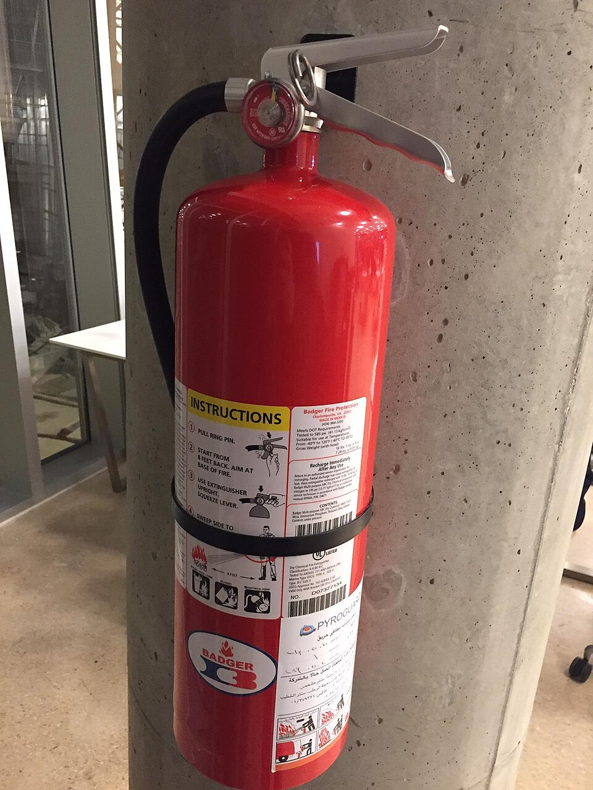

# ARIA: help and harm

*ARIA can make a genuinely custom widget usable for screen readers - or make a perfectly fine element worse. The WebAIM Million consistently finds home pages using ARIA average 41% more detected errors than pages that don't.*

> `role="button"` on a `<div>` tells every screen reader in the room "this is a button" - and says
> nothing about whether pressing Enter or Space actually does anything, because a real `<button>`
> element gets that behavior for free and a `<div>` never does. ARIA can only ever change what gets
> *announced*; it cannot make an element *behave* like what it now claims to be. Get that mismatch
> wrong and the result is worse than doing nothing at all - a screen reader user is told "button,"
> presses it, and nothing happens.

> **In real life**
>
> Read the instructions on a fire extinguisher and they are precise on purpose: pull the pin, aim at
> the base, squeeze, sweep - in that exact order, on that exact type of fire. Follow them on the fire
> they were rated for and the extinguisher genuinely saves the situation. Grab the same extinguisher for
> a fire it was never rated for - water-based foam on a live electrical fire, say - and the exact same
> tool makes things measurably worse. ARIA is the extinguisher: precise, powerful, and only safe when
> applied to exactly the situation its instructions describe. Reached for out of habit, on a widget it
> was never meant for, it does not sit there neutrally - it actively makes the experience worse.

**ARIA**: ARIA (Accessible Rich Internet Applications) is a set of HTML attributes - roles, states, and properties - that describe a UI element's purpose and current condition to assistive technology, most valuably for custom widgets with no native HTML equivalent; used correctly it fills a real gap, used incorrectly it overrides accurate native semantics with an inaccurate claim.

## The first rule of ARIA use

The W3C's own authoring guidance states it directly: if a native HTML element or attribute already
has the semantics and behavior you need, use it instead of repurposing an element and patching in
ARIA to fake the difference. A `<button>` is keyboard-operable, focusable, and announced correctly by
every screen reader with zero ARIA required. A `<div>` styled to look identical and given
`role="button"` gets the announcement right and nothing else - no keyboard operability, no focus
behavior - unless every one of those is rebuilt by hand with `tabindex`, key event handlers, and
careful testing. ARIA changes what gets *said*; it is silent on what actually *works*.

## Where ARIA genuinely helps

Custom widgets with no native HTML equivalent are where ARIA earns its place: a tab panel, a combobox
with autocomplete, a tree view, a live region announcing a toast notification - none of these have a
built-in element that behaves correctly out of the box, so the W3C ARIA Authoring Practices Guide
defines exact role, state, and keyboard-interaction patterns for each. Used to match those patterns
precisely - `role="tab"` paired with `aria-selected` kept in sync with the actual selected state,
full arrow-key navigation implemented to match - ARIA is the only way to make that widget
comprehensible to a screen reader at all.

## Where it quietly does damage

The WebAIM Million - an annual accessibility analysis of the top one million home pages - has
consistently found that pages using ARIA average roughly 41% *more* detected accessibility errors
than pages that use none at all. That number does not mean ARIA itself is harmful; it means ARIA is
disproportionately misapplied. The recurring patterns: a role announced without the matching behavior
built to go with it, a redundant role applied to an element that already has that exact semantics
natively (harmless but pointless), an `aria-hidden="true"` left on an element that is still keyboard-
focusable (a screen reader user tabs to a stop that announces nothing at all - worse than no hiding),
and an `aria-label` that overrides perfectly good visible text with something that has drifted out of
sync with it.

> **Tip**
>
> Before adding any ARIA attribute, ask the first-rule question explicitly: is there a native HTML
> element that already does this? A `<button>`, `<a href>`, `<select>`, `<input type="checkbox">` - each
> comes with correct semantics and full keyboard behavior for free. Reach for ARIA only once that
> answer is genuinely no.

> **Common mistake**
>
> Adding `aria-hidden="true"` to visually hide an element without also removing it from the tab order.
> The element disappears from a screen reader's rendering entirely, but a sighted keyboard user - or a
> screen reader user tabbing through - still lands on it, hears nothing, and has no idea what just
> happened. Pair `aria-hidden` with `tabindex="-1"`, or better, use a method that removes the element
> from both trees at once (like the `hidden` attribute or `display: none`).


*Fire Extinguisher Usage — GeorgesNehmatElie, CC BY-SA 4.0, via Wikimedia Commons. [Source](https://commons.wikimedia.org/wiki/File:Fire_Extinguisher_Usage.jpg)*
- **The instructions - ARIA used correctly** — Numbered, exact steps in a specific order. ARIA works the same way: precise attributes, applied in the exact pattern the APG defines, on exactly the element they're meant for.
- **The classification icons - what this applies to** — Rated for one class of fire, dangerous on another. The same ARIA role that fixes one custom widget can actively break a different element it was never meant to describe.
- **The pull pin - overriding a default on purpose** — Pulling the pin deliberately disables a safeguard for one specific job. Adding a role or aria-* attribute overrides a browser's own native semantics the same deliberate way - and just as easy to do somewhere it doesn't belong.
- **The manufacturer's certification** — A listed, tested extinguisher earned trust against a real standard before anyone relied on it. The parallel: verify ARIA usage against the ARIA Authoring Practices Guide's tested patterns, not improvisation.

**Deciding whether ARIA belongs here**

1. **Does a native HTML element already do this?** — button, a, select, input - if yes, use it and stop; it needs zero ARIA to be correct.
2. **Is this a genuinely custom widget with no native equivalent?** — Tabs, comboboxes, trees, live regions - this is where ARIA's APG patterns exist to fill a real gap.
3. **Does the role match fully-built, tested behavior?** — Every state ARIA claims (aria-selected, aria-expanded) must stay in sync with what the widget actually does, or the announcement becomes a lie.
4. **Would removing the ARIA make this worse, better, or no different?** — If removing it changes nothing observable, it was never needed. If removing it breaks the widget, it was doing real work.

*An ARIA misuse detector (Python)*

```python
elements = [
    {"tag": "button", "role": None, "note": "native button, no ARIA present"},
    {"tag": "div", "role": "button", "has_tabindex": False, "has_key_handler": False,
     "note": "div styled as a button"},
    {"tag": "button", "role": "button", "note": "native button with redundant role"},
    {"tag": "span", "aria_hidden": True, "focusable": True, "note": "visually hidden icon-only link"},
    {"tag": "div", "role": "tab", "aria_selected": True, "has_key_handler": True,
     "note": "custom tab, part of a full APG tab pattern"},
]

for el in elements:
    verdict = None
    if el.get("role") == "button" and el["tag"] == "div":
        if not el.get("has_tabindex") or not el.get("has_key_handler"):
            verdict = "HARMS: announces 'button' with no keyboard behavior built to match"
    elif el.get("role") == "button" and el["tag"] == "button":
        verdict = "NEUTRAL: redundant role on an element that already has this semantics natively"
    elif el.get("aria_hidden") and el.get("focusable"):
        verdict = "HARMS: hidden from screen readers but still reachable by Tab - a silent dead stop"
    elif el.get("role") == "tab" and el.get("has_key_handler"):
        verdict = "HELPS: custom widget, no native equivalent, matches the APG tab pattern"
    elif el.get("role") is None:
        verdict = "FINE: native element, no ARIA needed"

    print(el["note"] + ":")
    print("  " + (verdict or "no verdict"))
    print("")
```

*An ARIA misuse detector (Java)*

```java
import java.util.*;

public class Main {
    static class Elem {
        String tag, role, note;
        boolean hasTabindex, hasKeyHandler, ariaHidden, focusable, ariaSelected;
    }

    public static void main(String[] args) {
        List<Elem> elements = new ArrayList<>();

        Elem e1 = new Elem(); e1.tag = "button"; e1.note = "native button, no ARIA present";
        elements.add(e1);

        Elem e2 = new Elem(); e2.tag = "div"; e2.role = "button"; e2.note = "div styled as a button";
        elements.add(e2);

        Elem e3 = new Elem(); e3.tag = "button"; e3.role = "button"; e3.note = "native button with redundant role";
        elements.add(e3);

        Elem e4 = new Elem(); e4.tag = "span"; e4.ariaHidden = true; e4.focusable = true;
        e4.note = "visually hidden icon-only link";
        elements.add(e4);

        Elem e5 = new Elem(); e5.tag = "div"; e5.role = "tab"; e5.ariaSelected = true; e5.hasKeyHandler = true;
        e5.note = "custom tab, part of a full APG tab pattern";
        elements.add(e5);

        for (Elem el : elements) {
            String verdict = null;
            if ("button".equals(el.role) && el.tag.equals("div")) {
                if (!el.hasTabindex || !el.hasKeyHandler) {
                    verdict = "HARMS: announces 'button' with no keyboard behavior built to match";
                }
            } else if ("button".equals(el.role) && el.tag.equals("button")) {
                verdict = "NEUTRAL: redundant role on an element that already has this semantics natively";
            } else if (el.ariaHidden && el.focusable) {
                verdict = "HARMS: hidden from screen readers but still reachable by Tab - a silent dead stop";
            } else if ("tab".equals(el.role) && el.hasKeyHandler) {
                verdict = "HELPS: custom widget, no native equivalent, matches the APG tab pattern";
            } else if (el.role == null) {
                verdict = "FINE: native element, no ARIA needed";
            }

            System.out.println(el.note + ":");
            System.out.println("  " + (verdict != null ? verdict : "no verdict"));
            System.out.println();
        }
    }
}
```

### Your first time: Audit one real page's ARIA usage

- [ ] Open DevTools and search the DOM for role= and aria- attributes — List every one you find, with the element it sits on.
- [ ] For each, ask the first-rule question — Is there a native element that already provides this semantics? If yes, the ARIA is likely unnecessary or actively wrong.
- [ ] For any role claiming interactive behavior (button, tab, checkbox), test it with a keyboard — Confirm Tab reaches it and Enter/Space (or arrow keys, for composite roles) actually does what the role claims.
- [ ] Check every aria-hidden='true' for a matching tabindex='-1' or removal from the tab order — A hidden-but-still-focusable element is the single most common harmful pattern to check for.

- **A screen reader announces 'button' but pressing Enter or Space does nothing.**
  A button role was added without the matching keyboard behavior. Either implement full keyboard support (tabindex, Enter/Space handlers) or - usually simpler and more robust - replace the element with a real <button>.
- **A screen reader user reports landing on a stop that announces nothing at all.**
  Almost always an aria-hidden left on a still-focusable element. Add a negative tabindex or remove the element from the tab order entirely.
- **An aria-label makes a screen reader announce something different from what's visually on the button.**
  Confirm the aria-label and the visible text still say the same thing in substance - WCAG 2.5.3 requires the accessible name to contain the visible label text, and drift between them confuses users who use both voice control and sight together.

### Where to check

- Every `role="button"`, `role="link"`, or similar interactive role applied to a non-native element - confirm full matching keyboard behavior exists, not just the label.
- Every `aria-hidden="true"` - confirm the element is also removed from the tab order, not just hidden from assistive tech announcement.
- [[accessibility-testing/reporting-and-fixing/semantic-html-first]] for the specific native-element-first discipline that prevents most ARIA misuse before it starts.
- [[accessibility-testing/reporting-and-fixing/writing-a11y-findings-devs-act-on]] for how to file an ARIA-misuse finding with a concrete fix direction, since "remove the ARIA" or "use a real button" is often the entire fix.
- [[accessibility-testing/manual-a11y-testing/screen-readers-nvda-voiceover]] for confirming what a role actually announces, since the DOM attribute alone does not prove what a real screen reader says.

### Worked example: a 'more accessible' redesign that made things worse

1. A team redesigns a dropdown menu, adding `role="menu"` and `role="menuitem"` to every option, plus
   `aria-expanded` on the trigger - confident this makes the component "more accessible" than the
   plain `<select>` it replaced.
2. A screen reader user reports the new dropdown is now confusing: menu items are announced with
   different keyboard expectations (arrow keys expected to move focus directly, per the ARIA menu
   pattern) than what was actually implemented (only Tab moves between them, matching the old select's
   behavior).
3. The role claimed a specific, well-defined interaction pattern; the implementation delivered a
   different one. The mismatch is worse than the plain `<select>` ever was, because the `<select>`'s
   native behavior always matched what it announced.
4. Root cause: no native HTML element needed replacing here at all - `<select>` already provided
   correct semantics and full keyboard behavior for free, and the ARIA menu pattern was never the
   right fit for this component in the first place.
5. Fix: revert to `<select>` (or `<select>` with custom styling, which does not require ARIA) rather
   than trying to patch the mismatched keyboard behavior to match the menu role after the fact.

**Quiz.** Why does this note say a button role on a non-native element can make things worse than having no ARIA at all?

- [ ] Because screen readers ignore ARIA roles entirely
- [x] Because ARIA only changes what gets announced, not what actually behaves that way - a role without matching keyboard behavior tells a user something is operable when it is not
- [ ] Because ARIA roles are deprecated in modern HTML
- [ ] Because a button role is not a valid ARIA role

*ARIA is purely descriptive - it tells assistive technology what something claims to be, with zero effect on the element's actual behavior. A div announced as a button that does not respond to Enter or Space is worse than an unmarked div, because the user was actively told it would work and then hit a dead end.*

- **The first rule of ARIA use** — If a native HTML element or attribute already provides the semantics and behavior needed, use it - do not repurpose a generic element and patch in ARIA instead.
- **What ARIA can and cannot change** — ARIA changes what gets announced to assistive technology. It has zero effect on actual keyboard behavior or focus management - those still have to be built by hand for non-native elements.
- **The WebAIM Million ARIA finding** — Home pages using ARIA consistently average roughly 41% more detected accessibility errors than pages using none - not because ARIA is inherently bad, but because it is disproportionately misapplied.
- **The most common harmful ARIA pattern** — A role claiming interactive behavior (button, tab, menu) with no matching keyboard support built to go with it - and separately, an aria-hidden left on an element that is still keyboard-focusable.

### Challenge

Find one custom interactive element on a real site (a div styled as a button, a custom dropdown). Test it with a screen reader or keyboard-only. Does its ARIA role match its actual behavior? Name the exact mismatch if you find one, or confirm it if it's correctly built.

- [W3C — ARIA Authoring Practices Guide (APG)](https://www.w3.org/WAI/ARIA/apg/)
- [WebAIM — The WebAIM Million](https://webaim.org/projects/million/)
- [Why No ARIA is better than Bad ARIA](https://www.youtube.com/watch?v=SYBJjAJ4SfY)

🎬 [Why No ARIA is better than Bad ARIA](https://www.youtube.com/watch?v=SYBJjAJ4SfY) (8 min)

- The first rule of ARIA use: if a native HTML element already provides the semantics and behavior needed, use it instead of ARIA.
- ARIA only changes what gets announced to assistive technology - it has no effect on actual keyboard operability or focus behavior, which must be built separately for non-native elements.
- The WebAIM Million consistently finds pages using ARIA average about 41% more detected errors - a sign of widespread misapplication, not proof ARIA itself is the problem.
- The two most common harmful patterns: an interactive role with no matching keyboard behavior, and aria-hidden left on an element still reachable by Tab.
- ARIA earns its place on genuinely custom widgets with no native equivalent - tabs, comboboxes, live regions - built to match the ARIA Authoring Practices Guide's tested patterns exactly.


## Related notes

- [[Notes/accessibility-testing/reporting-and-fixing/writing-a11y-findings-devs-act-on|Writing a11y findings devs act on]]
- [[Notes/accessibility-testing/reporting-and-fixing/semantic-html-first|Semantic HTML first]]
- [[Notes/accessibility-testing/manual-a11y-testing/screen-readers-nvda-voiceover|Screen readers (NVDA / VoiceOver)]]


---
_Source: `packages/curriculum/content/notes/accessibility-testing/reporting-and-fixing/aria-help-and-harm.mdx`_
