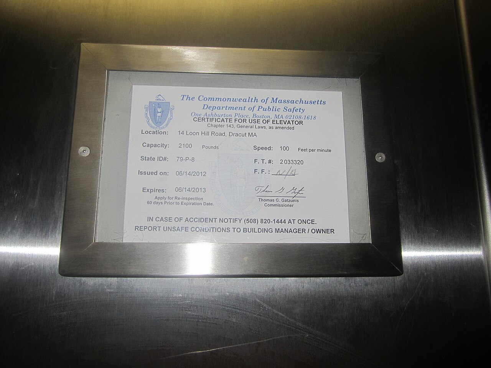

# Re-testing a fix

*A green re-scan proves the rule stopped firing - it doesn't prove a screen reader user can actually complete the flow. Re-test with the same method that found the bug, and check the fix didn't quietly break something next to it.*

> A developer adds an `aria-label` to satisfy a missing-accessible-name violation, the automated
> re-scan goes green, and the ticket closes. Nobody confirmed what a screen reader actually announces
> now - and it turns out the new label duplicates text already read aloud from a sibling element,
> so the fix "worked" by the tool's definition while making the real experience noisier and more
> confusing than before the ticket was ever filed.

> **In real life**
>
> An elevator's inspection certificate does not just say "passed" once and stay valid forever - it
> names an exact issue date, an exact expiration date, and a standing instruction to apply for
> re-inspection sixty days before that expiration, every cycle, on schedule. The certificate for one
> elevator at one address is never accepted as proof for a different elevator down the hall, no matter
> how similar the two look. Re-testing an accessibility fix deserves the same discipline: verified
> again, on the exact element the original finding named, using the same method that found the problem
> in the first place - not assumed permanent from one scan, and not proven by testing something merely
> similar nearby.

**Re-testing a fix**: Re-testing a fix means confirming a reported accessibility issue is actually resolved by using the same method that originally found it - a screen reader retest for a screen reader finding, a keyboard-only pass for a keyboard finding - rather than accepting a passing automated re-scan alone, and checking the fix did not introduce a new problem nearby.

## Same method in, same method out

A finding discovered by a screen reader needs to be closed by a screen reader, not just a clean
`axe-core` re-scan. The two are not interchangeable: an automated tool proves a specific rule no
longer fires; only listening to the actual announcement proves a real person using that exact
assistive technology now has a usable experience. A `color-contrast` violation is one of the rare
cases where a re-scan alone is legitimately sufficient - it is a pure numeric threshold with no
judgment involved. Anything involving meaning, announcement order, or interaction pattern needs the
human method that found it in the first place, applied again.

## Fixes create new bugs more often than reports admit

Adding an `aria-label` to satisfy one rule can duplicate an announcement already coming from visible
text nearby. Adding `aria-hidden` to remove noisy decorative content can accidentally hide real
content if the boundary is drawn one element too wide. Restructuring a component to add a missing
landmark can shift focus order in a way nothing in the original finding ever asked for. None of these
show up in a re-scan that only checks whether the original rule still fires - each one requires
actually exercising the fixed area, and ideally the area immediately around it, with the same method
used originally.

> **Tip**
>
> Re-test slightly wider than the exact element that was fixed. A label change, a new landmark, or a
> restructured heading can shift what a screen reader announces for neighboring elements too - confirm
> the fix didn't just relocate the confusion one element over.

> **Common mistake**
>
> Treating "the ticket's rule no longer fires in the automated scan" as equivalent to "the fix is
> verified." That statement is only true for the narrow set of purely numeric or presence-based rules
> (contrast ratio, alt attribute existing at all) - everything involving meaning or interaction needs
> the human retest the original finding was built on.


*Massachusetts Elevator Inspection Certificate — NWRGeek, CC0, via Wikimedia Commons. [Source](https://commons.wikimedia.org/wiki/File:Massachusetts_Elevator_Inspection_Certificate_-_Pass_Card.JPG)*
- **Issued on / Expires** — A pass is valid for a fixed window, not forever. Verifying a fix once at merge time does not guarantee it stays fixed as everything around it keeps changing.
- **Apply for re-inspection 60 days prior** — Scheduled, not left to memory. The same standing discipline applies to a fix: confirm it with the original method, not a quicker substitute that happens to be more convenient.
- **The commissioner's signature** — A specific named person verified this personally, not just filled out a form. A fix needs the same - someone who actually re-tested it, not just closed the ticket on a green build.
- **Certificate for use of elevator** — Issued for one exact piece of equipment at one exact address. Re-testing has to target the exact element and page the original finding named - not a similar-looking one nearby.

**Closing an accessibility finding correctly**

1. **Developer implements a fix for the reported finding** — Using the finding's exact location and fix direction as the target.
2. **Automated re-scan confirms the specific rule no longer fires** — Necessary, but on its own only sufficient for purely numeric/presence-based rules like contrast or alt-attribute existence.
3. **Re-test with the same method that found the original issue** — Screen reader for a screen reader finding, keyboard-only for a keyboard finding - confirming the real experience, not just the rule.
4. **Check slightly wider than the exact fixed element** — Confirm the fix did not shift confusion onto a neighboring element - a new label, landmark, or heading can ripple outward.

*Deciding what re-test method a fix actually needs (Python)*

```python
findings = [
    {"id": 1, "rule": "color-contrast", "originally_found_by": "automated-scan"},
    {"id": 2, "rule": "image-alt", "originally_found_by": "automated-scan"},
    {"id": 3, "rule": "focus-order", "originally_found_by": "keyboard-only-pass"},
    {"id": 4, "rule": "screen-reader-announcement-confusing", "originally_found_by": "screen-reader-pass"},
]

# Rules that are pure numeric/presence checks - a clean re-scan alone is sufficient
SCAN_SUFFICIENT_RULES = {"color-contrast", "image-alt"}

for f in findings:
    if f["rule"] in SCAN_SUFFICIENT_RULES:
        print("Finding #" + str(f["id"]) + " (" + f["rule"] + "): automated re-scan alone is sufficient")
    else:
        print("Finding #" + str(f["id"]) + " (" + f["rule"] + "): must re-test with " +
              f["originally_found_by"] + " - a clean re-scan alone does not prove this is fixed")

print("")
must_manually_retest = [f for f in findings if f["rule"] not in SCAN_SUFFICIENT_RULES]
print(str(len(must_manually_retest)) + " of " + str(len(findings)) +
      " findings require the original human method to close out, not just a re-scan")
```

*Deciding what re-test method a fix actually needs (Java)*

```java
import java.util.*;

public class Main {
    static class Finding {
        int id; String rule, originallyFoundBy;
        Finding(int id, String rule, String originallyFoundBy) {
            this.id = id; this.rule = rule; this.originallyFoundBy = originallyFoundBy;
        }
    }

    public static void main(String[] args) {
        List<Finding> findings = new ArrayList<>();
        findings.add(new Finding(1, "color-contrast", "automated-scan"));
        findings.add(new Finding(2, "image-alt", "automated-scan"));
        findings.add(new Finding(3, "focus-order", "keyboard-only-pass"));
        findings.add(new Finding(4, "screen-reader-announcement-confusing", "screen-reader-pass"));

        Set<String> scanSufficientRules = new HashSet<>(Arrays.asList("color-contrast", "image-alt"));

        int mustManuallyRetest = 0;
        for (Finding f : findings) {
            if (scanSufficientRules.contains(f.rule)) {
                System.out.println("Finding #" + f.id + " (" + f.rule + "): automated re-scan alone is sufficient");
            } else {
                System.out.println("Finding #" + f.id + " (" + f.rule + "): must re-test with " +
                        f.originallyFoundBy + " - a clean re-scan alone does not prove this is fixed");
                mustManuallyRetest++;
            }
        }

        System.out.println();
        System.out.println(mustManuallyRetest + " of " + findings.size() +
                " findings require the original human method to close out, not just a re-scan");
    }
}
```

### Your first time: Re-test one real fix properly

- [ ] Find a recently closed accessibility ticket in a project you have access to — Note exactly what method was used in the original finding - automated scan, keyboard-only, or a specific screen reader.
- [ ] Re-verify using that exact same method — Not a different, more convenient one - the point is confirming the same experience that was broken is now actually fixed.
- [ ] Check one element immediately adjacent to the fix — Confirm the fix did not shift a problem sideways onto a neighboring label, landmark, or heading.
- [ ] Add a regression check if one does not already exist — A jest-axe or cypress-axe assertion on the fixed component prevents this exact issue from silently returning in a future change.

- **A ticket closed as fixed reopens with the same complaint weeks later.**
  Almost always closed on a green automated re-scan alone, without re-testing with the original method. Re-verify with a screen reader or keyboard pass this time, and add a regression test so it does not silently drift back.
- **A fix for one screen reader announcement introduces a duplicate or confusing announcement nearby.**
  Expand the re-test scope past the exact fixed element - check the elements immediately before and after it too, since a new label or landmark can change what gets announced around it.
- **No one remembers which specific assistive technology and browser combination originally found an issue.**
  This is exactly why writing a11y findings devs act on insists on naming the exact tooling used - without it, a re-test can only guess at whether it is actually confirming the same thing that was originally broken.

### Where to check

- Every ticket closed on the strength of an automated re-scan alone, specifically for rules involving meaning, announcement, or interaction rather than a pure numeric threshold.
- The elements immediately adjacent to a fix, not just the exact element the finding named.
- [[accessibility-testing/reporting-and-fixing/writing-a11y-findings-devs-act-on]] for why naming the exact original method and tooling in the finding is what makes an accurate re-test possible at all.
- [[accessibility-testing/reporting-and-fixing/aria-help-and-harm]] for the specific category of fix - a new ARIA attribute - most likely to introduce a fresh problem while resolving the original one.
- [[accessibility-testing/automated-a11y-audits/ci-a11y-checks]] for turning a confirmed fix into a permanent regression check, so re-testing this exact issue by hand never has to happen twice.

### Worked example: a fix that passed every scan and still shipped a worse experience

1. A finding reports: "Using VoiceOver on Safari, the 'Remove item' button in the cart only announces
   'button' with no indication of which item it removes."
2. A developer fixes it by adding `aria-label="Remove item"` to every remove button on the page,
   closes the ticket once the automated re-scan shows no missing-accessible-name violations.
3. A re-test using VoiceOver on Safari - the exact original method - reveals every remove button now
   announces the identical "Remove item, button," with no way to tell which cart item any of them
   refers to, since the label is static text with no per-item detail.
4. The automated rule was satisfied - every button has an accessible name now - but the actual user
   problem (which item does this remove?) was never solved, because the fix targeted the rule instead
   of the plain-language impact from the original finding.
5. Corrected fix: `aria-label={"Remove " + item.name}` per row, re-tested with VoiceOver again to
   confirm each button now announces its specific item - closed only once the real experience, not
   just the rule, was verified.

**Quiz.** A missing-accessible-name finding was originally discovered using VoiceOver on Safari. A developer's fix makes the automated re-scan pass with zero violations. What does this note say should happen before the ticket is closed?

- [ ] Nothing further - a clean automated re-scan is sufficient proof for any accessibility fix
- [x] Re-test using VoiceOver on Safari specifically, the same method and tooling that found the original issue, since a clean scan only proves the rule stopped firing, not that the real announcement now makes sense
- [ ] The fix should be reverted since automated tools cannot be trusted at all
- [ ] A different screen reader should be used instead, since VoiceOver already confirmed the bug once

*The rule this note follows throughout: re-test with the same method that found the issue. An automated re-scan proves the rule no longer fires - for anything involving meaning or announcement quality, only listening with the actual assistive technology confirms whether the real problem, not just the rule, is actually resolved.*

- **Re-testing a fix** — Confirming a reported issue is resolved using the same method that originally found it - a screen reader retest for a screen reader finding - not just accepting a passing automated re-scan.
- **When a clean automated re-scan alone IS sufficient** — Only for purely numeric or presence-based rules with no judgment involved, like a measured contrast ratio or whether an alt attribute exists at all.
- **Why fixes create new bugs more often than expected** — A new aria-label, aria-hidden boundary, or restructured landmark can duplicate or hide content, or shift focus order, in ways the original finding never described and a rule-only re-scan cannot detect.
- **Why re-testing should check slightly wider than the exact fixed element** — A label, landmark, or heading change can shift what gets announced for neighboring elements too - confirming only the exact element can miss a problem that moved one element over.

### Challenge

Find a closed accessibility ticket (or create one) and check what method verified the fix before closing. If it was only an automated re-scan and the original finding involved meaning or interaction, re-test it yourself with the original method and report whether it holds up.

- [web.dev — Assistive Technology Testing](https://web.dev/learn/accessibility/test-assistive-technology)
- [W3C WAI — Evaluating Web Accessibility Overview](https://www.w3.org/WAI/test-evaluate/)
- [Every developer should learn this! Website Accessibility testing using a screen reader](https://www.youtube.com/watch?v=Aku9j7qADBA)

🎬 [Every developer should learn this! Website Accessibility testing using a screen reader](https://www.youtube.com/watch?v=Aku9j7qADBA) (12 min)

- Re-test a fix with the same method that found the original issue - a screen reader retest for a screen reader finding, keyboard-only for a keyboard finding.
- A clean automated re-scan alone is only sufficient for purely numeric or presence-based rules - anything involving meaning or announcement quality needs the original human method.
- Fixes create new bugs more often than expected: a new label, hidden boundary, or restructured landmark can duplicate or hide content in ways only re-testing catches.
- Check slightly wider than the exact fixed element - confusion can relocate to a neighboring element rather than actually resolve.
- Once a fix is genuinely verified, add a regression check (jest-axe, cypress-axe) so the same issue cannot silently return in a future change without anyone re-doing this work by hand.


## Related notes

- [[Notes/accessibility-testing/reporting-and-fixing/writing-a11y-findings-devs-act-on|Writing a11y findings devs act on]]
- [[Notes/accessibility-testing/reporting-and-fixing/aria-help-and-harm|ARIA: help & harm]]
- [[Notes/accessibility-testing/automated-a11y-audits/ci-a11y-checks|CI a11y checks]]


---
_Source: `packages/curriculum/content/notes/accessibility-testing/reporting-and-fixing/re-testing-a-fix.mdx`_
