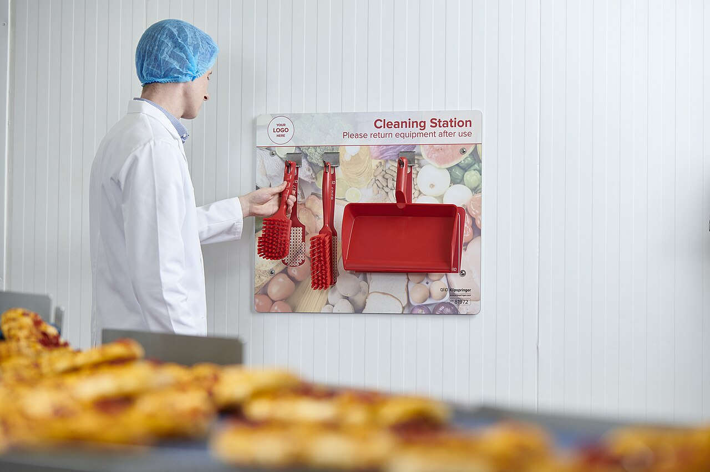

# Semantic HTML first

*71.6% of screen reader users navigate a long page by jumping through its headings first, before reading anything - a structure that div soup with the right CSS classes can never provide, no matter how correct it looks.*

> A page built entirely from `<div class="header">`, `<div class="nav">`, and `<div class="button">` can
> look pixel-identical to one built with `<header>`, `<nav>`, and `<button>`. Sighted users notice no
> difference at all. A screen reader user notices immediately - because the div-soup version has no
> landmarks to jump between, no navigable heading outline, and no button that responds to a keypress.
> The visual layer was copied perfectly; the structure underneath it, the part assistive technology
> actually reads, was never there.

> **In real life**
>
> A cleaning station mounted on a factory wall holds a scrub brush, a fine brush, and a dustpan - each
> one hanging over a printed photo of its own exact silhouette, so putting a tool back is not a judgment
> call. Reach for the dustpan and its one obvious slot is right there, distinct at a glance from the
> brushes beside it. Nothing forces a worker to hang tools correctly, but the board makes the correct
> choice the easy, obvious one - and makes a wrong choice immediately visible to anyone who looks.
> Semantic HTML elements work the same way: a purpose-built element for each job, distinct and correct
> by default, versus a generic div that could be holding absolutely anything.

**Semantic HTML first**: Semantic HTML first is the practice of reaching for a purpose-built native HTML element - button, nav, header, main, footer, article, h1 through h6, label paired with input - before a generic div or span, because the native element carries correct built-in role, state, and keyboard behavior for free, with zero ARIA required.

## What "for free" actually buys

A native `<button>` is focusable, operable with Enter and Space, and announced as "button" by every
screen reader - zero ARIA required. A `<nav>` becomes a landmark a screen reader user can jump to
directly. An `<h2>` becomes an entry in a navigable heading outline. A `<label>` correctly wrapping an
`<input>` gets automatic name association - and on mobile, an `<input type="email">` even summons the
correct on-screen keyboard, another win with zero extra code. Every one of these behaviors requires
deliberate, tested, ARIA-plus-JavaScript reconstruction the moment the equivalent is built from a
`<div>` instead - and reconstruction is exactly where mismatches and bugs creep in.

## Landmarks and headings are not decoration - they are the primary map

The WebAIM Screen Reader User Survey has asked this question across ten consecutive surveys, and the
answer holds steady: in the 2024 survey, 71.6% of respondents said they find information on a long
page by navigating through its headings first, before reading page content in order - and the rate
climbs with experience, reaching roughly 78-90% among advanced and expert users. Landmark regions
(`header`, `nav`, `main`, `footer`, `aside`) work the same way, letting a screen reader jump straight
to the main content and skip repeated navigation on every single page load. Neither of these
navigation methods exists at all on a page built from unstructured divs - there is nothing to jump to,
because nothing was ever marked as a landmark or a heading in the first place.

> **Tip**
>
> Write the HTML structure - actual `header`, `nav`, `main`, headings in a sensible order - before any
> CSS or JavaScript touches the page. Once a div-based layout is styled and shipped, retrofitting real
> semantics later means restructuring markup that visual design, tests, and CSS selectors have already
> grown dependent on - fixing it before that dependency exists is far cheaper than after.

> **Common mistake**
>
> Assuming a CSS class name substitutes for real structure. A `<div class="button">` announces as
> nothing to a screen reader no matter how the class is named - the class exists for styling only and
> carries zero semantic meaning to assistive technology.


*Shadow Board Cleaning Station — Citationneededhelper, CC BY-SA 4.0, via Wikimedia Commons. [Source](https://commons.wikimedia.org/wiki/File:Shadow_Board_Cleaning_Station.jpg)*
- **One tool, one labeled spot** — This brush only ever hangs over the photo of itself. A native HTML element works the same way - button for a button, nav for navigation, one purpose-built element per job.
- **The dustpan's exact silhouette** — You cannot accidentally hang the dustpan where the brush belongs - the shape mismatch is obvious immediately. A div misused as a button never gives that same warning to anyone looking at it.
- **Please return equipment after use** — A standing rule that everything goes back to its one correct, purpose-built place - the same discipline semantic-HTML-first asks of every element choice in a layout.
- **The person still has to choose correctly** — The board makes the right choice obvious, not automatic. The right HTML element exists for nearly every job - someone still has to reach for it instead of a generic div.

**What structure buys a screen reader user**

1. **Page loads with real header, nav, main, and headings** — Every one of these becomes a jump target automatically - no extra code, no ARIA, nothing to keep in sync.
2. **A screen reader builds a landmark list and heading outline** — Generated straight from the real elements present - div soup with no semantic elements produces an empty list on both counts.
3. **The user jumps directly to main content, skipping repeated navigation** — Exactly the 71.6%-preferred method - reading headings first, in order, rather than the whole page top to bottom.
4. **Every native interactive element already works with a keyboard** — No separate reconstruction step needed - button, a, select, input all ship correct behavior by default.

*What a screen reader can navigate to, div-soup vs semantic (Python)*

```python
div_soup_page = [
    {"tag": "div", "class": "header"},
    {"tag": "div", "class": "nav"},
    {"tag": "div", "class": "heading-large", "text": "Welcome"},
    {"tag": "div", "class": "button", "text": "Sign up"},
]

semantic_page = [
    {"tag": "header"},
    {"tag": "nav"},
    {"tag": "main"},
    {"tag": "h1", "text": "Welcome"},
    {"tag": "button", "text": "Sign up"},
]

LANDMARK_TAGS = {"header", "nav", "main", "footer", "aside"}
HEADING_TAGS = {"h1", "h2", "h3", "h4", "h5", "h6"}

def build_navigation_map(page):
    landmarks = [el["tag"] for el in page if el["tag"] in LANDMARK_TAGS]
    headings = [el for el in page if el["tag"] in HEADING_TAGS]
    keyboard_operable = [el for el in page if el["tag"] in ("button", "a", "input", "select")]
    return landmarks, headings, keyboard_operable

for name, page in [("div-soup page", div_soup_page), ("semantic page", semantic_page)]:
    landmarks, headings, operable = build_navigation_map(page)
    print(name + ":")
    print("  Landmarks a screen reader can jump to: " + str(landmarks if landmarks else "NONE"))
    print("  Headings in the navigable outline: " + str([h.get("text") for h in headings] if headings else "NONE"))
    print("  Elements with built-in keyboard behavior: " + str([o.get("text", o["tag"]) for o in operable] if operable else "NONE"))
    print("")
```

*What a screen reader can navigate to, div-soup vs semantic (Java)*

```java
import java.util.*;

public class Main {
    static class Elem {
        String tag, cssClass, text;
        Elem(String tag) { this.tag = tag; }
        Elem(String tag, String text) { this.tag = tag; this.text = text; }
    }

    static final Set<String> LANDMARK_TAGS = new HashSet<>(Arrays.asList("header", "nav", "main", "footer", "aside"));
    static final Set<String> HEADING_TAGS = new HashSet<>(Arrays.asList("h1", "h2", "h3", "h4", "h5", "h6"));
    static final Set<String> OPERABLE_TAGS = new HashSet<>(Arrays.asList("button", "a", "input", "select"));

    public static void main(String[] args) {
        List<Elem> divSoupPage = new ArrayList<>();
        Elem d1 = new Elem("div"); d1.cssClass = "header"; divSoupPage.add(d1);
        Elem d2 = new Elem("div"); d2.cssClass = "nav"; divSoupPage.add(d2);
        Elem d3 = new Elem("div", "Welcome"); d3.cssClass = "heading-large"; divSoupPage.add(d3);
        Elem d4 = new Elem("div", "Sign up"); d4.cssClass = "button"; divSoupPage.add(d4);

        List<Elem> semanticPage = new ArrayList<>();
        semanticPage.add(new Elem("header"));
        semanticPage.add(new Elem("nav"));
        semanticPage.add(new Elem("main"));
        semanticPage.add(new Elem("h1", "Welcome"));
        semanticPage.add(new Elem("button", "Sign up"));

        Map<String, List<Elem>> pages = new LinkedHashMap<>();
        pages.put("div-soup page", divSoupPage);
        pages.put("semantic page", semanticPage);

        for (Map.Entry<String, List<Elem>> entry : pages.entrySet()) {
            List<String> landmarks = new ArrayList<>();
            List<String> headings = new ArrayList<>();
            List<String> operable = new ArrayList<>();

            for (Elem el : entry.getValue()) {
                if (LANDMARK_TAGS.contains(el.tag)) landmarks.add(el.tag);
                if (HEADING_TAGS.contains(el.tag)) headings.add(el.text);
                if (OPERABLE_TAGS.contains(el.tag)) operable.add(el.text != null ? el.text : el.tag);
            }

            System.out.println(entry.getKey() + ":");
            System.out.println("  Landmarks a screen reader can jump to: " + (landmarks.isEmpty() ? "NONE" : landmarks));
            System.out.println("  Headings in the navigable outline: " + (headings.isEmpty() ? "NONE" : headings));
            System.out.println("  Elements with built-in keyboard behavior: " + (operable.isEmpty() ? "NONE" : operable));
            System.out.println();
        }
    }
}
```

### Your first time: Audit one page's semantic structure

- [ ] Open DevTools and inspect the top-level layout elements — Are header, nav, main, and footer real elements, or divs with matching class names?
- [ ] List every heading tag on the page in order — Do they form a sensible outline (h1 then h2s then h3s under those), or jump around, or not exist as real heading tags at all?
- [ ] Tab through every clickable-looking element — Does Tab reach it? Native elements always will; div-based ones only will if tabindex was added by hand.
- [ ] Compare what a screen reader's landmark/heading navigation shows to what the page visually implies — A mismatch here is exactly the gap div soup with the right CSS classes creates.

- **A page looks perfectly structured visually but a screen reader reports zero landmarks and zero headings.**
  Classic div soup - visual hierarchy was built with CSS classes named after real elements, but the actual tags underneath are all div and span. Swap in real header/nav/main/h1-h6 tags; the CSS classes can stay for styling.
- **A button-styled element does not respond to Enter or Space.**
  It is a div or span, not a real button - either add full keyboard support by hand (tabindex, key handlers, role) or, far simpler, replace it with an actual <button> element.
- **A form field's label is visible on screen but a screen reader never announces it.**
  The label is probably a styled span or div near the input rather than a real <label> element with a matching for/id (or wrapping the input directly) - the visual proximity means nothing to assistive technology without that programmatic association.

### Where to check

- Any component library or page template first, since fixing structure there benefits every page that reuses it.
- The very top-level page layout - header, nav, main, footer - as the first and cheapest structural check, before diving into individual components.
- [[accessibility-testing/reporting-and-fixing/aria-help-and-harm]] for what happens when ARIA gets reached for as a patch instead of fixing the underlying element choice.
- [[accessibility-testing/reporting-and-fixing/re-testing-a-fix]] for confirming a structural fix actually produces the landmark/heading outline a screen reader user expects, not just visually similar markup.
- [[accessibility-testing/why-accessibility-matters/pour-principles]] for how this ties back to the Perceivable and Operable principles specifically.

### Worked example: a rebuilt navigation menu that lost its landmark for no visual reason

1. A design team rebuilds a site's top navigation for a visual refresh, keeping every existing CSS
   class name intact to avoid breaking styles - `class="nav"`, `class="nav-item"`, and so on.
2. The rebuild swaps the underlying markup from a real `<nav>` wrapping a `<ul>` of `<a>` tags to a
   `<div class="nav">` wrapping `<div class="nav-item">` elements with `onclick` handlers, because the
   new component library's default export uses divs.
3. Visually, nothing changed - same look, same class names, same click behavior for a mouse user.
4. A screen reader user reports the navigation landmark that used to let them jump straight to the
   menu is gone, and none of the individual links are reachable by Tab or operable with Enter anymore.
5. Root cause named precisely: the visual refresh silently downgraded five real, keyboard-operable
   `<a>` elements inside a `<nav>` landmark into five inert divs with a mouse-only click handler each
   - a regression invisible to every check that only looks at the screen.

**Quiz.** According to the WebAIM Screen Reader User Survey (2024), what percentage of respondents said they navigate a long page by finding headings first, before reading content in order?

- [ ] About 25%
- [ ] About 50%
- [x] 71.6%, climbing to roughly 78-90% among advanced and expert users
- [ ] Nearly 100% of all respondents

*71.6% overall, and the rate climbs further with screen reader proficiency - meaning heading-first navigation is not a niche preference, it is the predominant way experienced screen reader users find information on a page. A page with no real heading tags removes that primary navigation method entirely.*

- **Semantic HTML first** — Reaching for a purpose-built native element (button, nav, header, h1-h6, label+input) before a generic div or span, because the native element carries correct role, state, and keyboard behavior for free.
- **What native elements provide with zero ARIA required** — Correct role announcement, full keyboard operability, focus behavior, and - for landmarks and headings - a place in a screen reader's navigable structure.
- **71.6%** — The share of respondents in WebAIM's 2024 Screen Reader User Survey who navigate a long page by finding headings first - climbing to 78-90% among advanced and expert users.
- **Why a CSS class name never substitutes for real structure** — A class named button or header carries meaning only for styling - a screen reader reads the actual tag, not the class name, so a div stays announced as nothing regardless of what it is named.

### Challenge

Pick one real page and inspect its top-level layout in DevTools. Count how many of header, nav, main, and footer are real elements versus divs with matching class names. For any that are divs, name exactly what a screen reader loses as a result.

- [WebAIM — Screen Reader User Survey #10 Results](https://webaim.org/projects/screenreadersurvey10/)
- [MDN — Heading Elements (h1-h6)](https://developer.mozilla.org/en-US/docs/Web/HTML/Element/Heading_Elements)
- [Semantic HTML & Accessibility (Updated)](https://www.youtube.com/watch?v=0Y1EEG4GyKU)

🎬 [Semantic HTML & Accessibility (Updated)](https://www.youtube.com/watch?v=0Y1EEG4GyKU) (10 min)

- Semantic HTML first means reaching for button, nav, header, main, h1-h6, and label+input before a generic div - each carries correct role and keyboard behavior for free.
- 71.6% of WebAIM's 2024 Screen Reader User Survey respondents navigate a long page by headings first, climbing to 78-90% among advanced and expert users - a div-soup page provides zero support for this.
- Landmark regions (header, nav, main, footer, aside) let a screen reader user jump straight to content and skip repeated navigation - they exist only when real landmark elements are present.
- A CSS class name carries meaning only for visual styling - a screen reader reads the actual HTML tag, not the class name attached to it.
- Structure lost in a visual refresh (real elements swapped for divs with matching classes) is invisible to any check that only looks at the screen, which is exactly why it slips through so often.


## Related notes

- [[Notes/accessibility-testing/reporting-and-fixing/aria-help-and-harm|ARIA: help & harm]]
- [[Notes/accessibility-testing/reporting-and-fixing/re-testing-a-fix|Re-testing a fix]]
- [[Notes/accessibility-testing/why-accessibility-matters/pour-principles|POUR principles]]


---
_Source: `packages/curriculum/content/notes/accessibility-testing/reporting-and-fixing/semantic-html-first.mdx`_
