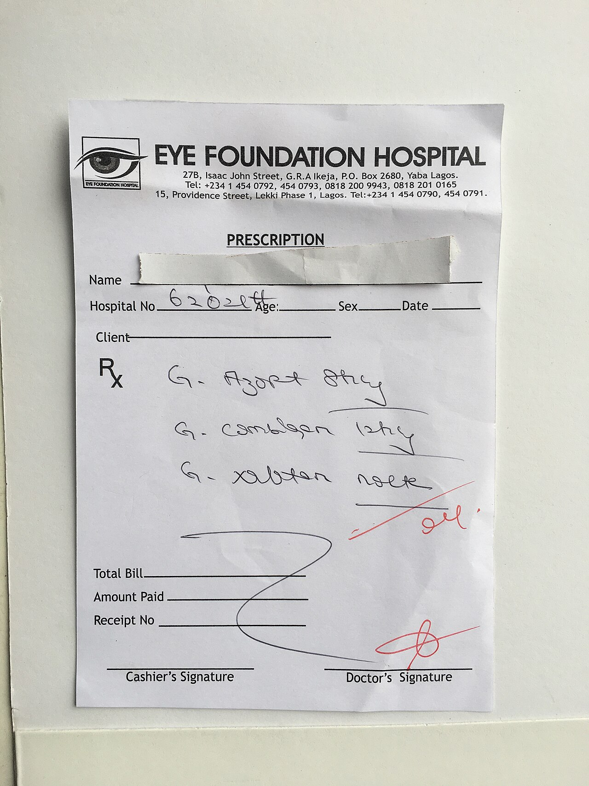

# Writing a11y findings devs act on

*'Fails WCAG 1.4.3' tells a developer nothing they can act on. A finding that names the exact element, the real user impact, and a fix direction gets resolved in one pass instead of three rounds of clarifying comments.*

> "Contrast issue on the pricing page" is technically a true statement and completely useless as a bug
> report. Which element? Which color pair? What ratio, against what minimum? Who does this actually
> affect, and how badly? A developer reading that ticket has to redo the entire investigation before
> they can even start the fix - and every hour spent re-finding what the reporter already found is an
> hour the fix itself is delayed.

> **In real life**
>
> A prescription pad has the same fixed fields no matter who fills it out: patient name, date, the `Rx`
> line itself, a signature. But a doctor's illegible handwriting on that line - three words a pharmacist
> has to guess at - makes the well-structured form worthless anyway. The format alone never guarantees
> the content is usable; legible, specific, unambiguous handwriting is what actually lets the next
> person in the chain act without calling back to ask what it says. An accessibility finding works
> exactly the same way: the right fields (location, criterion, impact, fix) are necessary, but only
> specific, unambiguous content in each one is sufficient.

**An actionable accessibility finding**: An actionable accessibility finding names the exact element and location, states the plain-language user impact (not just the abstract WCAG criterion), includes reproduction steps with the specific assistive technology and browser used, and points toward a fix direction - everything a developer needs to resolve it without a clarifying round-trip back to the reporter.

## The five fields that separate "found it" from "fixed it"

**Exact location**: not "the pricing page" but the specific component, URL, and element - a CSS
selector or a screenshot with the exact spot marked beats a paragraph of description every time.
**Plain-language impact**: "screen reader users cannot tell which plan is currently selected" lands
faster than "fails WCAG 4.1.2" - name the criterion too, for prioritization and any compliance
tracking, but lead with what actually breaks for a real person. **Reproduction steps naming the exact
tooling**: "using VoiceOver on Safari" or "keyboard-only, no mouse" - a developer without that
assistive technology installed cannot verify a fix without knowing exactly what to install and how to
drive it. **Severity that reflects real impact, not just automated tool output**: a `critical`-impact
`axe-core` violation on a rarely-used admin-only page and the same violation on the checkout button
are not equally urgent, even though the tool reports them identically. **A fix direction**: not always
mandatory, but a developer unfamiliar with accessibility patterns often does not know that a fix
exists ("add `aria-current=\"true\"` to the selected plan"), and naming it turns a research task into
an implementation task.

## Bad vs. good, the same finding twice

Bad: *"Contrast issue on pricing page."* Good: *"On /pricing, the '$29/mo' price text (gray #9CA3AF on
white) measures 2.6:1 contrast, below the 4.5:1 minimum for WCAG 1.4.3 (AA). Low-vision users may not
be able to read the price at all. Suggested fix: darken to at least #6B7280, which measures 4.6:1
against the same white background."* Same underlying bug, radically different amount of work left for
whoever picks up the ticket - the second version is close to a one-line diff away from done.

> **Tip**
>
> Attach evidence a developer can verify independently - a screenshot with the element circled, the
> exact measured contrast ratio, or a short screen recording of a screen reader announcing the problem.
> Evidence turns "I think this is broken" into "here is proof," which shortens or eliminates the
> skepticism-and-clarification round that vague reports invite.

> **Common mistake**
>
> Copy-pasting an automated tool's raw rule description as the entire finding. `axe-core`'s rule text is
> written for a general audience and rarely names your product's specific component, real user
> scenario, or an achievable fix - translate it into your product's language before filing it.


*Drug prescription paper — Beendy234, CC0, via Wikimedia Commons. [Source](https://commons.wikimedia.org/wiki/File:Drug_prescription_paper.jpg)*
- **The fixed fields** — Name, hospital number, date - the form's structure forces exactly what's needed to identify who and when, the same way a bug template forces location and severity fields to exist.
- **The Rx line - the actual finding** — This is where structure alone cannot save it. Illegible handwriting under a well-organized form is still an instruction nobody downstream can safely act on without guessing.
- **The signature - who to ask** — A finding with no identifiable, reachable author is a dead end the moment a developer has a follow-up question the report itself cannot answer.
- **The letterhead - the context** — Which system, which environment - the header a report's reader needs before a single specific detail in the body means anything at all.

**Turning a raw scan hit into an actionable finding**

1. **Start from the raw tool output** — axe-core or WAVE gives a rule ID, an impact level, and a DOM selector - accurate, but written for no specific product.
2. **Translate the rule into plain-language user impact** — Name who is affected and what breaks for them specifically, not just the abstract criterion.
3. **Add exact location and reproduction steps with real tooling named** — The specific page, element, and the exact assistive technology/browser combination used to find it.
4. **Attach evidence and, where possible, a fix direction** — A screenshot, measured value, or recording, plus a concrete suggestion - closes the loop without a round-trip.

*Scoring a finding's actionability (Python)*

```python
def score_finding(f):
    points = 0
    reasons = []

    if f.get("exact_location"):
        points += 1
    else:
        reasons.append("missing exact location/selector")

    if f.get("plain_language_impact"):
        points += 1
    else:
        reasons.append("missing plain-language user impact")

    if f.get("wcag_criterion"):
        points += 1
    else:
        reasons.append("missing WCAG criterion reference")

    if f.get("repro_tooling"):
        points += 1
    else:
        reasons.append("missing exact assistive tech/browser used to reproduce")

    if f.get("evidence"):
        points += 1
    else:
        reasons.append("missing evidence (screenshot, measurement, or recording)")

    if f.get("fix_direction"):
        points += 1
    else:
        reasons.append("missing suggested fix direction (optional but valuable)")

    return points, reasons

findings = [
    {"title": "Contrast issue on pricing page", "exact_location": False, "plain_language_impact": False,
     "wcag_criterion": False, "repro_tooling": False, "evidence": False, "fix_direction": False},
    {"title": "Price text contrast fails WCAG 1.4.3", "exact_location": True, "plain_language_impact": True,
     "wcag_criterion": True, "repro_tooling": False, "evidence": True, "fix_direction": True},
]

for f in findings:
    score, reasons = score_finding(f)
    print(f["title"] + ": " + str(score) + "/6 actionable")
    for r in reasons:
        print("  - " + r)
    print("")
```

*Scoring a finding's actionability (Java)*

```java
import java.util.*;

public class Main {
    static class Finding {
        String title;
        boolean exactLocation, plainLanguageImpact, wcagCriterion, reproTooling, evidence, fixDirection;
    }

    static int scoreFinding(Finding f, List<String> reasons) {
        int points = 0;
        if (f.exactLocation) points++; else reasons.add("missing exact location/selector");
        if (f.plainLanguageImpact) points++; else reasons.add("missing plain-language user impact");
        if (f.wcagCriterion) points++; else reasons.add("missing WCAG criterion reference");
        if (f.reproTooling) points++; else reasons.add("missing exact assistive tech/browser used to reproduce");
        if (f.evidence) points++; else reasons.add("missing evidence (screenshot, measurement, or recording)");
        if (f.fixDirection) points++; else reasons.add("missing suggested fix direction (optional but valuable)");
        return points;
    }

    public static void main(String[] args) {
        Finding bad = new Finding();
        bad.title = "Contrast issue on pricing page";

        Finding good = new Finding();
        good.title = "Price text contrast fails WCAG 1.4.3";
        good.exactLocation = true;
        good.plainLanguageImpact = true;
        good.wcagCriterion = true;
        good.evidence = true;
        good.fixDirection = true;

        for (Finding f : new Finding[]{bad, good}) {
            List<String> reasons = new ArrayList<>();
            int score = scoreFinding(f, reasons);
            System.out.println(f.title + ": " + score + "/6 actionable");
            for (String r : reasons) System.out.println("  - " + r);
            System.out.println();
        }
    }
}
```

### Your first time: Rewrite one raw scan hit into an actionable finding

- [ ] Take one real axe DevTools or WAVE violation from a page you have access to — Copy its raw rule text and DOM selector as your starting point.
- [ ] Translate it into plain-language impact — Write one sentence naming who is affected and what breaks for them, without using the rule's technical name.
- [ ] Add exact reproduction steps with real tooling named — State the specific browser and assistive technology (or 'keyboard-only, no mouse') you used to confirm it.
- [ ] Attach one piece of evidence and, if you can, a fix direction — A screenshot with the element marked, plus a one-line suggestion for the fix, if you have enough context to propose one.

- **A filed finding comes back with 'cannot reproduce' or a clarifying question before any work starts.**
  That is a sign a required field was missing - almost always exact location or reproduction tooling. Add both and the round-trip disappears on the next report.
- **A developer fixes the letter of the rule but the real user impact remains.**
  Usually means the finding led with the abstract WCAG criterion instead of the plain-language impact - a developer optimizing to 'make the rule pass' without understanding what it protects can satisfy the rule while missing the actual problem.
- **Every finding in a backlog is marked the same severity regardless of real impact.**
  Copying an automated tool's impact label directly, unadjusted for the specific page and user flow, flattens genuinely different urgencies into one bucket - re-score by real-world impact, not raw tool output.

### Where to check

- Any finding about to be filed straight from raw automated tool output, before it goes into the tracker - translate first, file second.
- The severity field specifically, checked against the actual page/flow rather than accepted as-is from the scanner.
- [[accessibility-testing/reporting-and-fixing/aria-help-and-harm]] for a common category of finding where the "fix direction" field genuinely needs care - a wrong ARIA suggestion can make things worse, not better.
- [[accessibility-testing/reporting-and-fixing/re-testing-a-fix]] for how the same actionable-finding discipline applies to confirming a fix actually resolved the reported impact, not just silenced the rule.
- [[accessibility-testing/automated-a11y-audits/what-automation-catches-vs-misses]] for why the plain-language-impact field matters so much: it is exactly the layer of understanding automation cannot supply on its own.

### Worked example: the same contrast bug, filed twice, six months apart

1. Six months ago, a finding titled "Contrast issue on pricing page" sits in the backlog untouched -
   no one is sure which element, how bad, or how to fix it, and it keeps getting deprioritized against
   clearer tickets.
2. A fresh audit finds the same underlying bug and files it again, this time naming the exact
   selector (`.price-text`), the measured ratio (2.6:1 against a 4.5:1 minimum), the plain-language
   impact ("low-vision users may not be able to read the price"), and a specific fix (darken to
   `#6B7280`, which measures 4.6:1).
3. The second ticket is picked up and closed within a day - the developer had everything needed to
   act without a single clarifying comment.
4. The original vague ticket is closed as a duplicate once the team realizes both describe the exact
   same element.
5. The lesson generalizes past this one bug: the underlying defect did not get easier to fix in six
   months - the finding got easier to act on, and that alone was the difference between six months
   stalled and one day resolved.

**Quiz.** A finding reads: 'Fails WCAG 1.4.3 (Contrast Minimum), impact: serious.' What is this note's main critique of that finding as written?

- [ ] The WCAG criterion reference is wrong
- [x] It is accurate but not actionable - it names the abstract rule without the exact location, plain-language impact, or a fix direction a developer needs to resolve it without further investigation
- [ ] Severity should never be included in a finding
- [ ] Automated tools should never be cited in a finding

*The criterion reference itself may be perfectly correct - the problem is completeness, not accuracy. Without the exact element/location, what actually breaks for a real user in plain language, and ideally a fix direction, a developer has to redo the investigation the reporter already did before any fix work can start.*

- **An actionable accessibility finding** — Names the exact location, states plain-language user impact (not just the WCAG criterion), includes reproduction steps naming the specific assistive tech/browser used, and points toward a fix direction.
- **The five fields that separate 'found it' from 'fixed it'** — Exact location, plain-language impact, reproduction steps with real tooling named, severity reflecting actual impact, and (where possible) a fix direction.
- **Why copy-pasting raw automated tool output as a finding falls short** — Rule text is written for a general audience - it rarely names your specific component, the real user scenario, or an achievable fix. Translate before filing.
- **Why severity should be re-scored, not copied from the scanner** — A tool's impact label (e.g. 'critical') does not know whether the affected element sits on a checkout button or a rarely-used admin page - real-world context changes true urgency.

### Challenge

Take one vague accessibility finding you have seen (or one from this note's 'bad' example) and rewrite it with all five fields: exact location, plain-language impact, WCAG criterion, reproduction steps naming real tooling, and a fix direction.

- [W3C WAI — Evaluating Web Accessibility Overview](https://www.w3.org/WAI/test-evaluate/)
- [Deque — Accessibility Engineering Blog](https://www.deque.com/blog/)
- [Write Accessibility Bug Reports Devs Actually Fix — The 5-Step Formula That Works](https://www.youtube.com/watch?v=DKrcNRCvTj4)

🎬 [Write Accessibility Bug Reports Devs Actually Fix — The 5-Step Formula That Works](https://www.youtube.com/watch?v=DKrcNRCvTj4) (9 min)

- An actionable finding names exact location, plain-language impact, WCAG criterion, reproduction steps with real tooling, and ideally a fix direction.
- The same underlying bug filed vaguely versus filed actionably can be the entire difference between six months stalled and one day resolved.
- Raw automated tool output is accurate but written for a general audience - translate it into your product's specific language before filing.
- Severity should reflect real-world impact on the specific page and flow, not just an automated tool's abstract impact label copied unadjusted.
- Evidence - a screenshot, a measured value, a recording - turns 'I think this is broken' into proof a developer can verify without re-investigating.


## Related notes

- [[Notes/accessibility-testing/reporting-and-fixing/aria-help-and-harm|ARIA: help & harm]]
- [[Notes/accessibility-testing/reporting-and-fixing/re-testing-a-fix|Re-testing a fix]]
- [[Notes/accessibility-testing/automated-a11y-audits/what-automation-catches-vs-misses|What automation catches vs misses]]


---
_Source: `packages/curriculum/content/notes/accessibility-testing/reporting-and-fixing/writing-a11y-findings-devs-act-on.mdx`_
