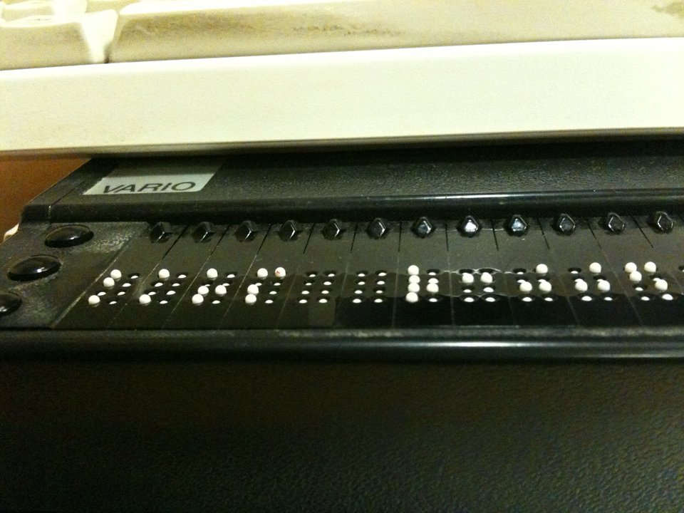

# Disabilities & assistive tech

*Disability spans visual, auditory, motor, and cognitive differences, is often situational or temporary rather than fixed, and is supported by real assistive technology - screen readers, magnifiers, switch access, and voice control.*

> Every test plan quietly assumes a user: someone who sees the screen, hears the alert sound, clicks with
> a precise mouse, and reads a wall of text in one pass under time pressure. Most real users do not match
> that assumption all of the time, and a large number never match it at all. Accessibility testing starts
> by replacing that imagined user with the actual range of people who open the product.

> **In real life**
>
> A curb cut - the small ramp sliced into a sidewalk kerb at a crossing - was fought for and built for
> wheelchair users. Once it existed, it also caught the parent pushing a stroller, the delivery worker
> wheeling a hand truck, the traveler dragging a rolling suitcase, and the jogger who did not want to hop
> a six-inch ledge. Nobody had to ask twice. That is the curb-cut effect: a fix built for one group's hard
> requirement quietly becomes a convenience for nearly everyone else too, and it is the same pattern behind
> most accessible design on the web.

**Disability and assistive technology**: A disability is any long-term or short-term difference in vision, hearing, movement, or cognition that changes how a person perceives or operates a digital product. Assistive technology (AT) is hardware or software that bridges that difference - screen readers such as NVDA, JAWS, and VoiceOver that speak or braille-render a screen, screen magnifiers that enlarge content, switch access devices operated by a single button or puff of air, and voice control software that lets speech drive the interface instead of a mouse or keyboard.

## Four categories, and real tools that answer them

- **Visual** - blindness, low vision, and color vision differences. Answered by screen readers (NVDA
  and JAWS on Windows, VoiceOver on macOS/iOS, TalkBack on Android), screen magnifiers, and high-contrast
  or dark themes.
- **Auditory** - deafness and levels of hearing loss. Answered by captions, transcripts, and visual
  alternatives to audio-only alerts.
- **Motor** - conditions such as tremor, paralysis, or limited fine motor control that make a precise
  mouse click unreliable. Answered by full keyboard operability, switch access devices, and voice
  control software that maps spoken commands to on-screen actions.
- **Cognitive** - conditions such as ADHD, dyslexia, or memory-related differences that affect how
  someone reads, focuses, or recalls multi-step instructions. Answered by plain language, consistent
  layout, and forgiving time limits.

## Disability is often situational, not fixed

A person with a broken wrist has a temporary motor disability and cannot use a mouse for weeks. A
parent holding a baby in one arm has a momentary version of the same limitation. Bright outdoor
sunlight on a phone screen recreates low vision for anyone. A noisy train platform recreates deafness
for anyone trying to follow an audio alert. Treating accessibility as a fixed label for a small,
separate group of people misses how often "temporarily disabled by circumstance" describes the very
same person testing the product on different days.

> **Tip**
>
> Where possible, actually run a real screen reader (NVDA is free) or navigate one full flow keyboard-only
> before assuming a fix is done. Reading a checklist and operating the product with the target tool are
> different kinds of evidence, and only the second one reliably catches broken reading order or missing
> focus.

> **Common mistake**
>
> Reducing "accessibility" to "blind users plus screen readers" and stopping there. That framing misses
> deaf and hard-of-hearing users entirely, misses motor differences that break mouse-only interactions,
> misses cognitive load from dense unstructured text, and misses everyone whose situational limitation
> never shows up in a persona document at all.


*Refreshable Braille display — Wikimedia Commons, CC0. [Source](https://commons.wikimedia.org/wiki/File:Refreshable_Braille_display_2010_0123.JPG)*
- **Braille cells that physically change** — Each cell raises and lowers its own pins many times a second as the screen reader moves - this is output a blind user reads by touch, not a static plaque.
- **Cursor-routing buttons** — Pressing above a cell moves the text cursor to that exact character - a motor interaction as precise as clicking a mouse, done entirely by touch.
- **The VARIO label** — This is a real, specific commercial device, not a generic mockup - assistive technology is ordinary hardware people buy and depend on daily.
- **An ordinary keyboard, right above it** — The display sits under a standard keyboard - assistive tech typically supplements a mainstream setup rather than replacing it entirely.

**Thinking through disability categories before a test pass**

1. **Ask which senses and inputs the flow depends on** — Sight for layout, hearing for alerts, precise pointing for small targets, sustained reading for instructions.
2. **Map each dependency to a category it could fail** — Visual, auditory, motor, cognitive - a single flow usually touches more than one.
3. **Include situational and temporary versions** — Glare, noise, a temporary injury, or a one-handed moment recreate the same barriers for anyone.
4. **Test with the actual assistive technology, not a guess** — A free screen reader or keyboard-only pass finds what a checklist alone cannot.

*A screen-reader structure checker (Python)*

```python
elements = [
    {"tag": "h1", "text": "Product page"},
    {"tag": "img", "alt": "Blue running shoe on a white background"},
    {"tag": "img", "alt": ""},
    {"tag": "h2", "text": "Details"},
    {"tag": "input", "name": "email", "has_label": True},
    {"tag": "input", "name": "promo_code", "has_label": False},
    {"tag": "h4", "text": "Reviews"},
    {"tag": "button", "icon_only": True, "aria_label": ""},
    {"tag": "button", "icon_only": True, "aria_label": "Add to cart"},
]

heading_ranks = {"h1": 1, "h2": 2, "h3": 3, "h4": 4, "h5": 5, "h6": 6}

def check_images(elements):
    return [e for e in elements if e["tag"] == "img" and not e.get("alt", "").strip()]

def check_inputs(elements):
    return [e for e in elements if e["tag"] == "input" and not e.get("has_label")]

def check_heading_order(elements):
    skips = []
    last_rank = 0
    for e in elements:
        if e["tag"] in heading_ranks:
            rank = heading_ranks[e["tag"]]
            if last_rank and rank > last_rank + 1:
                skips.append((last_rank, rank))
            last_rank = rank
    return skips

def check_icon_buttons(elements):
    return [e for e in elements if e.get("icon_only") and not e.get("aria_label", "").strip()]

bad_images = check_images(elements)
bad_inputs = check_inputs(elements)
heading_skips = check_heading_order(elements)
bad_buttons = check_icon_buttons(elements)

checks = [
    ("images_have_alt_text", len(bad_images) == 0, len(bad_images)),
    ("inputs_have_labels", len(bad_inputs) == 0, len(bad_inputs)),
    ("heading_order_no_skips", len(heading_skips) == 0, len(heading_skips)),
    ("icon_buttons_have_names", len(bad_buttons) == 0, len(bad_buttons)),
]

print("Screen-reader structure check:")
overall_pass = True
for name, passed, count in checks:
    status = "PASS" if passed else "FAIL"
    if not passed:
        overall_pass = False
    print("  " + name + "=" + status + " (violations=" + str(count) + ")")

print()
if heading_skips:
    for a, b in heading_skips:
        print("  heading skip: h" + str(a) + " -> h" + str(b))

result = "PASS" if overall_pass else "FAIL"
print("RESULT=" + result)
```

*A screen-reader structure checker (Java)*

```java
import java.util.*;

public class Main {
    static class Elem {
        String tag;
        String alt;
        Boolean hasLabel;
        Boolean iconOnly;
        String ariaLabel;

        Elem(String tag) { this.tag = tag; }
    }

    static Map<String, Integer> headingRanks() {
        Map<String, Integer> m = new LinkedHashMap<>();
        m.put("h1", 1); m.put("h2", 2); m.put("h3", 3);
        m.put("h4", 4); m.put("h5", 5); m.put("h6", 6);
        return m;
    }

    public static void main(String[] args) {
        List<Elem> elements = new ArrayList<>();

        Elem e1 = new Elem("h1"); elements.add(e1);
        Elem e2 = new Elem("img"); e2.alt = "Blue running shoe on a white background"; elements.add(e2);
        Elem e3 = new Elem("img"); e3.alt = ""; elements.add(e3);
        Elem e4 = new Elem("h2"); elements.add(e4);
        Elem e5 = new Elem("input"); e5.hasLabel = true; elements.add(e5);
        Elem e6 = new Elem("input"); e6.hasLabel = false; elements.add(e6);
        Elem e7 = new Elem("h4"); elements.add(e7);
        Elem e8 = new Elem("button"); e8.iconOnly = true; e8.ariaLabel = ""; elements.add(e8);
        Elem e9 = new Elem("button"); e9.iconOnly = true; e9.ariaLabel = "Add to cart"; elements.add(e9);

        Map<String, Integer> ranks = headingRanks();

        int badImages = 0;
        for (Elem e : elements) {
            if (e.tag.equals("img") && (e.alt == null || e.alt.trim().isEmpty())) badImages++;
        }

        int badInputs = 0;
        for (Elem e : elements) {
            if (e.tag.equals("input") && !(e.hasLabel != null && e.hasLabel)) badInputs++;
        }

        List<int[]> headingSkips = new ArrayList<>();
        int lastRank = 0;
        for (Elem e : elements) {
            if (ranks.containsKey(e.tag)) {
                int rank = ranks.get(e.tag);
                if (lastRank != 0 && rank > lastRank + 1) {
                    headingSkips.add(new int[]{lastRank, rank});
                }
                lastRank = rank;
            }
        }

        int badButtons = 0;
        for (Elem e : elements) {
            boolean iconOnly = e.iconOnly != null && e.iconOnly;
            boolean noLabel = e.ariaLabel == null || e.ariaLabel.trim().isEmpty();
            if (iconOnly && noLabel) badButtons++;
        }

        System.out.println("Screen-reader structure check:");
        boolean overallPass = true;

        String[] names = {"images_have_alt_text", "inputs_have_labels", "heading_order_no_skips", "icon_buttons_have_names"};
        int[] counts = {badImages, badInputs, headingSkips.size(), badButtons};
        for (int i = 0; i < names.length; i++) {
            boolean passed = counts[i] == 0;
            if (!passed) overallPass = false;
            String status = passed ? "PASS" : "FAIL";
            System.out.println("  " + names[i] + "=" + status + " (violations=" + counts[i] + ")");
        }

        System.out.println();
        for (int[] skip : headingSkips) {
            System.out.println("  heading skip: h" + skip[0] + " -> h" + skip[1]);
        }

        String result = overallPass ? "PASS" : "FAIL";
        System.out.println("RESULT=" + result);
    }
}
```

### Your first time: Map one real flow to disability categories

- [ ] Pick one flow and list its senses and inputs — What must a user see, hear, and click or type to finish it?
- [ ] Match each dependency to visual, auditory, motor, or cognitive risk — Most flows touch at least two categories at once.
- [ ] Add one situational case — Glare, background noise, a one-handed moment, or a distracted reread under time pressure.
- [ ] Run the flow with one real assistive tool — A free screen reader or a keyboard-only pass, start to finish, eyes on the actual result.

- **A team says the product is 'accessible' because it works with a screen reader.**
  Ask about keyboard operability, caption coverage, and plain-language error messages separately - screen-reader support alone does not cover motor, auditory, or cognitive needs.
- **A bug report gets closed as 'edge case' because the reporter has a temporary injury.**
  Point out that the same interaction barrier affects permanent motor disabilities too - a fix for one covers the other, so the report is not a one-off.
- **Testing only ever covers the visual category.**
  Deliberately schedule a keyboard-only pass and a captions/audio-alert check as separate, named test activities, not optional extras.

### Where to check

- Run NVDA (free, Windows) or VoiceOver (built into macOS/iOS) on one real flow, start to finish.
- Try the same flow using only the keyboard - Tab, Shift+Tab, Enter, Space, arrow keys, no mouse.
- Check that alerts and errors have a visible, non-audio-only equivalent.
- [[accessibility-testing/why-accessibility-matters/pour-principles]] for the four principles that organize what to check once categories are mapped.

### Worked example: a promo-code field only some users can reach

1. A checkout form's promo-code input has no visible label, only placeholder text that disappears on
   focus.
2. Sighted mouse users barely notice - the placeholder reads fine until they click in.
3. A screen-reader user tabs to the field and hears only "edit text," with no clue what to enter, since
   placeholder text is not reliably announced as a label.
4. A user with a temporary wrist injury tabbing through the form independently confirms the same gap:
   the field's purpose is not established without sight.
5. Report: "Promo-code input has no programmatic label (placeholder-only); screen reader announces
   'edit text' with no name. Add a real label element." One fix, two different user populations helped.

**Quiz.** Why does this note treat disability as sometimes situational rather than only a fixed, permanent label?

- [ ] Because permanent disabilities are less common and less important to test for
- [x] Because a temporary injury, bright sunlight, or a noisy room can recreate the same motor, visual, or auditory barrier that a permanent disability causes, so the same fixes serve both
- [ ] Because situational limitations are the only ones covered by WCAG
- [ ] Because assistive technology only helps with permanent conditions

*The note's curb-cut framing and the sunlight/noise/one-handed examples make the same point: the barrier, not the label, is what a fix has to address, and situational cases share the exact same barrier as permanent ones.*

- **Four disability categories** — Visual, auditory, motor, cognitive - most flows depend on more than one at once.
- **The curb-cut effect** — A fix built for one group's hard requirement (wheelchair access) becomes a convenience for many others (strollers, luggage, delivery carts) without anyone asking twice.
- **Situational disability** — A temporary or context-driven limitation - glare, noise, a one-handed moment, a temporary injury - that recreates a permanent disability's barrier for anyone.
- **Free real assistive tools to actually test with** — NVDA (Windows screen reader) and VoiceOver (built into macOS/iOS) cost nothing and reveal what a checklist alone misses.

### Challenge

Pick one real flow. List which of the four disability categories it depends on, name one situational case that recreates the same barrier, then run the flow once using only a keyboard and once with a free screen reader. Write down anywhere the two runs disagreed.

- [W3C WAI — How People with Disabilities Use the Web: Diversity](https://www.w3.org/WAI/people-use-web/abilities-barriers/)
- [NV Access — NVDA screen reader (free, Windows)](https://www.nvaccess.org/)
- [Understanding Assistive Technology: Desktop Screen Readers](https://www.youtube.com/watch?v=Hp8dAkHQ9O0)

🎬 [Understanding Assistive Technology: Desktop Screen Readers](https://www.youtube.com/watch?v=Hp8dAkHQ9O0) (2 min)

- Disability spans visual, auditory, motor, and cognitive differences, and most real flows depend on more than one at once.
- Disability is often situational or temporary - glare, noise, injury, or a one-handed moment recreate the same barriers for anyone.
- Real assistive technology (NVDA, JAWS, VoiceOver, switch access, voice control) is ordinary hardware and software people depend on daily, not an abstraction.
- A fix built for one category, like the curb-cut effect, often quietly helps far more people than it targeted.
- Testing only the visual category and calling it done misses most of what accessibility testing actually needs to cover.


## Related notes

- [[Notes/accessibility-testing/why-accessibility-matters/pour-principles|POUR principles]]
- [[Notes/accessibility-testing/why-accessibility-matters/wcag-2-2-a-aa-aaa|WCAG 2.2 A / AA / AAA]]
- [[Notes/accessibility-testing/why-accessibility-matters/the-business-and-legal-case-ada-eaa|The business & legal case (ADA/EAA)]]


---
_Source: `packages/curriculum/content/notes/accessibility-testing/why-accessibility-matters/disabilities-and-assistive-tech.mdx`_
