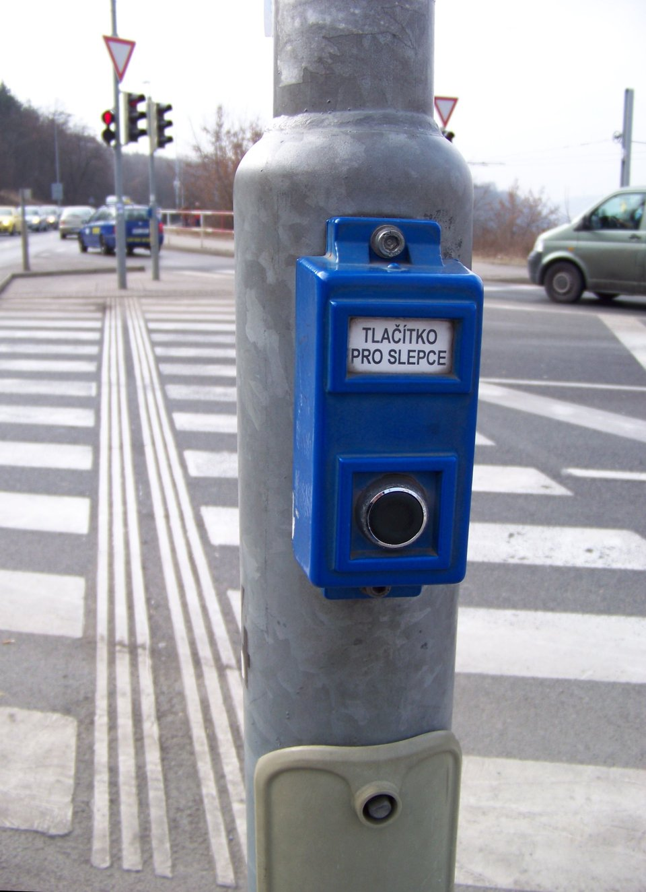

# POUR principles

*WCAG organizes every success criterion under four principles - Perceivable, Operable, Understandable, Robust - and a product only counts as accessible when all four hold; strength in three does not compensate for failure in one.*

> "Accessible" is not one property, it is four, and WCAG names all four so nothing quietly falls through
> a gap between them: content has to be perceivable, the interface has to be operable, the experience has
> to be understandable, and the code has to be robust enough for the tools people actually use to read it.

> **In real life**
>
> A four-legged stool does not need three excellent legs and one missing - it needs all four solid, or it
> tips over regardless of how well-made the other three are. A beautifully carved leg does not compensate
> for a snapped one; the stool still fails at the one job it has. WCAG's four principles work the same
> way: a product with flawless visual perceivability but broken keyboard operation is not "seventy-five
> percent accessible" - for the person who cannot use a mouse, it does not hold up at all.

**POUR**: POUR is the acronym for WCAG's four organizing principles. Perceivable means information and interface components must be presentable to users in ways they can perceive - not hidden from any one sense entirely. Operable means interface components and navigation must be operable - usable by keyboard alone, without requiring precise timing or fine motor control. Understandable means information and the operation of the interface must be understandable - readable, predictable, and forgiving of input mistakes. Robust means content must be robust enough to be reliably interpreted by a wide variety of user agents, including assistive technology, both now and as those tools change.

## The four principles, briefly

- **Perceivable** - can the information reach at least one working sense? Text alternatives for images,
  captions for audio, and sufficient color contrast all serve this principle.
- **Operable** - can the interface actually be driven? Full keyboard operability, enough time to
  complete tasks, and avoiding content that could trigger seizures all serve this principle.
- **Understandable** - does the experience make sense once it is reached? Predictable navigation,
  clear error messages, and readable language all serve this principle.
- **Robust** - does the code hold up across the tools people actually use? Valid, semantic markup that
  a screen reader, browser extension, or future assistive technology can correctly parse serves this
  principle.

## All four are independent - none substitutes for another

A page can be flawlessly perceivable - excellent contrast, full text alternatives, clean captions - and
still fail completely for a keyboard-only user if a custom dropdown traps focus. A page can be fully
operable by keyboard and still fail for a cognitive disability if every error message just says
"invalid input" with no explanation of what to fix. Each principle addresses a genuinely different kind
of user need, and a real accessibility review has to check all four separately rather than assuming
strength in one implies strength in the others.

> **Tip**
>
> When triaging a finding, name which of the four principles it actually violates before deciding how
> serious it is. "This dropdown is inaccessible" is vague; "this dropdown traps keyboard focus, which is
> an Operable failure" tells the fixing engineer exactly what kind of problem to solve.

> **Common mistake**
>
> Assuming a product that looks and reads beautifully must be broadly accessible. Perceivable and
> Understandable can both be excellent while Operable is badly broken - a gorgeous, clearly written page
> that cannot be tabbed through at all still locks out every keyboard-only and switch-access user.


*Tlacitko pro slepce (accessible pedestrian signal button), Prague — Wikimedia Commons, CC BY-SA 3.0. [Source](https://commons.wikimedia.org/wiki/File:Tla%C4%8D%C3%ADtko_pro_slepce,_Krejc%C3%A1rek.jpg)*
- **The raised tactile button - Operable** — A physical control that can be found and pressed by touch alone, with no dependence on seeing where it is.
- **The printed label - Perceivable and Understandable** — Plain text names the button's purpose for anyone who can read it, in addition to the tactile and audible cues serving those who cannot.
- **Standardized traffic infrastructure - Robust** — The same button design works across intersections citywide - a consistent, predictable interface any pedestrian can rely on regardless of which crossing they reach.
- **The marked crosswalk it controls** — The control exists to make one real task achievable - safely crossing - the same way every POUR check should trace back to a real task a real person needs to complete.

**Checking all four principles on one flow**

1. **Perceivable: can it reach a working sense?** — Text alternatives, captions, and sufficient contrast for anyone relying on sight, hearing, or both.
2. **Operable: can it actually be driven?** — Full keyboard operation, forgiving time limits, nothing that traps focus or requires precise timing.
3. **Understandable: does it make sense once reached?** — Predictable navigation and error messages that explain what to actually fix.
4. **Robust: does the code hold up for real tools?** — Valid, semantic markup a screen reader or other assistive technology can correctly interpret.

*A POUR classifier for accessibility findings (Python)*

```python
findings = [
    "Product images have no alt text",
    "The video player cannot be reached or operated using only the keyboard",
    "Error messages use vague wording like 'something went wrong' with no next step",
    "A custom dropdown breaks when the page is later updated to a new browser version",
    "Body text contrast is 3.1:1 against the background",
    "The checkout timer expires with no way to request more time",
    "Form labels do not explain what format a date field expects",
    "A custom widget is not built from standard HTML, so assistive tech cannot read its state",
]

keyword_map = [
    ("Perceivable", ["alt text", "contrast", "background"]),
    ("Operable", ["keyboard", "timer", "operated"]),
    ("Understandable", ["vague", "next step", "format", "expects"]),
    ("Robust", ["browser version", "assistive tech", "standard html", "widget"]),
]

def classify(finding):
    lower = finding.lower()
    for principle, keywords in keyword_map:
        for kw in keywords:
            if kw in lower:
                return principle
    return "Unclassified"

counts = {"Perceivable": 0, "Operable": 0, "Understandable": 0, "Robust": 0, "Unclassified": 0}

print("POUR classification of findings:")
print()
for f in findings:
    principle = classify(f)
    counts[principle] += 1
    print("  [" + principle + "] " + f)

print()
print("Totals:")
for principle in ["Perceivable", "Operable", "Understandable", "Robust", "Unclassified"]:
    print("  " + principle + ": " + str(counts[principle]))

weakest = max(
    (p for p in ["Perceivable", "Operable", "Understandable", "Robust"]),
    key=lambda p: counts[p],
)
print()
print("Principle with the most findings this pass: " + weakest)
```

*A POUR classifier for accessibility findings (Java)*

```java
import java.util.*;

public class Main {
    public static void main(String[] args) {
        List<String> findings = new ArrayList<>();
        findings.add("Product images have no alt text");
        findings.add("The video player cannot be reached or operated using only the keyboard");
        findings.add("Error messages use vague wording like 'something went wrong' with no next step");
        findings.add("A custom dropdown breaks when the page is later updated to a new browser version");
        findings.add("Body text contrast is 3.1:1 against the background");
        findings.add("The checkout timer expires with no way to request more time");
        findings.add("Form labels do not explain what format a date field expects");
        findings.add("A custom widget is not built from standard HTML, so assistive tech cannot read its state");

        LinkedHashMap<String, List<String>> keywordMap = new LinkedHashMap<>();
        keywordMap.put("Perceivable", Arrays.asList("alt text", "contrast", "background"));
        keywordMap.put("Operable", Arrays.asList("keyboard", "timer", "operated"));
        keywordMap.put("Understandable", Arrays.asList("vague", "next step", "format", "expects"));
        keywordMap.put("Robust", Arrays.asList("browser version", "assistive tech", "standard html", "widget"));

        LinkedHashMap<String, Integer> counts = new LinkedHashMap<>();
        counts.put("Perceivable", 0);
        counts.put("Operable", 0);
        counts.put("Understandable", 0);
        counts.put("Robust", 0);
        counts.put("Unclassified", 0);

        System.out.println("POUR classification of findings:");
        System.out.println();
        for (String f : findings) {
            String principle = classify(f, keywordMap);
            counts.put(principle, counts.get(principle) + 1);
            System.out.println("  [" + principle + "] " + f);
        }

        System.out.println();
        System.out.println("Totals:");
        for (String p : new String[]{"Perceivable", "Operable", "Understandable", "Robust", "Unclassified"}) {
            System.out.println("  " + p + ": " + counts.get(p));
        }

        String weakest = null;
        int best = -1;
        for (String p : new String[]{"Perceivable", "Operable", "Understandable", "Robust"}) {
            if (counts.get(p) > best) {
                best = counts.get(p);
                weakest = p;
            }
        }

        System.out.println();
        System.out.println("Principle with the most findings this pass: " + weakest);
    }

    static String classify(String finding, LinkedHashMap<String, List<String>> keywordMap) {
        String lower = finding.toLowerCase();
        for (Map.Entry<String, List<String>> e : keywordMap.entrySet()) {
            for (String kw : e.getValue()) {
                if (lower.contains(kw)) return e.getKey();
            }
        }
        return "Unclassified";
    }
}
```

### Your first time: Classify a real findings list by POUR principle

- [ ] Collect five or more real or plausible findings from one product — Mix categories deliberately - do not let every finding be a contrast issue.
- [ ] Assign exactly one primary principle to each — Perceivable, Operable, Understandable, or Robust - pick the one it violates most directly.
- [ ] Total the findings per principle — A lopsided total (all Perceivable, none Operable) usually means the review missed a whole category, not that the product is genuinely strong there.
- [ ] Re-check the principle with zero findings specifically — Zero findings in Robust, for example, is more often a missed check than a clean result.

- **A review lists ten Perceivable findings and zero Operable findings.**
  Treat the zero as a signal the review never actually tested keyboard operation, not as evidence the product is operable - re-run a dedicated keyboard-only pass.
- **A finding gets argued over because it 'kind of fits two principles.'**
  Pick the principle the fix most directly addresses - a missing accessible name on an icon button is Perceivable (nothing to perceive) even though it also affects Operable outcomes downstream; classify by the direct cause.
- **Someone argues a product is accessible because it 'looks great and reads clearly.'**
  Point out that Perceivable and Understandable strength says nothing about Operable or Robust - ask directly whether the product has been tested keyboard-only and with a real screen reader.

### Where to check

- W3C WAI's accessibility-principles page for the authoritative definition of each of the four.
- Whether a findings list is lopsided toward one principle, which usually signals a missed check rather than a clean result.
- Whether any single finding secretly covers two principles at once and needs splitting into two reports.
- [[accessibility-testing/why-accessibility-matters/wcag-2-2-a-aa-aaa]] for how POUR's principles map onto WCAG's conformance levels.

### Worked example: a product that looked done but was not

1. A design review praises a new settings page: clean typography, strong color contrast, clear plain-
   language copy throughout.
2. An accessibility pass confirms Perceivable and Understandable are genuinely solid.
3. A keyboard-only run reveals the custom toggle switches cannot be reached by Tab at all - only mouse
   click works.
4. This is a clean, severe Operable failure, completely independent of how well the other three
   principles were executed.
5. Report: "Toggle switches on Settings are mouse-only; Tab navigation skips them entirely (Operable
   failure). Visual and copy quality do not offset this - keyboard-only users cannot change these
   settings at all." The fix is scoped precisely because the principle was named precisely.

**Quiz.** A product has excellent contrast, full text alternatives, and clear plain-language copy, but its custom video player cannot be operated by keyboard at all. What does this note say about calling the product accessible?

- [ ] It is accessible overall, since three of the four principles are clearly strong
- [x] It is not accessible for keyboard-only users specifically, because Operable is a genuinely independent requirement that strength in Perceivable and Understandable does not offset
- [ ] It is accessible as long as a mouse is available to every user
- [ ] Contrast and text alternatives are the only principles that matter for legal conformance

*The note's stool analogy and worked example both make the same point: each POUR principle is independent, and a severe failure in one (Operable, here) is not compensated for by strength in the others - for the affected user population, the product simply does not work.*

- **Perceivable** — Information and interface components must be presentable in ways users can actually perceive - not hidden from any one sense entirely.
- **Operable** — Interface components and navigation must be usable - including fully by keyboard, without requiring precise timing or fine motor control.
- **Understandable** — Information and interface operation must make sense - predictable, readable, and forgiving of input mistakes.
- **Robust** — Content must be reliably interpretable by a wide variety of user agents, including assistive technology, now and as those tools change.
- **Why POUR findings should be classified by principle** — Naming the exact principle a finding violates tells the fixing engineer precisely what kind of problem to solve, and reveals when a whole category of testing was skipped.

### Challenge

Take five real or plausible accessibility findings from one product. Classify each under exactly one of Perceivable, Operable, Understandable, or Robust. If one principle ends up with zero findings, explain whether that is genuine strength or a sign that category was never actually tested.

- [W3C WAI — Accessibility Principles (POUR)](https://www.w3.org/WAI/fundamentals/accessibility-principles/)
- [W3C — Web Content Accessibility Guidelines (WCAG) 2.2](https://www.w3.org/TR/WCAG22/)
- [WCAG Wednesdays: Episode 1 - WCAG and the POUR Principles](https://www.youtube.com/watch?v=2ivlVUfoO7A)

🎬 [WCAG Wednesdays: Episode 1 - WCAG and the POUR Principles](https://www.youtube.com/watch?v=2ivlVUfoO7A) (5 min)

- POUR names WCAG's four organizing principles: Perceivable, Operable, Understandable, Robust.
- The four are independent - strength in three never substitutes for a genuine failure in the fourth.
- Naming the exact principle a finding violates gives the fixing engineer a precise, actionable problem instead of a vague complaint.
- A findings list lopsided toward one principle usually signals a missed test category, not a genuinely clean result elsewhere.
- Every POUR check should trace back to one real task a real person needs to complete, not an abstract checklist item.


## Related notes

- [[Notes/accessibility-testing/why-accessibility-matters/wcag-2-2-a-aa-aaa|WCAG 2.2 A / AA / AAA]]
- [[Notes/accessibility-testing/why-accessibility-matters/disabilities-and-assistive-tech|Disabilities & assistive tech]]
- [[Notes/accessibility-testing/why-accessibility-matters/the-business-and-legal-case-ada-eaa|The business & legal case (ADA/EAA)]]


---
_Source: `packages/curriculum/content/notes/accessibility-testing/why-accessibility-matters/pour-principles.mdx`_
