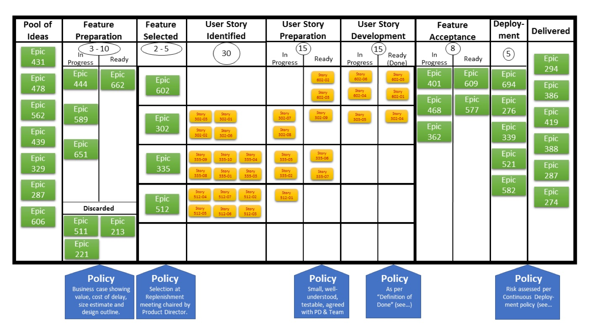

# Backlog & stories

*The As-a/I-want/so-that story format, the three Cs, INVEST criteria, and a tester's real job in refinement: asking the edge-case questions before a story is called Ready.*

> You get handed a ticket that says "Add search." No role, no reason, no hint at what "done" looks like -
> and you're expected to test it. A one-line ticket is not a user story; it's a placeholder for a
> conversation that never happened. Learn the real story format, the criteria that separate a good backlog
> item from a vague one, and exactly where a tester's questions belong before a story is ever called Ready.

> **In real life**
>
> A classified want ad follows a strict, tiny format for a reason: "Wanted: reliable dog walker, weekday
> mornings, so my dog gets exercise while I'm at work." Three parts, every time - who's wanted, what for, and
> why it matters to the person posting it. A serious respondent doesn't just show up and start walking the
> dog; they ask what "reliable" actually means here - same time every day, texted confirmation, what happens
> if they're sick - before agreeing to the job. And there's always an implicit test at the end: the dog
> actually gets walked, on the schedule that was promised, or the job wasn't done regardless of good
> intentions. A user story is that want ad's format, aimed at a team instead of a stranger.

**User story**: A user story is a short, structured description of one small piece of desired functionality, written from a user's perspective and valuable on its own, intended to prompt a conversation rather than fully specify behavior up front - commonly in the form 'As a [role], I want [capability], so that [benefit].'

## The format and the three Cs

The classic shape is deliberately small: **As a** [role], **I want** [capability], **so that** [benefit].
The role grounds it in a real person, the capability states what they need, and the "so that" is the part
teams skip most often and need the most - without a reason, nobody can tell if a proposed solution is
even solving the right problem. Ron Jeffries, one of the format's originators, described a good story
through three Cs: the **Card** is just the short written statement, small enough to fit on an index card
on purpose; the **Conversation** is the real content - the discussion between the team and whoever wants
the work, where the actual detail gets negotiated; and the **Confirmation** is the acceptance criteria that
everyone agrees will decide, later, whether the story is actually done. A card without a conversation is
just an assumption in writing, and a conversation without written confirmation is a disagreement waiting to
happen at the worst possible time - during the Sprint Review.

## INVEST: what makes a story good

Bill Wake's INVEST acronym is the practical checklist. **Independent** - a story shouldn't force a strict
build order onto unrelated stories, because hidden coupling is exactly the kind of thing a tester needs
surfaced before, not after, estimation. **Negotiable** - it's a placeholder for a conversation, not a
locked contract; details can still change as the team learns more. **Valuable** - it delivers something a
real user or the business actually cares about, not an internal implementation step disguised as a story.
**Estimable** - the team has enough shared understanding to size it at all; a story nobody can estimate is
usually missing information, not effort. **Small** - it fits inside a single Sprint (or a single pull
through a Kanban column) with room to spare. **Testable** - there's a concrete way to know it's done,
which in practice means real acceptance criteria exist, not adjectives like "fast" or "user-friendly" with
nothing underneath them.

## A tester's job in refinement

Refinement (sometimes called grooming) is where a story earns its way from a rough idea to Ready, and a
tester's most valuable move there is asking the question nobody else thought to ask. That means pushing
for concrete acceptance criteria - actual examples, not adjectives - and asking the edge-case and
negative-path questions early: what happens with an empty input, what happens for the second user hitting
this at the same time, what happens if permission is denied. It also means being willing to flag a story
as not yet Ready and sending it back rather than silently guessing at missing detail once development has
already started, because a guess made during testing is a guess made too late to change the design
cheaply.

> **Tip**
>
> Write acceptance criteria as concrete examples, not adjectives. "The form validates the email field" gives
> a tester nothing to check against; "an email missing the @ symbol shows an inline error and blocks
> submission" gives them something a test can actually pass or fail against, straight from the wording.

> **Common mistake**
>
> Treating the written card as the entire specification. A story is intentionally incomplete - the danger
> runs in both directions: a team that expands a two-line card into pages of detail so the real conversation
> never happens, or a team that ships straight off that two-line card with no refinement conversation at
> all. Either way, the actual detail everyone needed got skipped, just at different points in the process.


*Sample Kanban Board — Andy Carmichael, Wikimedia Commons, CC BY-SA 4.0. [Source](https://commons.wikimedia.org/wiki/File:Sample_Kanban_Board.png)*
- **Epics decompose into stories, not the other way around** — The green Epic cards are too big to build directly - they only enter the story columns once broken into pieces small enough for INVEST's Small criterion to actually apply.
- **A written readiness policy, not a vague standard** — 'Small, well-understood, testable, agreed with PD and Team' is INVEST's Small and Testable criteria spelled out as an explicit, enforced rule for entering this column - not left to individual judgment.
- **A 'Ready (Done)' sub-column for stories** — Stories only reach this sub-column once they meet an agreed bar - the same idea as a story's acceptance criteria being satisfied, made visible on the board itself.
- **Even story preparation is capped** — The circled number limits how many stories can be in refinement at once - a team refining far more stories than it can soon develop is just building a backlog of guesses.

**From idea to a Ready story - press Play**

1. **A rough idea or Epic enters the backlog** — Too big and too vague to build directly - this is the input to refinement, not something anyone commits to yet.
2. **The conversation happens** — The team and whoever wants the work talk through the actual detail - this is the real content behind the Card, the second of the three Cs.
3. **The story is checked against INVEST** — Independent, Negotiable, Valuable, Estimable, Small, Testable - a story failing any of these goes back for more conversation, not forward to estimation.
4. **Acceptance criteria are written as concrete examples** — This is the Confirmation - the specific, checkable statement of done that a tester can actually test against later.
5. **The story is marked Ready** — Only now does it enter Sprint Planning or get pulled into a Kanban column - Ready is a checked bar, not a guess.

Here is an INVEST checker: it validates a story against the six criteria and refuses to call it Ready if
any one of them fails.

*An INVEST-criteria story checker (Python)*

```python
story = {
    "independent": True,
    "negotiable": True,
    "valuable": True,
    "estimable": True,
    "small": True,
    "testable": True,
}

for criterion, passed in story.items():
    print(criterion.upper() + "=" + ("PASS" if passed else "FAIL"))

result = "PASS" if all(story.values()) else "FAIL"
assert result == "PASS", "story failed INVEST review, send back to refinement"
print("RESULT=" + result)
```

*An INVEST-criteria story checker (Java)*

```java
import java.util.*;

public class Main {
    public static void main(String[] args) {
        Map<String, Boolean> story = new LinkedHashMap<>();
        story.put("independent", true);
        story.put("negotiable", true);
        story.put("valuable", true);
        story.put("estimable", true);
        story.put("small", true);
        story.put("testable", true);

        boolean allOk = true;
        for (var e : story.entrySet()) {
            System.out.println(e.getKey().toUpperCase() + "=" + (e.getValue() ? "PASS" : "FAIL"));
            allOk &= e.getValue();
        }
        String result = allOk ? "PASS" : "FAIL";
        if (!result.equals("PASS")) throw new AssertionError("story failed INVEST review, send back to refinement");
        System.out.println("RESULT=" + result);
    }
}
```

### Your first time: Turning a vague ticket into a Ready story

- [ ] Rewrite it in the As-a/I-want/so-that format — If you can't fill in a real 'so that,' that's your first finding - go find out why the work matters before doing anything else.
- [ ] Run it through INVEST, one letter at a time — Say out loud which criteria pass and which don't - don't just eyeball the whole thing as 'looks fine.'
- [ ] Write two concrete acceptance-criteria examples — At least one should be an edge case or a negative path, not just the obvious happy path.
- [ ] Bring it to a real refinement conversation — Don't mark it Ready alone - the Conversation is what turns your draft into something the whole team actually agreed to.

- **A story has no 'so that' clause, or a made-up one nobody actually believes.**
  Stop and ask why this work matters before estimating it. A story without a real reason is usually solving a made-up problem, or a real problem the person writing it never actually stated.
- **Acceptance criteria say only 'works correctly' or 'is user-friendly.'**
  Demand concrete, checkable examples instead - a specific input and a specific expected result. If nobody can produce one, the story isn't Testable yet, and INVEST says it isn't Ready.
- **A story silently depends on another unfinished story to even be testable.**
  That's a broken Independent criterion. Name the hidden coupling explicitly in refinement, before the Sprint starts, not when someone can't test it and doesn't know why.

### Where to check

- The refinement or grooming session itself - is real conversation happening, or is a Product Owner just reading cards aloud?
- Any written Definition of Ready the team has agreed to, and whether it's actually being enforced.
- The Product Owner's stated reason for a story's priority - does it match the "so that" on the card?
- [[agile-and-devops-for-testers/scrum-and-kanban/estimation]] for what happens right after a story clears this bar - estimation only works on a story that's genuinely Ready.

### Worked example: the story that shipped on a guess

1. **The story:** "As a shopper, I want to apply a discount code, so that I save money on my order" ships
   with one acceptance criterion: "a valid code reduces the total."
2. **What refinement skipped:** Nobody asked what happens with an expired code, a code applied twice, or a
   code combined with a store credit - all real cases a tester would normally raise before Ready.
3. **The bug:** A customer stacks an expired code with a refund and gets charged a negative amount at
   checkout, two sprints after the story shipped as "done."
4. **The tester traces it back:** The acceptance criteria only ever described the happy path - there was
   never a negative-path example to test against, because refinement never produced one.
5. **The real root cause:** This isn't a coding mistake so much as an INVEST gap - the story was marked
   Testable without anyone actually confirming it met that bar.
6. **The fix:** The team adds a standing refinement rule - at least one edge-case acceptance criterion per
   story before it's called Ready - and retroactively writes the missing test for the discount-and-refund
   case.
7. **The lesson:** A story with exactly one acceptance criterion covering only the happy path has usually
   only been checked against INVEST's Small and Valuable letters, not its Testable one.

**Quiz.** Which of these acceptance criteria is written the way a tester can actually use it?

- [ ] The search feature works well and is fast
- [ ] Search results are relevant and user-friendly
- [x] Searching for a term with no matches shows an empty-state message instead of an error
- [ ] The search bar looks good on all screens

*A usable acceptance criterion names a specific situation and a specific expected result - here, an empty-result search and the exact behavior expected. The other options are adjectives ('well,' 'fast,' 'relevant,' 'user-friendly,' 'looks good') with nothing concrete for a test to check against.*

- **The three Cs** — Card (the short written statement), Conversation (the real discussion that fills in detail), Confirmation (the acceptance criteria that decide when it's done).
- **INVEST** — Independent, Negotiable, Valuable, Estimable, Small, Testable - six criteria a well-formed backlog item should meet before it's called Ready.
- **A tester's refinement job** — Push for concrete, example-based acceptance criteria, ask edge-case and negative-path questions early, and flag stories that aren't actually Ready instead of guessing later.

### Challenge

Take a vague ticket you've seen (real or invented) and rewrite it as a full story: the As-a/I-want/so-that format, a pass/fail check against all six INVEST letters, and two acceptance-criteria examples where at least one is an edge case.

- [Mountain Goat Software - User Stories (Mike Cohn)](https://www.mountaingoatsoftware.com/agile/user-stories)
- [Agile Alliance - INVEST glossary entry](https://www.agilealliance.org/glossary/invest/)
- [How to Write Good User Stories - INVEST](https://www.youtube.com/watch?v=tDtCp9ZEIY4)

🎬 [How to Write Good User Stories - INVEST](https://www.youtube.com/watch?v=tDtCp9ZEIY4) (7 min)

- A user story is As-a/I-want/so-that plus the three Cs - Card, Conversation, Confirmation - and the Conversation is the part most often skipped.
- INVEST - Independent, Negotiable, Valuable, Estimable, Small, Testable - is the practical checklist for whether a story is actually Ready.
- A tester's job in refinement is asking edge-case and negative-path questions early, and demanding concrete acceptance-criteria examples instead of adjectives.
- A story that only covers the happy path has been checked against Small and Valuable, but not yet against Testable.


## Related notes

- [[Notes/agile-and-devops-for-testers/scrum-and-kanban/scrum-roles-and-ceremonies|Scrum roles & ceremonies]]
- [[Notes/agile-and-devops-for-testers/scrum-and-kanban/kanban|Kanban]]
- [[Notes/agile-and-devops-for-testers/scrum-and-kanban/estimation|Estimation]]


---
_Source: `packages/curriculum/content/notes/agile-and-devops-for-testers/scrum-and-kanban/backlog-and-stories.mdx`_
