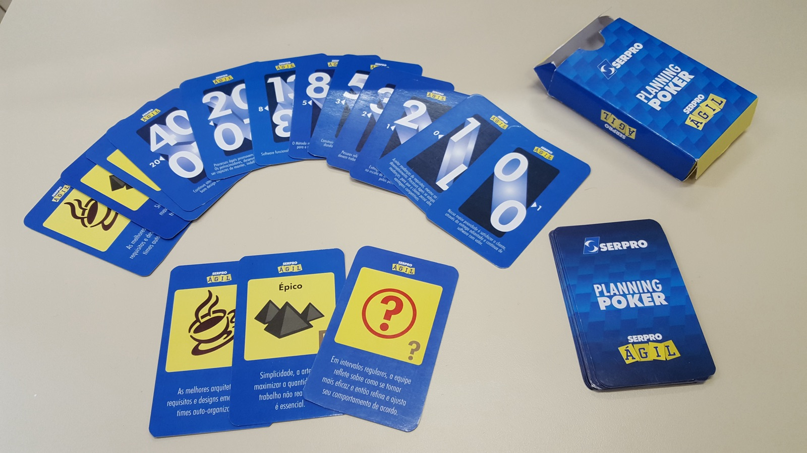

# Estimation

*Story points, Planning Poker, and T-shirt sizing as relative, not absolute, measures - plus a tester's job in estimation: surfacing hidden regression and test-setup effort before it's a surprise.*

> A story gets called "small" in planning, everyone nods, and three days later it's still open because it
> turned out to touch a shared component used in a dozen other flows. The estimate wasn't wrong out of
> laziness - it was made without the one piece of information a tester usually has and a developer
> estimating alone often doesn't: how big the regression surface actually is. Learn what a story point
> really measures, how a team converges on one honestly, and exactly where your voice changes the number.

> **In real life**
>
> Ask a professional moving company for a quote and they don't time-and-motion every box - they walk the
> apartment, count rooms, and compare it against hundreds of moves they've already done: "this is a
> two-bedroom with a full kitchen, about like the Miller job last month, call it a five-hour crew." Then
> someone mentions the piano on the third floor with no elevator, and the quote jumps - not because the movers
> got worse at their job, but because one hidden detail just changed the actual size of the work. Relative
> sizing against past jobs is exactly how experienced movers estimate, and hidden complexity is exactly what
> blows up a "small" job in software the same way it blows up a "small" move.

**Estimation**: Estimation, in agile teams, is sizing a backlog item relative to previously-completed work - commonly in story points - to forecast capacity and plan ahead, rather than predicting an exact number of hours a specific person will spend on it.

## Relative sizing techniques

**Story points** are a unitless, relative scale - usually a Fibonacci-like sequence such as one, two,
three, five, eight, thirteen - that reflects effort, complexity, and uncertainty together, not hours on a
clock. A story sized at five isn't "five hours," it's "roughly like the other work this team has already
sized at five." **T-shirt sizing** (extra-small through extra-large) trades precision for speed, and fits
best at a coarser level - sizing a whole epic or portfolio item before it's even been split into stories,
where a detailed point estimate would be false confidence anyway. **Planning Poker** is the consensus
mechanic most teams use to actually produce a story-point number: everyone privately picks a card, all
cards flip over at the same time, and if the values are close the team simply takes the higher one and
moves on - if they're far apart, the outliers explain what they saw before everyone revotes.

## Why relative beats absolute

People are reliably bad at guessing "this will take six hours" in isolation, but reliably good at judging
"is this bigger or smaller than that other thing we already built" - which is the entire reason relative
sizing works at all where absolute-hour guessing keeps failing. It also survives change better: a team's
velocity (points completed per Sprint) can be tracked and used to forecast, and that forecast stays
meaningful even as the team's composition or its pace shifts, because the points themselves are calibrated
against that team's own history rather than a universal clock.

## A tester's contribution to estimation

A tester in the room during estimation is often the person who can see cost nobody else can. That includes
naming the hidden regression surface a "small" UI change actually carries when it touches a shared
component used across several other flows, flagging the real cost of test-data or environment setup a
story quietly requires, accounting for a cross-browser or cross-device matrix a feature needs covered, and
- just as importantly - refusing to let a genuinely under-specified story get a number at all. A story
that can't be estimated with any confidence usually isn't ready for estimation; it's ready to go back to
refinement instead.

> **Tip**
>
> When your card disagrees sharply with the rest of the room, that gap is the valuable part of the exercise
> - say out loud what you know that they don't, or what they know that you don't, before anyone revotes. The
> final number matters far less than the conversation the disagreement forces.

> **Common mistake**
>
> Converting story points directly into hours ("one point equals four hours") or comparing one team's
> velocity against another team's as if it were a universal score. Points are a relative, team-calibrated
> scale built from that team's own history - they don't carry a fixed real-world unit, and they were never
> meant to.


*Planning poker deck used internally on Serpro — Rachmaninoff, Wikimedia Commons, CC BY-SA 4.0. [Source](https://commons.wikimedia.org/wiki/File:Planning_poker_deck_Serpro.jpg)*
- **Gaps between numbers, not a straight count** — The Fibonacci-like spacing forces a real choice instead of false precision - there's no card for four sitting between three and five, so the team can't pretend to distinguish differences that small.
- **A card for 'I genuinely don't know yet'** — The question-mark card is a legitimate vote - it signals missing information and forces a conversation, instead of pressuring someone into a guess they don't actually believe.
- **A card for 'this is too big to size at all'** — The pyramid-icon card flags a story that needs splitting before estimation makes sense - some things genuinely aren't Small yet, and this card says so out loud.
- **Every card stays face down until the reveal** — Cards flip over simultaneously by design - this single mechanic is what prevents the first person to speak from anchoring everyone else's number.

**One Planning Poker round - press Play**

1. **The team reviews a refined, testable story** — Estimation only works on a story that's already passed INVEST - an unclear story just produces an unreliable number.
2. **Everyone privately picks a card** — No discussion yet - this is what keeps the first opinion spoken out loud from quietly becoming everyone else's opinion too.
3. **All cards reveal at the same time** — Simultaneous reveal is the whole point of the format - it protects the estimate from anchoring bias by design, not by willpower.
4. **Close votes converge; wide votes discuss** — Adjacent values usually just get rounded up and accepted. A question-mark or a wide spread means someone explains what they saw before anyone revotes.
5. **The team converges on a size** — Not a promise of hours - a relative size, calibrated against the team's own past work, used to forecast capacity going forward.

Here is a consensus calculator: it checks how far apart a round of Planning Poker votes actually are on
the Fibonacci-like scale, and decides whether the team has converged or needs to discuss and revote.

*A planning-poker-consensus calculator (Python)*

```python
fibonacci = [1, 2, 3, 5, 8, 13, 21]
votes = [5, 5, 8, 5]

lo = min(votes)
hi = max(votes)
spread = fibonacci.index(hi) - fibonacci.index(lo)
reached = spread <= 1

print("ROUND_MIN=" + str(lo))
print("ROUND_MAX=" + str(hi))
print("SPREAD_STEPS=" + str(spread))
print("CONSENSUS=" + ("PASS" if reached else "FAIL"))

result = "PASS" if reached else "FAIL"
assert result == "PASS", "no consensus, re-discuss the outliers and revote"
print("RESULT=" + result)
```

*A planning-poker-consensus calculator (Java)*

```java
import java.util.*;

public class Main {
    public static void main(String[] args) {
        int[] fibonacci = {1, 2, 3, 5, 8, 13, 21};
        int[] votes = {5, 5, 8, 5};

        int lo = Integer.MAX_VALUE, hi = Integer.MIN_VALUE;
        for (int v : votes) {
            lo = Math.min(lo, v);
            hi = Math.max(hi, v);
        }

        int loIdx = indexOf(fibonacci, lo);
        int hiIdx = indexOf(fibonacci, hi);
        int spread = hiIdx - loIdx;
        boolean reached = spread <= 1;

        System.out.println("ROUND_MIN=" + lo);
        System.out.println("ROUND_MAX=" + hi);
        System.out.println("SPREAD_STEPS=" + spread);
        System.out.println("CONSENSUS=" + (reached ? "PASS" : "FAIL"));

        String result = reached ? "PASS" : "FAIL";
        if (!result.equals("PASS")) throw new AssertionError("no consensus, re-discuss the outliers and revote");
        System.out.println("RESULT=" + result);
    }

    static int indexOf(int[] arr, int value) {
        for (int i = 0; i < arr.length; i++) if (arr[i] == value) return i;
        return -1;
    }
}
```

### Your first time: Your first Planning Poker round

- [ ] Gather two or three reference stories of known size — Pick already-built stories the team agrees were a two, a five, and an eight - these are what every new vote gets compared against.
- [ ] Vote privately, then reveal together — Pick your card before seeing anyone else's, exactly like the deck's face-down mechanic is designed for.
- [ ] Speak up on any wide spread, even if you're the lowest number — Explain specifically what you saw - a shared component, a missing test environment, an ambiguous acceptance criterion - not just 'it feels bigger to me.'
- [ ] Write down one hidden-complexity sentence with the final number — Whatever a tester spotted that changed the vote is worth more than the number itself - record it for the next similar story.

- **Every single story gets estimated as the same number, regardless of what it actually involves.**
  The scale has stopped being meaningful. Recalibrate against real reference stories of clearly different, agreed sizes before the next round.
- **The most senior person reveals or states their card first, and everyone else's vote quietly matches it.**
  Enforce the deck's actual mechanic - private pick, simultaneous reveal, no verbal hints beforehand. Anchoring is exactly what that mechanic exists to prevent.
- **A story keeps coming back to estimation unresolved, Sprint after Sprint.**
  It isn't Estimable yet. Stop revoting on it and send it back to refinement for a real conversation and concrete acceptance criteria instead.

### Where to check

- The team's own velocity and point history for stories of comparable, already-agreed size.
- The refinement notes for the specific story being estimated - a vague story produces an unreliable number no matter how the vote goes.
- Whoever cast an outlier vote, and what specific detail drove it.
- [[agile-and-devops-for-testers/scrum-and-kanban/backlog-and-stories]] for the INVEST review a story needs to pass before estimation is even worth doing.

### Worked example: the two-point login story that wasn't

1. **The vote:** A story titled "add a remember-me checkbox to login" gets a fast, confident two-point
   consensus - it looks like a small UI addition.
2. **What the vote missed:** The login flow is shared by five other features, including a compliance-
   sensitive one, and none of that shows up anywhere in the story's acceptance criteria.
3. **The tester's flag, made too late:** Only during test-case writing does it surface that "remember me"
   needs its own regression pass across all five dependent flows, not just the login screen itself.
4. **The real cost:** What was voted a two-point story turns into roughly two weeks of unplanned
   regression testing once the shared-component risk is fully understood.
5. **The root cause:** The regression surface was invisible to the vote because nobody raised it during
   Planning Poker - the story was estimated purely on visible UI effort.
6. **The fix that sticks:** The team adds a standing prompt to their estimation process - "does this touch
   a shared component?" - asked out loud before every vote, not left to chance.
7. **The lesson:** A confident, fast consensus isn't proof an estimate is right; it's only proof everyone
   in the room shared the same blind spot.

**Quiz.** In Planning Poker, what does a wide, non-adjacent spread of votes usually indicate?

- [ ] The team should just average the numbers and move on
- [ ] Someone made a mistake and should recount their card
- [x] People have different information or assumptions that need to be discussed before revoting
- [ ] The story should automatically get the highest value shown

*A wide spread almost always means people are estimating based on different, unstated assumptions or information - the fix is discussion, where outliers explain what they saw, followed by a revote. Averaging or auto-picking a value skips the exact conversation the spread was there to trigger.*

- **Story points** — A unitless, relative measure of effort, complexity, and uncertainty - calibrated against a team's own past work, not a fixed number of hours.
- **T-shirt sizing** — A coarse, fast sizing scale (extra-small through extra-large) best used at the epic or portfolio level, before something is split into estimable stories.
- **Planning Poker's core mechanic** — Private card selection, simultaneous reveal, and discussion on any wide spread before revoting - specifically designed to prevent anchoring on the first opinion spoken aloud.

### Challenge

Pick a story you've seen estimated (real or invented) and write one sentence naming a hidden cost - regression surface, test-data setup, or a cross-browser/device matrix - that a tester would know to raise before the vote, but a developer estimating alone might miss.

- [Mountain Goat Software - Planning Poker (Mike Cohn)](https://www.mountaingoatsoftware.com/agile/planning-poker)
- [Agile Alliance - Estimation glossary entry](https://www.agilealliance.org/glossary/estimation/)
- [Planning Poker Explained: How Agile Teams Estimate Story Points](https://www.youtube.com/watch?v=gE7srp2BzoM)

🎬 [Planning Poker Explained: How Agile Teams Estimate Story Points](https://www.youtube.com/watch?v=gE7srp2BzoM) (6 min)

- Story points are relative and team-calibrated, not a disguised number of hours - that's exactly why they keep working as a team's composition and pace change.
- Planning Poker's private-vote, simultaneous-reveal mechanic exists specifically to prevent anchoring on the first opinion spoken aloud.
- A tester's real contribution to estimation is naming hidden regression surface, test-data cost, and matrix coverage nobody else in the room can see.
- A fast, confident consensus isn't proof an estimate is right - it can just mean everyone shared the same blind spot.


## Related notes

- [[Notes/agile-and-devops-for-testers/scrum-and-kanban/scrum-roles-and-ceremonies|Scrum roles & ceremonies]]
- [[Notes/agile-and-devops-for-testers/scrum-and-kanban/kanban|Kanban]]
- [[Notes/agile-and-devops-for-testers/scrum-and-kanban/backlog-and-stories|Backlog & stories]]


---
_Source: `packages/curriculum/content/notes/agile-and-devops-for-testers/scrum-and-kanban/estimation.mdx`_
