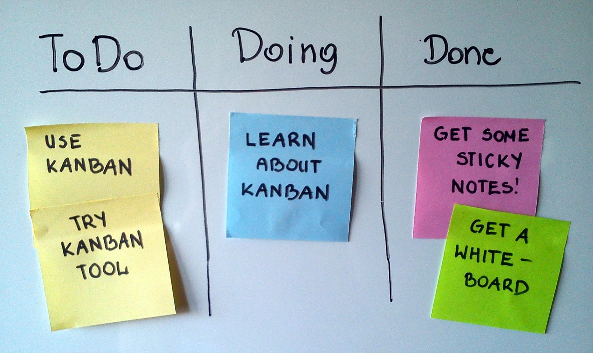

# Kanban

*Kanban's six real practices - visualize, limit WIP, manage flow, explicit policies, feedback loops, and improve together - and why it runs on continuous pull instead of fixed sprints.*

> A support team never has a two-week backlog to plan against - tickets arrive whenever a customer hits a
> problem, and nobody can promise "we'll start your fix on the fourteenth." That team almost certainly runs
> on a board with columns and a rule about how many things can sit "In Progress" at once, and calls it
> Kanban. Learn the six real practices behind that board and you'll be able to tell, at a glance, whether a
> team is actually managing flow or just drew three columns on a whiteboard.

> **In real life**
>
> Kanban's own name comes from an old, physical system: a Toyota factory floor in the 1940s, restocked the
> way a supermarket restocks its shelves. A supermarket does not guess a year in advance how much milk to
> manufacture and warehouse - a shelf empties, a card or signal goes back to the supplier, and only then does
> more get made, in roughly the amount the shelf can actually hold. Nothing is pulled forward until there is
> open shelf space for it. That is the entire mechanism: visible signal, capped capacity, pulled - not
> pushed - replenishment. Software Kanban is the identical idea applied to a backlog of work instead of a
> backlog of milk cartons.

**Kanban**: Kanban is a method for managing and improving the flow of work using a visual, explicit workflow with limits on how much work can be in progress at once, defined by six general practices: visualize the workflow, limit work in progress, manage flow, make process policies explicit, implement feedback loops, and improve collaboratively using models and the scientific method.

## The six practices, not just the board

A board with columns is not, by itself, Kanban - it's the most common way to satisfy the first practice,
**visualize the workflow**, and nothing more without the other five. **Limit work in progress** means
every column (or a subset of them) has an actual, agreed, enforced cap on how many items can sit there at
once - not a suggestion, a hard stop that blocks pulling in new work until something moves out. **Manage
flow** means watching how items move through the system as a whole - cycle time, aging items, where things
pile up - rather than only counting how many tickets closed this week. **Make process policies explicit**
means writing down, visibly, what "ready to pull into this column" and "done with this column" actually
mean, so two people don't silently disagree about whether a card is allowed to move. **Implement feedback
loops** means the team has a real, recurring cadence - a replenishment meeting, a flow review - where flow
data gets looked at together. **Improve collaboratively, evolve experimentally** closes the loop: change
one thing at a time, based on evidence from that flow data, and see what actually happens before changing
the next thing.

## Continuous flow, not a fixed timebox

The biggest structural difference from Scrum is that Kanban has no Sprint. There is no two-week commitment
ceremony and no fixed-length container event - work is pulled continuously, one item at a time, whenever
there is open capacity in the next column, and a finished item ships the moment it's actually done rather
than waiting for a review event to make it official. Replenishment - deciding what gets pulled from the
backlog next - can happen on its own cadence, entirely decoupled from delivery. This is why Kanban fits
support queues, ops work, and maintenance streams so well: the input rate is unpredictable, so a fixed
two-week commitment would either sit half-empty or get blown apart by the third urgent ticket.

> **Tip**
>
> Don't just watch how many cards are in the "Done" column - watch how long each item actually sat in
> Testing or Review before it got there, and watch which cards are aging far past the team's normal cycle
> time. A column with a healthy count but three cards stuck for two weeks is a bigger warning sign than a
> column that's simply full.

> **Common mistake**
>
> Calling three columns and a pile of sticky notes "Kanban" when nothing actually stops the team from
> pulling in a tenth item while nine are still in progress. Without an enforced work-in-progress limit and
> an explicit, written definition of what moves a card between columns, a board is just a visible to-do list
> - useful, but not the flow-control system Kanban actually is.


*A Scrum board suggesting a Kanban approach — Jeff.lasovski, Wikimedia Commons, CC BY-SA 3.0. [Source](https://commons.wikimedia.org/wiki/File:Simple-kanban-board-.jpg)*
- **Three columns are the whole workflow, visualized** — This is practice one made physical: anyone walking past can see the entire state of the work without asking a single person for a status update.
- **A small stack, already queued** — Two items sit in To Do rather than ten - a healthy queue depth is itself a flow signal, even before a numeric cap is written down anywhere.
- **Only one card actively In Progress** — This is what an enforced work-in-progress limit looks like in practice - not a rule taped to the wall, but a board where the count genuinely stays low.
- **Nothing here says 'Sprint 4' or 'day 3'** — There's no iteration label anywhere on this board - a card moves to Done the moment it's actually finished, not at a scheduled review event.

**One card's pull cycle - press Play**

1. **Card waits in the backlog** — Nothing pulls it forward until there's open capacity in the next column - replenishment happens on its own cadence, not a fixed Sprint clock.
2. **Pulled into a column with room** — The work-in-progress limit is what creates that room in the first place - a full column simply cannot accept another card yet.
3. **Explicit policy decides when it can move again** — A written, agreed definition of 'done with this column' - not a guess - is what lets the next person trust the card is actually ready to pull.
4. **Flow data feeds a real review** — Cycle time and aging items get looked at together on a recurring cadence, and the team changes one policy at a time based on what that data actually shows.

Here is a small work-in-progress enforcer: it checks each column's current count against its agreed limit,
which is the concrete mechanic behind practice two.

*A Kanban WIP-limit enforcer (Python)*

```python
columns = [
    ("To Do", None, 6),
    ("In Progress", 3, 3),
    ("Review", 2, 2),
    ("Done", None, 5),
]

def check(name, limit, count):
    ok = True if limit is None else count <= limit
    label = name.replace(" ", "_").upper()
    limit_text = "none" if limit is None else str(limit)
    print(label + "=" + ("PASS" if ok else "FAIL") + " count=" + str(count) + " limit=" + limit_text)
    return ok

results = [check(name, limit, count) for name, limit, count in columns]
result = "PASS" if all(results) else "FAIL"
assert result == "PASS", "a column is over its WIP limit"
print("RESULT=" + result)
```

*A Kanban WIP-limit enforcer (Java)*

```java
import java.util.*;

public class Main {
    static class Column {
        String name;
        Integer limit;
        int count;
        Column(String name, Integer limit, int count) {
            this.name = name;
            this.limit = limit;
            this.count = count;
        }
    }

    public static void main(String[] args) {
        List<Column> columns = new ArrayList<>();
        columns.add(new Column("To Do", null, 6));
        columns.add(new Column("In Progress", 3, 3));
        columns.add(new Column("Review", 2, 2));
        columns.add(new Column("Done", null, 5));

        boolean allOk = true;
        for (Column c : columns) {
            boolean ok = c.limit == null || c.count <= c.limit;
            String label = c.name.replace(" ", "_").toUpperCase();
            String limitText = c.limit == null ? "none" : String.valueOf(c.limit);
            System.out.println(label + "=" + (ok ? "PASS" : "FAIL") + " count=" + c.count + " limit=" + limitText);
            allOk &= ok;
        }
        String result = allOk ? "PASS" : "FAIL";
        if (!result.equals("PASS")) throw new AssertionError("a column is over its WIP limit");
        System.out.println("RESULT=" + result);
    }
}
```

### Your first time: Reading a Kanban board for the first time

- [ ] Find the actual WIP limits — Look for a number on or near each column, not just a column name. If there isn't one, that's your first finding, not a dead end.
- [ ] Find the written column policies — Ask what 'ready to pull' and 'done' mean for at least two columns. If nobody can answer without a debate, the policies aren't actually explicit yet.
- [ ] Track one real card end to end — Pick a single item and note the date it entered each column - that's a real cycle time, not an estimate.
- [ ] Ask about the flow review cadence — Find out when the team last looked at cycle time or aging cards together, and what changed afterward.

- **The board has columns, but nothing stops the team from pulling in new work while every column is already full.**
  Negotiate a real numeric limit per column with the team and treat hitting it as a hard stop - the point is that pulling in more becomes physically or procedurally impossible, not just discouraged.
- **Cards sit in a 'Testing' or 'Review' column for weeks with no visible reason.**
  This is exactly what practice two and three exist to catch - track cycle time and aging explicitly, and flag a stuck card the moment it crosses the team's normal cycle time, rather than only noticing it when someone finally asks.
- **The team says 'we do Kanban' but still commits an entire batch of work every Monday like a fixed iteration.**
  That's Scrum's timeboxing wearing Kanban's column labels. Real Kanban replenishes continuously as capacity opens up - if the team is batch-committing on a calendar, name that gap in the next flow review.

### Where to check

- The board's written column policies - what "ready" and "done" mean for each column, and who agreed to them.
- Cycle-time and aging-item data from the team's flow reviews, not just the current column counts.
- The replenishment meeting, if one exists, and how items get selected into the workflow from the backlog.
- [[agile-and-devops-for-testers/scrum-and-kanban/scrum-roles-and-ceremonies]] for how continuous flow contrasts with Scrum's fixed Sprint and its four events.

### Worked example: the Testing column that quietly became a warehouse

1. **The setup:** A team's board looks healthy at a glance - Development rarely exceeds its limit of four,
   and Done keeps growing every week.
2. **The tester notices something the column count hides:** Three cards in Testing have been sitting there
   for over two weeks, far past the team's usual one-to-two-day cycle time for that column.
3. **The root cause:** Testing has no work-in-progress limit at all, so nothing ever blocked new items from
   entering it - the column just quietly filled up while Development kept moving, and nobody's dashboard
   flagged it because column counts alone don't show age.
4. **The fix:** The team sets an explicit limit on Testing for the first time, and adds an aging-card check
   to their weekly flow review instead of relying on someone happening to notice.
5. **The improvement, made experimentally:** Cycle time through Testing visibly drops over the next two
   weeks, confirming the limit - not just the extra attention - was the actual fix, which is the
   collaborative-improvement practice working as intended.
6. **The lesson:** A full "Done" column proves throughput, not flow health - practice two and three exist
   precisely because item counts alone hide exactly this kind of silent bottleneck.

**Quiz.** Which of these is one of Kanban's six core practices, distinct from simply drawing columns on a board?

- [ ] Running a fixed two-week Sprint
- [x] Limiting work in progress with an enforced cap per column
- [ ] Assigning a Scrum Master to facilitate every event
- [ ] Estimating every item in story points before it starts

*Limiting work in progress is one of Kanban's six general practices, and it's what turns a board from a visible to-do list into an actual flow-control system. Sprints and Scrum Masters belong to Scrum, and story-point estimation is a separate, optional practice not required by Kanban itself.*

- **Kanban's six practices** — Visualize the workflow, limit work in progress, manage flow, make process policies explicit, implement feedback loops, improve collaboratively and evolve experimentally.
- **Kanban vs Scrum's core structural difference** — Kanban runs on continuous pull with no fixed iteration; Scrum runs on a fixed-length Sprint with a planning-and-review ceremony bookending it.
- **Why a column count alone can mislead** — A column can hold a healthy-looking number of cards while individual items sit far past normal cycle time - flow health needs cycle time and aging data, not just a headcount.

### Challenge

Find (or sketch) a real board you've used. For each column, write down whether it has an actual enforced WIP limit and an explicit written policy for entry and exit - if either is missing for a column, that's this week's concrete improvement to propose.

- [The Kanban Guide - the official definition of Kanban's practices, maintained by Kanban University](https://kanbanguides.org/)
- [Atlassian - What is Kanban?](https://www.atlassian.com/agile/kanban)
- [Intro to Kanban in Under 5 Minutes](https://www.youtube.com/watch?v=R8dYLbJiTUE)

🎬 [Intro to Kanban in Under 5 Minutes](https://www.youtube.com/watch?v=R8dYLbJiTUE) (4 min)

- Kanban is six practices, not a whiteboard - visualize, limit WIP, manage flow, explicit policies, feedback loops, and collaborative improvement.
- Work is pulled continuously as capacity opens, with no fixed Sprint container - the opposite structural choice from Scrum.
- A healthy-looking column count can hide a real bottleneck; cycle time and aging items are what actually reveal flow health.
- Columns without an enforced numeric limit and an explicit entry-and-exit policy are a to-do list, not yet a working Kanban system.


## Related notes

- [[Notes/agile-and-devops-for-testers/scrum-and-kanban/scrum-roles-and-ceremonies|Scrum roles & ceremonies]]
- [[Notes/agile-and-devops-for-testers/scrum-and-kanban/backlog-and-stories|Backlog & stories]]
- [[Notes/agile-and-devops-for-testers/scrum-and-kanban/estimation|Estimation]]


---
_Source: `packages/curriculum/content/notes/agile-and-devops-for-testers/scrum-and-kanban/kanban.mdx`_
