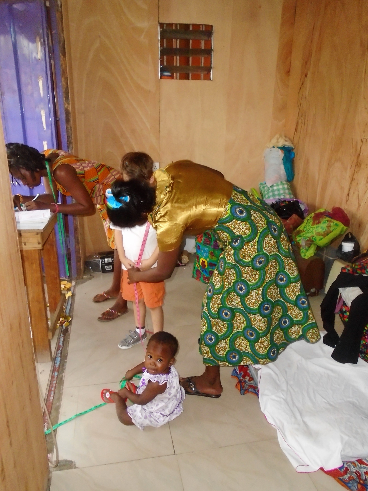

# Acceptance criteria

*The story-specific, concrete, testable conditions that define when THIS piece of work does what was asked - distinct from the Definition of Done, which is the same fixed checklist applied to every story regardless of what it is.*

> A story reads: "As a shopper, I want to apply a discount code so I get a lower price." The developer builds
> it, the tester tests it, and at sprint review the product owner says "that's not what I asked for - codes
> should stack with the loyalty discount, not replace it." Nobody was wrong about the code working. They were
> each testing a different, unwritten idea of what "apply a discount code" meant. That gap is exactly what
> acceptance criteria exist to close before a single line of code gets written.

> **In real life**
>
> Watch a seamstress take a customer's measurements for a single, specific garment: a tape measure held
> against the exact spot on the back, a number called out, and a second person writing that number down on
> the spot - 34 inches, not "about medium." That measurement belongs to this one order alone; the next
> customer through the door gets their own tape measure, their own numbers, their own written record.
> Nobody hands the tailor a vague instruction like "make it fit well" and expects a garment that satisfies
> everyone. Acceptance criteria work the same way: concrete, specific conditions written down for this one
> story, checked against this one piece of work - not a general standard shared across every order.

**Acceptance criteria**: Acceptance criteria are the specific, concrete, testable conditions - written for one particular story - that define when that story does what was asked. They describe the expected behavior of this piece of work alone, in contrast to the Definition of Done, which is a fixed, story-independent checklist applied identically to every story regardless of its content.

## Given/When/Then, or a plain checklist - either works if it's testable

Acceptance criteria can be written as a scenario - "Given a cart with an eligible item, when a valid discount
code is entered, then the total updates to reflect 10% off" - or as a flatter checklist: "valid codes apply a
10% discount," "invalid codes show an error and change nothing," "the discount appears on the order
confirmation." The format matters less than the property both share: each line describes an observable,
checkable outcome. "The checkout should feel smooth" is not acceptance criteria, no matter how it's
formatted - there is no way to look at the finished story and say yes or no to whether it happened. If a
criterion can't be checked off as true or false against the actual behavior, it isn't doing its job yet.

## Who writes them: the product owner drafts, the team sharpens

Acceptance criteria usually start with the product owner, who knows what the business actually needs from a
story. But a draft written alone, before anyone else has looked at it, tends to carry gaps the product owner
doesn't know are gaps - an edge case they didn't think of, a term that means one thing to them and another to
engineering. That's why the criteria get refined with the whole team, typically during backlog refinement or
sprint planning: developers flag what's ambiguous or technically unclear, testers push on edge cases and
ask "what happens if...", and the criteria that come out the other side are sharper for having been argued
over before any code exists - not discovered as a dispute after the story is built.

> **Tip**
>
> Read each acceptance criterion out loud and ask "how would I prove this is true or false?" If the answer is
> a vague shrug rather than a specific check, the criterion needs rewriting before the story goes into a
> sprint - not after.

> **Common mistake**
>
> Writing acceptance criteria that describe a feeling instead of a behavior - "the flow should be intuitive,"
> "errors should be handled gracefully" - hands every reader a different picture of what done looks like. It
> feels like progress because something got written down, but it settles nothing: the developer, the tester,
> and the product owner can each build, test, and expect a different outcome, and the gap only becomes visible
> at review, when it's the most expensive time to find it.


*Seamstress taking measurements in Alajo, Accra - Angela L. Rak, Wikimedia Commons, CC BY-SA 4.0. [Source](https://commons.wikimedia.org/wiki/File:Seamstress_taking_measurements_in_Alajo,_Accra.jpg)*
- **Tape measure held against the child's back** — An exact number is being taken for this one garment, right now - a concrete, specific measurement that belongs to nobody else's order, the same way one story's acceptance criteria belong to that story alone.
- **A second seamstress writing at a desk** — The measurement is being written down the instant it's taken, turning a spoken number into a record that can be checked later - just like acceptance criteria get written before a story is built, not recalled afterward.
- **A toddler on the floor holding the far end of the tape** — The tape runs the full length of the scene as one continuous line - every inch of it belongs to this specific fitting, not a general rule about garments in general.
- **Bundles of differently patterned fabric stacked in the corner** — Each bundle is a different order waiting its turn, and each will get its own separate measurements - a reminder that acceptance criteria are written per story, never as one shared list covering every order.

**Acceptance criteria taking shape - press Play**

1. **Product owner drafts the conditions** — A first pass at what 'done' looks like for this specific story, based on what the business actually needs.
2. **Team reviews during refinement** — Developers flag ambiguity and technical edge cases; testers push on 'what if' scenarios before any code exists.
3. **Criteria are rewritten to be testable** — Vague language like 'feels right' gets replaced with concrete, checkable conditions everyone reads the same way.
4. **Criteria are checked against the finished story** — At review, each condition is verified true or false against actual behavior - no argument left about what was meant.

Here is a small acceptance-criteria checker: it evaluates a set of conditions for one story, and treats a
vague, untestable condition the same as a hard failure - both block the story from being accepted.

*Acceptance criteria checker (Python)*

```python
criteria = [
    ("valid_discount_code_applies_10_percent", True),
    ("invalid_code_shows_error_message", True),
    ("checkout_total_updates_immediately", False),
    ("ui_should_feel_intuitive", None),
]

def evaluate(name, result):
    if result is None:
        print(name.upper() + "=VAGUE-CANNOT-TEST")
        return "VAGUE"
    status = "PASS" if result else "FAIL"
    print(name.upper() + "=" + status)
    return status

results = [evaluate(name, result) for name, result in criteria]
testable = [r for r in results if r != "VAGUE"]
vague_count = results.count("VAGUE")
all_pass = all(r == "PASS" for r in testable)
outcome = "STORY_NOT_ACCEPTED" if (not all_pass or vague_count > 0) else "STORY_ACCEPTED"

print("VAGUE_CRITERIA_COUNT=" + str(vague_count))
print("OUTCOME=" + outcome)
assert outcome == "STORY_NOT_ACCEPTED", "expected a failing check plus a vague criterion to block acceptance"
print("RESULT=" + outcome)
```

*Acceptance criteria checker (Java)*

```java
import java.util.*;

public class Main {
    static class Criterion {
        String name;
        Boolean result;
        Criterion(String name, Boolean result) { this.name = name; this.result = result; }
    }

    static String evaluate(Criterion c) {
        if (c.result == null) {
            System.out.println(c.name.toUpperCase() + "=VAGUE-CANNOT-TEST");
            return "VAGUE";
        }
        String status = c.result ? "PASS" : "FAIL";
        System.out.println(c.name.toUpperCase() + "=" + status);
        return status;
    }

    public static void main(String[] args) {
        List<Criterion> criteria = new ArrayList<>();
        criteria.add(new Criterion("valid_discount_code_applies_10_percent", true));
        criteria.add(new Criterion("invalid_code_shows_error_message", true));
        criteria.add(new Criterion("checkout_total_updates_immediately", false));
        criteria.add(new Criterion("ui_should_feel_intuitive", null));

        List<String> results = new ArrayList<>();
        for (Criterion c : criteria) results.add(evaluate(c));

        int vagueCount = 0;
        boolean allPass = true;
        for (String r : results) {
            if (r.equals("VAGUE")) vagueCount++;
            else if (!r.equals("PASS")) allPass = false;
        }
        String outcome = (!allPass || vagueCount > 0) ? "STORY_NOT_ACCEPTED" : "STORY_ACCEPTED";

        System.out.println("VAGUE_CRITERIA_COUNT=" + vagueCount);
        System.out.println("OUTCOME=" + outcome);
        if (!outcome.equals("STORY_NOT_ACCEPTED")) throw new AssertionError("expected a failing check plus a vague criterion to block acceptance");
        System.out.println("RESULT=" + outcome);
    }
}
```

### Your first time: Reviewing a story's acceptance criteria for the first time

- [ ] Read each line as a yes/no question — For every criterion, ask 'how would I prove this true or false against the finished story?' If there's no clear answer, flag it before the story is picked up.
- [ ] Check who wrote them and who reviewed them — A product owner's first draft that nobody on the team has looked at yet is more likely to carry gaps than one refined with developers and testers present.
- [ ] Separate them from the Definition of Done — Confirm the criteria describe what this story specifically does, not general quality gates like 'code reviewed' or 'tests passing' - those belong to the DoD, not here.
- [ ] Look for edge cases the criteria don't mention — Ask what happens with empty input, an expired code, or a second attempt after failure. Silence on an edge case is usually a gap, not an implicit 'handle it however.'

- **A story passes review, then the product owner says 'that's not what I meant' at sprint review.**
  The acceptance criteria were too vague or incomplete to catch the gap before the story was built. Rewrite the disputed condition into something concrete and testable, then apply that standard to future stories before development starts.
- **The developer, tester, and product owner each describe the story's expected behavior differently.**
  The acceptance criteria never actually settled the ambiguity - or were never written down at all. Get one written version everyone reads the same way before more work continues on the story.
- **Testers keep discovering edge cases the criteria never addressed.**
  This is a sign refinement skipped the 'what if' pass. Bring the gap back to the team, add the missing condition explicitly, and treat recurring gaps as a signal to slow down refinement, not to keep patching criteria after the fact.

### Where to check

- Each acceptance criterion, read as a yes/no question - if it can't be proven true or false, it isn't finished yet.
- Who drafted the criteria and whether the whole team reviewed them before the story entered a sprint.
- Whether disputes at review trace back to a criterion that was vague, missing, or never actually agreed on.
- [[agile-and-devops-for-testers/tester-in-a-sprint/definition-of-done]] for the separate, story-independent checklist that applies once acceptance criteria are already satisfied.
- [[agile-and-devops-for-testers/scrum-and-kanban/backlog-and-stories]] for where acceptance criteria get attached to a story before it's ready for a sprint.

### Worked example: a discount-code story that shipped the wrong thing

1. **The setup:** A story says "shoppers can apply a discount code at checkout." The product owner writes one
   line of acceptance criteria: "discount code reduces the total."
2. **What got built:** The developer implements a code that replaces any existing loyalty discount rather
   than stacking with it - a reasonable reading of the one vague line that was written.
3. **The root cause:** The single criterion never specified how the discount interacts with other discounts
   already on the cart, so "reduces the total" was technically true and still wrong.
4. **The fix:** The team rewrites the criteria before the next attempt: "valid code applies 10% off the
   pre-discount subtotal," "code stacks with, and does not replace, an active loyalty discount," "invalid
   code shows an error and changes nothing."
5. **The lesson:** The rework wasn't caused by a coding mistake - it was caused by an acceptance criterion
   concrete enough to sound testable but not concrete enough to rule out the wrong interpretation.

**Quiz.** A story's only acceptance criterion is 'the checkout should feel fast and easy to use.' What is the main problem with this criterion?

- [ ] It is too long and should be shortened
- [ ] It belongs in the Definition of Done, not the story
- [x] It cannot be checked as true or false against the finished story, so different people can each believe the story is done for different reasons
- [ ] It should have been written by the developer instead of the product owner

*Acceptance criteria have to be testable - a concrete condition someone can verify as true or false. 'Feel fast and easy to use' describes an impression, not a checkable outcome, which is exactly what causes disputes at review time.*

- **Acceptance criteria, in one line** — Concrete, testable conditions specific to one story, defining when that particular piece of work does what was asked.
- **Acceptance criteria vs Definition of Done** — Acceptance criteria are story-specific (does THIS story do what was asked). Definition of Done is story-independent and team-wide (code reviewed, tests passing, deployed) and applies to every story identically.
- **Who writes acceptance criteria** — The product owner typically drafts them; the whole team - developers and testers included - refines them during backlog refinement, before the story enters a sprint.

### Challenge

Pick a story from your current sprint. Rewrite each of its acceptance criteria as a strict yes/no question you could put in front of the story and answer without guessing. Flag any line where you can't.

- [Atlassian - Acceptance criteria](https://www.atlassian.com/work-management/project-management/acceptance-criteria)
- [Ministry of Testing - What is acceptance criteria](https://www.ministryoftesting.com/articles/what-is-acceptance-criteria)
- [How to Write Good Acceptance Criteria](https://www.youtube.com/watch?v=BPszM_zN2wY)

🎬 [How to Write Good Acceptance Criteria](https://www.youtube.com/watch?v=BPszM_zN2wY) (6 min)

- Acceptance criteria are story-specific, concrete, and testable - they define when THIS story does what was asked, unlike the team-wide Definition of Done.
- Given/When/Then and plain checklists both work, as long as every line can be checked true or false against actual behavior.
- The product owner usually drafts acceptance criteria, but the whole team refining them before a sprint starts catches gaps a solo draft misses.
- Vague criteria don't prevent rework - they just delay the dispute until review, which is the most expensive time to discover it.


## Related notes

- [[Notes/agile-and-devops-for-testers/tester-in-a-sprint/definition-of-done|Definition of done]]
- [[Notes/agile-and-devops-for-testers/tester-in-a-sprint/in-sprint-testing|In-sprint testing]]
- [[Notes/agile-and-devops-for-testers/scrum-and-kanban/backlog-and-stories|Backlog & stories]]


---
_Source: `packages/curriculum/content/notes/agile-and-devops-for-testers/tester-in-a-sprint/acceptance-criteria.mdx`_
