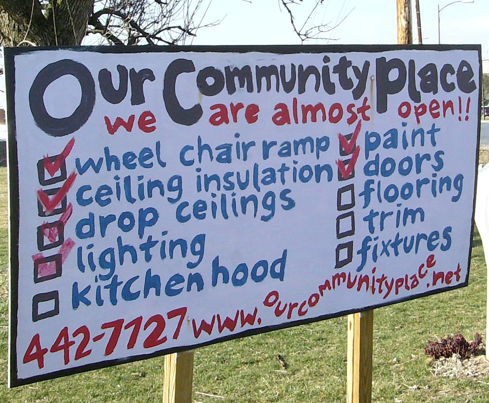

# Definition of done

*The team-agreed, story-independent checklist - code reviewed, tests passing, documented, deployed to staging - that must be true before ANY story counts as done, distinct from one story's specific acceptance criteria.*

> A developer drags a card to Done. The story's own acceptance criteria all check out - the button does what
> the ticket said. But nobody reviewed the code, there are no automated tests for it, and it has never been
> deployed anywhere but a laptop. Is it done? Most teams that have been burned once say no - and the reason
> they can say no with confidence, for every story, every time, is a single written list called the Definition
> of Done.

> **In real life**
>
> Before any patient leaves a hospital - whether they came in for a broken wrist or a cardiac procedure - the
> same discharge checklist has to be satisfied: vitals stable, medications reconciled, a follow-up appointment
> booked, discharge paperwork signed. The checklist does not know or care what brought this particular patient
> in the door. It is the hospital's one uniform bar for "safe to send home," applied identically no matter the
> case. A story's Definition of Done works the same way: it does not know or care what the story was about. It
> is the team's one uniform bar for "safe to call finished," checked the same way every single time - while the
> patient's own chart, listing exactly what surgery they needed and how it went, is a separate document
> entirely. That chart is the acceptance criteria; the discharge checklist is the Definition of Done.

**Definition of Done**: The Definition of Done (DoD) is a team-agreed, written checklist of quality conditions that must be true of EVERY product backlog item before it can be called done, regardless of what that item is. It is story-independent: the same fixed list - typically covering things like code review, automated tests passing, documentation, and deployment to a shared environment - applies uniformly across the whole team's work. This distinguishes it from acceptance criteria, which are specific to one story and describe what that particular piece of functionality must do.

## One list, every story, no exceptions

The whole point of a Definition of Done is that it is boring and identical every time. A team typically
writes it once, early, and revisits it only a few times a year - not per story, not per sprint. A common
starter list: code reviewed by at least one other engineer, unit tests written and passing, no known
critical defects open, documentation updated, and the change deployed to a shared staging environment. None
of those five conditions mentions what the story actually does. That is deliberate. A story about a
password-reset email and a story about a checkout discount code go through the exact same five gates, because
the gates are about the team's baseline standard of quality, not about either story's specific behavior.

## Why "it passed the acceptance criteria" is not enough

Acceptance criteria and Definition of Done answer two different questions, and conflating them is where teams
get burned. Acceptance criteria answer "does THIS story do what was asked?" - a story-specific question,
usually written as concrete conditions on that one piece of work. The Definition of Done answers a completely
different question: "is this piece of work built and shipped the way our team has agreed all work must be
built and shipped?" A story can satisfy every one of its acceptance criteria and still fail the Definition of
Done - a working feature with a passing acceptance test but zero automated regression coverage and no code
review is exactly that case. Both gates have to pass before a card earns the right to sit in Done.

> **Tip**
>
> Keep the Definition of Done visible somewhere the whole team actually looks - pinned in the sprint board's
> description, not buried in a wiki page nobody opens. A checklist nobody can quote from memory during a
> sprint review is not really being enforced, no matter how well it was written the day the team agreed to it.

> **Common mistake**
>
> Treating the Definition of Done as a per-story negotiation - "let's skip the automated test for this one,
> it's small" - is how the checklist quietly stops meaning anything. The entire value of a Definition of Done
> comes from it being non-negotiable and identical across every story; the moment one story gets an exception,
> every future "small" story asks for the same one, and the team has silently rewritten its own quality bar
> without ever agreeing to a new one.


*Construction checklist sign, Our Community Place - Artaxerxes, Wikimedia Commons, CC BY-SA 3.0. [Source](https://commons.wikimedia.org/wiki/File:Construction_checklist_sign_Our_Community_Place_Harrisonburg_VA_March_2008.jpg)*
- **we are almost open!!** — Almost is the whole point of a Definition of Done: it is a hard gate, not a suggestion. A few unchecked boxes mean this place is not open yet, no matter how close it looks - exactly how one missing DoD item keeps a story out of Done.
- **Checked items on the left** — Wheelchair ramp, ceiling insulation, and drop ceilings are already checked off in red. These are conditions that apply to this building regardless of what business ends up operating inside it - the same uniform bar a Definition of Done applies regardless of what a story is about.
- **Empty boxes on the right** — Flooring, trim, and fixtures are still unchecked. A Definition of Done works the same way at review time: every remaining empty box is a reason the story is not done yet, and the fix is to finish the item, never to erase the box.
- **Posted where everyone walking by can read it** — This checklist is not a private note in one person's head - it is painted on a sign facing the street. A team's Definition of Done needs the same visibility: written down and shared, not remembered differently by each person.

**A story reaching Done - press Play**

1. **Story meets its own acceptance criteria** — The specific, story-only conditions are satisfied first - this story's particular behavior works as asked.
2. **Definition of Done checklist runs next** — The same fixed list every story goes through: code reviewed, tests passing, documented, deployed to staging.
3. **Any unchecked item blocks the move** — One missing item - say, no code review yet - is enough to hold the card out of Done, exactly like one unchecked box holds the building out of open.
4. **Only a fully checked list earns Done** — Both gates passing, together, is what lets the card move - acceptance criteria alone were never enough on their own.

Here is a small Definition of Done gate: it checks a story's checklist items the same way for every story,
and blocks the move to Done the moment any one item is still open.

*A Definition of Done gate (Python)*

```python
checklist = [
    ("code_reviewed", True),
    ("unit_tests_passing", True),
    ("acceptance_criteria_met", True),
    ("docs_updated", True),
    ("deployed_to_staging", False),
]

def check(name, done):
    print(name.upper() + "=" + ("PASS" if done else "FAIL"))
    return done

results = [check(name, done) for name, done in checklist]
result = "PASS" if all(results) else "FAIL"
assert result == "FAIL", "expected this story to still be short of Done"
print("RESULT=" + result)
```

*A Definition of Done gate (Java)*

```java
import java.util.*;

public class Main {
    static class Item {
        String name;
        boolean done;
        Item(String name, boolean done) { this.name = name; this.done = done; }
    }

    static boolean check(Item item) {
        System.out.println(item.name.toUpperCase() + "=" + (item.done ? "PASS" : "FAIL"));
        return item.done;
    }

    public static void main(String[] args) {
        List<Item> checklist = new ArrayList<>();
        checklist.add(new Item("code_reviewed", true));
        checklist.add(new Item("unit_tests_passing", true));
        checklist.add(new Item("acceptance_criteria_met", true));
        checklist.add(new Item("docs_updated", true));
        checklist.add(new Item("deployed_to_staging", false));

        boolean allDone = true;
        for (Item item : checklist) {
            allDone &= check(item);
        }
        String result = allDone ? "PASS" : "FAIL";
        if (!result.equals("FAIL")) throw new AssertionError("expected this story to still be short of Done");
        System.out.println("RESULT=" + result);
    }
}
```

### Your first time: Reading a team's Definition of Done for the first time

- [ ] Find the actual written list — Ask where it lives - board description, wiki, README. If nobody can point to one document, that is your first finding.
- [ ] Check it against a card someone already called Done — Pick a recently completed story and verify every DoD item against it, not just its acceptance criteria. Gaps here are common and worth surfacing early.
- [ ] Separate it from that story's acceptance criteria — Confirm you can name which conditions are story-specific (acceptance criteria) versus which apply to every story (DoD). If the team mixes the two on one list, that is worth a gentle question.
- [ ] Ask when it was last revisited — A DoD that has never changed in two years of a growing team, or a codebase that added new environments, is worth a look - not because it must change, but because nobody may have checked.

- **A story sits in Done, but nobody can say whether it was code reviewed or has automated tests.**
  That story likely satisfied its acceptance criteria without ever passing the Definition of Done. Reopen the card, treat the DoD as the second, separate gate it is, and close the specific gap before calling it done again.
- **Different team members list different items when asked what the Definition of Done actually contains.**
  There is no single written source of truth, or it is not visible where the team actually works. Get the list agreed once, written down in one place everyone can see - the board's description, not someone's memory - and stop relying on recall.
- **The team keeps making one-off exceptions for stories described as too small to need the full checklist.**
  This is the checklist quietly losing its meaning one exception at a time. Bring it back to the whole team explicitly: either the DoD applies to every story without exception, or the team needs to renegotiate what the DoD actually requires - but that is a team decision, not a per-story shortcut.

### Where to check

- The board's own description or pinned documentation for the written Definition of Done, not a team member's memory of it.
- A handful of recently completed stories, checked against the DoD item by item, not just against their own acceptance criteria.
- Whether the DoD has an owner and a revisit cadence, or whether it was written once and never looked at again.
- [[agile-and-devops-for-testers/tester-in-a-sprint/acceptance-criteria]] for the story-specific conditions the Definition of Done deliberately does not cover.
- [[agile-and-devops-for-testers/scrum-and-kanban/scrum-roles-and-ceremonies]] for where the Definition of Done typically gets set and revisited - usually a Sprint Retrospective, not an ad hoc conversation.

### Worked example: a feature that passed its acceptance criteria and still was not done

1. **The setup:** A developer finishes a "discount code at checkout" story. Every acceptance criterion
   passes - valid codes apply, invalid codes are rejected, the confirmation page shows the discount.
2. **The tester checks the Definition of Done separately:** No automated test exists for the discount
   calculation, only manual clicking. The change has been run locally but never deployed to staging.
3. **The root cause:** The team's Definition of Done was known informally but never actually checked
   against this story before someone tried to move the card - acceptance criteria alone were treated as
   sufficient.
4. **The fix:** The card stays out of Done. The developer adds an automated test for the discount math and
   deploys to staging; only then does the card move.
5. **The lesson:** Passing acceptance criteria proves the story does what was asked. It says nothing about
   whether the team's baseline quality bar - review, tests, deployment - was met. Both gates are required,
   and neither substitutes for the other.

**Quiz.** A story's acceptance criteria all pass. What does this tell you about whether the story is Done?

- [ ] The story is Done - acceptance criteria are the only gate that matters
- [x] The story satisfies its own specific requirements, but still needs to pass the team's separate, story-independent Definition of Done
- [ ] The story cannot be Done until a second set of acceptance criteria is written
- [ ] Acceptance criteria and Definition of Done are the same document, so nothing else is needed

*Acceptance criteria are story-specific: they confirm this particular piece of work does what was asked. The Definition of Done is a separate, story-independent checklist - code review, tests, documentation, deployment - that every story must also pass. A story can satisfy one and fail the other.*

- **Definition of Done, in one line** — A team-agreed, written checklist of quality conditions applied identically to every story, regardless of what that story is about.
- **DoD vs acceptance criteria** — DoD is story-independent and team-wide (code reviewed, tests passing, deployed). Acceptance criteria are story-specific (this particular feature does what was asked). A story needs both to count as finished.
- **The most common way a DoD quietly stops working** — One-off exceptions granted per story - 'skip the test, it's small' - which erode the checklist until it no longer means anything, one exception at a time.

### Challenge

Find a team's actual Definition of Done - or write a starter one if none exists - and check it against the last three stories your team called Done. For each, note which DoD items were genuinely verified versus assumed.

- [Atlassian - Definition of Done](https://www.atlassian.com/agile/project-management/definition-of-done)
- [Visual Paradigm - Scrum Definition of Done](https://www.visual-paradigm.com/scrum/scrum-definition-of-done/)
- [DoD in Agile Scrum - What is Definition of Done](https://www.youtube.com/watch?v=gO4VgJkUg3Y)

🎬 [DoD in Agile Scrum - What is Definition of Done](https://www.youtube.com/watch?v=gO4VgJkUg3Y) (4 min)

- The Definition of Done is a team-agreed, written checklist applied identically to every story - it does not know or care what the story is about.
- Acceptance criteria and Definition of Done answer different questions: story-specific behavior versus team-wide quality baseline. A story needs both.
- A DoD only holds its value if it is visible, non-negotiable, and applied without per-story exceptions.
- When a story reaches Done without its DoD items genuinely checked, the gap usually traces back to acceptance criteria being mistaken for the whole gate.


## Related notes

- [[Notes/agile-and-devops-for-testers/tester-in-a-sprint/acceptance-criteria|Acceptance criteria]]
- [[Notes/agile-and-devops-for-testers/tester-in-a-sprint/in-sprint-testing|In-sprint testing]]
- [[Notes/agile-and-devops-for-testers/scrum-and-kanban/scrum-roles-and-ceremonies|Scrum roles & ceremonies]]


---
_Source: `packages/curriculum/content/notes/agile-and-devops-for-testers/tester-in-a-sprint/definition-of-done.mdx`_
