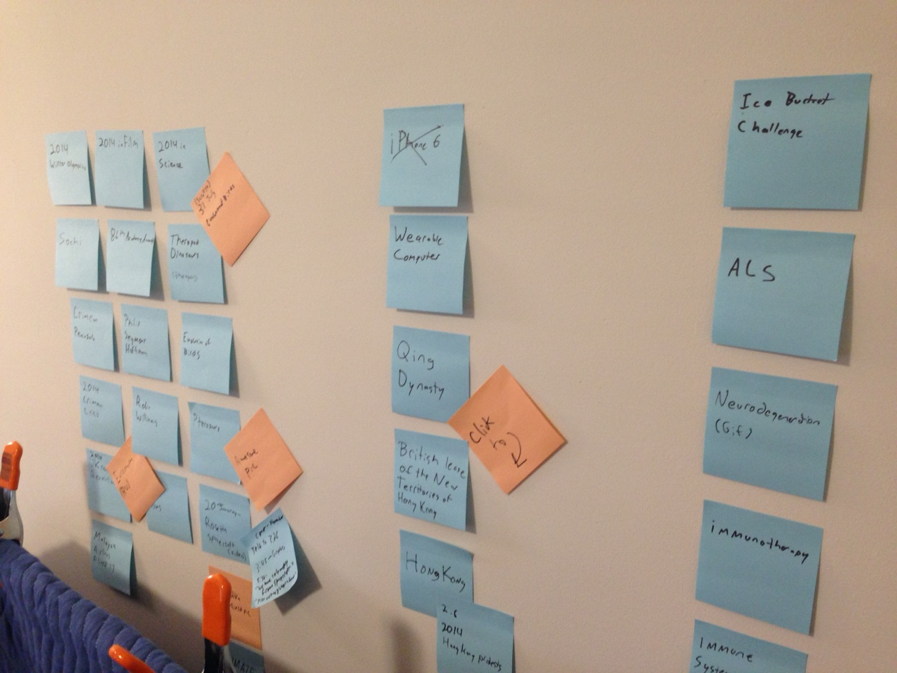

# LLMs for test ideas & cases

*How to turn a spec or user story into a raw list of test ideas with an LLM: equivalence classes, boundaries, negative cases, and why selecting and verifying that list is still the tester's job.*

> A blank test-case document at the start of a sprint is one of the most expensive kinds of quiet:
> the spec is finished, the deadline is set, and the only thing standing between here and a real
> suite is a long list of scenarios nobody has thought through yet. An LLM can fill that blank page
> in under a minute. The real work starts the moment it does.

> **In real life**
>
> A popcorn machine dumps out a full kettle at once: some kernels pop into something worth eating,
> plenty stay hard and unpopped, and a few scorch black at the bottom. Nobody eats straight from the
> kettle - a hand still sorts the popped from the duds before anything reaches a bowl. An LLM handed
> a spec works the same way. It pours out a long list of test-idea kernels in seconds. Most read
> fine, a few are genuinely sharp, and a few are duds or worse. The tester's hand is still the one
> that decides what actually reaches the bowl.

**LLM-assisted test ideation**: LLM-assisted test ideation is the practice of giving a large language model a spec, user story, or acceptance criteria and asking it to propose candidate test scenarios - equivalence classes, boundary values, and negative or adversarial cases - which a tester then reviews, prioritizes, and verifies before any of them become real test cases.

## Feed it something real, not a title

"Write test cases for the login page" produces exactly what that sentence deserves: generic,
happy-path filler that could describe any login page that ever existed. A model has nothing to
disagree with, nothing to push against, nothing specific to fail on. The candidate ideas it
returns are only as good as the spec it was actually given.

Paste the real thing instead: the acceptance criteria, the user story, the validation rules a
developer already wrote down. "Email is required and must contain an `@`. Password is required,
minimum 8 characters. On success, redirect to `/dashboard`." Now there is something concrete for a
model to reason about, and its list of candidate ideas will trace back to actual stated behavior
instead of a generic template of what logins tend to look like.

## What a useful raw list actually contains

A spec fed in properly tends to come back with three recognizable families: equivalence
classes (a valid email, an email with no `@`, an empty email), boundary values (a password of
exactly 8 characters versus 7), and negative or adversarial cases (submitting the form twice
quickly, pasting a password with leading whitespace). None of these are exotic - they are the
same categories a tester would eventually write by hand. The list just arrives faster, and it
arrives before the tester has spent the first twenty minutes just staring at the spec.

## The filter comes after, not instead

This is the part that is easy to skip when the list looks polished: every suggestion is still a
draft. Some ideas will duplicate each other in different words, some will describe a scenario the
spec never actually promises, and some will miss the one edge case that matters most to this
particular feature. Selecting which ideas become real test cases, ranking them by risk, and
checking each one against the actual requirement it claims to test is work only the tester does.
An LLM can expand the candidate list; it cannot decide what this product can afford to ship broken.

> **Tip**
>
> Ask for the raw list in named categories - "equivalence classes," "boundary values," "negative
> cases" - instead of one flat list. A model asked by name for boundaries is far more likely to
> actually produce one than a model asked to "think of edge cases" in the abstract.

> **Common mistake**
>
> Treating a long list as proof of good coverage. Ten suggested test ideas that are all variations
> of the same happy path cover exactly one thing ten times. Length is not coverage; count how many
> distinct requirements the list actually touches, not how many lines it has.


*Stickies to brainstorm - victorgrigas, Wikimedia Commons, CC BY-SA 3.0. [Source](https://commons.wikimedia.org/wiki/File:Stickies_to_brainstorm_Edit.2014..jpg)*
- **A wall of raw candidates** — One column of unsorted notes, roughly equal in size and confidence - exactly how an LLM's list of test ideas looks before anyone has judged a single one of them.
- **One idea, crossed out** — Someone looked at this candidate and rejected it outright - the same triage a tester applies to a suggestion that does not map to any real requirement.
- **A flagged follow-up** — Not thrown away, but marked for a specific next action - this is what a promising raw idea looks like once a tester decides it is worth developing further.
- **Another raw cluster, still unsorted** — A second, completely separate batch of candidates sits in its own group - reviewing one cluster never means the next one is automatically covered too.

**From spec to a triaged test-idea list**

1. **Give it the real spec** — Paste the actual acceptance criteria or user story, not a one-line description of the feature.
2. **Ask by name for classes, boundaries, and negative cases** — Naming the categories you want gets a far more useful spread than a vague request for 'edge cases.'
3. **Treat the output as a raw brainstorm** — The list is uneven on purpose - some ideas will be sharp, some redundant, some simply wrong for this spec.
4. **Select, prioritize, and verify by hand** — Only ideas that trace back to a real, stated requirement graduate into the actual test suite.

*A spec-to-ideas generator, then a tester's triage (Python)*

```python
# A simple field spec an LLM could be handed: age, integer, required, valid range 18-100.
SPEC = {"field": "age", "min": 18, "max": 100}

def generate_ideas(spec):
    lo, hi = spec["min"], spec["max"]
    return [
        ("valid-min", str(lo), "boundary: smallest accepted value"),
        ("valid-typical", str((lo + hi) // 2), "a normal, unremarkable value in range"),
        ("valid-max", str(hi), "boundary: largest accepted value"),
        ("invalid-below-min", str(lo - 1), "just outside the low boundary"),
        ("invalid-above-max", str(hi + 1), "just outside the high boundary"),
        ("invalid-non-numeric", "abc", "wrong type entirely"),
        ("invalid-empty", "", "required field left blank"),
        ("invalid-negative", "-5", "negative number, a different failure family than below-min"),
    ]

def main():
    ideas = generate_ideas(SPEC)
    print("Raw candidate ideas for '" + SPEC["field"] + "' (" + str(len(ideas)) + " total):")
    for name, value, note in ideas:
        print("  [" + name + "] value=" + repr(value) + " - " + note)

    keep = {"valid-min", "valid-max", "invalid-below-min", "invalid-above-max",
            "invalid-non-numeric", "invalid-empty"}
    kept = [i for i in ideas if i[0] in keep]
    dropped = [i for i in ideas if i[0] not in keep]

    print()
    print("Curated by a tester: kept " + str(len(kept)) + ", dropped " + str(len(dropped)) + " as redundant")
    for name, value, note in dropped:
        print("  dropped [" + name + "] - overlaps an already-covered class")

main()

# Raw candidate ideas for 'age' (8 total):
#   [valid-min] value='18' - boundary: smallest accepted value
#   [valid-typical] value='59' - a normal, unremarkable value in range
#   [valid-max] value='100' - boundary: largest accepted value
#   [invalid-below-min] value='17' - just outside the low boundary
#   [invalid-above-max] value='101' - just outside the high boundary
#   [invalid-non-numeric] value='abc' - wrong type entirely
#   [invalid-empty] value='' - required field left blank
#   [invalid-negative] value='-5' - negative number, a different failure family than below-min
#
# Curated by a tester: kept 6, dropped 2 as redundant
#   dropped [valid-typical] - overlaps an already-covered class
#   dropped [invalid-negative] - overlaps an already-covered class
```

*A spec-to-ideas generator, then a tester's triage (Java)*

```java
import java.util.*;

public class Main {
    static int lo = 18, hi = 100;

    static String[][] generateIdeas() {
        return new String[][] {
            {"valid-min", String.valueOf(lo), "boundary: smallest accepted value"},
            {"valid-typical", String.valueOf((lo + hi) / 2), "a normal, unremarkable value in range"},
            {"valid-max", String.valueOf(hi), "boundary: largest accepted value"},
            {"invalid-below-min", String.valueOf(lo - 1), "just outside the low boundary"},
            {"invalid-above-max", String.valueOf(hi + 1), "just outside the high boundary"},
            {"invalid-non-numeric", "abc", "wrong type entirely"},
            {"invalid-empty", "", "required field left blank"},
            {"invalid-negative", "-5", "negative number, a different failure family than below-min"},
        };
    }

    static String repr(String s) {
        return "'" + s + "'";
    }

    public static void main(String[] args) {
        String[][] ideas = generateIdeas();
        System.out.println("Raw candidate ideas for 'age' (" + ideas.length + " total):");
        for (String[] idea : ideas) {
            System.out.println("  [" + idea[0] + "] value=" + repr(idea[1]) + " - " + idea[2]);
        }

        Set<String> keep = new HashSet<>(Arrays.asList(
            "valid-min", "valid-max", "invalid-below-min", "invalid-above-max",
            "invalid-non-numeric", "invalid-empty"
        ));
        List<String[]> kept = new ArrayList<>();
        List<String[]> dropped = new ArrayList<>();
        for (String[] idea : ideas) {
            if (keep.contains(idea[0])) kept.add(idea); else dropped.add(idea);
        }

        System.out.println();
        System.out.println("Curated by a tester: kept " + kept.size() + ", dropped " + dropped.size() + " as redundant");
        for (String[] idea : dropped) {
            System.out.println("  dropped [" + idea[0] + "] - overlaps an already-covered class");
        }
    }
}

// Raw candidate ideas for 'age' (8 total):
//   [valid-min] value='18' - boundary: smallest accepted value
//   [valid-typical] value='59' - a normal, unremarkable value in range
//   [valid-max] value='100' - boundary: largest accepted value
//   [invalid-below-min] value='17' - just outside the low boundary
//   [invalid-above-max] value='101' - just outside the high boundary
//   [invalid-non-numeric] value='abc' - wrong type entirely
//   [invalid-empty] value='' - required field left blank
//   [invalid-negative] value='-5' - negative number, a different failure family than below-min
//
// Curated by a tester: kept 6, dropped 2 as redundant
//   dropped [valid-typical] - overlaps an already-covered class
//   dropped [invalid-negative] - overlaps an already-covered class
```

### Your first time: Turn one spec into a triaged test-idea list

- [ ] Pick one field or flow from a real spec — Something with an actual written rule attached - a validation range, a required field, a documented redirect.
- [ ] Ask by name for classes, boundaries, and a negative case — Naming the categories explicitly gets a far more useful spread than a vague 'give me test cases' request.
- [ ] List every suggestion without judging yet — Resist filtering while reading; a full raw list is easier to triage than one edited on the fly.
- [ ] Cross out anything that doesn't map to a stated requirement — If nothing in the spec supports an idea, it isn't a test case yet - it's a question for whoever owns the spec.
- [ ] Turn only the survivors into real test cases — Give each one a clear expected result before it goes anywhere near a test suite.

- **The list is long but every idea is a version of the happy path.**
  Ask explicitly, by name, for boundary values and negative or invalid cases - a bare 'give me test cases' request tends to default to the obvious path.
- **Two suggested cases are really the same case in different words.**
  Point at the exact requirement each one claims to test; if two ideas point at the same requirement, keep the clearer one and drop the other.
- **An idea sounds specific but nothing in the spec actually supports it.**
  Treat it as a hypothesis, not a finding - check it against the real requirement before it becomes a test case, or raise it as a question about a possible spec gap.

### Where to check

- The actual acceptance criteria or user story, read side by side with every suggested idea.
- The existing test suite, to check whether a suggested idea already has coverage under a different name.
- [[ai-and-the-modern-tester/ai-as-your-testing-copilot/reviewing-ai-output-critically]] for the habit of verifying a suggestion before it becomes a test case.
- [[ai-and-the-modern-tester/ai-as-your-testing-copilot/prompting-for-qa-work]] for how to phrase the request that produced the list in the first place.

### Worked example: turning a checkout discount-code field into a short suite

1. Spec: "Discount code is optional. If present, it must be 4-10 alphanumeric characters and match
   an active code. Expired or unknown codes show 'Code not valid' without blocking checkout."
2. Asked by name for classes, boundaries, and negative cases, the raw list includes: valid active
   code, code at 4 characters, code at 10 characters, code at 3 characters, code at 11 characters,
   expired code, unknown code, code with a space in it, submitting with no code at all.
3. The tester checks each against the spec: the space-in-code idea isn't addressed anywhere in the
   written rule, so it becomes a question for the developer rather than an assumed test case.
4. The remaining eight ideas each map to a stated rule and become the actual suite, prioritized by
   which failure would most confuse a paying customer - an unknown code silently blocking checkout
   outranks a boundary-length quibble.

**Quiz.** An LLM returns 12 candidate test ideas for a signup form spec. What is the tester's next step?

- [ ] Convert all 12 directly into the test suite, since more coverage is always better
- [ ] Discard the list, since AI-generated ideas cannot be trusted
- [x] Check each idea against the actual spec, merge or drop duplicates, and prioritize what maps to real requirements
- [ ] Ask a second LLM to double the list to 24 ideas for extra safety

*The list is a draft, not a plan. Some ideas will duplicate each other, some may not map to anything the spec actually states, and volume alone says nothing about coverage. The tester's job - checking, merging, prioritizing - is exactly the step that turns a raw brainstorm into a real suite. Discarding the list wastes a legitimately useful starting point, and doubling it just doubles the triage work without doubling actual coverage.*

- **What makes a spec-fed prompt better than a vague one** — A model reasoning over real acceptance criteria produces ideas that trace back to stated behavior; a vague prompt produces generic, happy-path filler with nothing specific to disagree with.
- **The three families a good raw list contains** — Equivalence classes, boundary values, and negative or adversarial cases - the same categories a tester would eventually write by hand, just arriving faster.
- **Why a long list isn't proof of coverage** — Ten ideas that are all variations of one happy path cover exactly one thing ten times; count distinct requirements touched, not lines generated.
- **What the tester still owns** — Selecting, prioritizing, and verifying which raw ideas map to real, stated requirements - the part no model does for you.

### Challenge

Take one real spec or acceptance criterion from your own project, ask an LLM by name for equivalence classes, boundary values, and negative cases, and triage the raw list: cross out anything that doesn't map to a stated requirement, merge duplicates, and write expected results for the survivors.

### Ask the community

> An LLM suggested `[idea]` for `[spec/feature]`, but I can't tell if it maps to a real requirement or is just a plausible-sounding guess. How would you check before adding it to the suite?

The most useful answers point at a specific way to verify against the spec or existing behavior, not just a gut feeling about whether the idea sounds right.

- [Tricentis — Generating test cases with AI: a detailed guide](https://www.tricentis.com/learn/ai-test-case-generation)
- [Testomat.io — ChatGPT for testing: prompts for test case generation](https://testomat.io/blog/chatgpt-for-test-case-generation/)
- [Software Testing Mentor — Create a Test Plan Using ChatGPT](https://www.youtube.com/watch?v=GZpApYFZJnk)

🎬 [Create a Test Plan Using ChatGPT | AI-Powered QA Strategy Tutorial](https://www.youtube.com/watch?v=GZpApYFZJnk) (13 min)

- Feed the real spec or acceptance criteria, not a one-line description - the ideas that come back are only as good as what went in.
- A useful raw list contains equivalence classes, boundary values, and negative cases - ask for them by name.
- The list is a draft: some ideas duplicate, some don't map to any real requirement, and length alone is not coverage.
- Selecting, prioritizing, and verifying which ideas become real test cases stays entirely the tester's job.


## Related notes

- [[Notes/ai-and-the-modern-tester/ai-as-your-testing-copilot/prompting-for-qa-work|Prompting for QA work]]
- [[Notes/ai-and-the-modern-tester/ai-as-your-testing-copilot/generating-test-data-with-ai|Generating test data with AI]]
- [[Notes/ai-and-the-modern-tester/ai-as-your-testing-copilot/reviewing-ai-output-critically|Reviewing AI output critically]]


---
_Source: `packages/curriculum/content/notes/ai-and-the-modern-tester/ai-as-your-testing-copilot/llms-for-test-ideas-and-cases.mdx`_
