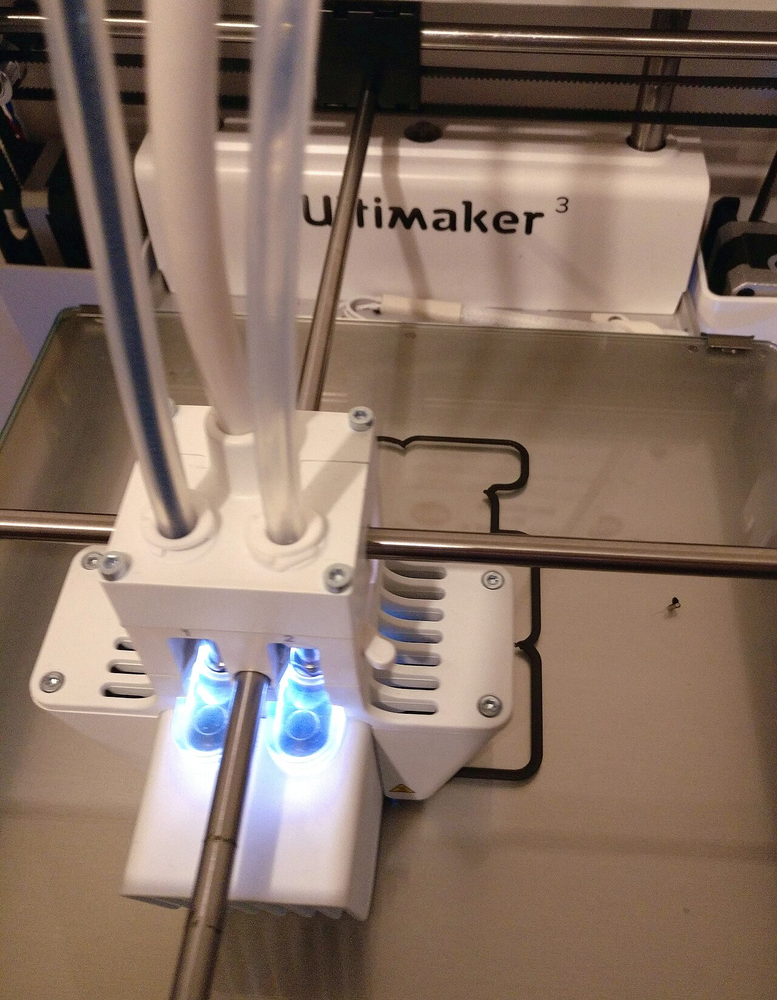

# AI test-generation tools

*Diffblue Cover writes a compilable JUnit test per method in about a second, autonomously - and by design locks in whatever the code currently does as correct, bug included. Speed of generation was never the same claim as correctness of assertion.*

> Point Diffblue Cover at a Java class and it autonomously analyzes every code path and writes a
> compilable, runnable JUnit test for every method - no prompting, no review loop, done in roughly a
> second per method. That speed is real and genuinely useful. It is also solving a narrower problem
> than it sounds like: the tests it writes assert that the code does exactly what it *currently* does -
> which means a bug sitting in that code right now gets faithfully written into the test suite as the
> expected, correct behavior.

> **In real life**
>
> A 3D printer is extraordinarily faithful to its input file - feed it a blueprint and it will
> reproduce every dimension precisely, layer by layer, at a speed no hand tool matches. Feed it a
> blueprint with a structural flaw - a wall too thin to bear the load it will actually carry - and the
> printer does not know or care. It prints the flaw exactly as specified, just as fast and precisely as
> it prints everything else, and the result looks complete the moment it comes off the bed. AI test
> generation has the same relationship to its input: a tool that turns code or a prompt into test
> cases at genuine speed, with zero judgment about whether what it just faithfully reproduced was
> actually correct to begin with.

**AI test-generation tools**: AI test-generation tools use static analysis, symbolic execution, or a large language model to automatically produce test code from a target - existing source code (Diffblue Cover), a natural-language prompt or spec (Copilot, ChatGPT/Claude-driven generation) - at a speed no hand-written process matches, with correctness of the resulting assertions still requiring human review against actual requirements.

## Two different jobs wearing the same label

**Code-driven generation** (Diffblue Cover is the clearest example) analyzes a method's actual code
paths and writes a *characterization test* - one that locks in exactly what the method currently
returns for a given input, as a regression baseline. Diffblue's own published benchmarks claim a 26x
productivity advantage over Copilot-assisted test writing for this specific job, and the tests it
produces are guaranteed to compile and run, since they are generated directly from real execution
paths rather than guessed at. **Prompt-driven generation** (GitHub Copilot suggesting a test inline,
or an LLM asked to write test cases from a user story) works from intent instead of implementation -
useful for scaffolding test structure fast, but Copilot's own demos show it typically proposes a
single test per prompt using a narrow default toolset (JUnit and Mockito for Java), leaving edge-case
coverage entirely dependent on how thoroughly a human keeps asking for more.

## Why "it compiles and passes" is not the same claim as "it's correct"

A characterization test generated from buggy code passes *because* it accurately describes the bug -
that is the tool doing its job correctly, and it is also exactly why the test is wrong to trust as a
correctness check without review. The same trap catches prompt-driven generation from a different
angle: an LLM asked to write assertions for a function it has only read, not executed, can produce a
plausible-looking expected value that was never actually verified against real behavior - a confident
guess formatted exactly like a fact. Both failure modes produce a test that looks indistinguishable
from a hand-written, carefully considered one until a human actually checks what it is asserting
against what the requirement actually says.

> **Tip**
>
> Read every AI-generated assertion against the actual requirement or spec, not against the code it was
> generated from. A characterization test's whole point is to match the code - checking it against the
> code again only confirms the tool did its job, not that the underlying behavior was ever right.

> **Common mistake**
>
> Treating "compiles and passes on first run" as evidence of quality. A generated test that runs clean
> proves the tool executed correctly - it says nothing about whether the assertion it wrote actually
> reflects what the software is supposed to do.


*3D printing in progress — MakerTobey, CC BY-SA 4.0, via Wikimedia Commons. [Source](https://commons.wikimedia.org/wiki/File:3D_printing_in_progress.jpg)*
- **One nozzle - the generator** — Turns a blueprint into physical output at speed, faithfully. An AI test-generation tool does the same with a code path or a prompt - turn it into runnable test code, fast, one after another.
- **A second nozzle, same head** — More output per pass does not mean better-designed output - two nozzles print twice as fast, not twice as accurately. More generated tests is not automatically better coverage.
- **The empty print bed** — Nothing here has been verified as sound yet - only laid down precisely. A freshly generated test is exactly this: code that exists and runs, not yet proven to check the right thing until a human reviews it.
- **The Ultimaker nameplate** — The machine is precise and repeatable - it will faithfully reproduce exactly what the file specifies, flaw included. AI test generation is just as faithful to a bad or vague input.

**Where each generation approach can go wrong**

1. **Code-driven: analyze real execution paths** — Diffblue Cover-style tools generate a test that locks in exactly what the code currently returns - guaranteed to compile and run.
2. **The test passes because it matches the code exactly** — If the code has a bug, the test faithfully encodes that bug as the expected, correct value.
3. **Prompt-driven: generate from intent, not execution** — An LLM proposes assertions based on what it infers should happen - plausible, but never actually run against real behavior first.
4. **Both need a human check against the actual requirement** — Not against the code (circular for characterization tests) and not against the tool's own confidence (unverified for prompt-driven ones).

*Auditing generated tests against the real requirement (Python)*

```python
# A buggy function: should reject negative amounts, currently does not.
def apply_discount(price, percent):
    return price - (price * percent / 100)

# A characterization test an AI tool might generate FROM this exact code.
def generated_test_matches_current_code():
    result = apply_discount(100, -20)  # negative percent - should be invalid
    assert result == 120.0  # code currently INCREASES price - the bug, encoded as "expected"
    return True

# The actual requirement, as written in the spec (never consulted by a characterization tool).
requirement = "apply_discount must reject any percent value outside 0-100 and raise ValueError."

def audit_against_requirement():
    try:
        apply_discount(100, -20)
        return "FAIL: no error raised for percent=-20, but requirement demands ValueError"
    except ValueError:
        return "PASS: correctly rejected an out-of-range percent"

print("Generated test result: " + str(generated_test_matches_current_code()) +
      " (passes - but only because it matches the existing bug)")
print("Requirement: " + requirement)
print("Audit against the actual requirement: " + audit_against_requirement())
```

*Auditing generated tests against the real requirement (Java)*

```java
public class Main {
    // A buggy method: should reject negative percent, currently does not.
    static double applyDiscount(double price, double percent) {
        return price - (price * percent / 100);
    }

    // A characterization test an AI tool might generate FROM this exact code.
    static boolean generatedTestMatchesCurrentCode() {
        double result = applyDiscount(100, -20); // negative percent - should be invalid
        return result == 120.0; // code currently INCREASES price - the bug, encoded as "expected"
    }

    static String auditAgainstRequirement() {
        double percent = -20;
        if (percent < 0 || percent > 100) {
            return "FAIL: no exception thrown for percent=-20, but requirement demands rejection";
        }
        return "PASS: correctly rejected an out-of-range percent";
    }

    public static void main(String[] args) {
        String requirement = "applyDiscount must reject any percent value outside 0-100.";

        System.out.println("Generated test result: " + generatedTestMatchesCurrentCode() +
                " (passes - but only because it matches the existing bug)");
        System.out.println("Requirement: " + requirement);
        System.out.println("Audit against the actual requirement: " + auditAgainstRequirement());
    }
}
```

### Your first time: Generate and audit a first AI-written test

- [ ] Pick one real method with a known edge case (negative input, empty string, boundary value) — Something small enough to reason about fully by hand.
- [ ] Generate a test for it with an AI tool - Copilot suggestion, or a prompt-driven LLM ask — Note whether it was generated from the code itself or from a description of intent.
- [ ] Read the generated assertion and ask: does this match the actual requirement, or just the current code? — If you cannot answer that from the spec alone, go find the spec before trusting the test.
- [ ] Deliberately test the known edge case by hand — Confirm whether the generated test would have caught a real bug there, or would have passed regardless.

- **A generated test suite has 100% pass rate on code everyone knows has an open bug ticket against it.**
  Classic characterization-test trap - the tests were generated from the buggy code and match it exactly. Regenerate after the fix, or better, write the specific edge-case test by hand before the fix so it actually fails first.
- **An LLM-generated test's expected value looks suspicious but nobody can immediately explain why it's wrong.**
  Trace the actual expected value from the requirement or spec, not from the code or the AI's explanation - an LLM asked to justify its own guess will often produce a fluent, confident, and equally unverified justification.
- **Generated tests are green but the exact bug a manual tester found yesterday goes uncaught by the whole suite.**
  Check whether that specific input combination was ever exercised by a generated test at all - happy-path bias in prompt-driven generation commonly skips exactly this kind of edge case unless explicitly asked for.

### Where to check

- Any AI-generated test asserting on a method with a known or suspected bug - confirm it was not generated from the buggy version and silently encoded the bug as expected behavior.
- Edge cases and boundary values specifically, since happy-path bias in prompt-driven generation tends to skip exactly these without explicit prompting.
- [[ai-and-the-modern-tester/ai-powered-test-automation/self-healing-tests]] for a related pattern - both trade a manual maintenance burden for a new review burden that has to actually happen.
- [[ai-and-the-modern-tester/ai-powered-test-automation/when-ai-automation-lies]] for the broader category of confident-but-unverified output this note's LLM-generated-assertion risk belongs to.
- [[ai-and-the-modern-tester/testing-ai-systems/evaluating-llm-outputs]] for how to systematically evaluate an LLM's output quality, applicable directly to judging generated test assertions.

### Worked example: a 26x faster test suite that still shipped the same bug

1. A team adopts Diffblue Cover to generate a full JUnit suite for a legacy payment module with no
   existing tests, citing the vendor's published 26x productivity claim over manual writing.
2. The generated suite achieves high method coverage almost immediately and is merged as the module's
   new regression baseline.
3. A `calculateLateFee` method contains a rounding bug - it truncates instead of rounding cents,
   under-charging by up to a cent per transaction. The generated characterization test asserts the
   truncated (wrong) value as correct, because that is exactly what the method currently returns.
4. Three months later, a manual audit comparing the module against its actual billing spec catches
   the rounding discrepancy - the automated suite never flagged it, because passing was never in
   question; the test was written to match the bug precisely.
5. Fix: correct the rounding, then regenerate (or hand-write) the specific test for that method,
   verified against the billing spec's exact rounding rule rather than against whatever the code
   happened to do at generation time.

**Quiz.** Diffblue Cover generates a compilable, passing JUnit test for a method that contains a known bug. Why does the test pass?

- [ ] Diffblue Cover detected the bug and wrote a test that specifically ignores it
- [x] The test is a characterization test - it asserts on exactly what the code currently returns, so it passes precisely because it accurately encodes the existing bug as 'expected'
- [ ] The test is flaky and will fail intermittently until the bug is fixed
- [ ] Diffblue Cover only generates tests for bug-free code

*A characterization test's entire purpose is to lock in current behavior as a regression baseline - it is generated directly from what the code does right now, bug included. That is the tool working exactly as designed; the mistake is treating a pass on this kind of test as proof the underlying behavior is correct, rather than proof it simply has not changed.*

- **AI test-generation tools** — Tools that use static analysis, symbolic execution, or an LLM to automatically produce test code - from existing source (Diffblue Cover) or a prompt/spec (Copilot, LLM-driven) - at a speed no manual process matches.
- **A characterization test** — A test generated to lock in exactly what code currently returns as a regression baseline - it passes because it matches the code precisely, bug included if one is present.
- **Diffblue Cover's vendor-claimed speed advantage** — 26x productivity advantage over Copilot-assisted test writing, per Diffblue's own published benchmarks - a vendor claim, cited as such, not an independently verified figure.
- **Why generated-test correctness must be checked against the spec, not the code** — A characterization test is generated from the code itself - checking it against that same code only confirms the tool worked, never whether the underlying behavior was ever actually right.

### Challenge

Generate an AI test for one real method with a known or suspected edge-case bug (negative input, empty collection, boundary value). Check whether the generated assertion matches the actual requirement or just whatever the code currently does. Report which.

- [Diffblue — Copilot vs. Diffblue Cover: the AI unit test showdown](https://www.diffblue.com/resources/copilot-vs-diffblue-cover-ai-unit-test-showdown/)
- [GitHub Copilot Documentation](https://docs.github.com/en/copilot)
- [Diffblue — Maximize Unit Testing Efficiency with Diffblue Cover's AI](https://www.youtube.com/watch?v=fXpfXYigCMU)

🎬 [Diffblue — Maximize Unit Testing Efficiency with Diffblue Cover's AI](https://www.youtube.com/watch?v=fXpfXYigCMU) (6 min)

- Code-driven tools like Diffblue Cover generate characterization tests that lock in exactly what code currently returns - guaranteed to compile and run, not guaranteed to be correct.
- Prompt-driven generation (Copilot, LLM-written tests) works from inferred intent, not execution - assertions can be plausible-sounding guesses never actually verified against real behavior.
- A characterization test generated from buggy code passes precisely because it accurately encodes the bug - that is the tool succeeding at its actual job, not a false positive to dismiss.
- Always audit a generated assertion against the real requirement or spec, never against the code it was generated from, which only confirms the tool executed correctly.
- Speed of generation (Diffblue's vendor-claimed 26x, or Copilot's fast inline suggestions) answers a different question than correctness of assertion - both still require human review before either claim is trusted.


## Related notes

- [[Notes/ai-and-the-modern-tester/ai-powered-test-automation/self-healing-tests|Self-healing tests]]
- [[Notes/ai-and-the-modern-tester/ai-powered-test-automation/when-ai-automation-lies|When AI automation lies]]
- [[Notes/ai-and-the-modern-tester/testing-ai-systems/evaluating-llm-outputs|Evaluating LLM outputs (DeepEval / RAGAS ideas)]]


---
_Source: `packages/curriculum/content/notes/ai-and-the-modern-tester/ai-powered-test-automation/ai-test-generation-tools.mdx`_
