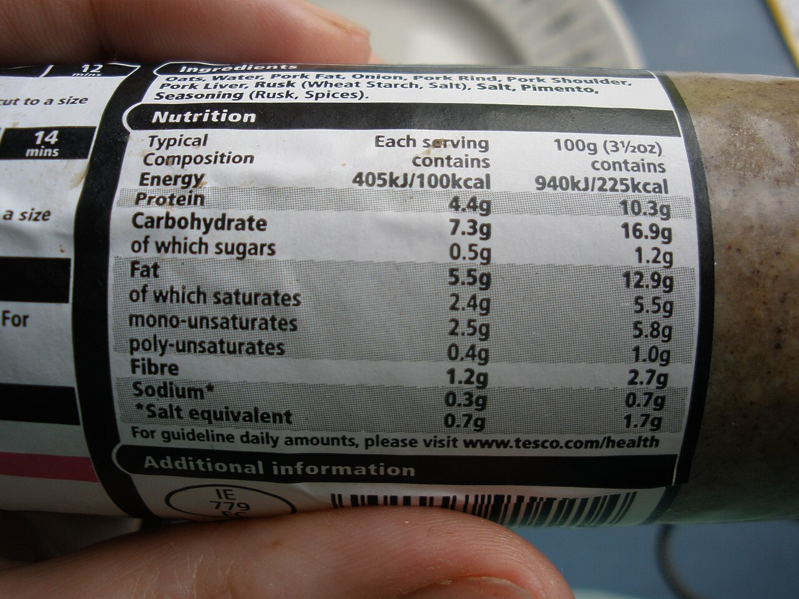

# AI on your resume, honestly

*'AI-powered testing expert' proves nothing and survives zero follow-up questions. 'Used Healenium to cut locator maintenance on a 200-test suite; personally verified 15 auto-healed substitutions before enabling it in CI, catching one that would have masked a real regression' proves everything.*

> "AI-powered testing expert" appears on thousands of resumes right now and proves nothing to an
> experienced interviewer - it survives exactly zero follow-up questions. The candidates who actually
> stand out are not the ones listing the most tool names; they are the ones who can spend five minutes
> explaining precisely what they did, what they changed, and what they personally verified before it
> shipped. That five-minute test is the entire bar this note is about clearing.

> **In real life**
>
> A nutrition label never says "healthy food" - it says 4.4g protein per serving, oats and pork shoulder
> and pork liver named individually, a barcode anyone can scan to check the claim independently. The
> specificity is exactly what makes it trustworthy: a vague health claim could mean anything and proves
> nothing, while a precise, checkable list stands behind itself. An honest AI resume line works the same
> way - not "AI-powered testing expert," but the exact tool, the exact task, and the exact judgment you
> personally applied, specific enough that anyone could check it and find it holds up.

**Representing AI use honestly**: Representing AI use honestly on a resume means naming the specific tool, the specific task it was applied to, and the specific verification or judgment contribution made personally - rather than either vague AI-buzzword overclaiming or, at the other extreme, downplaying genuine AI fluency that has real, demonstrable value.

## Two failure modes, both costly

**Overclaiming** turns "I used a tool that generated some test code" into "AI-powered testing expert"
- language that falls apart the moment an interviewer asks a specific follow-up, and reads as a
credibility red flag precisely because so many resumes now contain the identical vague phrase with
nothing behind it. **Underclaiming** goes the other way - hiding real, substantial AI fluency out of
worry it looks like "I just prompted a chatbot," when the judgment-and-verification skill built
alongside real tool use is exactly the premium skill combination the market is now paying more for.
Both failure modes have the same fix: replace the adjective with the specifics.

## The format that survives a follow-up question

A credible AI-work resume line has three parts: the specific tool, the specific task, and the specific
judgment or verification you personally provided - ideally with a measurable outcome attached. "Used
Diffblue Cover to generate a baseline JUnit suite for a legacy payment module; manually reviewed all
28 generated tests against the billing spec and corrected 3 that had encoded an existing rounding bug
as expected behavior" does more work than any adjective could, because every clause in it is something
a follow-up question can probe and a real answer can survive. This is not a writing trick - it is
literally the content the previous notes in this chapter argue actually commands a premium: tool
fluency plus demonstrated judgment, made visible and checkable.

> **Tip**
>
> Before writing any AI-related resume line, imagine the exact follow-up question an experienced
> interviewer would ask - "walk me through one specific case where the tool got something wrong and what
> you did about it." Write the resume line only once you have a real, specific answer to that question
> ready.

> **Common mistake**
>
> Assuming any mention of AI tool use looks less impressive than claiming pure manual expertise. The
> opposite is increasingly true - an interviewer who hears only "I wrote every test by hand" from a
> candidate in a market saturated with AI-assisted tooling may reasonably wonder why, and what judgment
> and verification skill that candidate has not yet had to develop.


*White pudding nutrition label — O'Dea, CC BY-SA 4.0, via Wikimedia Commons. [Source](https://commons.wikimedia.org/wiki/File:White_pudding_nutrition_label.JPG)*
- **The ingredients list - exact and specific** — Not 'meat product' - pork shoulder, pork liver, pork rind, named individually. A resume line about AI use needs the same specificity: the actual tool and the actual task, never 'AI-powered testing expert.'
- **The nutrition table - quantified, not vague** — 4.4g protein, not 'high in protein.' A credible AI-work resume line states a measurable outcome and a specific personal contribution, not an adjective.
- **The barcode - traceable, checkable** — Anyone can scan it and verify the claim independently. A resume claim about AI-assisted work should hold up the same way in an interview follow-up, not fall apart under one specific question.
- **A hand, visibly holding it - someone accountable** — A label means nothing without someone standing behind what's printed on it. The honest version of an AI-work claim names your own verification and judgment role explicitly, not just the tool's name.

**Turning a vague claim into a checkable one**

1. **Start with the vague version** — "AI-powered testing expert" or "proficient with AI testing tools" - true in some sense, but unfalsifiable and identical to thousands of other resumes.
2. **Name the specific tool and task** — Which exact tool, applied to which exact, real piece of work - not a category of tools or a generic task description.
3. **State your specific judgment or verification contribution** — What you personally checked, caught, corrected, or decided - the part a tool alone did not supply.
4. **Attach a measurable outcome where honestly possible** — A real number - tests reviewed, issues caught, time saved - not an inflated or invented one.

*Scoring a resume line for specificity (Python)*

```python
lines = [
    "AI-powered testing expert with deep automation skills",
    ("Used Diffblue Cover to generate a baseline JUnit suite for a legacy payment module; "
     "manually reviewed all 28 generated tests against the billing spec and corrected 3 that "
     "had encoded an existing rounding bug as expected behavior"),
]

def specificity_score(line):
    checks = {
        "names a specific tool": any(tool in line for tool in
            ["Diffblue", "Healenium", "RAGAS", "DeepEval", "Copilot", "Testim"]),
        "names a specific task": "module" in line or "suite" in line or "pipeline" in line,
        "states personal verification/judgment": "reviewed" in line or "corrected" in line or "caught" in line,
        "includes a measurable outcome": any(c.isdigit() for c in line),
    }
    return checks

for line in lines:
    print("Line: \\"" + line[:60] + ("..." if len(line) > 60 else "") + "\\"")
    checks = specificity_score(line)
    score = sum(checks.values())
    for check, passed in checks.items():
        print("  " + ("PASS" if passed else "MISS") + ": " + check)
    print("  Specificity score: " + str(score) + "/4")
    print("")
```

*Scoring a resume line for specificity (Java)*

```java
import java.util.*;

public class Main {
    public static void main(String[] args) {
        List<String> lines = Arrays.asList(
            "AI-powered testing expert with deep automation skills",
            "Used Diffblue Cover to generate a baseline JUnit suite for a legacy payment module; " +
            "manually reviewed all 28 generated tests against the billing spec and corrected 3 that " +
            "had encoded an existing rounding bug as expected behavior"
        );

        String[] knownTools = {"Diffblue", "Healenium", "RAGAS", "DeepEval", "Copilot", "Testim"};

        for (String line : lines) {
            String preview = line.length() > 60 ? line.substring(0, 60) + "..." : line;
            System.out.println("Line: \\"" + preview + "\\"");

            boolean namesTool = Arrays.stream(knownTools).anyMatch(line::contains);
            boolean namesTask = line.contains("module") || line.contains("suite") || line.contains("pipeline");
            boolean statesJudgment = line.contains("reviewed") || line.contains("corrected") || line.contains("caught");
            boolean hasNumber = line.chars().anyMatch(Character::isDigit);

            Map<String, Boolean> checks = new LinkedHashMap<>();
            checks.put("names a specific tool", namesTool);
            checks.put("names a specific task", namesTask);
            checks.put("states personal verification/judgment", statesJudgment);
            checks.put("includes a measurable outcome", hasNumber);

            int score = 0;
            for (Map.Entry<String, Boolean> entry : checks.entrySet()) {
                if (entry.getValue()) score++;
                System.out.println("  " + (entry.getValue() ? "PASS" : "MISS") + ": " + entry.getKey());
            }
            System.out.println("  Specificity score: " + score + "/4");
            System.out.println();
        }
    }
}
```

### Your first time: Rewrite one resume line honestly

- [ ] Find one vague AI-related line on your current resume or LinkedIn — Something like 'AI-powered' or 'proficient with AI tools' with no specifics attached.
- [ ] Recall the actual tool and the actual task it was used for — A real project, a real piece of work - not a hypothetical or aspirational one.
- [ ] Add the specific judgment or verification you personally provided — What you checked, caught, or decided that the tool alone did not do.
- [ ] Rehearse explaining it out loud in under five minutes — If you can't yet, the line isn't ready - go find the specifics first, or be honest that this is a skill you're still building.

- **A candidate's resume claims strong AI tool fluency but they cannot answer a specific follow-up question about it in an interview.**
  This is exactly the overclaiming failure mode - the fix has to happen before the interview, by only listing what can survive a real follow-up question, with the specific example ready in advance.
- **A candidate has genuinely strong AI-verification skills but their resume reads as entirely manual, traditional testing work.**
  This is the underclaiming failure mode - given the documented pay premium for AI and verification skills specifically, real fluency left off the resume is a real competitive disadvantage, not a modesty that gets rewarded.
- **An interviewer asks 'walk me through a time an AI tool got something wrong and what you did' and the candidate has no example ready.**
  This exact question is increasingly standard - prepare one specific, real example in advance, the same way any other behavioral interview question gets prepared for.

### Where to check

- Every AI-related line on a current resume or LinkedIn profile, checked against the specific-tool/specific-task/specific-judgment format this note describes.
- Whether a real, ready example exists for the "tell me about a time AI got something wrong" question before it comes up in an actual interview.
- [[ai-and-the-modern-tester/staying-employable-in-the-ai-era/the-testers-judgment-premium]] for why this exact format - tool fluency plus demonstrated judgment - is the content that actually commands a premium.
- [[ai-and-the-modern-tester/staying-employable-in-the-ai-era/learning-loop-for-new-tools]] for how a documented tool-evaluation habit becomes a ready source of specific, honest resume material over time.
- [[ai-and-the-modern-tester/ai-powered-test-automation/when-ai-automation-lies]] for the kind of concrete AI-failure story worth having ready, since catching a real hallucination is exactly the evidence an interviewer is listening for.

### Worked example: the same underlying work, two very different resume lines

1. A tester spent three weeks integrating an AI test-generation tool into a legacy module's test
   suite, catching several hallucinated assertions along the way and ultimately shipping a solid,
   human-verified baseline.
2. Draft one, written quickly: "Leveraged AI tools to accelerate test automation and improve QA
   efficiency" - technically not false, and completely indistinguishable from a resume line describing
   someone who ran the tool once and merged everything without looking.
3. An interviewer reading draft one has no way to tell real depth from a five-minute demo - and asks a
   pointed follow-up question that draft one gives no material to answer well.
4. Draft two, rewritten with the specific-tool/specific-task/specific-judgment format: "Used Diffblue
   Cover to generate a 45-test baseline suite for the billing module; caught and corrected 4 tests that
   had encoded existing bugs as expected behavior before merge, using the billing spec as ground truth."
5. Draft two survives the exact same follow-up question effortlessly, because the specifics it needed
   were already built into the line - the underlying work never changed, only how honestly and
   specifically it got represented.

**Quiz.** Why does this note say 'AI-powered testing expert' is a weaker resume claim than a specific line naming a tool, task, and personal verification contribution?

- [ ] Because mentioning AI tools at all is generally viewed negatively by employers
- [x] Because the vague version is unfalsifiable and identical to thousands of other resumes, while the specific version names exactly what can be checked and probed in an interview follow-up - and survives it
- [ ] Because 'expert' is against most resume style guides regardless of context
- [ ] Because specific tool names are always more impressive than general skill descriptions

*The core problem with the vague version is not that it mentions AI - it's that it proves nothing and cannot be distinguished from someone with far less real experience. A specific line naming the tool, the task, and the personal judgment applied gives an interviewer something concrete to ask about, and a candidate with real experience behind it can answer that question easily.*

- **Representing AI use honestly** — Naming the specific tool, the specific task, and the specific judgment or verification personally contributed - rather than vague overclaiming or, at the other extreme, hiding genuinely valuable AI fluency.
- **The two resume failure modes** — Overclaiming (vague buzzwords that collapse under a follow-up question) and underclaiming (hiding real AI-verification skill that the market is now paying a premium for).
- **The credible resume-line format** — Specific tool + specific task + specific personal judgment/verification, ideally with a measurable outcome - each part something a follow-up question can probe and a real answer can survive.
- **The five-minute test** — Before writing an AI-related resume line, confirm you could spend five minutes in an interview explaining exactly what you did, what you changed, and what you personally verified.

### Challenge

Find one vague AI-related line on your own resume or LinkedIn. Rewrite it using the specific-tool/specific-task/specific-judgment format from this note, using a real project. Practice explaining it out loud in under five minutes.

- [The Interview Guys — How to Add AI Skills to Your Resume Without Looking Fake](https://blog.theinterviewguys.com/how-to-add-ai-skills-to-your-resume-without-looking-fake/)
- [Wonsulting — How to Answer 'How Are You Using AI?' in Interviews](https://www.wonsulting.com/job-search-hub/how-to-answer-how-are-you-using-ai-in-interviews-like-a-pro)
- [Interviewer Asks About AI? (Example Answer)](https://www.youtube.com/watch?v=QyGfsKUVVZA)

🎬 [Interviewer Asks About AI? (Example Answer)](https://www.youtube.com/watch?v=QyGfsKUVVZA) (5 min)

- A vague AI resume claim like 'AI-powered testing expert' is unfalsifiable and identical to thousands of other resumes - it proves nothing and survives no follow-up question.
- The credible format names the specific tool, the specific task, and the specific personal judgment or verification contributed - ideally with a measurable outcome attached.
- Underclaiming real AI-verification skill out of insecurity is a real competitive disadvantage, not modesty, given the documented pay premium for exactly that skill combination.
- Before writing an AI-related resume line, confirm it passes the five-minute test: could you explain exactly what you did and what you verified, in detail, on the spot?
- Have one specific, real 'a time an AI tool got something wrong and what I did about it' example ready - it is an increasingly standard interview question with a very telling answer.


## Related notes

- [[Notes/ai-and-the-modern-tester/staying-employable-in-the-ai-era/the-testers-judgment-premium|The tester's judgment premium]]
- [[Notes/ai-and-the-modern-tester/staying-employable-in-the-ai-era/learning-loop-for-new-tools|Learning loop for new tools]]
- [[Notes/ai-and-the-modern-tester/ai-powered-test-automation/when-ai-automation-lies|When AI automation lies]]


---
_Source: `packages/curriculum/content/notes/ai-and-the-modern-tester/staying-employable-in-the-ai-era/ai-on-your-resume-honestly.mdx`_
