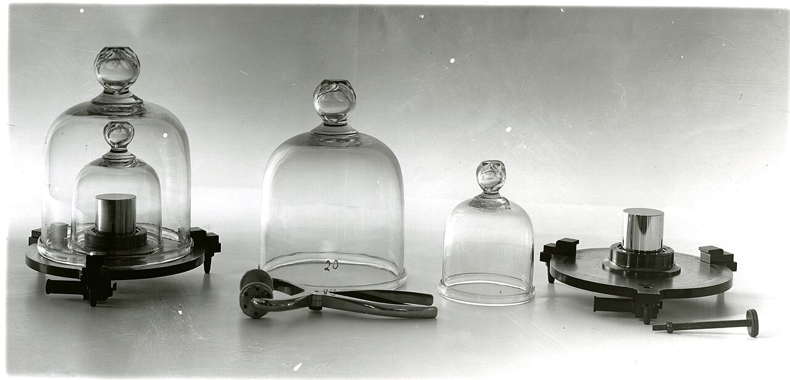

# Regression for prompts & models

*In 1937, NIST checked its primary kilogram against a duplicate and found one part in 50 million of drift over 50 years - the same discipline prompt regression testing borrows: a fixed golden dataset, re-checked on every change, catching drift no single run would show.*

> Nobody changed a line of application code, and quality still dropped - because the AI model provider
> quietly updated what "latest" points to behind an API alias, or a prompt template got a one-word
> "small" edit nobody thought needed a full re-evaluation. Neither event throws an error. Neither shows
> up in a code diff review. The only thing that catches either one is running the exact same fixed test
> set before and after, and comparing the scores.

> **In real life**
>
> For decades, the US measured every kilogram in the country against one specific object: Kilogram No.
> 20, a platinum-iridium cylinder kept under double bell jars, handled only with special tongs so a
> fingerprint's oil could never quietly shift its mass. In 1937, metrologists checked it against a
> second reference, Kilogram No. 4, and found it had drifted by just one part in 50 million over roughly
> fifty years - a change far too small for any single measurement to reveal, caught only because the
> exact same fixed standard was checked again, deliberately, against a stable baseline. A golden
> evaluation dataset for an AI system plays the identical role: one fixed, version-locked reference,
> re-checked on a schedule and on every change, built specifically to catch a drift too small for any
> one run to show.

**Regression testing for prompts and models**: Regression testing for prompts and models means re-running a fixed, version-controlled golden dataset of representative test cases against an AI system every time its prompt, model version, or configuration changes - and periodically even without any deliberate change - to catch a quality drop the change did not obviously cause.

## The golden dataset is the fixed reference

A golden dataset is a curated, versioned set of representative test cases - inputs plus either
expected outputs or explicit scoring criteria - built to cover the scenarios that actually matter for
the product, not just easy or common ones. A commonly cited practical starting point is 50 to 100
well-chosen examples for a single feature: enough to catch most real regressions without becoming too
slow or expensive to run on every change. The set gets version-controlled like code - a change to the
golden set itself is a tracked, reviewable event, never a silent edit to make a failing case
conveniently pass.

## The risk nobody's code diff will ever show

The most underappreciated regression risk in AI systems has nothing to do with anything a team
changed on purpose. Model providers routinely update what a floating alias (like a "latest" model
tag) actually points to behind the scenes - the exact same API call, with zero application code
changed, can silently start hitting a different underlying model snapshot with a different quality
profile. Pinning to an exact, dated model version in production closes that specific gap; upgrading
that pin deliberately, on a schedule, with the full golden set re-run before and after, turns an
invisible risk into a controlled, measured decision.

> **Tip**
>
> Track golden-dataset scores over time as a trend, not just a single before/after diff at release time.
> A metric drifting down by a small amount on several consecutive prompt tweaks can each individually
> look like noise, while the cumulative trend across all of them tells a completely different story.

> **Common mistake**
>
> Re-running the golden dataset only when a prompt or code change is deliberately made. A model
> provider's silent snapshot update behind a floating alias, or a shift in the provider's own
> infrastructure, can degrade quality with zero corresponding change on the team's side - a standing
> scheduled re-run (weekly, or before any planned model-version upgrade) is what actually catches this.


*Mass Standards — National Institute of Standards and Technology, public domain, via Wikimedia Commons. [Source](https://commons.wikimedia.org/wiki/File:MassStandards_005.jpg)*
- **Kilogram No. 20 - the golden reference** — The exact fixed standard every other US measurement was checked against. A golden eval dataset plays the same role: one fixed reference every new prompt or model version gets compared to.
- **Kilogram No. 4 - the secondary check** — A second reference used to cross-verify the primary, not replace it. Comparing a change against more than one baseline the same way catches drift a single reference might miss.
- **The handling tongs - never touched directly** — Even a fingerprint's oil could shift the mass over years - the reference is protected from anything that could quietly corrupt it. A golden dataset needs the same protection: version-locked, never silently edited to make a failing case pass.
- **Labeled '20' - exact identity tracked** — No ambiguity about which specific standard produced which reading. Every regression run needs the same traceability: exactly which prompt version and model snapshot produced this specific score.

**One regression check cycle**

1. **A prompt, model version, or config changes - or a schedule triggers** — Either a deliberate edit, or a standing weekly check that runs regardless of whether anyone changed anything.
2. **The fixed golden dataset runs against the new state** — The exact same 50-100 representative cases, scored the exact same way, every single time.
3. **Scores are compared against the last known-good baseline** — Per-metric deltas, not just an overall pass/fail - a small drop in one specific metric can matter more than the aggregate looking fine.
4. **A regression beyond threshold blocks the change or the upgrade** — Exactly like any other CI gate - the difference is what gets measured, not whether a gate exists at all.

*Comparing golden-dataset scores across two prompt versions (Python)*

```python
baseline_scores = {
    "faithfulness": 0.91,
    "answer_relevancy": 0.88,
    "tone_appropriateness": 0.85,
}

new_version_scores = {
    "faithfulness": 0.90,
    "answer_relevancy": 0.72,
    "tone_appropriateness": 0.86,
}

REGRESSION_THRESHOLD = 0.05  # a drop larger than this on any single metric blocks the change

print("Comparing golden-dataset scores: baseline -> new prompt version")
print("")

blocked = False
for metric in baseline_scores:
    old = baseline_scores[metric]
    new = new_version_scores[metric]
    delta = new - old
    if delta < -REGRESSION_THRESHOLD:
        blocked = True
        print("  " + metric + ": " + str(old) + " -> " + str(new) +
              " (REGRESSION of " + str(round(-delta, 2)) + ")")
    else:
        direction = "improved" if delta > 0 else "stable"
        print("  " + metric + ": " + str(old) + " -> " + str(new) + " (" + direction + ")")

print("")
if blocked:
    print("BLOCKED: at least one metric regressed beyond the " + str(REGRESSION_THRESHOLD) + " threshold")
else:
    print("CLEARED: no metric regressed beyond threshold - safe to ship")
```

*Comparing golden-dataset scores across two prompt versions (Java)*

```java
import java.util.*;

public class Main {
    public static void main(String[] args) {
        Map<String, Double> baselineScores = new LinkedHashMap<>();
        baselineScores.put("faithfulness", 0.91);
        baselineScores.put("answer_relevancy", 0.88);
        baselineScores.put("tone_appropriateness", 0.85);

        Map<String, Double> newVersionScores = new LinkedHashMap<>();
        newVersionScores.put("faithfulness", 0.90);
        newVersionScores.put("answer_relevancy", 0.72);
        newVersionScores.put("tone_appropriateness", 0.86);

        double regressionThreshold = 0.05; // a drop larger than this on any single metric blocks the change

        System.out.println("Comparing golden-dataset scores: baseline -> new prompt version");
        System.out.println();

        boolean blocked = false;
        for (String metric : baselineScores.keySet()) {
            double oldScore = baselineScores.get(metric);
            double newScore = newVersionScores.get(metric);
            double delta = newScore - oldScore;

            if (delta < -regressionThreshold) {
                blocked = true;
                System.out.println("  " + metric + ": " + oldScore + " -> " + newScore +
                        " (REGRESSION of " + Math.round(-delta * 100.0) / 100.0 + ")");
            } else {
                String direction = delta > 0 ? "improved" : "stable";
                System.out.println("  " + metric + ": " + oldScore + " -> " + newScore + " (" + direction + ")");
            }
        }

        System.out.println();
        if (blocked) {
            System.out.println("BLOCKED: at least one metric regressed beyond the " + regressionThreshold + " threshold");
        } else {
            System.out.println("CLEARED: no metric regressed beyond threshold - safe to ship");
        }
    }
}
```

### Your first time: Build a first golden dataset and baseline

- [ ] Collect 10-20 real, representative prompts for one AI feature — Cover typical cases and at least a few known-tricky edge cases, not just the easy happy path.
- [ ] Run them against the current production prompt/model and record the scores — This becomes the baseline every future change gets compared to.
- [ ] Make one small, deliberate prompt change and re-run the exact same set — Compare every metric's score against the baseline, not just whether it 'looks right' on a skim.
- [ ] Pin the exact model version used, not a floating 'latest' alias — Confirm the specific snapshot in use, so a future comparison is measuring an actual change, not a silent provider update.

- **Quality drops in production with no corresponding prompt, code, or config change on the team's side.**
  Check whether the model is pinned to an exact version or floating on an alias like 'latest' - a provider-side snapshot update is a common, invisible cause. Pin the version and re-run the golden set against both the old and new snapshot to confirm.
- **A small prompt wording tweak, individually reviewed as harmless, turns out to have regressed a metric.**
  Exactly why every prompt change - however small it looks - runs through the full golden set rather than being judged by eye. Wording changes can shift model behavior in ways that are not obvious from reading the diff.
- **Golden-dataset scores look stable release to release but users report a slow decline in quality over months.**
  Check the trend across the full history, not just the last release's before/after diff - a series of individually-small regressions can accumulate into a real decline that no single comparison ever flagged as a blocker.

### Where to check

- Whether the production model reference is pinned to an exact snapshot or floating on a provider alias - the single most common invisible regression source.
- The golden dataset's own version history, confirming it only changes through a reviewed process, never a quiet edit to make a failing case pass.
- [[ai-and-the-modern-tester/testing-ai-systems/evaluating-llm-outputs]] for the specific scoring metrics (faithfulness, relevancy, and others) a golden dataset run actually measures each time.
- [[ai-and-the-modern-tester/testing-ai-systems/why-ai-apps-break-differently]] for why a single before/after run is not enough confidence on its own, given non-determinism.
- [[ai-and-the-modern-tester/ai-powered-test-automation/self-healing-tests]] for a related discipline in a different context - keeping a fixed baseline and flagging deviations from it, rather than trusting a single observation.

### Worked example: a quality drop traced to a provider's silent model update

1. A support chatbot's answer-quality scores, tracked weekly against a 75-example golden dataset,
   show a sudden 12-point drop in faithfulness on a Tuesday - no prompt change, no deployment, no code
   change logged that week.
2. Investigation confirms the application was calling the provider's "latest" model alias rather than
   a pinned snapshot - the provider had rolled out a new underlying model version behind that alias
   two days earlier, entirely outside the team's control or visibility.
3. Re-running the golden dataset against the previous pinned snapshot confirms the drop is real and
   specific to the new model version, not a fluke - faithfulness returns to baseline when pointed back
   at the older snapshot.
4. The team pins the exact model snapshot version going forward, treating any future upgrade as a
   deliberate, golden-set-verified decision rather than something that happens to the product
   automatically and invisibly.
5. The new model version is eventually adopted on purpose, after prompt adjustments bring its
   faithfulness score on the golden set back above the established baseline threshold - upgraded on
   the team's own schedule, not the provider's.

**Quiz.** A team's AI feature quality drops with no application code, prompt, or deployment change logged that week. What does this note identify as a common, easy-to-miss cause?

- [ ] The golden dataset itself must be corrupted
- [x] The application is likely calling a floating model alias (like 'latest') rather than a pinned exact version, and the provider silently updated which model that alias points to
- [ ] This scenario is impossible - quality cannot change without a code change
- [ ] The evaluation framework has a bug and should be replaced

*This is the regression risk with no corresponding diff to review: a provider updating what a floating alias points to changes the system's actual behavior with zero code change on the team's side. Pinning to an exact, dated model snapshot and treating any upgrade as a deliberate, golden-set-verified decision is exactly how this note says to close that gap.*

- **A golden dataset** — A curated, version-controlled set of representative test cases (commonly 50-100 for one feature) used as a fixed reference, re-run against every prompt or model change to catch regressions.
- **Why model version pinning matters** — A floating alias like 'latest' can silently point to a different underlying model snapshot with a different quality profile - with zero code change on the team's side to review or catch.
- **Why golden-dataset scores should be tracked as a trend, not just a diff** — Several individually small regressions across consecutive changes can accumulate into a real quality decline that no single before/after comparison ever flags as a blocker.
- **The NIST kilogram parallel** — A 1937 check against a fixed secondary reference found the primary US kilogram standard had drifted one part in 50 million over ~50 years - too small for any single measurement to reveal, caught only by checking against a stable, protected baseline.

### Challenge

Build a small golden dataset (10-20 cases) for one AI feature you have access to, establish a baseline score, then make one deliberate small prompt change and re-run it. Report whether any metric regressed beyond a 5% threshold.

- [Evidently AI — A Tutorial on Regression Testing for LLMs](https://www.evidentlyai.com/blog/llm-regression-testing-tutorial)
- [Building a Golden Dataset for AI Evaluation: A Step-by-Step Guide](https://www.getmaxim.ai/articles/building-a-golden-dataset-for-ai-evaluation-a-step-by-step-guide/)
- [Regression Testing for LLMs: Golden Datasets Explained](https://www.youtube.com/watch?v=7vqU_Yj5kUc)

🎬 [Regression Testing for LLMs: Golden Datasets Explained](https://www.youtube.com/watch?v=7vqU_Yj5kUc) (9 min)

- A golden dataset is a fixed, version-controlled set of representative test cases (commonly 50-100 examples per feature) re-run on every prompt or model change to catch regressions.
- The most invisible regression risk is a model provider silently updating what a floating alias points to - pin to an exact snapshot in production and treat upgrades as deliberate, measured decisions.
- Track scores as a trend over time, not just a single before/after diff - small individual regressions can accumulate into a real decline no single comparison flags.
- Compare per-metric deltas against an explicit regression threshold, not just an overall score - a drop hidden in one metric can matter more than a stable aggregate implies.
- The golden dataset itself is version-controlled like code - a change to it is a tracked, reviewable event, never a quiet edit to make a failing case conveniently pass.


## Related notes

- [[Notes/ai-and-the-modern-tester/testing-ai-systems/evaluating-llm-outputs|Evaluating LLM outputs (DeepEval / RAGAS ideas)]]
- [[Notes/ai-and-the-modern-tester/testing-ai-systems/why-ai-apps-break-differently|Why AI apps break differently]]
- [[Notes/ai-and-the-modern-tester/ai-powered-test-automation/self-healing-tests|Self-healing tests]]


---
_Source: `packages/curriculum/content/notes/ai-and-the-modern-tester/testing-ai-systems/regression-for-prompts-and-models.mdx`_
