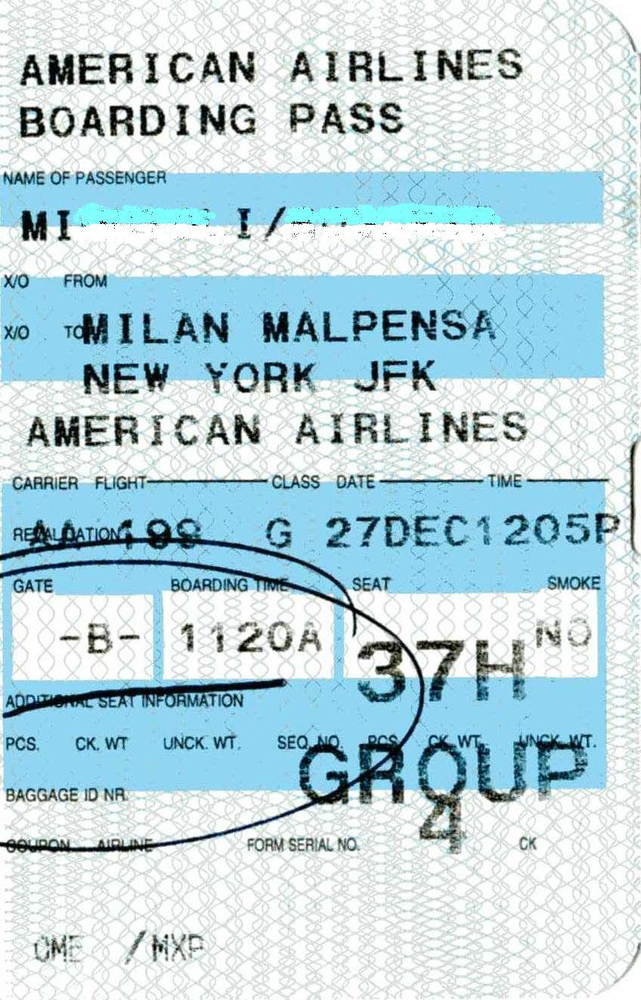

# Expiry & replay

*exp/iat/nbf are just claims - reading them proves nothing unless a server actually enforces them. And even a genuinely still-valid token can be replayed: expiry limits the damage, it does not by itself stop reuse.*

> `exp` is just a number sitting in a token's payload, next to every other claim, exactly as readable and
> exactly as easy to ignore. A token with no `exp` claim at all never expires - it is a permanent credential
> that happens to look like a normal, temporary one. A token WITH a perfectly correct `exp` claim is no safer
> if the server that receives it never actually compares that number to the current time. And here is the part
> that surprises most testers the first time: even a server that checks `exp` correctly, on a token that
> genuinely has not expired yet, can still be handed the exact same token a second time by someone who
> captured it - and accept it again, identically, because nothing about a normal `exp` check asks "have I seen
> this one before." Expiry and replay are two different questions, and a server can get one completely right
> while never asking the other at all.

> **In real life**
>
> The photo below is a real paper boarding pass. Look at what is actually printed on it and what a gate agent
> is supposed to do with each piece. A date and a boarding time are stamped right on the paper - a printed
> expiry, in plain sight, exactly like a JWT's `exp` claim sitting in the payload. Printing that time on the
> pass does nothing on its own; it only matters at the exact moment someone at the gate looks at it and
> compares it to the actual clock, refusing the pass if that time has passed. Now look closer, at the small
> handwritten mark near the seat number - a pen circle a gate agent made at boarding, and the sequence number
> printed near the bottom. Those two details answer a completely different question from the printed date: not
> "is this pass still within its valid window" but "has THIS EXACT pass already been used." A pass that is
> still within its printed time window can, in principle, be photocopied and presented again and again all
> day - the date alone will not catch that. Only a record that this specific pass was already consumed does.

**Expiry and replay**: exp (expiration time), nbf (not before), and iat (issued at) are timestamp claims defined in RFC 7519 that describe a JWT's intended validity window - exp says the token MUST NOT be accepted on or after this time, nbf says it MUST NOT be accepted before this time, and iat records when it was issued. All three are optional in the specification itself, which means a token missing exp entirely is spec-compliant and simultaneously a serious bug in practice: nothing about the token's structure forces it to expire. A verifier that decodes a token's claims but never actually compares exp and nbf against the current server time has the identical failure mode as having no exp claim at all - the timestamp is present and readable, but nothing enforces it. Replay is a separate, independent failure: even a token that IS correctly time-bounded, and genuinely has not expired yet, can be captured by an attacker (network capture, a leaked log, a shared device) and resubmitted - replayed - as-is, and a server that only checks exp/nbf has no way to distinguish that resubmission from the legitimate original request, because nothing about a timestamp check asks whether this specific token was already used once before.

## Three ways expiry gets skipped, and one way replay survives it anyway

- **No exp claim at all is a permanent credential in disguise.** RFC 7519 makes exp optional, so a token
  without one is technically valid JWT structure - and functionally a credential that never expires on its
  own. If it leaks once, it is valid forever, or until some other mechanism (a revocation list, a key
  rotation) invalidates it.
- **A present exp claim that is never actually checked is the identical bug wearing a disguise.** Decoding a
  token and reading its claims proves nothing about enforcement - a verifier has to explicitly compare `exp`
  (and `nbf`, if present) against the current time on every request. A library upgrade, a copy-pasted
  verification stub, or a custom parser that stops at signature validation can all silently drop this
  comparison.
- **nbf failures run the same risk in the other direction.** A token presented before its `nbf` time should
  be rejected as not-yet-valid - useful for pre-issued tokens meant to activate at a specific future moment.
  Skipping this check lets a token be used earlier than the issuer intended.
- **Replay survives a perfectly correct exp/nbf check, because it is a different question.** A captured
  token that has not expired yet is, by definition, still valid - expiry alone cannot and does not
  distinguish the legitimate holder's request from an attacker's resubmission of the identical token. That is
  exactly why short-lived access tokens exist: expiry cannot prevent replay, so the practical defense is
  shrinking the window replay is even possible in, paired with a refresh token to renew access without a
  full re-login every few minutes.

> **Tip**
>
> Test expiry by decoding a token and checking for the presence of `exp` first - if it is missing, that alone
> is a finding, before you even test whether the server enforces it. Then send that same token again, past its
> `exp` time, and confirm the server actually returns a rejection rather than just having a plausible-looking
> claim in the payload. Test replay separately and specifically: capture one still-VALID request and its exact
> token, then resend that identical request a second time before it expires - if a sensitive, supposedly
> one-time action (a password reset, a payment confirmation) succeeds twice, that is a replay finding
> independent of whatever the exp claim says.

> **Common mistake**
>
> A tester confirms a token's `exp` claim is present, correctly formatted, and set a reasonable distance in the
> future, and concludes the endpoint's token lifecycle is secure. Reading a claim is not the same as confirming
> enforcement - the only way to know whether a server actually checks `exp` is to send a token whose `exp` has
> already passed and confirm the response is a genuine rejection, not a `200`. Separately, even a fully-enforced
> `exp` says nothing about replay: a captured token that has not expired yet will pass every exp/nbf check
> correctly while still being a stolen credential in someone else's hands. Confirming the claim's presence, its
> enforcement, and the system's actual resistance to replay are three separate tests, not one.


*American Airlines boarding pass AA 199 - Piergiuliano Chesi, Wikimedia Commons, Public domain. [Source](https://commons.wikimedia.org/wiki/File:American_Airlines_boarding_pass_AA_199.jpg)*
- **DATE and TIME - a printed expiry, not a live check** — 27DEC, 1205P is stamped right on the paper, exactly like an exp claim sitting in a JWT payload. Printing it changes nothing by itself - it only matters the moment someone actually compares it to the current clock and refuses the pass if that time has passed.
- **BOARDING TIME - the not-before boundary** — A pass presented before its boarding window opens is also wrong, not just one presented after it closes. This is exactly what an nbf claim protects against - a token used too early, not only one used too late.
- **The gate agent's handwritten circle - proof THIS pass was already used** — A printed date says the pass is within its window. This mark is a different, separate fact: a human record that this specific, physical pass was already consumed once. A server's equivalent is marking a token's unique id as consumed - without it, a still-valid pass could be presented again and again.
- **SEQ NO - a one-time-use identifier** — A sequence number tied to this one boarding coupon is what would let a system actually detect a repeat presentation, the way a JWT's jti (JWT ID) claim lets a server track and reject a token it has already consumed once - something exp alone can never do.

**Testing expiry and replay as two separate questions - press Play**

1. **Decode a tester-issued token and check for exp** — Missing entirely is a finding on its own. If present, note the exact value before doing anything else.
2. **Send the SAME token again after its exp has passed** — Confirm the server returns a genuine rejection - reading the claim proved nothing; only this test proves enforcement.
3. **Capture one still-VALID request and its exact token** — Before it expires, save the full request - headers, body, token - byte for byte.
4. **Replay that exact captured request while the token is still valid** — If it succeeds a second time on a sensitive, meant-to-be-one-time action, that is a replay finding - independent of whatever exp correctly says.

Here is that same pair of independent checks in runnable form - claim validation, a captured-token replay,
a one-time-use jti guard, and the short-access/long-refresh pattern, modeled with plain timestamps.

*Run it - exp/nbf validation, token replay, and the refresh-token pattern (Python)*

```python
# exp/nbf/iat claim validation, replay of a captured token, and the
# short-lived-access + refresh-token pattern - modeled with plain timestamps,
# no real crypto needed to demonstrate the logic bugs.

def validate_vulnerable(claims, now):
    # BUG: decodes the claims and stops there - never actually compares
    # exp/nbf against the current time. A token missing exp entirely, or
    # one that expired an hour ago, both "pass" because nothing checks.
    return True, "accepted - claims parsed fine (exp/nbf never actually checked)"

def validate_secure(claims, now):
    if "exp" not in claims:
        return False, "rejected - no exp claim present, token would never expire"
    if "nbf" in claims and now < claims["nbf"]:
        return False, "rejected - not valid yet (now is before nbf)"
    if now >= claims["exp"]:
        return False, "rejected - expired (now is at or past exp)"
    return True, "accepted - now is within the nbf/exp window"

class ReplayGuard:
    # Models a server-side "has this exact single-use token id (jti) already
    # been consumed" check - the only thing that actually stops a captured,
    # still-VALID token from being replayed a second time.
    def __init__(self):
        self.consumed = set()

    def consume_vulnerable(self, jti):
        # BUG: never records anything, so every replay looks brand new.
        return True, "accepted - no record kept of jti '" + jti + "' ever being used before"

    def consume_secure(self, jti):
        if jti in self.consumed:
            return False, "rejected - jti '" + jti + "' was already consumed"
        self.consumed.add(jti)
        return True, "accepted - jti '" + jti + "' recorded as consumed"

def issue_access_token(now, sub, ttl):
    return {"sub": sub, "iat": now, "exp": now + ttl, "jti": "at-" + str(now)}

def issue_refresh_token(now, sub, ttl):
    return {"sub": sub, "iat": now, "exp": now + ttl, "jti": "rt-" + str(now)}

def run():
    T0 = 1_900_000_000  # a fixed "now", so the demo is repeatable

    print("Part 1 - a token with no exp claim at all:")
    no_exp = {"sub": "user_77", "iat": T0}
    ok, msg = validate_vulnerable(no_exp, T0 + 999_999)
    print("  vulnerable validator, checked WAY in the future: " + msg)
    ok2, msg2 = validate_secure(no_exp, T0 + 999_999)
    print("  secure validator,     checked WAY in the future: " + msg2)
    print()

    print("Part 2 - nbf: a token that is not valid yet:")
    future_nbf = {"sub": "user_77", "iat": T0, "nbf": T0 + 3600, "exp": T0 + 7200}
    ok3, msg3 = validate_secure(future_nbf, T0)
    print("  secure validator, checked immediately at issue time: " + msg3)
    ok4, msg4 = validate_secure(future_nbf, T0 + 4000)
    print("  secure validator, checked after nbf has passed:      " + msg4)
    print()

    print("Part 3 - replaying a captured, still-VALID token:")
    live = {"sub": "user_77", "iat": T0, "exp": T0 + 300, "jti": "at-live"}
    ok5, msg5 = validate_secure(live, T0 + 30)
    print("  first use, 30s after issue:  " + msg5)
    ok6, msg6 = validate_secure(live, T0 + 60)
    print("  attacker replay, 60s after issue (still within exp): " + msg6)
    print("  -> exp alone does not stop this: the token is genuinely still valid,")
    print("     which is exactly why a short TTL - not expiry as a concept - limits the damage.")
    print()

    print("Part 4 - a one-time password-reset token, submitted twice:")
    guard_vuln = ReplayGuard()
    guard_secure = ReplayGuard()
    reset_jti = "reset-8841"
    ok7, msg7 = guard_vuln.consume_vulnerable(reset_jti)
    print("  vulnerable guard, first submit:  " + msg7)
    ok8, msg8 = guard_vuln.consume_vulnerable(reset_jti)
    print("  vulnerable guard, second submit: " + msg8)
    ok9, msg9 = guard_secure.consume_secure(reset_jti)
    print("  secure guard,     first submit:  " + msg9)
    ok10, msg10 = guard_secure.consume_secure(reset_jti)
    print("  secure guard,     second submit: " + msg10)
    print()

    print("Part 5 - short-lived access token + refresh token:")
    access = issue_access_token(T0, "user_77", ttl=300)      # 5 minutes
    refresh = issue_refresh_token(T0, "user_77", ttl=1209600)  # 14 days
    t_later = T0 + 600  # 10 minutes later
    ok11, msg11 = validate_secure(access, t_later)
    print("  original access token, checked 10 min later: " + msg11)
    ok12, msg12 = validate_secure(refresh, t_later)
    print("  refresh token, checked 10 min later:          " + msg12)
    new_access = issue_access_token(t_later, "user_77", ttl=300)
    ok13, msg13 = validate_secure(new_access, t_later)
    print("  freshly minted access token via refresh flow: " + msg13)
    print()
    print("Expiry limits a stolen token's lifetime; a jti-consumption check is what actually")
    print("stops a still-valid token from being replayed; short access + long refresh keeps")
    print("both properties without forcing a full re-login every few minutes.")

run()
```

The same claim validation, replay guard, and refresh pattern in Java - identical timestamps, identical
outcomes:

*Run it - exp/nbf validation, token replay, and the refresh-token pattern (Java)*

```java
import java.util.*;

public class Main {
    static class Claims {
        String sub; Long iat, nbf, exp; String jti;
    }

    static class Result { boolean ok; String msg; Result(boolean ok, String msg) { this.ok = ok; this.msg = msg; } }

    static Result validateVulnerable(Claims claims, long now) {
        // BUG: decodes the claims and stops there - never actually compares
        // exp/nbf against the current time.
        return new Result(true, "accepted - claims parsed fine (exp/nbf never actually checked)");
    }

    static Result validateSecure(Claims claims, long now) {
        if (claims.exp == null) {
            return new Result(false, "rejected - no exp claim present, token would never expire");
        }
        if (claims.nbf != null && now < claims.nbf) {
            return new Result(false, "rejected - not valid yet (now is before nbf)");
        }
        if (now >= claims.exp) {
            return new Result(false, "rejected - expired (now is at or past exp)");
        }
        return new Result(true, "accepted - now is within the nbf/exp window");
    }

    static class ReplayGuard {
        Set<String> consumed = new HashSet<>();

        Result consumeVulnerable(String jti) {
            // BUG: never records anything, so every replay looks brand new.
            return new Result(true, "accepted - no record kept of jti '" + jti + "' ever being used before");
        }

        Result consumeSecure(String jti) {
            if (consumed.contains(jti)) {
                return new Result(false, "rejected - jti '" + jti + "' was already consumed");
            }
            consumed.add(jti);
            return new Result(true, "accepted - jti '" + jti + "' recorded as consumed");
        }
    }

    static Claims issueAccessToken(long now, String sub, long ttl) {
        Claims c = new Claims();
        c.sub = sub; c.iat = now; c.exp = now + ttl; c.jti = "at-" + now;
        return c;
    }

    static Claims issueRefreshToken(long now, String sub, long ttl) {
        Claims c = new Claims();
        c.sub = sub; c.iat = now; c.exp = now + ttl; c.jti = "rt-" + now;
        return c;
    }

    public static void main(String[] args) {
        final long T0 = 1_900_000_000L; // a fixed "now", so the demo is repeatable

        System.out.println("Part 1 - a token with no exp claim at all:");
        Claims noExp = new Claims();
        noExp.sub = "user_77"; noExp.iat = T0;
        Result r1 = validateVulnerable(noExp, T0 + 999_999);
        System.out.println("  vulnerable validator, checked WAY in the future: " + r1.msg);
        Result r2 = validateSecure(noExp, T0 + 999_999);
        System.out.println("  secure validator,     checked WAY in the future: " + r2.msg);
        System.out.println();

        System.out.println("Part 2 - nbf: a token that is not valid yet:");
        Claims futureNbf = new Claims();
        futureNbf.sub = "user_77"; futureNbf.iat = T0; futureNbf.nbf = T0 + 3600; futureNbf.exp = T0 + 7200;
        Result r3 = validateSecure(futureNbf, T0);
        System.out.println("  secure validator, checked immediately at issue time: " + r3.msg);
        Result r4 = validateSecure(futureNbf, T0 + 4000);
        System.out.println("  secure validator, checked after nbf has passed:      " + r4.msg);
        System.out.println();

        System.out.println("Part 3 - replaying a captured, still-VALID token:");
        Claims live = new Claims();
        live.sub = "user_77"; live.iat = T0; live.exp = T0 + 300; live.jti = "at-live";
        Result r5 = validateSecure(live, T0 + 30);
        System.out.println("  first use, 30s after issue:  " + r5.msg);
        Result r6 = validateSecure(live, T0 + 60);
        System.out.println("  attacker replay, 60s after issue (still within exp): " + r6.msg);
        System.out.println("  -> exp alone does not stop this: the token is genuinely still valid,");
        System.out.println("     which is exactly why a short TTL - not expiry as a concept - limits the damage.");
        System.out.println();

        System.out.println("Part 4 - a one-time password-reset token, submitted twice:");
        ReplayGuard guardVuln = new ReplayGuard();
        ReplayGuard guardSecure = new ReplayGuard();
        String resetJti = "reset-8841";
        Result r7 = guardVuln.consumeVulnerable(resetJti);
        System.out.println("  vulnerable guard, first submit:  " + r7.msg);
        Result r8 = guardVuln.consumeVulnerable(resetJti);
        System.out.println("  vulnerable guard, second submit: " + r8.msg);
        Result r9 = guardSecure.consumeSecure(resetJti);
        System.out.println("  secure guard,     first submit:  " + r9.msg);
        Result r10 = guardSecure.consumeSecure(resetJti);
        System.out.println("  secure guard,     second submit: " + r10.msg);
        System.out.println();

        System.out.println("Part 5 - short-lived access token + refresh token:");
        Claims access = issueAccessToken(T0, "user_77", 300);        // 5 minutes
        Claims refresh = issueRefreshToken(T0, "user_77", 1_209_600); // 14 days
        long tLater = T0 + 600; // 10 minutes later
        Result r11 = validateSecure(access, tLater);
        System.out.println("  original access token, checked 10 min later: " + r11.msg);
        Result r12 = validateSecure(refresh, tLater);
        System.out.println("  refresh token, checked 10 min later:          " + r12.msg);
        Claims newAccess = issueAccessToken(tLater, "user_77", 300);
        Result r13 = validateSecure(newAccess, tLater);
        System.out.println("  freshly minted access token via refresh flow: " + r13.msg);
        System.out.println();
        System.out.println("Expiry limits a stolen token's lifetime; a jti-consumption check is what actually");
        System.out.println("stops a still-valid token from being replayed; short access + long refresh keeps");
        System.out.println("both properties without forcing a full re-login every few minutes.");
    }
}
```

### Your first time: Your mission: test claim enforcement and replay as two separate questions

- [ ] Get a tester-issued token from this platform's own sandbox — Decode it and check whether exp is present at all - note the exact value if it is.
- [ ] Send it again after exp has passed — A genuine rejection confirms enforcement; a claim being present and readable proves nothing on its own.
- [ ] Capture one full, still-valid request byte for byte — Headers, body, and the exact token - before it expires.
- [ ] Replay that exact request while the token is still valid — Especially against a sensitive, meant-to-be-one-time action. A second success is a replay finding, independent of whatever exp correctly says.

You can now test a token's time boundaries and its resistance to replay as the two separate properties they
actually are - instead of treating "the exp claim looks right" as proof of either one.

- **A decoded token has no exp claim at all, and it still works days or weeks after issue.**
  The token has no built-in expiry - report it as a permanent credential. The fix is issuing every token with a short, enforced exp, and adding a revocation path for anything that needs to be invalidated before its natural expiry.
- **A token sent well past its exp time still returns a 200, even though exp is present and correctly formatted in the payload.**
  The claim is present but never actually checked - a verifier bug, not a token bug. Confirm by testing enforcement directly (send an expired token, expect a rejection) rather than trusting that a correctly-formatted claim implies it is being read.
- **A captured, still-valid token, replayed on a sensitive one-time action (a password reset, a payment confirmation), succeeds a second time.**
  exp/nbf enforcement alone cannot catch this - the token genuinely has not expired. The fix is a server-side single-use guard (a consumed jti, a one-time nonce) on any action that must never legitimately happen twice with the same token.
- **A team argues a short access-token TTL alone is 'annoying' and wants long-lived access tokens instead, without a refresh flow.**
  A short TTL is what limits the blast radius of a leaked or replayed token - it does not exist to inconvenience legitimate users. Pair it with a refresh token (long-lived, exchanged only at a dedicated endpoint) so the security property survives without forcing re-login on every expiry.

### Where to check

- **Whether exp is present on decode, before any other test** - a token missing it entirely is a finding
  by itself, independent of anything else.
- **The server's actual response to an expired token** - the only way to confirm enforcement; a correctly
  formatted claim in the payload proves nothing about whether it is checked.
- **A captured, still-valid request, replayed exactly** - the one test that actually demonstrates replay
  resistance or its absence, especially on any action meant to happen only once.
- **[[api-testing-fundamentals/auth-manually/bearer-and-jwt]]** - the decode-and-tamper basics this note
  assumes: how to read a token's claims before testing their enforcement.
- **[[security-testing-web/authentication-testing/session-and-cookie-attacks]]** - the same
  captured-and-replayed-credential pattern, tested against a session cookie instead of a bearer token.

### Worked example: a still-valid token, replayed on a one-time action in BuggyAPI

1. A tester, authorized to test this platform's own BuggyAPI sandbox with a tester-issued token, decodes a
   password-reset token and confirms it carries an `exp` five minutes out - correctly formatted, well within
   its window.
2. They submit the reset request once, using that token, and the password changes successfully - the
   expected, legitimate outcome.
3. Still within the token's five-minute window, they replay the EXACT same captured request a second time,
   unchanged. The server processes it again without complaint, silently resetting the password a second
   time.
4. Decoding confirms `exp` was never the issue - the token was still fully valid both times. The actual gap
   is a missing single-use guard: nothing on the server recorded that this specific token, or this specific
   reset action, had already been consumed once.
5. The finding is filed precisely: "password-reset token accepts replay within its valid window - no
   server-side single-use tracking (jti or equivalent) prevents the same token from completing the action
   twice," distinct from any exp/nbf enforcement question, which tested clean on its own.

**Quiz.** A token's exp claim is present, correctly formatted, and set one hour in the future. A tester concludes token expiry is fully secure on this endpoint. What is missing from that conclusion?

- [ ] Nothing - a well-formed, future-dated exp claim is sufficient proof that expiry is enforced
- [x] Whether the server actually compares exp to the current time and rejects requests past it - reading a claim's value is not the same as confirming it is enforced, and even a correctly-enforced exp says nothing about replay of a still-valid token
- [ ] The token needs a shorter exp value before any further testing is meaningful
- [ ] exp claims are encrypted, so this conclusion cannot be verified without the server's secret key

*Decoding a JWT's payload requires no secret - exp is plainly readable the moment a token is decoded, and its presence and formatting say nothing about whether the server that receives it actually checks that value against the current time on every request. The only way to confirm enforcement is to send an expired token and observe a genuine rejection. Separately, even a fully and correctly enforced exp check does not address replay: a captured token that has not expired yet will pass that check every time, including on a second, unauthorized resubmission - which is why this note treats enforcement and replay resistance as two independent tests. Option one skips the enforcement test entirely; option three is irrelevant to whether the current value is actually checked; option four confuses encoding with encryption - JWT payloads are base64url-encoded, not encrypted, and readable by anyone holding the token.*

- **exp / nbf / iat (RFC 7519)** — exp: must not be accepted on or after this time. nbf: must not be accepted before this time. iat: when the token was issued. All three are optional in the spec - a token can be fully valid JWT structure with none of them present.
- **Why a present exp claim can still be a bug** — Reading a claim off a decoded token proves nothing about enforcement. Only sending an expired token and observing a genuine rejection confirms the server actually checks exp against the current time.
- **Replay of a still-valid token** — A captured token that has NOT expired yet will pass every exp/nbf check correctly, every time - expiry alone cannot distinguish a legitimate request from an attacker resubmitting the identical, genuinely-valid token.
- **The actual fix for replay** — A server-side single-use guard - a consumed jti (JWT ID) or equivalent nonce - on any action that must never legitimately complete twice with the same token. exp/nbf enforcement does not provide this on its own.
- **Why short access tokens + refresh tokens exist** — Expiry cannot prevent replay, so shrinking the window replay is even possible in is the practical mitigation - paired with a longer-lived refresh token so legitimate users are not forced to re-login every few minutes.

### Challenge

On this platform's own BuggyAPI sandbox, using a tester-issued token: first, decode the token and confirm
whether exp is present; if it is, wait for it to pass (or use one you know has already expired) and resend
the exact same request, recording whether the server genuinely rejects it. Second, pick one action that
should only ever succeed once per token (a password reset, a one-time confirmation) - capture a full,
still-valid request, submit it once, then replay the identical captured request a second time before the
token expires, recording whether it succeeds twice. Write up whichever of the two actually reproduces as its
own finding, naming the specific mechanism (missing enforcement, or missing single-use tracking) rather than
one vague "token handling is broken" report.

### Ask the community

> I've started testing JWT expiry and replay as two separate things: sending an already-expired token to confirm the server actually rejects it rather than trusting the claim's presence, and separately replaying a captured-but-still-valid request against sensitive one-time actions to check for missing single-use tracking. For people who test token-based APIs regularly: what's the trickiest replay bug you've found on a token that was genuinely still within its exp window, and how do you usually confirm a jti-consumption guard is actually being enforced server-side rather than just present in the token format?

Distinguishing "the server has a jti claim in its tokens" from "the server actually tracks and rejects reused
jti values" from the outside, without access to server-side logs, is the part I find hardest to confirm with
confidence - curious how other testers build that proof.

- [RFC 7519 - JSON Web Token (JWT)](https://datatracker.ietf.org/doc/html/rfc7519)
- [OWASP - JSON Web Token Cheat Sheet](https://cheatsheetseries.owasp.org/cheatsheets/JSON_Web_Token_Cheat_Sheet.html)
- [Auth0 - What Are Refresh Tokens and How to Use Them Securely](https://auth0.com/blog/refresh-tokens-what-are-they-and-when-to-use-them/)

🎬 [Server Logic Simplified - How Do I Handle JWT Token Expiration And Renewal?](https://www.youtube.com/watch?v=DIIec7TVr-Q) (8 min)

- exp, nbf, and iat are all optional per RFC 7519 - a token with no exp claim is spec-compliant and functionally a permanent credential.
- Reading a claim's value off a decoded token proves nothing about enforcement - only sending an expired token and observing a genuine rejection confirms a server actually checks it.
- Replay is a separate question from expiry: a captured, still-VALID token passes every exp/nbf check correctly while still being a stolen credential in someone else's hands.
- The only real defense against replaying a still-valid token is a server-side single-use guard (a consumed jti or nonce) on actions that must never legitimately happen twice.
- Short-lived access tokens paired with a longer-lived refresh token exist because expiry cannot prevent replay - shrinking the window limits the damage instead.
- Test only systems you own or are explicitly, in writing, authorized to test, with tester-issued tokens, and never replay a captured request against a real user's account or data.


## Related notes

- [[Notes/api-testing-fundamentals/auth-manually/bearer-and-jwt|Bearer / JWT]]
- [[Notes/api-and-modern-security/jwt-and-token-attacks/alg-none-and-weak-secrets|alg:none & weak secrets]]
- [[Notes/security-testing-web/authentication-testing/session-and-cookie-attacks|Session & cookie attacks]]


---
_Source: `packages/curriculum/content/notes/api-and-modern-security/jwt-and-token-attacks/expiry-and-replay.mdx`_
