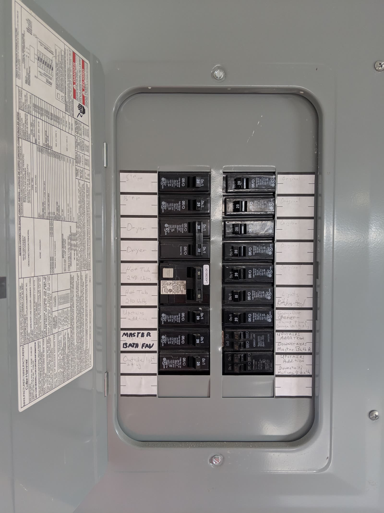

# The full API list

*All ten OWASP API Security Top 10:2023 categories, named and given a one-line mechanism each - a coverage taxonomy for recognizing which shape a finding has, not a severity ranking. API1 is not worse than API10; it is simply first in the reference numbering.*

> Three notes in this chapter went deep on three specific mechanisms - object ownership, function roles,
> authentication weaknesses, resource ceilings. There are seven more named categories in the OWASP API
> Security Top 10:2023 that this chapter does not dedicate a full note to, and a tester who has never even
> seen their names will miss findings that do not fit the three they know well. This note is the survey:
> all ten, named plainly, each with the one sentence that tells you what mechanism it actually describes -
> so a new finding has somewhere to be recognized, even on your first look at it.

> **In real life**
>
> The photo below is a household electrical panel with its cover open. Every switch inside is labeled by
> hand - lights, garage door opener, hot tub, master bath - so that when something trips, an electrician
> reads the label and knows exactly which circuit failed, without guessing from the size of the breaker
> or its position in the row. Nobody looks at that panel and concludes the breaker at the top is "worse"
> than the one at the bottom; a labeled panel is not a ranking; it is a reference, built so a problem can
> be IDENTIFIED quickly by matching its symptom to its label. The OWASP API Security Top 10:2023 is the
> same kind of panel: ten labeled categories, each naming one mechanism, arranged in a numbered list purely
> so testers can refer to "API1" or "API7" consistently - not because API1 trips more dangerously than
> API7. Learn the labels the way an electrician learns a panel: so that when something goes dark, you know
> which switch to look at first.

**The full API list**: The full API list is the practice of knowing all ten named categories of the OWASP API Security Top 10:2023 well enough to recognize which one a new finding's MECHANISM matches - treating the list as a coverage taxonomy, a reference for identification, rather than a ranked severity ladder. The ten categories, in their official reference numbering: API1 Broken Object Level Authorization (an object returned without an ownership check), API2 Broken Authentication (weak secrets, unthrottled auth endpoints, unverified tokens), API3 Broken Object Property Level Authorization (individual fields of an object read or set without checking if the caller should be able to), API4 Unrestricted Resource Consumption (no cap on requests, payload size, response size, or cost), API5 Broken Function Level Authorization (a caller's role does not gate the function/action it should), API6 Unrestricted Access to Sensitive Business Flows (a legitimate business flow automated and abused at harmful scale), API7 Server Side Request Forgery (the server fetches a caller-influenced URL without validating where it points), API8 Security Misconfiguration (insecure defaults, verbose errors, inconsistent settings across environments), API9 Improper Inventory Management (old, undocumented, or shadow endpoints still live and unmonitored), and API10 Unsafe Consumption of APIs (data from a third-party API trusted without the validation given to user input). The numbering is a reference index for consistent communication, not a priority order - severity is scored per finding, independent of which of the ten it matches.

## Reading the other seven, one mechanism at a time

- **API3 Broken Object Property Level Authorization** - a close cousin of API1, but scoped to
  PROPERTIES rather than whole objects: a profile endpoint that lets a caller also read or set a field
  like an internal role or balance, because the check covers the object as a whole but not each field
  inside it.
- **API6 Unrestricted Access to Sensitive Business Flows** - not a technical flaw in any single request,
  but a legitimate flow (buying a ticket, redeeming a code, posting a review) that nothing stops from
  being scripted and repeated at a harmful scale, even though every individual call is perfectly valid.
- **API7 Server Side Request Forgery (SSRF)** - any feature where the server itself fetches a resource
  named by the caller (a URL preview, a webhook test, an image-import feature) is a candidate, because
  an unvalidated destination can be redirected to internal-only infrastructure.
- **API8 Security Misconfiguration** - the catch-all for defaults nobody hardened: verbose stack traces
  in production, permissive CORS, missing security headers, or a staging config that quietly reached
  production.
- **API9 Improper Inventory Management** - APIs tend to accumulate more endpoints and versions than any
  single team remembers; an old v1 route left live, or an internal-only endpoint with no access
  restriction, is a live attack surface that nobody is even watching.
- **API10 Unsafe Consumption of APIs** - the mirror image of injection testing: instead of asking "do
  we validate what our USERS send us," it asks "do we validate what OTHER APIs send us," since a
  compromised or malicious upstream partner is just another untrusted input source.
- **The three this chapter covers in depth** - API1 and API5 (object versus function authorization) and
  API2 (broken authentication) each get their own dedicated note, precisely because they recur across
  almost every API and reward a slower, hands-on treatment.

> **Tip**
>
> When a finding does not obviously match API1, API2, API4, or API5 - the four this chapter has already
> gone deep on - resist the urge to force it into one of those four just because they are familiar. Walk
> the remaining six names first: does it involve a single field rather than a whole object (API3), an
> automatable business flow rather than a technical exploit (API6), the server fetching a URL (API7), a
> config nobody hardened (API8), a forgotten endpoint (API9), or trust placed in another API's response
> (API10). The right label is almost always in this list of ten; the skill is recognizing which one.

> **Common mistake**
>
> Treating the numbering as a severity order - assuming an API1 finding always outranks an API9 finding
> because 1 comes before 9. The list is a reference index, not a priority queue: an API9 Improper
> Inventory Management finding that surfaces a completely unauthenticated legacy endpoint holding real
> customer data can be far more severe than a low-impact API1 finding that only leaks a harmless
> preference field. Score every finding's severity from its actual exploitability and impact, entirely
> apart from which number it was assigned.


*Electrical panel opened - FuriousYogi, Wikimedia Commons, CC BY-SA 4.0. [Source](https://commons.wikimedia.org/wiki/File:Electrical_panel_opened.jpg)*
- **One switch, one handwritten label** — Each breaker is named for exactly the circuit it protects - kitchen, garage door, hot tub. This is what a category name does for a finding: it names the mechanism precisely enough that anyone reading it later knows exactly which check failed.
- **A whole row of switches, same size, same rail** — Every breaker in this panel is mounted at the same height with the same physical form. Nothing about a breaker's position tells you it protects a more important circuit - exactly as no category's number in the OWASP API list tells you it is more severe.
- **The double-width breaker - a bigger circuit is not automatically the worst one** — A larger breaker (like the 50-amp pair here, for a hot tub) simply protects a bigger load - it says nothing about which circuit failing would matter most today. Category size and category number are the same kind of red herring for severity.
- **The handwritten labels at top and bottom - added over time, never renumbered** — This panel has been relabeled as the house was extended - new circuits added, old ones renamed - yet the physical order never needed to reflect importance. A security taxonomy works the same way: categories get added or revised across editions without the numbering ever claiming to rank them.

**Placing a new finding among all ten - press Play**

1. **Write the finding's mechanism in one sentence** — Not the headline - what actually failed. An object returned without an ownership check reads differently from a business flow being scripted at scale, even if both started from the same user complaint.
2. **Walk the ten category names, not just the familiar four** — Check it against all ten shapes - including the six this chapter only surveys - before defaulting to whichever category you remember best.
3. **Assign the closest-matching category, or note it does not fit** — As with any taxonomy, a finding can straddle two categories or match none - name a primary category (and a secondary if genuinely relevant), or say plainly that it falls outside all ten.
4. **Score severity completely separately from the category number** — Rank by exploitability, exposure, and business impact - never by whether the assigned category was API1 or API10.

Here is the same taxonomy in runnable form - all ten categories named with their mechanism, and ten
findings labeled against them, deliberately listed out of API1..API10 order to make the point that this
list has no front-to-back severity to preserve.

*Run it - a 10-category classifier for the OWASP API Security Top 10:2023 (Python)*

```python
# A 10-category classifier for the OWASP API Security Top 10:2023 - a
# TAXONOMY for coverage (which mechanism a finding matches), never a
# severity ladder. API1 is not "worse" than API10; the numbering is a
# reference index, not a ranking.

CATEGORY_ORDER = ["API1", "API2", "API3", "API4", "API5",
                  "API6", "API7", "API8", "API9", "API10"]

CATEGORIES = {
    "API1":  "Broken Object Level Authorization",
    "API2":  "Broken Authentication",
    "API3":  "Broken Object Property Level Authorization",
    "API4":  "Unrestricted Resource Consumption",
    "API5":  "Broken Function Level Authorization",
    "API6":  "Unrestricted Access to Sensitive Business Flows",
    "API7":  "Server Side Request Forgery",
    "API8":  "Security Misconfiguration",
    "API9":  "Improper Inventory Management",
    "API10": "Unsafe Consumption of APIs",
}

MECHANISM = {
    "API1":  "an endpoint returns another user's OBJECT because it never checks who owns the id",
    "API2":  "the auth flow itself is weak - guessable keys, no attempt limit, or an unverified token",
    "API3":  "an object's response exposes or accepts individual PROPERTIES a caller should not read or set",
    "API4":  "no limit on requests, payload size, or expensive operations - resources are consumed without a ceiling",
    "API5":  "a caller with too low a ROLE reaches a FUNCTION that should require a higher one",
    "API6":  "a legitimate business FLOW (buy one, enter one code) is automated and abused at harmful scale",
    "API7":  "the server fetches a caller-supplied URL or resource without validating where it actually points",
    "API8":  "insecure defaults, verbose errors, missing headers, or inconsistent config across environments",
    "API9":  "an old, undocumented, or shadow version of an endpoint is still live and unmonitored",
    "API10": "data pulled in from a third-party API is trusted without the same validation given to user input",
}

# Ten findings, deliberately NOT listed in API1..API10 order - a taxonomy
# has no natural front-to-back severity order, so neither does this list.
TAGGED_FINDINGS = [
    ("F1",  "API4",  "a search endpoint has no page-size cap and no rate limit"),
    ("F2",  "API9",  "a v1 endpoint retired from the docs still responds and skips the newer checks"),
    ("F3",  "API1",  "an invoice id in the URL returns any customer's invoice"),
    ("F4",  "API7",  "a 'fetch preview' endpoint retrieves any URL, including internal-only hosts"),
    ("F5",  "API3",  "a PATCH to /profile lets a caller also set is_admin"),
    ("F6",  "API10", "a shipping-partner's API response is inserted into a page without sanitizing it"),
    ("F7",  "API2",  "a password-reset endpoint accepts unlimited guesses"),
    ("F8",  "API6",  "a promo-code endpoint can be scripted to redeem thousands of codes a minute"),
    ("F9",  "API5",  "a non-admin token can call POST /admin/reindex"),
    ("F10", "API8",  "stack traces and a debug endpoint are exposed in the production build"),
]

def run():
    print("The OWASP API Security Top 10:2023 - ten NAMED mechanisms, not a ranking:")
    print()
    for code in CATEGORY_ORDER:
        print("  " + code.ljust(5) + " " + CATEGORIES[code])
        print("        mechanism: " + MECHANISM[code])
    print()
    print("Ten real findings, labeled by MECHANISM match (deliberately NOT in")
    print("API1..API10 order - a taxonomy has no severity order to preserve):")
    for fid, code, desc in TAGGED_FINDINGS:
        print("  [" + fid + "] " + code + " " + CATEGORIES[code] + " - " + desc)
    print()
    print(str(len(TAGGED_FINDINGS)) + " findings, " + str(len(CATEGORIES)) + " categories, each finding matched")
    print("to exactly one mechanism. Coverage is the question here - not which letter 'wins'.")

run()
```

The same taxonomy and the same ten findings in Java - identical labels, identical order:

*Run it - a 10-category classifier for the OWASP API Security Top 10:2023 (Java)*

```java
import java.util.*;

public class Main {
    // A 10-category classifier for the OWASP API Security Top 10:2023 - a
    // TAXONOMY for coverage (which mechanism a finding matches), never a
    // severity ladder. API1 is not "worse" than API10; the numbering is a
    // reference index, not a ranking.

    static final String[] CATEGORY_ORDER = {
        "API1", "API2", "API3", "API4", "API5", "API6", "API7", "API8", "API9", "API10"
    };

    static final Map<String, String> CATEGORIES = new LinkedHashMap<>();
    static final Map<String, String> MECHANISM = new LinkedHashMap<>();

    static {
        CATEGORIES.put("API1", "Broken Object Level Authorization");
        CATEGORIES.put("API2", "Broken Authentication");
        CATEGORIES.put("API3", "Broken Object Property Level Authorization");
        CATEGORIES.put("API4", "Unrestricted Resource Consumption");
        CATEGORIES.put("API5", "Broken Function Level Authorization");
        CATEGORIES.put("API6", "Unrestricted Access to Sensitive Business Flows");
        CATEGORIES.put("API7", "Server Side Request Forgery");
        CATEGORIES.put("API8", "Security Misconfiguration");
        CATEGORIES.put("API9", "Improper Inventory Management");
        CATEGORIES.put("API10", "Unsafe Consumption of APIs");

        MECHANISM.put("API1", "an endpoint returns another user's OBJECT because it never checks who owns the id");
        MECHANISM.put("API2", "the auth flow itself is weak - guessable keys, no attempt limit, or an unverified token");
        MECHANISM.put("API3", "an object's response exposes or accepts individual PROPERTIES a caller should not read or set");
        MECHANISM.put("API4", "no limit on requests, payload size, or expensive operations - resources are consumed without a ceiling");
        MECHANISM.put("API5", "a caller with too low a ROLE reaches a FUNCTION that should require a higher one");
        MECHANISM.put("API6", "a legitimate business FLOW (buy one, enter one code) is automated and abused at harmful scale");
        MECHANISM.put("API7", "the server fetches a caller-supplied URL or resource without validating where it actually points");
        MECHANISM.put("API8", "insecure defaults, verbose errors, missing headers, or inconsistent config across environments");
        MECHANISM.put("API9", "an old, undocumented, or shadow version of an endpoint is still live and unmonitored");
        MECHANISM.put("API10", "data pulled in from a third-party API is trusted without the same validation given to user input");
    }

    static final String[][] TAGGED_FINDINGS = {
        {"F1",  "API4",  "a search endpoint has no page-size cap and no rate limit"},
        {"F2",  "API9",  "a v1 endpoint retired from the docs still responds and skips the newer checks"},
        {"F3",  "API1",  "an invoice id in the URL returns any customer's invoice"},
        {"F4",  "API7",  "a 'fetch preview' endpoint retrieves any URL, including internal-only hosts"},
        {"F5",  "API3",  "a PATCH to /profile lets a caller also set is_admin"},
        {"F6",  "API10", "a shipping-partner's API response is inserted into a page without sanitizing it"},
        {"F7",  "API2",  "a password-reset endpoint accepts unlimited guesses"},
        {"F8",  "API6",  "a promo-code endpoint can be scripted to redeem thousands of codes a minute"},
        {"F9",  "API5",  "a non-admin token can call POST /admin/reindex"},
        {"F10", "API8",  "stack traces and a debug endpoint are exposed in the production build"},
    };

    static String pad(String s, int n) {
        StringBuilder sb = new StringBuilder(s);
        while (sb.length() < n) sb.append(' ');
        return sb.toString();
    }

    public static void main(String[] args) {
        System.out.println("The OWASP API Security Top 10:2023 - ten NAMED mechanisms, not a ranking:");
        System.out.println();
        for (String code : CATEGORY_ORDER) {
            System.out.println("  " + pad(code, 5) + " " + CATEGORIES.get(code));
            System.out.println("        mechanism: " + MECHANISM.get(code));
        }
        System.out.println();
        System.out.println("Ten real findings, labeled by MECHANISM match (deliberately NOT in");
        System.out.println("API1..API10 order - a taxonomy has no severity order to preserve):");
        for (String[] f : TAGGED_FINDINGS) {
            String fid = f[0], code = f[1], desc = f[2];
            System.out.println("  [" + fid + "] " + code + " " + CATEGORIES.get(code) + " - " + desc);
        }
        System.out.println();
        System.out.println(TAGGED_FINDINGS.length + " findings, " + CATEGORIES.size() + " categories, each finding matched");
        System.out.println("to exactly one mechanism. Coverage is the question here - not which letter 'wins'.");
    }
}
```

### Your first time: Your mission: place five findings across all ten categories

- [ ] Gather or invent five short finding descriptions — Real findings from authorized testing you have already done in this chapter, or plausible ones you construct for practice - each a sentence or two.
- [ ] Write each finding's mechanism before naming a category — Not the headline - the actual failed check or missing control, in one clear sentence.
- [ ] Match each to one of all ten categories by name — Deliberately include at least one finding that matches one of the six categories this chapter only surveys (API3, API6, API7, API8, API9, API10) rather than defaulting to the three you have practiced most.
- [ ] Score each finding's severity completely separately from its category number — Rank by exploitability, exposure, and impact - and confirm your severity order does not simply follow API1 through API10.

You can now place a finding anywhere in the full ten-category taxonomy, not just the three or four this
chapter went deepest on - and you have practiced keeping category and severity as two separate questions.

- **A new finding does not obviously match API1, API2, API4, or API5 - the categories you know best.**
  Walk the other six names deliberately before forcing a familiar label onto it: API3 (a property, not a whole object), API6 (an abused business flow), API7 (the server fetching a URL), API8 (a config default), API9 (a forgotten endpoint), API10 (trust placed in another API). The right match is almost always in this list of ten.
- **A dashboard shows mostly API1 findings this quarter, and a stakeholder reads that as 'our biggest risk is object authorization.'**
  A category count is a coverage and trend signal, not a severity ranking. Pull the actual severity scores behind those API1 findings before drawing a risk conclusion - a pile of low-impact API1s can matter less than one high-impact finding in any other category.
- **Someone assumes API9 (Improper Inventory Management) is minor because it is near the end of the list.**
  Position in the numbering carries no severity meaning. An unmonitored legacy endpoint (API9) holding real customer data with no authentication at all can be far more severe than a low-impact finding anywhere earlier in the list - score it on its own exploitability and exposure.
- **A finding genuinely seems to straddle two categories, such as an unbounded search (API4) that is also an abusable business flow (API6).**
  Name a primary category (the one closest to the finding's sharpest mechanism) and a secondary as a contributing factor, and file it as one finding - the same discipline used for any taxonomy with overlapping edges.

### Where to check

- **The official 2023 category pages** - re-read a category's full description, not just its title,
  whenever a finding sits near a boundary between two of the ten.
- **This chapter's three deep-dive notes** - confirm a finding that looks like API1, API2, or API5
  really matches the mechanism described there before committing to that code.
- **Your own findings log, tagged by category over time** - a consistent mapping habit is what turns a
  single correctly-labeled finding into a trustworthy coverage trend later.
- **[[api-and-modern-security/owasp-api-security-top-10-2023/bola-and-bfla]]** and
  **[[api-and-modern-security/owasp-api-security-top-10-2023/broken-auth-for-apis]]** - the two
  authorization/authentication deep dives this survey points back to for API1, API5, and API2.

### Worked example: placing an unfamiliar finding correctly

1. A tester, authorized to test TaskFlight's sandbox, notices that a "check flight status by
   confirmation code" feature has no limit on how many codes can be tried per minute, and codes are
   short and sequential enough to enumerate.
2. The instinct is to call this API4 (no rate limit) - and that mechanism is genuinely present. But the
   sharper description is that this specific FLOW (checking a booking without being logged in) is being
   used to enumerate other travelers' bookings at scale, which is the shape API6 Unrestricted Access to
   Sensitive Business Flows names directly, with API4's missing rate limit as a contributing factor.
3. The tester writes the mechanism sentence first: "an unauthenticated business flow can be scripted to
   enumerate other users' bookings, and nothing rate-limits or throttles it."
4. The finding is filed as "API6:2023 Unrestricted Access to Sensitive Business Flows (primary) - also
   touches API4:2023 Unrestricted Resource Consumption (no rate limit) - confirmation-code lookup can be
   scripted to enumerate bookings," with both codes noted rather than picking only the most familiar one.
5. Severity is scored separately, based on what an enumerated booking actually exposes (traveler name,
   flight details) - independent of which of the two category numbers ended up listed first.

**Quiz.** A tester finds an internal-only reporting endpoint from an old API version, never removed from production and never documented in the current API spec, that anyone can call with no authentication at all. Which category best names this finding's mechanism?

- [ ] API1 Broken Object Level Authorization, since the endpoint returns data
- [x] API9 Improper Inventory Management, since the core problem is an undocumented, unmonitored old endpoint still live in production - its missing authentication is a compounding factor on top of that
- [ ] API5 Broken Function Level Authorization, since any authenticated user could call it
- [ ] This cannot be classified, since the endpoint should have been deleted rather than found

*The sharpest description of the failure is that an old, undocumented endpoint was never tracked or retired - exactly the mechanism API9 Improper Inventory Management names - with its complete lack of authentication as a serious compounding factor worth noting alongside it. Option one is wrong because the core issue is not a missing ownership check on a specific object; option three is wrong because the endpoint has no authentication at all, so there is no authenticated caller whose role could be insufficiently checked (that would be a different endpoint's problem, not this one's mechanism); option four is wrong because a real, testable finding with a clear mechanism is always reportable, whether or not it should have existed in the first place - inventory-management failures are exactly the kind of finding this category exists to catch.*

- **The full API list** — Knowing all ten OWASP API Security Top 10:2023 categories well enough to recognize which mechanism a new finding matches - a coverage taxonomy for identification, not a severity ranking.
- **API3 Broken Object Property Level Authorization** — Like API1, but scoped to individual PROPERTIES of an object rather than the whole object - a caller can read or set a specific field they should not.
- **API6 Unrestricted Access to Sensitive Business Flows** — A legitimate business flow (buying, redeeming, posting) with nothing stopping it from being automated and abused at a harmful scale, even though each individual call is valid.
- **API7 Server Side Request Forgery** — The server fetches a resource at a caller-influenced URL without validating where it actually points, letting a request be redirected to internal-only infrastructure.
- **API8, API9, API10 in one line each** — API8 Security Misconfiguration: insecure defaults or inconsistent settings. API9 Improper Inventory Management: forgotten or undocumented endpoints still live. API10 Unsafe Consumption of APIs: trusting another API's response the way you should never trust raw user input.
- **Numbering versus severity** — The API1-API10 numbering is a reference index for consistent naming, not a priority order. Score every finding's severity from its own exploitability and impact, completely independent of its assigned number.

### Challenge

Take three findings - real ones from testing you are authorized to do, or plausible ones you construct
for practice - and match each to one of all ten OWASP API Security Top 10:2023 categories by writing the
mechanism sentence first, then the category name. Make sure at least two of your three findings match
categories from outside the three this chapter covers in depth (API3, API6, API7, API8, API9, or API10).
Then rank all three findings by severity using only exploitability, exposure, and business impact - and
confirm your severity order does not simply follow the categories' numbering.

### Ask the community

> I've been working through all ten OWASP API Security Top 10:2023 categories as a coverage checklist rather than defaulting to the three or four I know best (BOLA, BFLA, broken authentication, resource consumption). For people who test APIs regularly: which of the other six categories - API3, API6, API7, API8, API9, API10 - do you find gets missed most often in practice, and how do you keep a whole team mapping consistently to all ten without everyone defaulting to the same familiar few?

Knowing which of the less-familiar six categories quietly gets skipped in real testing, and how to keep
a whole team's mapping habits spread across all ten rather than clustering on the same three or four,
is exactly the gap between "I know the famous ones" and genuine ten-category coverage - hearing how
other testers close it is the fastest way to get there.

- [OWASP API Security Top 10 - 2023, the official full list](https://owasp.org/API-Security/editions/2023/en/0x11-t10/)
- [OWASP API Security Top 10 - project home](https://owasp.org/API-Security/)
- [OWASP API Security Project - project page](https://owasp.org/www-project-api-security/)

🎬 [API security OWASP top 10 : TryHackMe](https://www.youtube.com/watch?v=d-3z_9Vx4e0) (38 min)

- The OWASP API Security Top 10:2023 names ten categories - API1 through API10 - each describing one distinct MECHANISM, not a ranked severity ladder.
- This chapter goes deep on three (API1 BOLA, API5 BFLA, API2 Broken Authentication) and one more (API4 Unrestricted Resource Consumption) - the other six (API3, API6, API7, API8, API9, API10) still need to be recognizable by name and mechanism.
- API3 scopes to individual properties, API6 covers abused business flows, API7 is server-side request forgery, API8 is misconfiguration, API9 is forgotten inventory, and API10 is unsafe trust in third-party API responses.
- The numbering is a reference index for consistent naming and searchable trend data - never a priority queue; a low-numbered finding is not automatically more severe than a high-numbered one.
- When a finding straddles two categories, name a primary and a secondary rather than splitting it into two tickets; when it matches none of the ten, report it fully anyway without forcing a code.
- Score every finding's severity from its own exploitability, exposure, and business impact - completely independent of which of the ten categories it was matched to.


## Related notes

- [[Notes/api-and-modern-security/owasp-api-security-top-10-2023/bola-and-bfla|BOLA & BFLA]]
- [[Notes/api-and-modern-security/owasp-api-security-top-10-2023/broken-auth-for-apis|Broken auth for APIs]]
- [[Notes/api-and-modern-security/owasp-api-security-top-10-2023/unrestricted-resource-consumption|Unrestricted resource consumption]]


---
_Source: `packages/curriculum/content/notes/api-and-modern-security/owasp-api-security-top-10-2023/the-full-api-list.mdx`_
