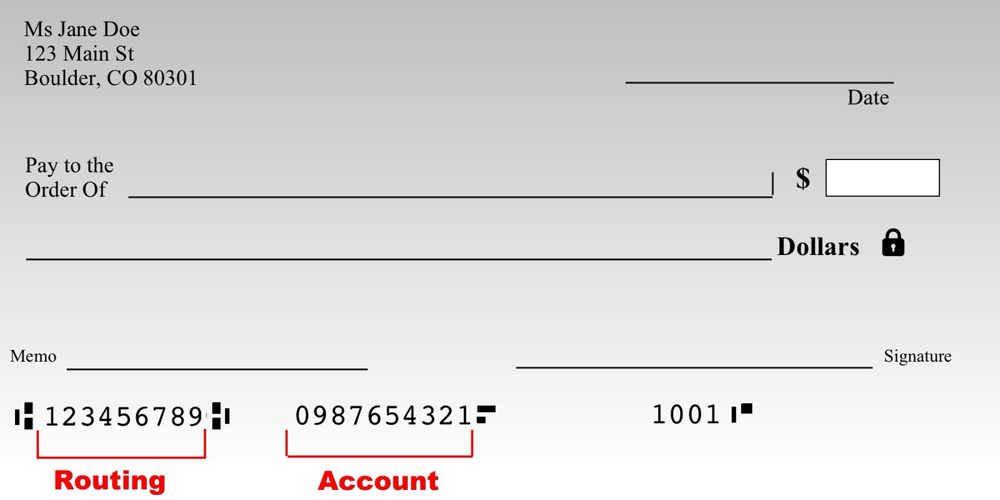

# Mass assignment

*Mass assignment happens when an endpoint binds every field in a request body straight onto a database record instead of a named, allowed set - so a field the UI never shows, like isAdmin or accountBalance, still gets written if a caller simply includes it.*

> TaskFlight's profile page lets a traveler edit their display name and bio - two text boxes, nothing
> else. A tester, authorized to test the sandbox, opens the network tab, finds the `PATCH /me` request the
> form actually sends, and copies it into a scratch request. The body is plain JSON: `{"display_name": "...",
> "bio": "..."}`. Nothing stops the tester from adding a third field the UI never offered - `"isAdmin": true`
> - and sending that instead. If the response comes back `200 OK` and a follow-up `GET /me` shows the account
> now really is an admin, nothing about authentication broke and nothing about authorization-by-id broke
> either. The account is still exactly who it claims to be, reaching only its own object. What broke is
> something quieter: the server took every key in the request body and wrote it onto the record, trusting
> the client to only ever send the fields the UI intended. That is mass assignment, and it hides behind the
> most ordinary-looking "update my profile" form on the API.

> **In real life**
>
> Picture a paper deposit slip at a bank counter. The visible, printed part of the slip has exactly two
> blanks a customer is meant to fill in: the amount to deposit, and which account to credit - their own. A
> teller who does their job correctly reads the slip, checks the account number against the customer's own
> id, and processes only that one transaction. Now imagine the same slip printed with a few extra blank
> lines near the bottom, left over from an older form template - lines labeled "internal use," "fee waiver
> code," "override balance." Nothing stops a customer from filling those in too. A careless teller who
> simply keys in every filled-in line on the slip, trusting that anything written on the paper must be
> intended, ends up processing a fee waiver or a balance override nobody with authority actually approved -
> not because the customer forged a signature or grabbed someone else's slip, but because the teller bound
> every field on the page to the account, instead of only the two fields the form was ever supposed to
> accept.

**Mass assignment**: Mass assignment is the failure to restrict which fields of an incoming request body an API is willing to bind onto a stored object, so that fields never exposed by the client UI - and never intended to be caller-controlled at all, like isAdmin, role, accountBalance, or verified - still get written if a caller simply includes them in the request. It is a write-side failure: the caller is fully authenticated and is only ever touching their OWN object (so BOLA's ownership check and BFLA's role check can both be passing cleanly), yet the object itself ends up with fields set that no legitimate client-side flow would ever have sent. OWASP folded mass assignment into API3:2023 Broken Object Property Level Authorization alongside excessive data exposure, because both are the same root cause read in opposite directions: excessive data exposure is the server handing back MORE fields than a response should ever carry; mass assignment is the server accepting and writing MORE fields than a request should ever be allowed to set. The fix is never a longer or better-hidden form - it is an explicit, server-side allowlist of exactly which fields a given endpoint is permitted to write, applied before anything from the request body touches the stored record.

## Finding it: smuggle a field the UI never offers

- **Start from a legitimate request, not a guess.** Use the real "update profile" (or "update booking," or
  "update account") request the UI actually sends, captured from your own tester-owned session, as the
  base you modify - never a request invented from scratch.
- **Add one field the UI has no control for.** A likely internal field name - `isAdmin`, `role`,
  `is_verified`, `accountBalance`, `is_internal_test_account` - guessed from what the object probably
  contains, or discovered directly from a response elsewhere (a GET on the same object often reveals field
  names a PATCH will happily accept).
- **Confirm with a read, not just a write's status code.** A `200 OK` on the write proves nothing by
  itself; follow up with a `GET` on the same object and check whether the smuggled field's value actually
  changed. A write that quietly no-ops the unknown field is correct behavior, not a finding.
- **Test every endpoint that accepts a body for an object you own** - profile updates, booking edits,
  settings changes - each is an independent allowlist that can be missing, even on an API that gets BOLA
  and BFLA right everywhere else.

## Why "the UI doesn't show it" is not a control

- **A client-side form is a suggestion to the server, never an instruction.** The server has no way of
  knowing whether a request came from the real UI, a modified replay, or a script - it can only enforce
  what it is willing to accept, field by field, on its own side.
- **Nested and array fields hide the same bug.** A body like `{"profile": {"display_name": "..."}}` or an
  array of settings objects can smuggle an extra key just as easily as a flat body - test the same
  allowlist question wherever nested objects accept a body.
- **A field being absent from documentation does not mean it is rejected.** Many frameworks bind whatever
  keys exist on the underlying model by default unless a developer explicitly restricts them - undocumented
  is not the same as unwritable.

> **Tip**
>
> Before testing a write endpoint for mass assignment, first read the object with a GET (or any endpoint
> that returns it) and note every field name it contains - including ones the UI clearly never edits, like
> `isAdmin` or `accountBalance`. That field list is your test plan: try writing each one through the PATCH
> or PUT endpoint for that object, one at a time, and check with a follow-up GET whether it actually changed.
> The read is what turns a guess into a targeted test.

> **Common mistake**
>
> A tester sends a profile update with `isAdmin: true` smuggled into the body, gets back a `200 OK`, and
> files the finding immediately based on the status code alone. Many APIs return `200 OK` on a write
> regardless of which fields it actually persisted - a framework can silently ignore an unknown key and
> still report success on the fields it DID accept. Without a follow-up `GET` confirming the account is now
> genuinely an admin, the `200 OK` proves the request was well-formed, not that the smuggled field was
> written. Always confirm impact by reading the object back before writing up a mass-assignment finding.


*Blank check - Mario Lurig, Wikimedia Commons, CC0 1.0. [Source](https://commons.wikimedia.org/wiki/File:Blank_check.jpg)*
- **Pay to the Order Of - the field a caller is meant to set** — A legitimate blank, meant to be filled in by whoever holds the pen - the API equivalent of display_name or bio, a field the client UI genuinely offers and the server should accept.
- **The blank dollar amount box - no printed ceiling** — Nothing on the slip itself limits what number goes here. A processor that writes whatever amount is written, without checking it against what was actually authorized, is doing exactly what a mass-assignment-vulnerable endpoint does with any field it blindly binds.
- **The signature line - proves WHO, not WHAT** — A signature authenticates the account holder. It says nothing about which blanks on the slip should be trusted - the same gap as an authenticated API request whose identity is fine but whose fields are not individually checked.
- **Routing and account numbers - fixed, not caller-editable** — These numbers are printed or pre-encoded, never left for the customer to fill in freely. That is the model a server-side allowlist follows: some fields are simply never open to being set by the request at all.

**Finding a mass-assignment field on one endpoint - press Play**

1. **Read the object first** — GET the object (or find it in any response) and note every field name it actually contains - including ones the UI never edits, like isAdmin or accountBalance.
2. **Copy the real write request, then add one field** — Start from the UI's genuine PATCH/PUT request, captured from your own tester-owned session, and add exactly one undocumented field from the read.
3. **Send it, then read the object back** — A 200 OK alone proves nothing - many frameworks report success while silently ignoring unknown keys. Confirm with a fresh GET whether the smuggled field's value actually changed.
4. **Report the missing allowlist, not the smuggled value** — The finding is that the endpoint has no server-side allowlist restricting writable fields - name the endpoint, the field smuggled, and the before/after read as proof.

Here is that same allowlist question in runnable form - a "profile update" endpoint modeled two ways: one
that blindly merges every field a request body contains, and one that only ever writes fields on an
explicit allowlist.

*Run it - a mass-assignment allowlist simulator (Python)*

```python
# Mass assignment simulator: a "profile update" endpoint that binds request
# fields onto a user record. VULNERABLE version blindly merges every field
# the client sent; SECURE version only merges an explicit allowlist of fields
# a user is actually permitted to set, ignoring the rest.

USERS = {
    "test_alice": {"display_name": "Alice", "bio": "", "isAdmin": False, "accountBalance": 100},
    "test_bob":   {"display_name": "Bob",   "bio": "", "isAdmin": False, "accountBalance": 50},
}

ALLOWED_FIELDS = {"display_name", "bio"}

def update_profile_VULNERABLE(username, request_body):
    # BUG: merges every key the client sent directly onto the stored record,
    # with no allowlist - isAdmin, accountBalance, anything, gets written.
    record = USERS[username]
    updated = dict(record)
    updated.update(request_body)
    return updated

def update_profile_SECURE(username, request_body):
    # SAFE: only fields in ALLOWED_FIELDS are ever copied onto the record;
    # everything else in the body is silently ignored, never bound.
    record = USERS[username]
    updated = dict(record)
    for key, value in request_body.items():
        if key in ALLOWED_FIELDS:
            updated[key] = value
    return updated

REQUESTS = [
    ("test_alice", {"display_name": "Alice W."}, "a normal display-name edit"),
    ("test_alice", {"display_name": "Alice W.", "isAdmin": True}, "isAdmin smuggled into the body"),
    ("test_bob", {"bio": "QA tester", "accountBalance": 999999}, "accountBalance smuggled into the body"),
]

def run():
    for label, updater in [("VULNERABLE (no allowlist)", update_profile_VULNERABLE),
                            ("SECURE (allowlist enforced)", update_profile_SECURE)]:
        print("== " + label + " ==")
        for username, body, desc in REQUESTS:
            baseline = USERS[username]
            result = updater(username, body)
            admin_leak = result["isAdmin"] != baseline["isAdmin"]
            balance_leak = result["accountBalance"] != baseline["accountBalance"]
            leaked = admin_leak or balance_leak
            print("REQUEST=" + username + " BODY=" + str(body))
            print("  DESC=" + desc)
            print("  ISADMIN_BEFORE=" + str(baseline["isAdmin"]) + " ISADMIN_AFTER=" + str(result["isAdmin"]))
            print("  BALANCE_BEFORE=" + str(baseline["accountBalance"]) + " BALANCE_AFTER=" + str(result["accountBalance"]))
            print("  LEAK=" + ("true" if leaked else "false"))
        print()

run()

# Final check: does the SECURE implementation ever leak a disallowed field
# across every request tried, including the two attack attempts above?
secure_leaks = []
for username, body, desc in REQUESTS:
    baseline = USERS[username]
    result = update_profile_SECURE(username, body)
    if result["isAdmin"] != baseline["isAdmin"] or result["accountBalance"] != baseline["accountBalance"]:
        secure_leaks.append(username)

print("RESULT=" + ("PASS - allowlist blocked every smuggled field" if not secure_leaks else "FAIL"))
```

The identical allowlist logic in Java - same records, same three requests, same verdicts:

*Run it - a mass-assignment allowlist simulator (Java)*

```java
import java.util.*;

public class Main {
    static final Map<String, Map<String, Object>> USERS = new LinkedHashMap<>();
    static final Set<String> ALLOWED_FIELDS = new LinkedHashSet<>(Arrays.asList("display_name", "bio"));

    static {
        Map<String, Object> alice = new LinkedHashMap<>();
        alice.put("display_name", "Alice");
        alice.put("bio", "");
        alice.put("isAdmin", false);
        alice.put("accountBalance", 100);
        USERS.put("test_alice", alice);

        Map<String, Object> bob = new LinkedHashMap<>();
        bob.put("display_name", "Bob");
        bob.put("bio", "");
        bob.put("isAdmin", false);
        bob.put("accountBalance", 50);
        USERS.put("test_bob", bob);
    }

    static Map<String, Object> updateProfileVulnerable(String username, Map<String, Object> requestBody) {
        // BUG: merges every key the client sent directly onto the stored record,
        // with no allowlist - isAdmin, accountBalance, anything, gets written.
        Map<String, Object> updated = new LinkedHashMap<>(USERS.get(username));
        updated.putAll(requestBody);
        return updated;
    }

    static Map<String, Object> updateProfileSecure(String username, Map<String, Object> requestBody) {
        // SAFE: only fields in ALLOWED_FIELDS are ever copied onto the record;
        // everything else in the body is silently ignored, never bound.
        Map<String, Object> updated = new LinkedHashMap<>(USERS.get(username));
        for (Map.Entry<String, Object> e : requestBody.entrySet()) {
            if (ALLOWED_FIELDS.contains(e.getKey())) {
                updated.put(e.getKey(), e.getValue());
            }
        }
        return updated;
    }

    static String pyRepr(Object v) {
        if (v instanceof String) return "'" + v + "'";
        if (v instanceof Boolean) return ((Boolean) v) ? "True" : "False";
        return String.valueOf(v);
    }

    static String formatBody(Map<String, Object> body) {
        StringBuilder sb = new StringBuilder("{");
        boolean first = true;
        for (Map.Entry<String, Object> e : body.entrySet()) {
            if (!first) sb.append(", ");
            sb.append("'").append(e.getKey()).append("': ").append(pyRepr(e.getValue()));
            first = false;
        }
        sb.append("}");
        return sb.toString();
    }

    static class Req {
        String username, desc;
        Map<String, Object> body;
        Req(String u, Map<String, Object> b, String d) { username = u; body = b; desc = d; }
    }

    static List<Req> requests() {
        List<Req> list = new ArrayList<>();

        Map<String, Object> b1 = new LinkedHashMap<>();
        b1.put("display_name", "Alice W.");
        list.add(new Req("test_alice", b1, "a normal display-name edit"));

        Map<String, Object> b2 = new LinkedHashMap<>();
        b2.put("display_name", "Alice W.");
        b2.put("isAdmin", true);
        list.add(new Req("test_alice", b2, "isAdmin smuggled into the body"));

        Map<String, Object> b3 = new LinkedHashMap<>();
        b3.put("bio", "QA tester");
        b3.put("accountBalance", 999999);
        list.add(new Req("test_bob", b3, "accountBalance smuggled into the body"));

        return list;
    }

    interface Updater { Map<String, Object> update(String username, Map<String, Object> body); }

    public static void main(String[] args) {
        List<Req> requests = requests();

        String[] labels = {"VULNERABLE (no allowlist)", "SECURE (allowlist enforced)"};
        Updater[] updaters = {Main::updateProfileVulnerable, Main::updateProfileSecure};

        for (int i = 0; i < updaters.length; i++) {
            System.out.println("== " + labels[i] + " ==");
            for (Req r : requests) {
                Map<String, Object> baseline = USERS.get(r.username);
                Map<String, Object> result = updaters[i].update(r.username, r.body);
                boolean adminLeak = !result.get("isAdmin").equals(baseline.get("isAdmin"));
                boolean balanceLeak = !result.get("accountBalance").equals(baseline.get("accountBalance"));
                boolean leaked = adminLeak || balanceLeak;
                System.out.println("REQUEST=" + r.username + " BODY=" + formatBody(r.body));
                System.out.println("  DESC=" + r.desc);
                System.out.println("  ISADMIN_BEFORE=" + pyRepr(baseline.get("isAdmin")) + " ISADMIN_AFTER=" + pyRepr(result.get("isAdmin")));
                System.out.println("  BALANCE_BEFORE=" + baseline.get("accountBalance") + " BALANCE_AFTER=" + result.get("accountBalance"));
                System.out.println("  LEAK=" + (leaked ? "true" : "false"));
            }
            System.out.println();
        }

        List<String> secureLeaks = new ArrayList<>();
        for (Req r : requests) {
            Map<String, Object> baseline = USERS.get(r.username);
            Map<String, Object> result = updateProfileSecure(r.username, r.body);
            if (!result.get("isAdmin").equals(baseline.get("isAdmin")) || !result.get("accountBalance").equals(baseline.get("accountBalance"))) {
                secureLeaks.add(r.username);
            }
        }

        System.out.println("RESULT=" + (secureLeaks.isEmpty() ? "PASS - allowlist blocked every smuggled field" : "FAIL"));
    }
}
```

### Your first time: Your mission: smuggle one field through a TaskFlight write endpoint

- [ ] Confirm authorization and read the object first — On TaskFlight's own sandbox (or another system you are explicitly authorized to test), GET your own profile or booking object and note every field name it actually contains.
- [ ] Capture the real write request — Use the browser's own network tab to copy the exact PATCH/PUT request the UI sends when you edit a field it exposes - this is your base request, not a guess.
- [ ] Add one undocumented field from the read — Pick a field the UI never edits - isAdmin, accountBalance, role, is_verified - and add it to the body alongside a legitimate field.
- [ ] Confirm with a follow-up GET, not just the write's status code — A 200 OK on the write is not proof. Read the object back and check whether the smuggled field's value actually changed before writing up a finding.

You have now tested the one write-side allowlist question that BOLA and BFLA testing never asks - whether
an endpoint restricts WHICH fields a caller may set on their own object, not just whether they may reach it
at all.

- **A field the UI never exposes, added to a write request body, is accepted and actually changes on a follow-up read.**
  That is a mass-assignment finding: the endpoint has no server-side allowlist restricting writable fields. Report the exact endpoint, the field smuggled, the request sent, and the before/after read that proves it changed. The fix is an explicit allowlist of writable fields, enforced before anything from the body touches the record.
- **A write returns 200 OK for a smuggled field, but a follow-up read shows the field never actually changed.**
  That is correct behavior, not a finding - the endpoint accepted the well-formed request but silently ignored the unknown key. Always confirm mass assignment with a read, never with the write's status code alone.
- **A developer 'fixes' mass assignment by removing the field from the API's documentation.**
  Removing a field from documentation does not stop the server from binding it if a caller sends it anyway. Confirm the fix by re-sending the exact same smuggled-field request after the change ships - a real fix rejects or ignores it at the server, regardless of what the docs say.
- **A nested object field (like profile.role inside a larger body) is overlooked because testing only checked top-level keys.**
  Test the same allowlist question at every level a body accepts structure - nested objects and array elements can smuggle a field exactly like a flat body can. Re-run the same smuggle-and-confirm test inside any nested object the endpoint accepts.

### Where to check

- **Every endpoint that accepts a body for an object you own** - profile updates, booking edits, settings
  changes: each is an independent allowlist question, even on an endpoint whose ownership and role checks
  are both airtight.
- **Any field visible on a GET but absent from the UI's edit form** - the single fastest way to build a
  target list of fields worth smuggling into the matching write endpoint.
- **[[api-and-modern-security/rest-api-attacks/excessive-data-exposure]]** - the read-side sibling of this
  same failure: mass assignment is a server writing fields it should not accept; excessive data exposure is
  a server returning fields it should not send. OWASP now groups both under API3:2023.
- **[[api-and-modern-security/owasp-api-security-top-10-2023/bola-and-bfla]]** - BOLA and BFLA confirm WHO
  may reach an object and WHICH actions their role permits; mass assignment is the separate question of
  WHICH FIELDS a permitted write may actually set. All three checks can be run independently on one endpoint.
- **[[api-and-modern-security/owasp-api-security-top-10-2023/the-full-api-list]]** - see where mass
  assignment sits inside API3:2023 among all ten 2023 categories, as a coverage map rather than a ranking.

### Worked example: one smuggled field, confirmed by a read

1. A tester, authorized to test TaskFlight's sandbox with a tester-owned account, opens the profile page
   and finds it exposes exactly two editable fields: display name and bio.
2. The tester captures the real `PATCH /me` request the UI sends when saving a display-name change, then
   separately runs `GET /me` and notices the response also includes `isAdmin: false` and
   `accountBalance: 100` - fields the UI never shows anywhere.
3. The tester resends the captured PATCH request, this time with `isAdmin: true` added alongside the
   legitimate `display_name` field. The response comes back `200 OK`.
4. To confirm impact rather than assume it, the tester runs `GET /me` again. The response now shows
   `isAdmin: true` - the smuggled field was written, not silently ignored.
5. The finding is filed as mass assignment (API3:2023) against the `PATCH /me` endpoint, with the captured
   request, the field smuggled, and the before/after `GET /me` responses as proof - and a recommendation
   for a server-side allowlist restricting the endpoint to `display_name` and `bio` only.

**Quiz.** A tester adds isAdmin: true to a profile-update request body and receives a 200 OK. What is the correct next step before concluding this is a confirmed mass-assignment finding?

- [ ] File the finding immediately - a 200 OK on the write is sufficient proof that the field was set
- [x] Send a follow-up GET on the same object and confirm the isAdmin field's value actually changed, since many frameworks return 200 OK while silently ignoring unknown fields
- [ ] Conclude it cannot be mass assignment, since a legitimate field like display_name was also included in the same request
- [ ] Escalate directly to a privileged action, since isAdmin appears to have been accepted

*A 200 OK on a write endpoint often just means the request was well-formed and the fields the endpoint DOES recognize were processed - it says nothing about whether an unrecognized or disallowed field was actually persisted, since many frameworks silently drop unknown keys while still reporting success. Confirming impact requires reading the object back (a GET, or any endpoint that returns it) and checking whether the smuggled field's value genuinely changed. Option three is wrong because mixing a legitimate field with a smuggled one is exactly how a real attacker's request would look, not evidence against the finding. Option four skips the confirmation step entirely and risks acting on an unconfirmed result.*

- **Mass assignment** — An endpoint binds every field in a request body onto a stored object instead of an explicit allowlist, so undocumented fields (isAdmin, accountBalance, role) get written if a caller simply includes them.
- **How to find it** — Read the object first (GET) to see every field name it contains, capture the real write request the UI sends, add one undocumented field, then confirm with a follow-up read whether it actually changed.
- **Why a 200 OK is not proof** — Many frameworks silently ignore unrecognized fields while still reporting success on the fields they do process - a write's status code alone never confirms a smuggled field was persisted.
- **Mass assignment vs excessive data exposure** — Mass assignment is the WRITE-side failure: the server accepts and stores more fields than it should. Excessive data exposure is the READ-side failure: the server returns more fields than it should. OWASP groups both under API3:2023 Broken Object Property Level Authorization.
- **Mass assignment vs BOLA/BFLA** — BOLA asks whether a caller may reach a given OBJECT; BFLA asks whether a caller's role permits a given FUNCTION. Mass assignment asks a third, independent question: of the fields on an object a caller IS permitted to write, which ones actually get bound?
- **The actual fix to recommend** — A server-side allowlist naming exactly which fields a given endpoint may write, enforced before anything from the request body touches the stored record - never reliance on the client UI to simply not offer a field.

### Challenge

On TaskFlight's sandbox (or another system you are explicitly authorized to test), using a tester-owned
account: GET your own profile or booking object and list every field name in the response. Capture the
real write request the UI sends for a field it does expose, then resend it with one additional field from
your list that the UI never edits. Confirm the result with a follow-up read, not the write's status code
alone, and write up whichever fields (if any) actually changed as a mass-assignment finding, naming the
missing server-side allowlist as the fix.

### Ask the community

> I've started reading an object with GET before testing its write endpoint for mass assignment, then trying each undocumented field name one at a time and confirming with a follow-up read rather than trusting the write's status code. For people who test APIs regularly: what field names do you find worth guessing beyond the obvious isAdmin/role/accountBalance set, and how do you handle frameworks that return 200 OK on partial success - accepting some fields in a body while silently dropping others - without it looking like the whole request succeeded?

Building a reliable list of field names worth trying, and telling partial-success 200s apart from full
success ones, are exactly the two things that make mass-assignment testing either fast or a lot of wasted
follow-up reads - hearing how other testers handle both is the fastest way to tighten this up.

- [OWASP API3:2023 Broken Object Property Level Authorization - the official category page (covers mass assignment)](https://owasp.org/API-Security/editions/2023/en/0xa3-broken-object-property-level-authorization/)
- [OWASP API6:2019 Mass Assignment - the original standalone category page](https://owasp.org/API-Security/editions/2019/en/0xa6-mass-assignment/)
- [OWASP Mass Assignment Cheat Sheet](https://cheatsheetseries.owasp.org/cheatsheets/Mass_Assignment_Cheat_Sheet.html)

🎬 [Broken Object Property Level Authorization - 2023 OWASP Top 10 API Security Risks](https://www.youtube.com/watch?v=IRz28m-syjM) (2 min)

- Mass assignment is a write-side failure: an endpoint binds every field in a request body onto a stored object instead of an explicit, server-side allowlist of writable fields.
- Find it by reading the object first to see every field name it contains, then smuggling one undocumented field into the real write request the UI sends.
- Always confirm with a follow-up read - a 200 OK on the write proves the request was well-formed, not that a smuggled field was actually persisted.
- Mass assignment is the write-side counterpart to excessive data exposure (the read-side leak); OWASP now groups both under API3:2023 Broken Object Property Level Authorization.
- It is independent of BOLA and BFLA - an endpoint can correctly enforce who may reach an object and what role a function needs, and still accept fields on that object it never should have.
- Test only systems you own or are explicitly authorized to test, with tester-owned accounts and synthetic data, confirming impact with minimal proof rather than escalating beyond what demonstrates the finding.


## Related notes

- [[Notes/api-and-modern-security/rest-api-attacks/excessive-data-exposure|Excessive data exposure]]
- [[Notes/api-and-modern-security/rest-api-attacks/ssrf|SSRF]]
- [[Notes/api-and-modern-security/owasp-api-security-top-10-2023/bola-and-bfla|BOLA & BFLA]]
- [[Notes/api-and-modern-security/owasp-api-security-top-10-2023/the-full-api-list|The full API list]]


---
_Source: `packages/curriculum/content/notes/api-and-modern-security/rest-api-attacks/mass-assignment.mdx`_
