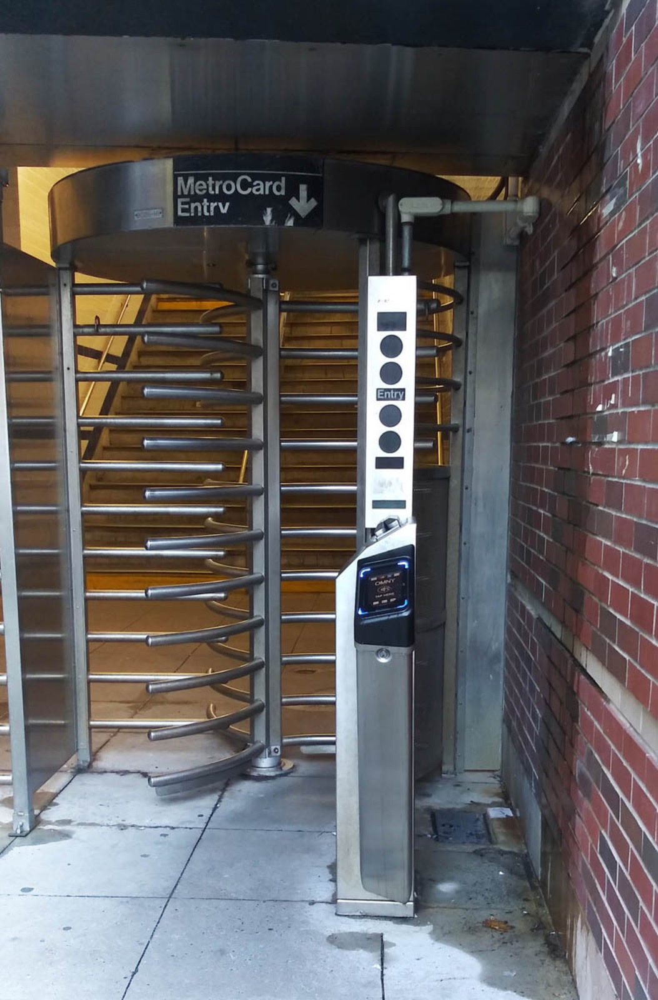

# Rate-limit & abuse testing

*Testing whether an API actually enforces rate limits means hammering a login or search endpoint and checking for a real, server-side 429 - and whether the limit is scoped per account, per IP, or both, since per-account-only never catches one attacker spraying many accounts from one source.*

> TaskFlight's login form has a friendly client-side message: "too many attempts, please wait a moment,"
> which appears after five failed tries in the browser. A tester, authorized to test the sandbox, opens the
> network tab and sends the exact same login request directly - bypassing the form entirely - six, ten,
> twenty times in a row. If the server answers `200`/`401` every single time with no refusal at all, that
> friendly message was never a control. It was a courtesy the UI extended to a browser that chose to obey
> it, and nothing stopped a request sent any other way. Rate-limit testing is the discipline of finding out,
> deliberately and on a system you are authorized to test, whether a limit like that actually lives on the
> server - enforced against every caller regardless of how the request arrives - or whether it only ever
> lived in the one client polite enough to check.

> **In real life**
>
> Picture a subway station's entry gate: a set of heavy steel turnstile arms mounted in a full-height frame,
> paired with a card reader. The gate does not care how politely you ask, how fast you walk up, or how many
> people are queued behind you - it physically permits exactly one body through per valid tap, and it will
> not rotate again until the next valid credential is presented. That is enforcement built into the gate
> itself, not a sign on the wall asking riders to only go through it once each. Now imagine the same station
> with a friendly paper sign instead - "please tap once and let the next rider through" - taped next to a
> turnstile with its arms removed. A well-behaved rider still taps and steps through politely. But nothing
> stops someone from simply walking through the open frame five times in a row, or a dozen people from
> walking through together after one single tap. The sign LOOKS like the same rule the real turnstile
> enforces. Only the physical gate - the one that does not care whether you intended to follow the rule -
> actually enforces it.

**Rate-limit and abuse testing**: Rate-limit and abuse testing is the practice of deliberately, and only on an authorized system, sending a burst of requests to an endpoint to determine whether the server itself enforces a cap on how many a single caller may make in a given window - as opposed to a limit that exists only as client-side UI behavior a direct request can simply skip. A correctly rate-limited endpoint returns a clear 429 Too Many Requests (ideally with a Retry-After or reset-time header) once a caller crosses its threshold, refusing further attempts until the window resets, regardless of whether the request came from the real UI, a script, or a replayed capture. Testing it well means checking THREE separate things, not one: that a limit exists at all (a burst that never gets refused is the base finding), that it is enforced PER THE RIGHT SCOPE (per account, per IP, or both - a login endpoint limited only per-account never notices one attacker spraying many different accounts from a single IP, since each account only ever sees one attempt), and that lockout behavior is reasonable (a limit so aggressive it locks out a legitimate user from one mistyped password is its own kind of finding, just as real as no limit at all). None of the three substitutes for the others.

## Finding the missing (or misscoped) limit

- **Send a short, deliberate burst - never a sustained real flood.** Enough requests to observe the
  behavior once (a dozen, not a thousand) against an authorized sandbox is the test; sustaining a large
  burst beyond what proves the point risks looking like - and functioning as - genuine abuse against a
  shared environment.
- **Target the endpoints that matter most.** Login (brute-force candidate), password reset (enumeration
  and abuse candidate), and any expensive search or export endpoint (resource-exhaustion candidate) are the
  highest-value places to test first.
- **Check for a real 429, not just a slowdown.** A clear, distinct too-many-requests response is the
  correct signal. Silence, a generic 500, or the request simply taking longer under load are all weaker,
  less trustworthy signals that something is limiting traffic on purpose.
- **Try the request from a source the UI does not use.** A direct API call, a different client, a
  slightly different header set - if a limit only trips when requests look exactly like the official UI's
  traffic, it may be a client-side courtesy rather than a server-side control.

## Per-account vs per-IP: the scope question a single test can miss

- **A login endpoint can rate-limit one account and still be wide open to credential spraying.** If the
  limit only counts failed attempts against a SINGLE account, an attacker who tries one password each
  against a thousand DIFFERENT accounts from one source never trips it - each account only ever sees one
  attempt.
- **A per-IP-only limit has its own gap.** A distributed attempt from many different source addresses can
  spread requests thin enough that no single IP ever crosses the threshold, even while the account being
  targeted receives far more attempts overall than the account-level limit was meant to allow.
- **The strongest posture checks both, and reports which scopes are actually enforced.** State plainly
  which of "per account," "per IP," or "combined/global" a tested endpoint enforces - a vague "there is a
  rate limit" leaves out exactly the information that determines whether a real credential-spraying attempt
  would actually be caught.

> **Tip**
>
> Test a login endpoint's rate limiting with two different bursts, not one: first, many attempts against a
> SINGLE account (to test per-account limiting), and second, one attempt each against many DIFFERENT
> accounts, all from the same source (to test per-IP/per-source limiting). A limit that catches the first
> burst but not the second is exactly the credential-spraying gap real attackers use - and a single burst
> against one account alone would never have revealed it.

> **Common mistake**
>
> A tester sends a burst of requests, notices the responses start taking noticeably longer under load, and
> concludes rate limiting is working. A slowdown under load is what happens to almost any endpoint given
> enough concurrent traffic - it is a side effect of load, not evidence of an intentional, enforced ceiling.
> The actual signal to look for is a clear, distinct refusal - a 429 status, ideally with a Retry-After or
> reset-time header - returned deliberately once a threshold is crossed. An endpoint that simply gets slower
> and slower with no refusal at any point has no rate limit; it has a performance ceiling it will eventually
> fall over past, which is a different problem with a different fix.


*NYC Subway turnstile equipt with OMNY - GK tramrunner RU, Wikimedia Commons, CC BY-SA 4.0. [Source](https://commons.wikimedia.org/wiki/File:NYC_Subway_turnstile_equipt_with_OMNY.jpg)*
- **MetroCard Entry - the credential this gate actually requires** — A rider needs a valid tap to proceed at all. This is the identity check every rate limit needs BEFORE it can decide whose count to increment - per account, per card, or per source.
- **The rotating steel arms - enforcement, not a request** — The gate physically permits one body through per valid tap; it does not ask nicely and hope riders comply. This is what a server-side 429 is: a refusal enforced at the gate itself, not a courtesy message a client chooses to display.
- **The reader's own entry panel** — The gate keeps its own account of activity at the point of entry, not trusting whatever a rider claims about how many times they have already passed - the same principle behind counting attempts server-side rather than trusting a client's own request-count header.
- **The OMNY contactless reader - ties a pass to an account, not just to the gate** — Tapping a specific card or device ties this pass to one identity. A rate limit scoped only to 'this gate' (the equivalent of per-IP alone) counts differently than one scoped to 'this card' (per-account) - a real system may need to watch both.

**Testing a login endpoint's rate limit for scope - press Play**

1. **Burst one account, many attempts** — Send several failed login attempts against a SINGLE tester-owned account in quick succession. Expect a 429 well before the burst grows large.
2. **Burst many accounts, one attempt each, same source** — Send one attempt each against several DIFFERENT tester-owned accounts, all from the same source. This tests per-IP/per-source scope, not per-account scope.
3. **Compare which burst got refused** — A limit that caught the first burst but not the second enforces per-account only - a real credential-spraying attempt across many accounts would sail straight through it.
4. **Report the scope explicitly, not just 'a limit exists'** — Name exactly which scope is enforced - per account, per IP, both, or neither - since that detail decides whether a real attacker's actual technique would be caught.

Here is that exact scope gap in runnable form - the same six login attempts, all from one source but
targeting six different accounts, checked once against a per-account-only limiter and once against a
per-IP limiter.

*Run it - a per-account vs per-IP rate-limit comparison (Python)*

```python
# Rate-limit / abuse-testing simulator - a login endpoint hammered from one
# IP using many different usernames. Compares a PER-IP limiter against a
# PER-ACCOUNT limiter to show why both are needed: a per-account-only limit
# never notices one attacker spraying many accounts from a single source.

LOGIN_ATTEMPTS = [
    ("203.0.113.9", "test_alice"),
    ("203.0.113.9", "test_bob"),
    ("203.0.113.9", "test_carol"),
    ("203.0.113.9", "test_dave"),
    ("203.0.113.9", "test_erin"),
    ("203.0.113.9", "test_frank"),
]

class Limiter:
    def __init__(self, capacity):
        self.capacity = capacity
        self.counts = {}

    def allow(self, key):
        used = self.counts.get(key, 0)
        if used >= self.capacity:
            return False
        self.counts[key] = used + 1
        return True

def run_per_account_only(attempts, capacity):
    limiter = Limiter(capacity)
    results = []
    for ip, username in attempts:
        allowed = limiter.allow(username)
        results.append((ip, username, allowed))
    return results

def run_per_ip(attempts, capacity):
    limiter = Limiter(capacity)
    results = []
    for ip, username in attempts:
        allowed = limiter.allow(ip)
        results.append((ip, username, allowed))
    return results

def report(label, results):
    print("== " + label + " ==")
    blocked = 0
    for ip, username, allowed in results:
        verdict = "200 OK" if allowed else "429 Too Many Requests"
        if not allowed:
            blocked += 1
        print("REQUEST=" + username + " IP=" + ip + " RESPONSE=" + verdict)
    print("  BLOCKED_COUNT=" + str(blocked) + " OF " + str(len(results)))
    print()
    return blocked

# A per-account limiter set to 5 tries PER ACCOUNT never trips here, because
# each of the 6 requests targets a DIFFERENT account - only one try each.
per_account_blocked = report(
    "Per-account limit only (5 attempts per ACCOUNT)",
    run_per_account_only(LOGIN_ATTEMPTS, capacity=5),
)

# The same 6 requests against a per-IP limiter set to 5 tries PER IP trips on
# the 6th request, because all 6 came from the same source IP regardless of
# which account each one targeted.
per_ip_blocked = report(
    "Per-IP limit (5 attempts per IP, any account)",
    run_per_ip(LOGIN_ATTEMPTS, capacity=5),
)

print("REQUESTS_TOTAL=" + str(len(LOGIN_ATTEMPTS)))
print("PER_ACCOUNT_BLOCKED=" + str(per_account_blocked))
print("PER_IP_BLOCKED=" + str(per_ip_blocked))

# The finding: a credential-spraying burst across many DIFFERENT accounts
# from one IP sails straight through a per-account-only limiter, and only a
# per-IP (or combined) limit actually catches it.
caught_the_spray = per_ip_blocked > 0 and per_account_blocked == 0
print("RESULT=" + ("PASS - per-IP limit caught the spray the per-account limit missed" if caught_the_spray else "FAIL"))
```

The identical comparison in Java - same six attempts, same two limiters, same result:

*Run it - a per-account vs per-IP rate-limit comparison (Java)*

```java
import java.util.*;

public class Main {
    static final String[][] LOGIN_ATTEMPTS = {
        {"203.0.113.9", "test_alice"},
        {"203.0.113.9", "test_bob"},
        {"203.0.113.9", "test_carol"},
        {"203.0.113.9", "test_dave"},
        {"203.0.113.9", "test_erin"},
        {"203.0.113.9", "test_frank"},
    };

    static class Limiter {
        int capacity;
        Map<String, Integer> counts = new LinkedHashMap<>();
        Limiter(int capacity) { this.capacity = capacity; }
        boolean allow(String key) {
            int used = counts.getOrDefault(key, 0);
            if (used >= capacity) return false;
            counts.put(key, used + 1);
            return true;
        }
    }

    static List<Object[]> runPerAccountOnly(String[][] attempts, int capacity) {
        Limiter limiter = new Limiter(capacity);
        List<Object[]> results = new ArrayList<>();
        for (String[] a : attempts) {
            String ip = a[0], username = a[1];
            boolean allowed = limiter.allow(username);
            results.add(new Object[]{ip, username, allowed});
        }
        return results;
    }

    static List<Object[]> runPerIp(String[][] attempts, int capacity) {
        Limiter limiter = new Limiter(capacity);
        List<Object[]> results = new ArrayList<>();
        for (String[] a : attempts) {
            String ip = a[0], username = a[1];
            boolean allowed = limiter.allow(ip);
            results.add(new Object[]{ip, username, allowed});
        }
        return results;
    }

    static int report(String label, List<Object[]> results) {
        System.out.println("== " + label + " ==");
        int blocked = 0;
        for (Object[] r : results) {
            String ip = (String) r[0], username = (String) r[1];
            boolean allowed = (Boolean) r[2];
            String verdict = allowed ? "200 OK" : "429 Too Many Requests";
            if (!allowed) blocked++;
            System.out.println("REQUEST=" + username + " IP=" + ip + " RESPONSE=" + verdict);
        }
        System.out.println("  BLOCKED_COUNT=" + blocked + " OF " + results.size());
        System.out.println();
        return blocked;
    }

    public static void main(String[] args) {
        int perAccountBlocked = report(
            "Per-account limit only (5 attempts per ACCOUNT)",
            runPerAccountOnly(LOGIN_ATTEMPTS, 5)
        );

        int perIpBlocked = report(
            "Per-IP limit (5 attempts per IP, any account)",
            runPerIp(LOGIN_ATTEMPTS, 5)
        );

        System.out.println("REQUESTS_TOTAL=" + LOGIN_ATTEMPTS.length);
        System.out.println("PER_ACCOUNT_BLOCKED=" + perAccountBlocked);
        System.out.println("PER_IP_BLOCKED=" + perIpBlocked);

        boolean caughtTheSpray = perIpBlocked > 0 && perAccountBlocked == 0;
        System.out.println("RESULT=" + (caughtTheSpray ? "PASS - per-IP limit caught the spray the per-account limit missed" : "FAIL"));
    }
}
```

### Your first time: Your mission: test one TaskFlight login endpoint for both limiting scopes

- [ ] Confirm authorization and create tester-owned accounts — On TaskFlight's own sandbox (or another system you are explicitly authorized to test), set up several tester-owned accounts specifically for this test.
- [ ] Burst one account with several failed attempts — Send a short, deliberate sequence of failed logins against a SINGLE tester-owned account. Expect a 429 well before the burst grows large.
- [ ] Burst many accounts, one attempt each, same source — Send one login attempt each against several DIFFERENT tester-owned accounts, all from your own single source. Expect this to ALSO be caught if the endpoint is properly scoped.
- [ ] Report which scope is actually enforced — State plainly whether the endpoint limits per account, per IP, both, or neither - naming the exact request counts and responses from both bursts as evidence.

You have now tested the one gap a single-burst rate-limit test always misses - whether an endpoint's limit
is scoped narrowly enough that a real credential-spraying attempt across many accounts would sail straight
through it.

- **A burst of requests from one caller all succeed with no refusal at any point, only a gradual slowdown.**
  That slowdown is load behavior, not rate limiting - it is not a deliberate, enforced ceiling. Report the burst size, duration, and the absence of any 429. The fix is a server-side cap per caller per window, with a clear rejection once it is exceeded.
- **A login endpoint correctly rate-limits repeated attempts against one account, but many single attempts spread across different accounts from the same source all succeed.**
  This is a scope gap: the limit is enforced per account only, missing per-IP/per-source enforcement. Report both burst results side by side - the caught one and the missed one - and recommend a combined or per-IP limit alongside the existing per-account one.
- **A rate limit locks a legitimate tester-owned account out for an extended period after a handful of genuine mistyped-password attempts.**
  An overly aggressive limit is its own finding, just as real as a missing one - report the exact attempt count and lockout duration observed, since a limit that punishes normal user error as harshly as a real attack has usability costs worth weighing.
- **A rate-limit test is reported as 'passed' after only one burst against a single account.**
  One burst against one account only tests per-account scope. Re-test with a second burst - one attempt each against several different accounts from the same source - before concluding the endpoint's rate limiting is complete.

### Where to check

- **Login and password-reset endpoints** - the classic brute-force and enumeration targets; test both
  per-account and per-source scope on each.
- **Any expensive search, export, or report endpoint** - cheap to call, potentially costly to run; confirm
  a burst against it is refused with a 429 well before the underlying resource is stressed.
- **Response headers on a limited call** - well-designed APIs return remaining-quota and reset-time headers
  alongside a 429; note their presence or absence as part of the finding.
- **[[api-and-modern-security/owasp-api-security-top-10-2023/unrestricted-resource-consumption]]** - rate
  limiting is one of four independent ceilings that category covers (alongside payload size, pagination, and
  cost-based abuse); this note goes deeper specifically on rate-limit scope and abuse-testing technique.
- **[[api-and-modern-security/rest-api-attacks/ssrf]]** - a URL-fetching feature is worth testing for both
  destination validation (SSRF) and repeated-call abuse (this note); the two checks are independent on the
  same endpoint.

### Worked example: a login endpoint that catches one attack pattern and misses another

1. A tester, authorized to test TaskFlight's sandbox, creates six tester-owned accounts specifically for
   this test: test_alice through test_frank.
2. First burst: the tester sends six failed login attempts against test_alice alone, in quick succession.
   The sixth attempt returns 429 Too Many Requests - the per-account limit works correctly.
3. Second burst: the tester sends one login attempt each against all six different accounts, all from the
   same source, in the same short window. All six return normally (200 with a 401 body) - none are refused.
4. The finding is filed as a rate-limiting scope gap: the login endpoint enforces a limit per account but
   not per source, so a real credential-spraying attempt - one guess each against many different accounts -
   would not be caught by the control that appeared, from the first burst alone, to be working correctly.
5. Both bursts, their exact requests, and their responses are included as evidence, with a recommendation
   for a combined or per-source limit alongside the existing per-account one.

**Quiz.** A tester sends six failed login attempts against a single tester-owned account and the sixth is correctly refused with a 429. What should the tester conclude about this login endpoint's rate limiting?

- [ ] Rate limiting is fully verified for this endpoint - a 429 was observed, so the control works
- [x] Only that per-account limiting works - a second burst (one attempt each against several different accounts from the same source) is needed to confirm per-IP/per-source scope, since a per-account-only limit would not catch that pattern
- [ ] The endpoint cannot have a scope gap, since any working rate limit necessarily covers every possible attack pattern
- [ ] No further testing is needed because a single burst is sufficient to characterize an endpoint's rate limiting

*A single burst against one account only tests per-account scope. A real credential-spraying attacker often tries one password each against many different accounts from a single source specifically to avoid tripping a per-account limit - a scope that first burst never exercises. Confirming full coverage requires a second, independent burst: one attempt each against several different accounts, all from the same source, checking whether THAT pattern also gets refused. Options one, three, and four all treat one burst as proof of complete coverage, which is exactly the gap a per-account-only limit hides.*

- **Rate-limit and abuse testing** — Deliberately sending a burst of requests to an authorized endpoint to check whether the SERVER enforces a request cap - not just whether a client-side UI displays a polite warning that a direct request can simply skip.
- **The real signal to look for** — A clear, distinct 429 Too Many Requests, ideally with Retry-After or reset-time headers - a gradual slowdown under load is a performance side effect, not evidence of an enforced ceiling.
- **Per-account vs per-IP scope** — A per-account-only limit never notices one attacker spraying many DIFFERENT accounts from a single source, since each account only ever sees one attempt. A per-IP-only limit can miss a distributed attempt spread across many sources. Testing both scopes independently is the only way to know which gap (if any) exists.
- **The two-burst test** — Burst one: many attempts against ONE account (tests per-account scope). Burst two: one attempt each against MANY accounts from the SAME source (tests per-IP/per-source scope). A limit can catch one and completely miss the other.
- **Overly aggressive limiting** — A rate limit so strict it locks out a legitimate user after a couple of genuine mistyped-password attempts is its own finding - just as real as a missing limit, worth reporting with the exact attempt count and lockout duration observed.
- **Burst size discipline** — A short, deliberate burst - enough to observe the behavior once - is the correct test on an authorized system. Sustaining a large burst well beyond that point risks functioning as genuine abuse against a shared environment.

### Challenge

On TaskFlight's sandbox (or another system you are explicitly authorized to test), create several
tester-owned accounts. Run two separate bursts against the login endpoint: first, several failed attempts
against a single account; second, one attempt each against several different accounts, all from your own
source. Record which burst (if either) gets refused with a 429, and write up the result naming exactly
which scope - per account, per IP, both, or neither - the endpoint actually enforces, with both bursts'
requests and responses as evidence.

### Ask the community

> I've started testing login endpoints with two separate bursts - many attempts against one account, then one attempt each against several different accounts from the same source - specifically to catch the per-account-only rate-limit gap that a single burst would miss. For people who test APIs regularly: what other request patterns do you use to probe for scope gaps like this (rotating source IPs, spacing requests just under a window's reset, alternating between a handful of endpoints that might share or might NOT share a limiting bucket), and how do you keep a legitimately authorized test from ever looking like real credential-spraying traffic to whoever is monitoring the environment?

Finding the scope gaps a single burst never reveals, while keeping an authorized test clearly
distinguishable from the real attack pattern it is modeling, is exactly the balance this kind of testing
needs - hearing how other testers calibrate both is the fastest way to get it right.

- [OWASP API4:2023 Unrestricted Resource Consumption - the official category page (rate limiting is one of its four ceilings)](https://owasp.org/API-Security/editions/2023/en/0xa4-unrestricted-resource-consumption/)
- [OWASP - Blocking Brute Force Attacks](https://owasp.org/www-community/controls/Blocking_Brute_Force_Attacks)

🎬 [What is Rate Limiting? Explained in 2 minutes](https://www.youtube.com/watch?v=xHxalUnhwm8) (2 min)

- Rate-limit testing means deliberately sending a short, authorized burst and checking for a real, server-side 429 - never trusting a client-side warning a direct request can simply skip.
- A gradual slowdown under load is a performance side effect, not evidence of an enforced limit; the actual signal is a clear, distinct refusal at a threshold.
- Test both scopes independently: many attempts against one account (per-account), and one attempt each against many accounts from one source (per-IP/per-source) - a limit can catch one pattern and completely miss the other.
- A per-account-only limit never notices credential spraying across many different accounts, since each account only ever sees a single attempt.
- An overly aggressive limit that locks out legitimate users on ordinary mistakes is its own finding, just as real as a missing one.
- Keep bursts short and deliberate, only on systems you are explicitly authorized to test - enough to observe the behavior once, never a sustained flood against a shared environment.


## Related notes

- [[Notes/api-and-modern-security/rest-api-attacks/ssrf|SSRF]]
- [[Notes/api-and-modern-security/owasp-api-security-top-10-2023/unrestricted-resource-consumption|Unrestricted resource consumption]]
- [[Notes/api-and-modern-security/owasp-api-security-top-10-2023/the-full-api-list|The full API list]]


---
_Source: `packages/curriculum/content/notes/api-and-modern-security/rest-api-attacks/rate-limit-and-abuse-testing.mdx`_
