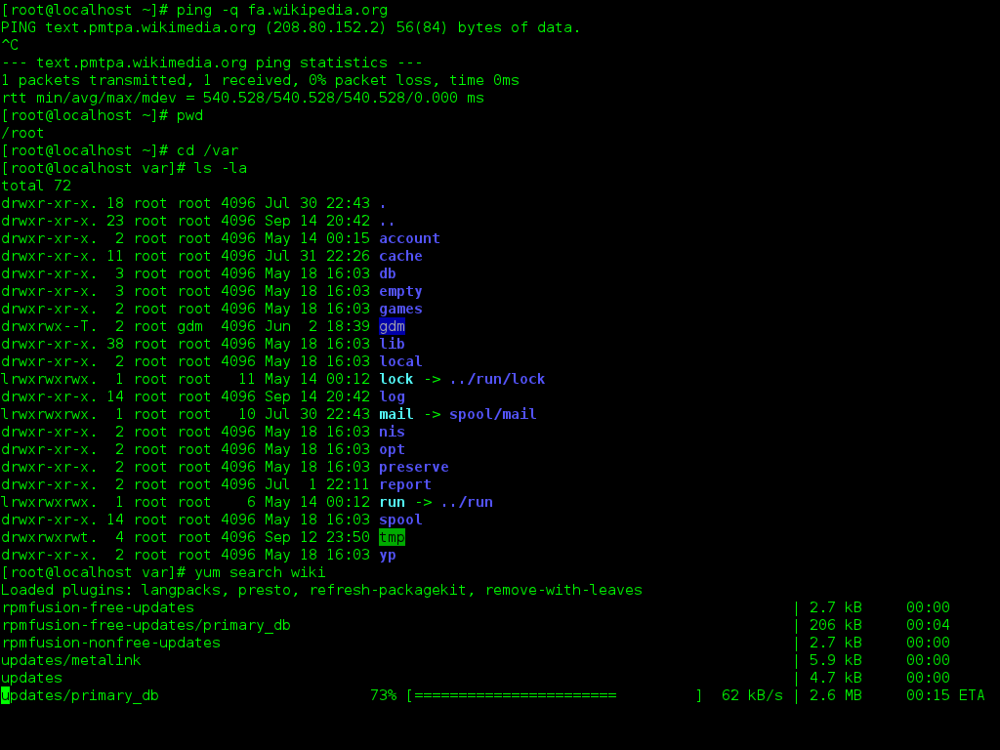

# Running Postman collections headlessly

*Turn a collection from a click-only artifact into a repeatable command, with explicit environments, useful exit codes, and no desktop app required.*

> A collection that only runs when Priya clicks Runner is not automation. It is a ritual with orange buttons. Headless execution makes the same requests and assertions runnable by a terminal, a teammate, or a build agent.

> **In real life**
>
> The command line is a railway timetable: the route, stops, and inputs are written down, so the journey does not depend on one driver remembering the sequence.

**Headless collection execution**: Headless collection execution runs a Postman Collection without the desktop UI. Newman runs exported Collection v2.1 JSON from Node.js; Postman's newer CLI is the path for v3 collections. The collection still owns requests and scripts, while command-line arguments select environments, data, reporters, and timeouts.

## The smallest honest run

Install Newman as a pinned development dependency, export a v2.1 collection, and invoke it through the project-local binary: `npm install --save-dev newman` then `npx newman run postman/smoke.postman_collection.json -e postman/local.postman_environment.json`. Pinning keeps laptops and CI on the same runner version. A successful process exits zero; assertion or runtime failures produce a non-zero result that automation can use.

> **Tip**
>
> Commit non-secret collection and environment templates. Inject tokens through CI secrets or command-line variables; never export a real token into Git and call it “test data.”

> **Common mistake**
>
> Do not add `--suppress-exit-code` to make a red run look green. That flag deliberately returns zero even after failures, which converts a quality gate into decorative theatre.


*Linux command-line, Bash, GNOME Terminal — The GNOME Project, GPL 2.0 or later, via Wikimedia Commons. [Source](https://commons.wikimedia.org/wiki/File:Linux_command-line._Bash._GNOME_Terminal._screenshot.png)*
- **Typed command** — The repeatable entry point: command and options are visible instead of hidden in UI state.
- **Process output** — A headless runner reports each request and assertion where humans and CI logs can inspect them.
- **Live progress and completion** — The terminal owns the process until it completes and returns an exit status that automation can trust.

**From exported collection to signal**

1. **Export v2.1 JSON** — Store the runnable collection beside the code.
2. **Select environment** — Point Newman at non-secret values for this target.
3. **Run headlessly** — Requests and post-response scripts execute without Postman Desktop.
4. **Read exit status** — Zero passes; a failure makes automation stop.

*Run it - model a headless run's exit decision (Python)*

```python
results = [("health", True), ("list tickets", True), ("schema", False)]
for name, passed in results:
    print(f"{name}: {'PASS' if passed else 'FAIL'}")
exit_code = 0 if all(passed for _, passed in results) else 1
print(f"exit_code={exit_code}")
```

*Run it - model the same exit decision (Java)*

```java
import java.util.*;
public class Main {
  public static void main(String[] args) {
    Map<String, Boolean> results = new LinkedHashMap<>();
    results.put("health", true); results.put("list tickets", true); results.put("schema", false);
    results.forEach((name, passed) -> System.out.println(name + ": " + (passed ? "PASS" : "FAIL")));
    int exitCode = results.values().stream().allMatch(Boolean::booleanValue) ? 0 : 1;
    System.out.println("exit_code=" + exitCode);
  }
}
```

### Your first time: Your mission: make one collection terminal-runnable

- [ ] Export the collection as v2.1 JSON — Newman does not run Postman's v3 collection format.
- [ ] Create a secret-free environment template — Keep placeholders, not credentials, in version control.
- [ ] Run with npx newman run — Use the project dependency rather than an unknown global install.
- [ ] Intentionally break one assertion — Confirm the shell receives a non-zero exit status.

- **Newman rejects the collection format.**
  Export Collection v2.1 JSON, or migrate the workflow to Postman CLI for v3 collections.
- **Variables resolve in Postman but are blank in Newman.**
  Pass the correct environment with -e and check variable scope; desktop current values are not magically in the export.
- **CI passes although assertions fail.**
  Remove -x/--suppress-exit-code and ensure the shell is not swallowing the command's status.

### Where to check

- The collection export format and committed file diff.
- The exact `-e`, `--env-var`, timeout, and data options in the command.
- The final Newman summary and shell exit status.

### Worked example: a smoke collection leaves the desktop

The team exports `smoke.postman_collection.json`, commits `ci.postman_environment.json` with `baseUrl` but no key, and runs `npx newman run ... -e ... --env-var apiKey=$API_KEY`. A deliberately failing status assertion returns non-zero. The same command now works locally and in CI; only the secret source changes.

**Quiz.** Why is --suppress-exit-code dangerous in a CI quality gate?

- [ ] It disables network access
- [x] It can return success even when tests fail
- [ ] It deletes the environment
- [ ] It converts v2.1 to v3

*CI primarily trusts the process status. Suppressing failure status hides a broken suite from the pipeline.*

- **What does headless mean here?** — The collection runs without Postman Desktop through a command-line runner.
- **What collection format does Newman expect?** — Exported Postman Collection v2.1 JSON; current Postman docs direct v3 users toward Postman CLI.
- **Why use npx with a dev dependency?** — It runs the repository-pinned Newman version consistently.

### Challenge

Add a `test:api:smoke` package script around a secret-free collection. Break one assertion and capture the non-zero status, then restore it.

### Ask the community

> My exported collection runs in Postman but Newman reports `[exact error]`; collection format is `[version]` and command is `[redacted command]`.

Include format and command options, but redact keys and tokens.

- [Postman Docs — Install and run Newman](https://learning.postman.com/docs/reference/newman-cli/installing-running-newman)
- [Postman Docs — Newman command reference](https://learning.postman.com/docs/reference/newman-cli/newman-options)

🎬 [Postman Newman Tutorial | Postman API Testing — SDET Unicorns](https://www.youtube.com/watch?v=ee-T6skoMjM) (12 min)

- A collection becomes automation only when a repeatable command can run it without desktop state.
- Newman is for exported v2.1 JSON; current v3 workflows should evaluate Postman CLI.
- Keep environment templates in Git and inject secrets at runtime.
- Preserve Newman's non-zero failure status so CI can enforce the result.


## Related notes

- [[Notes/api-test-automation/api-tests-in-ci-newman/newman-and-ci-pipeline|Newman + CI pipeline]]
- [[Notes/api-test-automation/api-tests-in-ci-newman/reporting-api-results|Reporting API results]]
- [[Notes/api-testing-fundamentals/postman-and-curl/collections-and-environments|Collections & environments]]


---
_Source: `packages/curriculum/content/notes/api-test-automation/api-tests-in-ci-newman/running-postman-collections-headlessly.mdx`_
