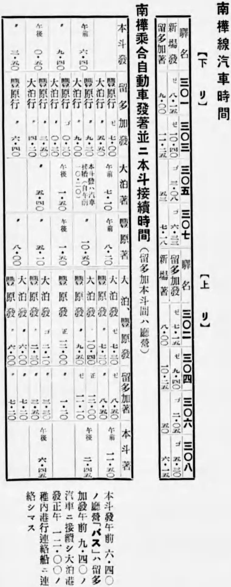

# Scheduled API regression

*Use scheduled runs for broad, time-based confidence without confusing them with per-change gates or production monitoring.*

> Running 900 regressions on every typo is slow. Running them “whenever someone remembers” is archaeology. A schedule buys breadth at a deliberate cadence.

> **In real life**
>
> A railway timetable separates a recurring service from an emergency dispatch. A nightly regression is scheduled transport; a pull-request smoke gate is immediate feedback. They serve different passengers.

**Scheduled API regression**: Scheduled API regression is a broader automated suite triggered by time rather than a code change. It detects drift, expiry, shared-environment changes, and failures outside working hours, but it complements rather than replaces fast per-change checks and purpose-built production monitoring.

## Choose cadence from risk, not superstition

Nightly is common, not sacred. Schedule mutable shared environments often enough to catch meaningful drift, shard or rotate expensive coverage, and give every failure an owner. Postman's scheduled collection runs execute in Postman Cloud; local files are unavailable unless uploaded, schedules are not included when collections are imported/exported, and current docs list authentication and usage constraints. A CI cron running Newman is a separate option with your runner's network access.

> **Tip**
>
> Record the collection revision, environment, start time, and test-data identity on every scheduled run. “Nightly failed” without those coordinates is a weather report from an unknown city.

> **Common mistake**
>
> Do not let scheduled tests mutate shared data without unique names and cleanup. Yesterday's leftovers will impersonate today's product bug.


*Nanka Railway timetable, pre-1946 — Nanka Railway, public domain, via Wikimedia Commons. [Source](https://commons.wikimedia.org/wiki/File:Nanka_Railway_timetable_(Karafuto).jpg)*
- **Published route** — The suite scope is known before the run rather than chosen ad hoc at midnight.
- **Repeated times** — A cadence creates comparable runs and reveals drift across days.
- **Every stop has a place** — Each test family needs an owner and a defined environment.

**A useful scheduled regression loop**

1. **Time trigger** — Cron or Postman schedule starts at the agreed cadence.
2. **Create unique run id** — Names and data become traceable and collision-resistant.
3. **Run broad suite** — Exercise slower paths omitted from PR smoke.
4. **Report + alert owner** — Send actionable evidence, not undifferentiated noise.
5. **Clean up** — Remove only resources created by this run.

*Run it - plan rotating nightly coverage (Python)*

```python
suites = ["auth", "projects", "tickets", "attachments"]
for day in range(1, 8):
    focus = suites[(day - 1) % len(suites)]
    print(f"night {day}: smoke + {focus}")
```

*Run it - plan the same rotation (Java)*

```java
public class Main {
  public static void main(String[] args) {
    String[] suites = {"auth", "projects", "tickets", "attachments"};
    for (int day = 1; day <= 7; day++) {
      System.out.println("night " + day + ": smoke + " + suites[(day - 1) % suites.length]);
    }
  }
}
```

### Your first time: Your mission: design a seven-night regression

- [ ] Separate always-run smoke from rotating depth — Critical checks stay daily while expensive families rotate.
- [ ] Generate a unique run id — Use it in every created entity and report.
- [ ] Assign a named failure owner — An alert without ownership becomes inbox mulch.
- [ ] Test cleanup against partial failure — Cleanup must know exactly what this run created.

- **Nightly fails only after several days.**
  Inspect leftover data, expiring credentials, rate limits, and schedule overlap before blaming randomness.
- **Postman Cloud cannot reach the target.**
  Use a reachable environment or run the schedule on a CI/self-hosted runner with the required network path.
- **Alerts are ignored.**
  Reduce duplicates, attach the failing request/assertion and run revision, and route to a specific owner.

### Where to check

- Trigger history, timezone, overlap, and collection revision.
- Postman scheduled-run test results, errors, and Console log, or equivalent CI logs.
- Data created under the run id and whether cleanup completed.

### Worked example: nightly breadth without a four-hour wall

Every night runs auth and read-only smoke. Monday focuses project lifecycle, Tuesday ticket filters, Wednesday attachments, then the rotation repeats. Each entity begins `reg-{runId}-`; cleanup queries only that prefix. A summary links failures to the exact collection commit and owner.

**Quiz.** What does scheduled regression replace?

- [ ] All pull-request checks
- [ ] Production observability
- [x] Neither; it complements both
- [ ] Unit tests only

*A time-triggered suite finds drift and broad regressions, but it is slower than per-change feedback and is not continuous production observability.*

- **Schedule trigger** — Time-based rather than change-based execution.
- **Why unique run ids?** — They prevent collisions and make cleanup and diagnosis traceable.
- **Postman scheduled runs execute where?** — In Postman Cloud, with documented network, file, auth, and usage constraints.

### Challenge

Write a weekly matrix that keeps critical smoke nightly, rotates four expensive domains, forbids overlap, and assigns an owner plus cleanup rule.

### Ask the community

> Our scheduled run fails on `[cadence/environment]`; run revision, run id, and first failing request are `[details]`.

Share the first causal failure, not thirty downstream casualties.

- [Postman Docs — Automate collection runs on a schedule](https://learning.postman.com/docs/tests-and-scripts/running-collections/scheduling-collection-runs)
- [Postman Docs — View scheduled run results](https://learning.postman.com/docs/tests-and-scripts/running-collections/viewing-scheduled-collection-runs/)

🎬 [Postman — How to Write and Automate API Tests in Postman](https://www.youtube.com/watch?v=oXW-C2bM0wE) (13 min)

- Scheduled regression adds broad time-based coverage; it does not replace PR gates or monitoring.
- Choose cadence and rotation from risk, runtime, and environment cost.
- Use unique run identities and scoped cleanup to prevent cross-run pollution.
- Make every scheduled failure traceable to a revision, environment, first failure, and owner.


## Related notes

- [[Notes/api-test-automation/api-tests-in-ci-newman/newman-and-ci-pipeline|Newman + CI pipeline]]
- [[Notes/api-test-automation/api-tests-in-ci-newman/reporting-api-results|Reporting API results]]
- [[Notes/api-test-automation/real-world-api-suites/test-pyramids-for-apis|Test pyramids for APIs]]


---
_Source: `packages/curriculum/content/notes/api-test-automation/api-tests-in-ci-newman/scheduled-api-regression.mdx`_
