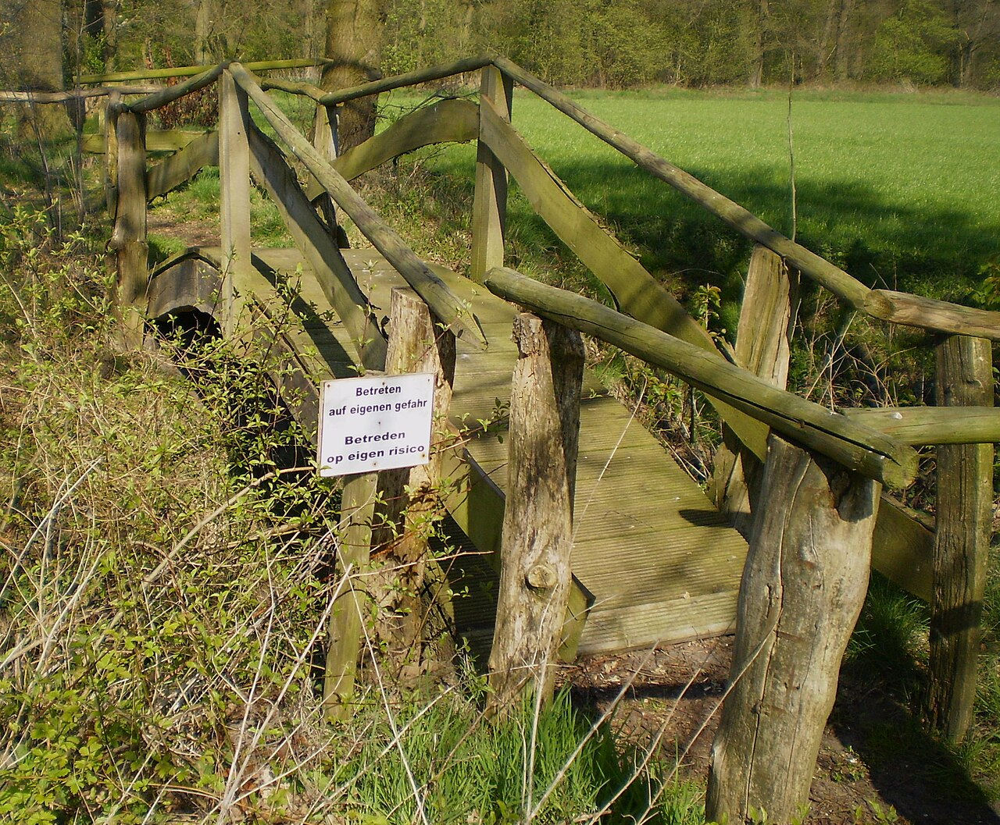

# Breaking-change detection

*Not every API diff breaks a consumer, and some tiny diffs absolutely do. Learn compatibility direction, expand-and-contract delivery, and evidence-based release gates.*

> A one-line diff can delete a field used by a million clients. A thousand-line diff can add optional documentation and break nobody. Counting changed lines is how you confidently measure the wrong object.

> **In real life**
>
> A bridge warning matters because traffic already depends on the route. Compatibility asks who is crossing, in which direction, and whether the changed structure still carries them.

**Breaking change**: A breaking API change makes a previously valid consumer interaction fail against the new provider or makes a new consumer request incompatible with the deployed provider. Detection therefore needs contract semantics and version context, not text diff size alone.

## Direction decides the verdict

- Removing or renaming a response field can break consumers that read it.
- Tightening request validation can reject requests that previously worked.
- Adding a required request field breaks old consumers; adding an optional response field usually should not.
- Changing type, nullability, enum membership, or status behavior can break generated and handwritten clients.
- A schema diff reports risk; verified consumer contracts report demonstrated usage.

> **Tip**
>
> Use expand-and-contract: add the replacement compatibly, migrate and observe consumers, then remove the old shape only after evidence says nobody needs it.

> **Common mistake**
>
> Calling every diff breaking creates alert fatigue; calling every additive diff safe ignores closed schemas, strict decoders, enums, and operational behavior. Classify with contract semantics and real consumers.


*Bridge with warning sign — Apdency, Wikimedia Commons, public domain. [Source](https://commons.wikimedia.org/wiki/File:Bridge_with_warning_sign.jpg)*
- **Published warning** — A compatibility report must name the exact risk, not merely say something changed.
- **Existing route** — Consumers already depend on the old crossing; migration must account for them.
- **The route already extends beyond view** — Expand-and-contract accounts for existing travelers before changing the crossing beneath them.

**Expand, migrate, contract**

1. **Detect the proposed interface diff** — Classify request and response compatibility in the correct direction.
2. **Add the replacement without removal** — Old and new consumers can both operate.
3. **Publish and verify contracts** — Prove provider versions satisfy known consumer interactions.
4. **Migrate and observe consumers** — Use version/deployment evidence, not calendar optimism.
5. **Remove the old shape** — Contract only after no supported consumer still relies on it.

*Run it — classify a small response-schema diff (Python)*

```python
before = {"id": {"required": True}, "status": {"required": True}, "note": {"required": False}}
after = {"id": {"required": True}, "state": {"required": True}, "note": {"required": False}, "priority": {"required": False}}

for field, rule in before.items():
    if field not in after:
        print(f"BREAKING RISK: removed response field {field!r}")
for field, rule in after.items():
    if field not in before:
        label = "BREAKING RISK" if rule["required"] else "usually compatible"
        print(f"{label}: added response field {field!r}")

# BREAKING RISK: removed response field 'status'
# BREAKING RISK: added response field 'state'
# usually compatible: added response field 'priority'
```

*Run it — classify a small response-schema diff (Java)*

```java
import java.util.*;

public class Main {
  public static void main(String[] args) {
    Map<String, Boolean> before = new LinkedHashMap<>();
    before.put("id", true); before.put("status", true); before.put("note", false);
    Map<String, Boolean> after = new LinkedHashMap<>();
    after.put("id", true); after.put("state", true); after.put("note", false); after.put("priority", false);
    before.forEach((field, required) -> {
      if (!after.containsKey(field)) System.out.println("BREAKING RISK: removed response field '" + field + "'");
    });
    after.forEach((field, required) -> {
      if (!before.containsKey(field)) System.out.println((required ? "BREAKING RISK" : "usually compatible") + ": added response field '" + field + "'");
    });
  }
}

/* BREAKING RISK: removed response field 'status'
   BREAKING RISK: added response field 'state'
   usually compatible: added response field 'priority' */
```

### Your first time: Your mission: judge a proposed API diff

- [ ] Capture old and proposed contracts — Use normalized machine documents from version control.
- [ ] Classify request and response directions — Widening input and widening output have different consumer effects.
- [ ] Run known consumer contracts — Distinguish theoretical risk from demonstrated use.
- [ ] Write an expand-and-contract sequence — Name when old behavior can be removed and what evidence permits it.

You have a migration decision, not just a colorful diff.

- **The diff tool flags formatting-only changes.**
  Parse and normalize the contract before semantic comparison.
- **A supposedly safe added field breaks a strict client.**
  Check whether the response schema or decoder rejects unknown fields; compatibility depends on actual constraints.
- **Nobody knows whether the old field is still used.**
  Use consumer contract versions and production telemetry; absence of complaints is not evidence of absence.

### Where to check

- Semantic contract-diff output with rule and location.
- Consumer contract verification across deployed and candidate versions.
- Client decoder behavior for unknown fields and enum values.
- Broker/environment records and telemetry before removal.

### Worked example: rename status to state without detonating mobile clients

1. A provider wants to rename response field `status` to `state`.
2. Direct replacement is breaking because released clients read `status`.
3. The provider first returns both fields with consistent values.
4. New clients move to `state`; contracts and telemetry show supported versions no longer require `status`.
5. Only then does a separate release remove `status`, with the removal gated by verified evidence.

**Quiz.** Which is the safest way to rename a response field used by existing clients?

- [ ] Rename it in one deployment
- [x] Add the new field, migrate and verify consumers, then remove the old field later
- [ ] Change only the docs
- [ ] Wait one week and delete it

*Expand-and-contract preserves compatibility while consumers migrate and makes removal depend on evidence rather than hope.*

- **Semantic diff** — Compares parsed contract meaning rather than text or line count.
- **Expand-and-contract** — Add compatible replacement, migrate consumers, then remove old behavior.
- **Risk vs proof** — Schema diff finds potential breakage; consumer verification shows known interactions affected.

### Challenge

Model a required-field rename as two releases. For each release, state old-consumer/new-provider and new-consumer/old-provider compatibility, then name the evidence needed before removal.

### Ask the community

> Our API diff changes `[old]` to `[new]`. Known consumers are `[versions]`, strictness is `[behavior]`, and verification says `[result]`. What migration gate are we missing?

Compatibility is directional; include both provider and consumer versions.

- [Pact FAQ — breaking changes and expand-and-contract](https://docs.pact.io/faq)
- [OpenAPI Specification — official versions](https://spec.openapis.org/oas/)

🎬 [Contract testing Ask Me Anything — PactFlow](https://www.youtube.com/watch?v=FxrFj7xvQ24) (33 min)

- Breaking change detection is semantic and directional, not a line-count exercise.
- Request and response compatibility must be classified separately.
- Schema diffs expose risk; consumer contracts expose demonstrated dependency.
- Expand-and-contract keeps old and new consumers working during migration.
- Removal should depend on verified contracts and deployment evidence, not elapsed time.


## Related notes

- [[Notes/api-test-automation/contract-and-schema-testing/openapi-as-the-contract|OpenAPI as the contract]]
- [[Notes/api-test-automation/contract-and-schema-testing/consumer-driven-contracts|Consumer-driven contracts]]
- [[Notes/api-test-automation/contract-and-schema-testing/schema-validation|Schema validation]]


---
_Source: `packages/curriculum/content/notes/api-test-automation/contract-and-schema-testing/breaking-change-detection.mdx`_
