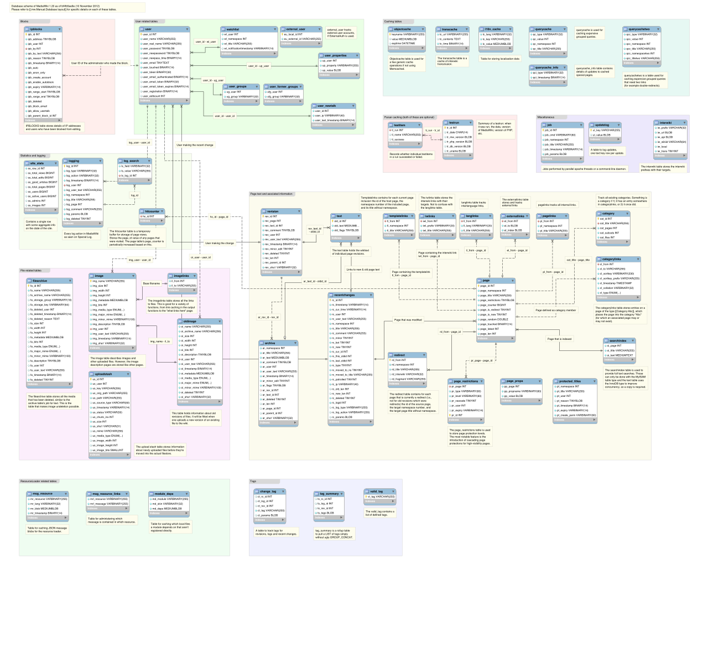

# Schema validation

*Schema validation checks structure, not whether the business did the right thing. Learn JSON Schema's sharp edges, useful keywords, and how to produce failures a human can actually repair.*

> A parcel can fit the approved box, carry the approved label, and still contain three bricks instead of your laptop. Schema validation proves the box; functional tests still have to inspect the delivery.

> **In real life**
>
> A customs form checks required boxes, formats, and allowed categories. It cannot decide whether the declared gift is thoughtful. JSON Schema enforces structure and constraints, not business intent.

**Schema validation**: JSON Schema validation evaluates a JSON instance against schema assertions such as type, required, enum, numeric or string limits, and nested applicators. An instance is valid only when every applicable asserted constraint succeeds.

## Assertions worth automating

- `type`, `required`, and `properties` establish the basic object shape.
- `enum`, `const`, and range or length keywords constrain values.
- `items` applies a schema to array members; Draft 2020-12 uses `prefixItems` for tuple positions.
- `additionalProperties` applies a schema to unmatched object members; it is not false by default.
- `format` is annotation by default in Draft 2020-12 unless format assertion is enabled.

> **Tip**
>
> Include the instance path, schema path, keyword, expected constraint, and actual value in every failure. "Schema invalid" is a shrug wearing a build badge.

> **Common mistake**
>
> Assuming `properties` makes fields mandatory. It only describes fields when present; list mandatory names under `required`.


*MediaWiki database schema — Timo Tijhof, Wikimedia Commons, CC BY 4.0. [Source](https://commons.wikimedia.org/wiki/File:MediaWiki_1.20_(44edaa2)_database_schema.svg)*
- **Each table has a shape** — A schema defines members and constraints for one instance location.
- **Relationships nest** — References and applicators compose small schemas into deeper structures.
- **One mismatch is local** — Good validators report the precise instance and schema paths, not just a red page.

**Schema validation without mystery**

1. **Declare the dialect** — Select the meta-schema your validator must implement.
2. **Validate the schema** — Catch malformed or unknown structure before judging data.
3. **Validate the instance** — Evaluate every applicable assertion at its instance location.
4. **Collect useful errors** — Keep paths and failed keywords instead of a boolean alone.
5. **Run business assertions separately** — Schema-valid data can still be functionally wrong.

*Run it — tiny structural validator (Python)*

```python
def validate(ticket):
    errors = []
    required = ["id", "status", "priority"]
    for field in required:
        if field not in ticket:
            errors.append(f"$.{field}: required property is missing")
    if "status" in ticket and ticket["status"] not in {"open", "done"}:
        errors.append(f"$.status: {ticket['status']!r} is not in enum ['open', 'done']")
    if "priority" in ticket and not isinstance(ticket["priority"], int):
        errors.append(f"$.priority: expected integer, got {type(ticket['priority']).__name__}")
    return errors

for error in validate({"id": "T-7", "status": "paused", "priority": "high"}):
    print(error)

# $.status: 'paused' is not in enum ['open', 'done']
# $.priority: expected integer, got str
```

*Run it — tiny structural validator (Java)*

```java
import java.util.*;

public class Main {
  static List<String> validate(Map<String, Object> ticket) {
    List<String> errors = new ArrayList<>();
    for (String field : List.of("id", "status", "priority"))
      if (!ticket.containsKey(field)) errors.add("$." + field + ": required property is missing");
    if (!Set.of("open", "done").contains(ticket.get("status")))
      errors.add("$.status: value is not in enum [open, done]");
    if (!(ticket.get("priority") instanceof Integer))
      errors.add("$.priority: expected integer");
    return errors;
  }
  public static void main(String[] args) {
    validate(Map.of("id", "T-7", "status", "paused", "priority", "high")).forEach(System.out::println);
  }
}

/* $.status: value is not in enum [open, done]
   $.priority: expected integer */
```

### Your first time: Your mission: validate one response shape

- [ ] Write a small schema with an explicit dialect — Include type, properties, and required.
- [ ] Create one valid and three invalid instances — Break presence, type, and enum separately.
- [ ] Run a dialect-compatible validator — Configure format assertion only if you intend to enforce it.
- [ ] Inspect error paths — Reject messages that do not locate the failure.

The validator now proves exactly one kind of correctness, and you know its boundary.

- **A missing field passes.**
  Add the field name to required; properties alone does not require presence.
- **An unexpected field passes.**
  Decide whether evolution permits it; if not, set additionalProperties or unevaluatedProperties deliberately.
- **An invalid email format passes.**
  Draft 2020-12 treats format as annotation by default; enable the format-assertion vocabulary in supported tooling or add an explicit assertion.

### Where to check

- The `$schema` URI and validator dialect support.
- `required` separately from `properties`.
- `additionalProperties` and composition behavior.
- Error output paths and whether all errors or only the first are collected.

### Worked example: the optional field nobody meant to make optional

1. A ticket schema defines `properties.id.type` as `string`.
2. A response without `id` passes validation.
3. The team blames the validator, but it followed the schema exactly.
4. Adding `required: [id]` turns absence into an assertion failure.
5. A separate functional assertion still checks that the ID identifies the created ticket.

**Quiz.** A schema lists a field under properties but not required. What happens when the field is absent?

- [ ] Validation fails
- [x] Validation normally passes because properties does not require presence
- [ ] The field becomes null
- [ ] The validator invents a default

*The properties keyword applies a subschema when that property exists. Required is the separate assertion that demands presence.*

- **properties vs required** — properties constrains present members; required demands named members exist.
- **additionalProperties default** — Extra properties are permitted unless the schema constrains them.
- **format in Draft 2020-12** — Annotation by default; assertion requires explicit support/configuration.

### Challenge

Build five instances around one schema: valid, missing required, wrong type, invalid enum, and extra field. Predict each verdict before running and explain any surprise by pointing at a keyword.

### Ask the community

> My JSON Schema `[dialect]` unexpectedly accepts/rejects `[minimal instance]`. Validator and version: `[tool]`. Which keyword semantics am I misreading?

Post the smallest schema and instance together; screenshots hide the useful paths.

- [JSON Schema Draft 2020-12 Validation — official](https://json-schema.org/draft/2020-12/json-schema-validation)
- [Draft 2020-12 release notes — official](https://json-schema.org/draft/2020-12/release-notes)

🎬 [How to validate incoming requests using OpenAPI — Zuplo](https://www.youtube.com/watch?v=POkuwh0iAbc) (4 min)

- Schema validation proves structural constraints, not business correctness.
- Declare the dialect and use compatible tooling.
- Properties does not imply required, and extra properties are allowed by default.
- Draft 2020-12 format is annotation unless assertion is explicitly enabled.
- Useful failures locate both the instance and the failed schema keyword.


## Related notes

- [[Notes/api-test-automation/contract-and-schema-testing/openapi-as-the-contract|OpenAPI as the contract]]
- [[Notes/api-test-automation/contract-and-schema-testing/breaking-change-detection|Breaking-change detection]]
- [[Notes/api-testing-fundamentals/finding-api-bugs/validating-against-the-spec|Validating against the spec]]


---
_Source: `packages/curriculum/content/notes/api-test-automation/contract-and-schema-testing/schema-validation.mdx`_
