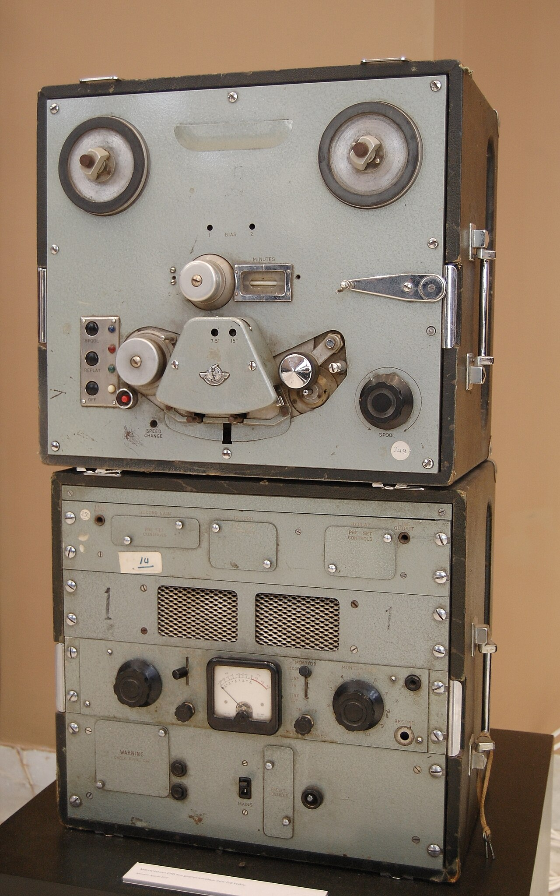

# Record & playback

*WireMock can proxy a real API, capture observed exchanges as stub mappings, and replay them locally—but recordings are raw material that must be filtered, sanitized, reviewed, and maintained.*

> Recording an API is seductive: click Record, send traffic, click Stop, and suddenly stub files appear.
> The machine has done your homework! Except it also copied yesterday's IDs, timestamps, headers,
> possibly credentials, and every accidental request you made while the red light was on. Playback is
> fast; trustworthy playback begins with editing.

> **In real life**
>
> A reel-to-reel recorder captures exactly what reaches the microphone—not the clean performance you
> meant to make. Coughs, wrong notes, and private background chatter become part of the tape. WireMock's
> recorder is equally literal: it proxies real traffic and turns what it observed into mappings.

**record and playback**: Record and playback is a service-virtualization workflow where a proxy forwards requests to a real target, captures selected request/response exchanges as reusable stub mappings, then serves those mappings locally without contacting the target. A recording is an observed example, not proof of the provider's full contract.

## What actually happens

1. WireMock starts proxying to an allowed target.
2. Recording begins with filters that limit methods and paths.
3. The client sends representative requests through WireMock.
4. WireMock forwards them and records the resulting exchanges.
5. Recording stops; mappings are produced and become immediately playable.
6. A human removes secrets and noise, generalizes unstable values, and reviews matchers.

WireMock supports recording and snapshotting; both produce mappings from observed traffic. Recorded
JSON and XML requests get content-aware matching by default, and repeat requests can be represented
as scenarios. None of that knows whether a captured authorization token is safe to commit.

> **Tip**
>
> Use an allowlist before recording: one host, a narrow path pattern, test accounts, and synthetic data.
> Sanitizing after capture is necessary; preventing sensitive traffic from entering the recording is
> better.

> **Common mistake**
>
> Treating a captured `200` as the entire contract. The recorder saw one happy example. It did not see
> required-field validation, `401`, `404`, rate limiting, pagination edges, or the provider's next
> version. Add those deliberately from the specification.


*EMI reel-to-reel tape recorder — Badseed, CC BY-SA 3.0. [Source](https://commons.wikimedia.org/wiki/File:EMI_reel-to-reel_tape_recorder.JPG)*
- **Source reel** — The real provider is the source. Recording depends on exactly what it emits during the session.
- **Tape path** — WireMock proxies traffic through a controlled path where exchanges can be selected and captured.
- **Captured mapping** — The take-up reel holds observed examples, not every response the provider could produce.
- **Monitor and edit** — Review matchers, bodies, secrets, and unstable data before a recording becomes a test fixture.

**From live traffic to trustworthy fixture**

1. **Constrain** — Allow one target and only the paths and headers needed.
2. **Record** — Proxy synthetic test traffic and capture representative exchanges.
3. **Sanitize** — Remove credentials, personal data, volatile IDs, dates, and irrelevant headers.
4. **Generalize** — Keep strict contract fields while relaxing unstable incidental values.
5. **Augment and review** — Add missing errors from the contract and review the diff like code.

*Sanitize a captured exchange*

```python
captured = {
    "request": {"path": "/users/42", "authorization": "Bearer secret-token"},
    "response": {"id": 42, "email": "real.person@example.com", "created_at": "2026-07-17T10:03:00Z"},
}

safe = {
    "request": {"path_pattern": "/users/[0-9]+", "authorization": "Bearer test-token"},
    "response": {"id": 1001, "email": "learner@example.test", "created_at": "<ISO-8601>"},
}

for section in safe:
    print(section, safe[section])
```

*Flag volatile captured fields*

```java
import java.util.*;

public class Main {
    public static void main(String[] args) {
        var captured = new LinkedHashMap<String, String>();
        captured.put("Authorization", "Bearer secret-token");
        captured.put("created_at", "2026-07-17T10:03:00Z");
        captured.put("Content-Type", "application/json");

        var volatileNames = Set.of("authorization", "created_at", "set-cookie", "request-id");
        captured.forEach((name, value) -> {
            String verdict = volatileNames.contains(name.toLowerCase()) ? "REVIEW" : "KEEP";
            System.out.printf("%-6s %s%n", verdict, name);
        });
    }
}
```

### Your first time: Record safely, then prove playback is offline

- [ ] Use a test tenant and synthetic records — Never learn sanitization by leaking real customer data into Git.
- [ ] Configure target and request filters — Capture only the required host, path pattern, method, and meaningful headers.
- [ ] Record a small representative flow — Stop promptly; fewer deliberate exchanges are easier to review than a traffic dump.
- [ ] Sanitize, disconnect, and replay — Disable network access to the provider and prove the edited mapping still serves the test.

- **Playback returns 404 for a different test user.**
  The recorded matcher captured a literal ID or token. Generalize only the volatile part while keeping method, path shape, and meaningful fields strict.
- **A secret scanner flags the mappings directory.**
  Revoke the exposed credential immediately, remove it from history, then add automated fixture scanning and safer recording inputs.
- **Several identical requests replay surprising responses in sequence.**
  The recorder represented repeats as a scenario. Review scenario state or disable repeat-as-scenarios when one stable response is intended.
- **The recording passes while the provider changed.**
  Playback is isolated by design. Run contract-drift checks and a small live integration suite separately.

### Where to check

- `mappings/` for request matchers and response definitions.
- `__files/` for extracted large or binary response bodies.
- `/__admin/mappings` and the recorder UI for loaded mappings.
- Git secret scanning, fixture schema validation, and the provider's current contract diff.

### Worked example: capturing a safe exchange-rate fixture

1. Restrict recording to a test provider host and `GET /rates/*`; capture `Accept`, not `Authorization`.
2. Request two synthetic currencies through the proxy, then stop recording.
3. Replace volatile response timestamps with stable examples and change literal currency paths into
   intentional separate mappings. Add documented `404` and `429` cases manually.
4. Disconnect from the network and replay the consumer suite. In a separate scheduled job, validate
   those fixtures against the provider's current schema.

**Quiz.** What does a successful recorded 200 response prove about the provider contract?

- [ ] Every documented response is covered
- [x] Only that one observed exchange occurred in that session
- [ ] The provider cannot introduce breaking changes
- [ ] Authentication data is safe to commit

*A recording is evidence of one observed exchange. It must be sanitized and supplemented with documented error and edge cases; it does not replace a contract or live integration checks.*

- **Recording** — Proxy live requests and create mappings from the observed exchanges when recording stops.
- **Playback** — Serve captured mappings locally; no explicit playback mode is required once mappings are loaded.
- **Sanitize** — Remove or replace credentials, personal data, volatile IDs, timestamps, cookies, and request IDs.
- **Generalize** — Relax only unstable values while keeping contract-significant matching strict.
- **Observed example** — Evidence of what happened once, not a complete specification of what may happen.

### Challenge

Record two requests to a safe demo API, inspect every generated matcher and body, then make playback
work with a different synthetic user while offline. Document every field you generalized and why.

### Ask the community

> I recorded `[endpoint]` using synthetic data. These fields were captured: `[list]`; I sanitized `[list]` and generalized `[list]`. What contract-significant field might I be weakening?

Share sanitized mapping fragments only. Never paste real tokens to ask whether they are sensitive.

- [WireMock — Record and Playback](https://wiremock.org/docs/record-playback/)
- [WireMock — Proxying](https://wiremock.org/docs/proxying/)
- [WireMock — Request matching](https://wiremock.org/docs/request-matching/)

🎬 [Fake It until You Make It! API Integration Testing with Containers & WireMock — Oleg Nenashev](https://www.youtube.com/watch?v=YEc6EwiHrjM) (44 min)

- Recordings are observed examples and raw fixture material, not complete API contracts.
- Constrain capture before it begins and use synthetic data to reduce privacy and secret risk.
- Sanitize secrets and volatile data, then generalize only fields that are truly incidental.
- Review generated mappings as code and add documented errors the happy recording never saw.
- Prove offline playback, then use separate contract and live checks to detect provider drift.


## Related notes

- [[Notes/api-test-automation/mocking-and-service-virtualization/wiremock-hands-on|WireMock hands-on]]
- [[Notes/api-test-automation/mocking-and-service-virtualization/simulating-errors-latency-and-chaos|Simulating errors, latency & chaos]]
- [[Notes/api-test-automation/contract-and-schema-testing/breaking-change-detection|Breaking-change detection]]


---
_Source: `packages/curriculum/content/notes/api-test-automation/mocking-and-service-virtualization/record-and-playback.mdx`_
