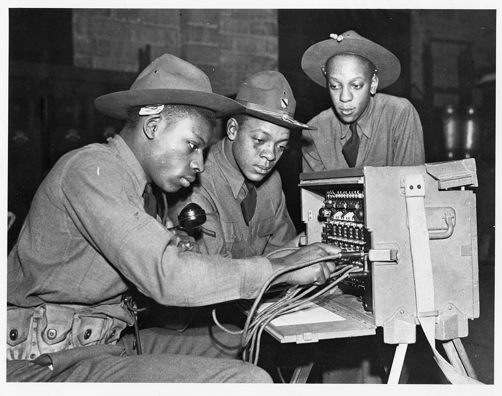

# WireMock hands-on

*WireMock is an HTTP server you control: match an incoming request, return a deliberate response, inspect what arrived, and reset state so the next test starts clean.*

> WireMock is a tiny HTTP service with a suspiciously useful superpower: it tells the exact lie your
> test asks for. Point the application at it, teach it that `GET /rates/NPR` returns one controlled
> response, run the behavior, then inspect what the application actually sent. No payment gateway was
> bothered during the making of this test.

> **In real life**
>
> A manual telephone switchboard does not imitate the entire telephone network. An operator connects
> one incoming line to one chosen destination by placing the correct plug in the correct socket.
> WireMock does the same routing with request matchers: method, path, header, or body in; selected stub
> response out.

**WireMock**: WireMock is an open-source HTTP mock server for defining request-to-response stub mappings, verifying received requests, recording traffic, and injecting delays or faults. It can run inside JVM tests, as a standalone JAR, in Docker, or as a remote service. The application under test must use WireMock's base URL instead of the real dependency.

## The smallest useful mapping

WireMock's Java DSL expresses the same two halves as its JSON admin API:

```
stubFor(get(urlPathEqualTo("/rates/NPR"))
  .withHeader("Accept", equalTo("application/json"))
  .willReturn(okJson("{\"currency\":\"NPR\",\"rate\":133.40}")));
```

- **Request matcher:** `GET`, path `/rates/NPR`, and the required `Accept` header.
- **Response definition:** status `200`, JSON content type, and a controlled body.
- **Priority:** when several mappings match, lower numeric priority wins; unspecified mappings use
  WireMock's default priority.
- **Unmatched request:** WireMock returns `404`. Treat that as evidence that the test or mapping is
  wrong, not as a reason to add `anyUrl()` until the red light goes away.

> **Tip**
>
> Match only what matters to the contract. Matching an entire JSON body byte-for-byte makes harmless
> field order or whitespace changes break the test; matching too little lets a malformed request earn
> a cheerful `200`. Method, path, required headers, and meaningful JSON fields are the usual boundary.

> **Common mistake**
>
> Pointing the test at `localhost:8080` in one place and leaving the production URL hard-coded in
> another. The suite passes because nobody checks WireMock's request journal, while the real sandbox
> quietly receives your test traffic. Assert the configured base URL and verify the expected request.


*Portable telephone switchboard operators — U.S. Army Signal Corps, public domain. [Source](https://commons.wikimedia.org/wiki/File:3_men_working_on_a_portable_phone_switchboard.jpg)*
- **Incoming request** — The handset carries a specific call, just as method, URL, headers, and body describe one HTTP request.
- **Request matcher** — The operator chooses the socket; WireMock selects the highest-priority mapping that matches.
- **Stub wiring** — Each cable is an explicit mapping between an input pattern and a controlled destination response.
- **Request journal** — The other operators can inspect what was connected; WireMock records received requests for verification and debugging.

**One WireMock-backed test**

1. **Start and reset** — Start an isolated server and clear mappings and requests.
2. **Register the mapping** — Describe the meaningful request and controlled response.
3. **Inject the base URL** — Configure the application to call WireMock, never the real provider.
4. **Exercise the application** — Call the application's public behavior, not WireMock directly.
5. **Assert and verify** — Assert the outcome, then inspect the request journal when interaction matters.

*Match requests like a tiny WireMock*

```python
mappings = [
    {"method": "GET", "path": "/rates/NPR", "status": 200, "body": "NPR=133.40"},
    {"method": "ANY", "path": "*", "status": 404, "body": "No stub matched"},
]

def serve(method, path):
    for stub in mappings:
        method_ok = stub["method"] in ("ANY", method)
        path_ok = stub["path"] in ("*", path)
        if method_ok and path_ok:
            return stub["status"], stub["body"]

for request in [("GET", "/rates/NPR"), ("POST", "/rates/NPR")]:
    status, body = serve(*request)
    print(request, "->", status, body)
```

*Run the same matcher in Java*

```java
import java.util.*;

public class Main {
    record Stub(String method, String path, int status, String body) {}

    static Stub serve(List<Stub> mappings, String method, String path) {
        return mappings.stream()
            .filter(s -> (s.method().equals("ANY") || s.method().equals(method))
                      && (s.path().equals("*") || s.path().equals(path)))
            .findFirst().orElseThrow();
    }

    public static void main(String[] args) {
        var mappings = List.of(
            new Stub("GET", "/rates/NPR", 200, "NPR=133.40"),
            new Stub("ANY", "*", 404, "No stub matched")
        );
        for (String method : List.of("GET", "POST")) {
            Stub hit = serve(mappings, method, "/rates/NPR");
            System.out.println(method + " -> " + hit.status() + " " + hit.body());
        }
    }
}
```

### Your first time: Stub one dependency end to end

- [ ] Start WireMock on a random or dedicated test port — Use the official JUnit integration, standalone JAR, or Docker image; avoid a port shared by parallel tests.
- [ ] Register one exact mapping — Match the method, URL path, and one header or body field that the contract requires.
- [ ] Inject WireMock's base URL — Log or assert the effective URL before the application call.
- [ ] Assert outcome and request — Check the application's response first; verify the downstream request only if it is part of the requirement.

- **WireMock returns 404 although the mapping exists.**
  Inspect the unmatched-request diff and compare method, path vs full URL, query parameters, headers, and JSON matching rules.
- **The wrong stub responds.**
  Two mappings overlap. Make matchers more specific or assign explicit priorities; remember that priority 1 outranks 5.
- **Tests pass alone but fail in parallel.**
  They share a server, port, or request journal. Use per-test instances or isolate mappings and reset safely between tests.
- **Verification finds calls from a previous test.**
  Reset requests or the full server state during setup; do not rely on test execution order.

### Where to check

- `GET /__admin/requests/unmatched` or the library's unmatched-request diagnostics.
- `GET /__admin/mappings` to see loaded mappings, matchers, IDs, and priorities.
- `GET /__admin/requests` to inspect the request journal and exact received traffic.
- The application's effective dependency base URL and test logs.

### Worked example: proving the client sends the required correlation ID

1. Register a `POST /notifications` stub requiring `Content-Type: application/json` and an
   `X-Correlation-Id` header matching a non-empty pattern.
2. Configure the ticket service's notification base URL to the WireMock server.
3. Create a ticket through the ticket service. Assert that it reports notification accepted.
4. Verify one downstream request with the expected ticket ID and correlation header. Then reset the
   journal. If the header disappears in a refactor, the mapping no longer matches and the test fails
   with the actual unmatched request available for diagnosis.

**Quiz.** Two WireMock mappings match the same request. One has priority 1 and the other priority 5. Which response is selected?

- [ ] Priority 5, because the larger number wins
- [x] Priority 1, because lower numeric priority wins
- [ ] Both responses are concatenated
- [ ] Selection is random

*WireMock treats lower numeric values as higher priority. Explicit priorities are useful for a specific mapping plus a lower-priority catch-all response.*

- **Stub mapping** — A request matcher paired with a response definition.
- **Unmatched default** — WireMock normally returns 404 when no mapping matches.
- **Priority** — Lower numeric values win; unspecified mappings use the default priority.
- **Request journal** — Recorded incoming requests used for verification and diagnosis.
- **Test isolation** — Separate server state or reliable resets so mappings and requests cannot leak between tests.

### Challenge

Create a specific mapping for `GET /tickets?status=open` and a low-priority catch-all JSON `404`.
Send one matching and two deliberately wrong requests. Use the unmatched-request diagnostics to
explain each mismatch without weakening the specific mapping.

### Ask the community

> My WireMock request did not match. Mapping: `[paste]`. Actual unmatched request: `[paste]`. I expected `[field]` to match because `[reason]`.

Include both sides. "WireMock returns 404" without the mapping and actual request is a mystery novel.

- [WireMock — Stubbing](https://wiremock.org/docs/stubbing/)
- [WireMock — Request matching](https://wiremock.org/docs/request-matching/)
- [WireMock — Verifying requests](https://wiremock.org/docs/verifying/)

🎬 [Setup WireMock Standalone Server Locally — Create Basic JSON Stub — Amod Mahajan](https://www.youtube.com/watch?v=kIgl7Yxmd4M) (14 min)

- A WireMock mapping is a deliberate request matcher paired with a controlled response.
- Inject and assert the mock base URL so tests never leak to a real dependency.
- Match contract-significant details without coupling to irrelevant whitespace or field order.
- Use the request journal and unmatched-request diagnostics before weakening a mapping.
- Isolate or reset server state so parallel tests cannot share mappings or history.


## Related notes

- [[Notes/api-test-automation/mocking-and-service-virtualization/stubs-mocks-and-fakes|Stubs, mocks & fakes]]
- [[Notes/api-test-automation/mocking-and-service-virtualization/record-and-playback|Record & playback]]
- [[Notes/api-test-automation/mocking-and-service-virtualization/simulating-errors-latency-and-chaos|Simulating errors, latency & chaos]]


---
_Source: `packages/curriculum/content/notes/api-test-automation/mocking-and-service-virtualization/wiremock-hands-on.mdx`_
