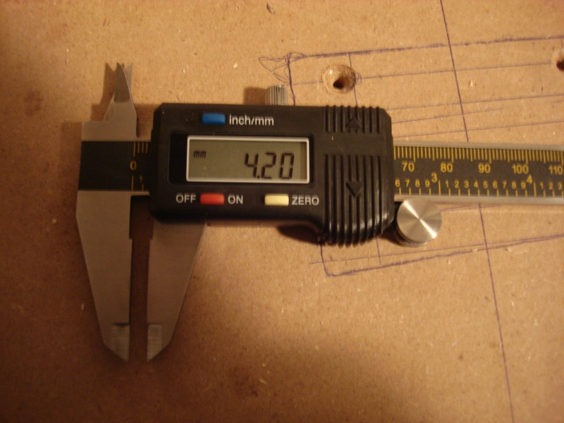

# Validating against the spec

*A response that 'looks reasonable' isn't the bar - the bar is the documented contract. Checking an actual field's type, presence, and value against the OpenAPI spec is what turns a hunch into a citable finding.*

> A machinist doesn't decide a part is "close enough" by eyeballing it next to the drawing - they put
> calipers on it and read a number against the tolerance written on the blueprint. "Looks about right"
> and "measures 4.20mm against a spec that says 4.00mm ± 0.05mm" are two completely different
> conversations. Checking an API response against its spec is the same move: stop eyeballing, measure
> the actual field against the actual documented contract.

> **In real life**
>
> A blueprint doesn't just describe what a part should look like in general - it specifies exact
> dimensions and tolerances, and a machinist's calipers exist specifically to turn "does this part
> match the drawing" into a number you can check, not a judgment call. An API's OpenAPI spec plays the
> same role: it's not a rough description, it's a contract with exact field names, types, and allowed
> values. Validating against it means measuring, not eyeballing.

**Validating against the spec**: Validating against the spec means checking an API's actual response against its documented contract (an OpenAPI/Swagger spec, or any written schema) field by field - correct field names, correct types, correct enum values, nothing required missing, nothing undocumented silently added. A response can look reasonable and still fail this check; it can look odd and still pass it. The spec, not your intuition, is the standard being measured against.

## What "the spec" actually promises, field by field

- **Field presence** — is every field the spec marks `required` actually in the response? A missing
  required field is a contract violation even if everything else present looks fine.
- **Field type** — does a field documented as a string actually arrive as a string, not a number or
  a stringified number? Type drift is one of the most common and most easily-missed violations,
  because a "wrong type" value often still looks fine printed on a screen.
- **Enum values** — if the spec lists `status` as one of a closed set of values, does the response
  ever return something outside that set? Even a plausible-looking new value is a violation if the
  spec didn't declare it.
- **Undocumented fields** — a field present in the response that the spec never mentions at all.
  Not automatically a security problem, but it's still a contract gap: nothing promised that field
  exists, so nothing guarantees it keeps existing.
- **The request side too** — validating against the spec isn't only about responses; a request the
  spec says is valid should be accepted, and the reverse (see
  [[api-testing-fundamentals/finding-api-bugs/negative-api-tests]]) should be rejected.

> **Tip**
>
> When BuggyAPI (or any spec-first API) generates its OpenAPI document from the same schema code the
> server validates against, the docs literally can't drift from the runtime behavior by design — which
> means a mismatch you find between the live response and the published spec is almost never "the docs
> are just out of date." Treat it as a real finding first, not an assumption to explain away.

> **Common mistake**
>
> Judging a response as "fine" because it looks reasonable, without actually opening the spec and
> checking field by field. A response can be perfectly plausible-looking and still violate the
> contract in a way that only shows up once a client is generated straight from that spec and stops
> matching what the server actually sends.


*Vernier caliper, photo by Zach Hoeken — Wikimedia Commons, CC BY-SA 2.0. [Source](https://commons.wikimedia.org/wiki/File:Vernier_caliper_(363800655).jpg)*
- **The digital readout — the actual measured value** — 4.20mm, read directly off the instrument, not estimated. This is the equivalent of the real value that actually came back in an API response — a fact, not an impression.
- **The pencil-marked lines on the wood — the documented plan** — Someone wrote down, in advance, what this piece is supposed to measure. That's the spec's role — a documented expectation that exists BEFORE the measurement, not a story invented to fit the result afterward.
- **The caliper jaws — the act of actually measuring** — The jaws physically contact the part; there's no eyeballing step in between. Validating against a spec means running an actual comparison — field name, type, value — not judging a response by whether it looks about right.

**Turning a response into a spec-validation verdict**

1. **Open the documented contract first** — The OpenAPI/Swagger spec, before looking at any real response — deciding what 'correct' means up front, the same way a blueprint exists before the part is measured.
2. **Send the request and capture the real response** — Status code, headers, and the full body — you need the actual measurement, not a paraphrase of it.
3. **Walk the spec's fields one by one against the response** — Required? Present. Type declared? Matches. Enum declared? Value is inside it.
4. **Walk the response's fields back against the spec** — The reverse direction catches something the first pass can't: fields present in the response the spec never declared at all.
5. **Cite the exact mismatch, not a general impression** — 'Spec says X, response has Y, for field Z' is a finding. 'The status field looked weird' is not.

The check is mechanical on purpose — walk the spec's fields, compare each one, and cite exactly
what doesn't match:

*Run it — measuring a real response against its documented spec (Python)*

```python
def validate_against_spec(instance, spec):
    """Tiny schema checker -- stands in for a real OpenAPI/JSON Schema validator."""
    errors = []
    for field, rule in spec.items():
        if rule.get("required") and field not in instance:
            errors.append(f"{field}: required by the spec but missing from the response")
            continue
        if field not in instance:
            continue
        value = instance[field]
        expected_type = rule.get("type")
        if expected_type == "string" and not isinstance(value, str):
            errors.append(f"{field}: spec says string, response has {type(value).__name__}")
        if expected_type == "integer" and not isinstance(value, int):
            errors.append(f"{field}: spec says integer, response has {type(value).__name__}")
        if "enum" in rule and value not in rule["enum"]:
            errors.append(f"{field}: spec enum is {rule['enum']}, response has {value!r}")
    return errors

# The documented contract (a stripped-down stand-in for a real OpenAPI schema)
ticket_spec = {
    "id": {"type": "string", "required": True},
    "status": {"type": "string", "required": True, "enum": ["open", "in_progress", "blocked", "done", "cancelled"]},
    "priority": {"type": "string", "required": True, "enum": ["low", "medium", "high", "urgent"]},
    "number": {"type": "integer", "required": True},
}

# What the API actually sent back
actual_response = {
    "id": "6fa1c07e-2f34-4b1e-9c3a-5d2f8a91b0aa",
    "status": "open",
    "priority": "high",
    "number": "11",  # spec says integer; this API sent it as a string
}

problems = validate_against_spec(actual_response, ticket_spec)

print("=== Checking the real response against the documented spec ===")
if problems:
    print(f"{len(problems)} contract violation(s) found:")
    for p in problems:
        print(f"  - {p}")
else:
    print("Response matches the spec exactly.")

print()
print("Note what this DIDN'T check: whether 'open' is a sensible status, or")
print("whether the ticket even exists. Spec validation only asks one narrow")
print("question -- does the shape of the response match what was promised?")

# === Checking the real response against the documented spec ===
# 1 contract violation(s) found:
#   - number: spec says integer, response has str
#
# Note what this DIDN'T check: whether 'open' is a sensible status, or
# whether the ticket even exists. Spec validation only asks one narrow
# question -- does the shape of the response match what was promised?
```

The same idea, checked in the other direction — walking the response's OWN fields back against the
spec, which is the only way to catch something the spec never declared at all:

*Run it — catching an undocumented field the spec never promised (Java)*

```java
import java.util.*;

public class Main {
    // Spec field definition: type + whether required + optional enum values
    record FieldSpec(String type, boolean required, List<String> enumValues) {}

    static List<String> validateAgainstSpec(Map<String, Object> instance, Map<String, FieldSpec> spec) {
        List<String> errors = new ArrayList<>();
        for (var entry : spec.entrySet()) {
            String field = entry.getKey();
            FieldSpec rule = entry.getValue();
            if (rule.required() && !instance.containsKey(field)) {
                errors.add(field + ": required by the spec but missing from the response");
                continue;
            }
            if (!instance.containsKey(field)) continue;
            Object value = instance.get(field);
            if (rule.enumValues() != null && !rule.enumValues().contains(value)) {
                errors.add(field + ": spec enum is " + rule.enumValues() + ", response has '" + value + "'");
            }
        }
        // Undocumented fields: present in the response but not declared in the
        // spec at all -- a contract violation the required/enum checks above
        // never catch, because they only walk the SPEC's fields, not the
        // RESPONSE's.
        for (String field : instance.keySet()) {
            if (!spec.containsKey(field)) {
                errors.add(field + ": present in the response but not declared anywhere in the spec");
            }
        }
        return errors;
    }

    public static void main(String[] args) {
        Map<String, FieldSpec> projectSpec = new LinkedHashMap<>();
        projectSpec.put("id", new FieldSpec("string", true, null));
        projectSpec.put("key", new FieldSpec("string", true, null));
        projectSpec.put("name", new FieldSpec("string", true, null));
        projectSpec.put("status", new FieldSpec("string", true, List.of("active", "archived")));

        Map<String, Object> actualResponse = new LinkedHashMap<>();
        actualResponse.put("id", "b1e2c3d4-0000-0000-0000-000000000000");
        actualResponse.put("key", "OPS");
        actualResponse.put("name", "Ground Ops");
        actualResponse.put("status", "active");
        actualResponse.put("internal_score", 87); // never documented in the spec

        System.out.println("=== Checking a 'project' response against its documented spec ===");
        List<String> problems = validateAgainstSpec(actualResponse, projectSpec);
        if (problems.isEmpty()) {
            System.out.println("Response matches the spec exactly.");
        } else {
            System.out.println(problems.size() + " contract violation(s) found:");
            for (String p : problems) System.out.println("  - " + p);
        }

        System.out.println();
        System.out.println("An undocumented field isn't automatically a security leak, but it IS a");
        System.out.println("spec-validation finding: consumers who generated a client from the spec");
        System.out.println("have no typed way to read 'internal_score' at all, and it could vanish");
        System.out.println("or change shape with zero warning, because nothing promised it existed.");
    }
}

/* === Checking a 'project' response against its documented spec ===
   1 contract violation(s) found:
     - internal_score: present in the response but not declared anywhere in the spec

   An undocumented field isn't automatically a security leak, but it IS a
   spec-validation finding: consumers who generated a client from the spec
   have no typed way to read 'internal_score' at all, and it could vanish
   or change shape with zero warning, because nothing promised it existed. */
```

### Your first time: Your mission: measure one real endpoint against its own published spec

- [ ] Open BuggyAPI's own OpenAPI docs at /api/docs (or /api/v1/openapi.json for the raw spec) — This is the actual documented contract — generated straight from the same schema code the server validates against.
- [ ] Pick one response schema (a Ticket or Project, for example) and list every field with its declared type and any enum values — Write this down before you send anything — it's your measurement standard.
- [ ] Call the matching endpoint and capture the real response — The actual JSON, not a summary of it.
- [ ] Walk the spec's fields against the response: present, right type, value inside any enum — One field at a time, not a skim.
- [ ] Walk the response's fields back against the spec, looking for anything undocumented — This direction is easy to skip and catches a different category of finding.

You've practiced the two-directional check that turns "this response looks a little off" into a
specific, citable contract violation — spec-to-response for missing/wrong fields, response-to-spec
for undocumented ones.

- **A field's value matches the spec's TYPE but you're not sure if the actual VALUE makes sense (e.g. a valid-looking but suspicious enum value).**
  Spec validation and business-logic correctness are two different checks — a status of 'cancelled' on a ticket that was just created might be perfectly spec-valid (right type, right enum) while still being logically wrong. Flag it, but be precise about which check it actually failed.
- **You found an undocumented field, but you're not sure if it's worth reporting since 'it's not breaking anything.'**
  Report it anyway, clearly labeled as a spec-completeness finding rather than a functional bug — an undocumented field is a real gap even when nothing is currently broken, because any consumer generating a client from the spec has no typed, supported way to read it.
- **The live response and the published spec disagree, and you're tempted to assume the spec is just out of date.**
  Don't assume — check first whether the spec is generated from the same source the server validates against (BuggyAPI's is). If it is, a mismatch is a real runtime bug by definition, not a docs problem, and should be reported as such.

### Where to check

- **BuggyAPI's own docs at `/api/docs`** (Swagger UI) and **`/api/v1/openapi.json`** (the raw spec) —
  generated from the same schema code the server validates against, so it's a genuine source of
  truth, not a separate description that can silently drift.
- **A JSON Schema / OpenAPI validator library** (in whatever language you're comfortable in) — for
  checking many responses against a spec automatically instead of by hand once you're past the
  learn-the-shape-of-the-check stage this note covers.
- **[[api-testing-fundamentals/finding-api-bugs/negative-api-tests]]** — the request-side mirror of
  this check: does the API correctly REJECT a request that violates the spec, not just correctly
  accept one that follows it.
- **[[defect-management/writing-bug-reports/evidence]]** — once you've found a real spec mismatch,
  this is how to capture it (exact spec excerpt + exact response) so the report doesn't rely on
  anyone re-deriving what you found.

### Worked example: a spec mismatch that's easy to wave away, and shouldn't be

1. BuggyAPI's spec documents `due_date` on a ticket as nullable — a ticket with no due date should
   still return the field, set to `null`.
2. A tester calling the endpoint for a ticket that was created without a due date finds the
   `due_date` key isn't in the response body at all — not `null`, just absent entirely.
3. First instinct: "the practical effect is basically the same — either way there's no date to read —
   is this really worth a finding?" It's tempting to wave it away as equivalent.
4. Checked against the actual spec, though, it's unambiguous: a nullable field is documented to
   always be present, with `null` as one of its valid values. A client generated straight from that
   spec expects to be able to read `.due_date` and get `null`, not to have the key missing entirely.
5. Reported as a spec violation, citing the exact documented nullability, the exact endpoint, and the
   exact response received — precise enough that nobody reading the report has to go re-check the
   spec themselves to agree it's real.

**Quiz.** An API response includes a field the OpenAPI spec never mentions anywhere. The field's value looks harmless and nothing appears broken. Is this worth reporting as a finding?

- [ ] No — if the field isn't causing any visible problem, there's nothing to report
- [x] Yes — an undocumented field is a real contract gap even when nothing is currently broken, since any client generated from the spec has no supported way to read it and it could change or disappear with zero warning
- [ ] No, because spec validation only ever checks fields the spec explicitly requires, never fields beyond that list
- [ ] Yes, but only if the field contains sensitive-looking data

*The note walks through exactly this case: an undocumented field isn't automatically a security problem, but it IS a spec-completeness finding, because nothing promises that field exists in a stable, typed way for any consumer generating a client from the spec. Option one only checks for CURRENT visible breakage, missing the point that a spec's job is to promise stability going forward, not just describe today's response. Option three gets the direction of the check backwards — walking the response's OWN fields back against the spec (to catch undocumented ones) is one of the two directions this note explicitly teaches, not something spec validation skips. Option four narrows the reporting bar to a specific severity signal (sensitive data) when the note's actual bar is simpler: undocumented is enough on its own to be worth flagging, appropriately labeled.*

- **What 'validating against the spec' actually measures** — A real response's fields (presence, type, enum values) checked one by one against the documented contract — not a general impression of whether it 'looks right.'
- **The two directions of the check** — Spec-to-response (is everything the spec requires actually present and correctly typed?) and response-to-spec (is everything in the response actually documented, or is something undocumented sneaking in?).
- **Why type drift is easy to miss** — A value with the wrong type (a number sent as a string, for example) often still LOOKS fine printed on a screen — only an explicit type check against the spec catches it.
- **Is an undocumented field automatically a security bug?** — No — but it's still a real spec-completeness finding, because nothing promises the field is stable, typed, or will keep existing.
- **Why a spec generated from the same schema the server validates against matters** — It means the docs can't drift from runtime behavior by design — so a mismatch you find is almost always a real bug, not just outdated documentation.

### Challenge

Open BuggyAPI's OpenAPI spec (`/api/docs` or `/api/v1/openapi.json`) and pick one resource schema.
Call the matching endpoint and capture the real response. Walk the spec's fields against the
response (presence, type, enum), then walk the response's fields back against the spec (anything
undocumented). Write down every mismatch you find, citing the exact spec excerpt and the exact
response value for each.

### Ask the community

> I checked `[endpoint]`'s response against its documented spec and found `[field]` is `[what the spec says]` in the docs but `[what actually came back]` in the real response. Am I reading the spec correctly, and does this count as a genuine contract violation?

The most useful replies will double-check the exact spec wording with you before agreeing it's a
violation — some OpenAPI fields (nullable, optional vs. required-but-nullable) are easy to
misread if you're new to the spec format.

- [Swagger/OpenAPI — basic structure of an OpenAPI document](https://swagger.io/docs/specification/v3_0/basic-structure/)
- [The OpenAPI Specification v3.1 (the actual standard)](https://spec.openapis.org/oas/v3.1.0.html)
- [Understanding JSON Schema — the type/enum/required vocabulary OpenAPI builds on](https://json-schema.org/understanding-json-schema/)

🎬 [Zuplo — How to validate incoming requests using OpenAPI](https://www.youtube.com/watch?v=POkuwh0iAbc) (4 min)

- Validating against the spec means measuring an actual response field-by-field against the documented contract, not judging whether it 'looks reasonable.'
- Check both directions: spec-to-response (required fields present and correctly typed) and response-to-spec (nothing undocumented sneaking in).
- Type drift is the easiest violation to miss, because a wrong-type value often still looks fine at a glance.
- An undocumented field isn't automatically a security bug, but it's still a real spec-completeness finding worth reporting.
- When a spec is generated from the same schema the server validates against, a mismatch you find is a real bug — not 'the docs are just out of date.'


## Related notes

- [[Notes/api-testing-fundamentals/finding-api-bugs/testing-without-a-ui|Testing without a UI]]
- [[Notes/api-testing-fundamentals/finding-api-bugs/negative-api-tests|Negative API tests]]
- [[Notes/defect-management/writing-bug-reports/evidence|Evidence]]


---
_Source: `packages/curriculum/content/notes/api-testing-fundamentals/finding-api-bugs/validating-against-the-spec.mdx`_
