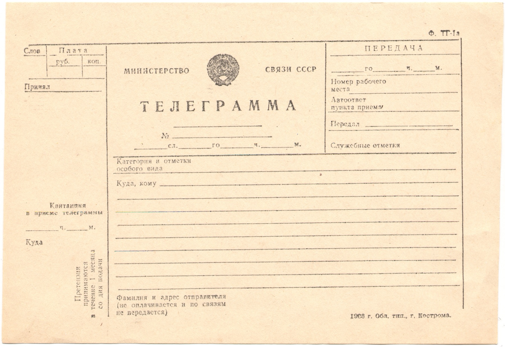

# Headers & bodies

*Headers are metadata about a message - who's asking, what format the body is in, how big it is - and the body is the actual payload. Testers who can name which header controls which behavior catch bugs that 'it just doesn't work' never finds.*

> The start line told you WHAT happened or WHAT was asked. The body, when there is one, carries the
> actual data. Headers sit between the two, and they're the part testers skip reading fastest - which
> is exactly backwards, because headers are where most of the INTERESTING behavior lives. Content
> negotiation, auth, caching, pagination, rate limits: none of that shows up in the body. It's all
> headers. Skip them and you're testing half an API.

> **In real life**
>
> A Soviet-era telegram form. Most of the paper is boxes: word count, the payment due, which clerk
> received it, which office transmitted it, the addressee's name. None of that is the MESSAGE - it's
> information ABOUT the message, needed to route it, bill it, and prove who sent it. The actual
> telegram text goes in a separate ruled block further down the form. And one box is stranger than the
> rest: "sender's name and address (not paid for, and not transmitted over the wire)" - it's written
> on the paper, filed for the record, but never actually sent to the recipient. That's not a quirk of
> 1980s bureaucracy - it's the exact shape of an HTTP header that a proxy strips before forwarding a
> request onward: present on the message as it exists at one hop, gone by the next.

**HTTP header**: An HTTP header is one 'Name: value' metadata line describing the message it's attached to (or the sender/receiver), distinct from the body which carries the actual payload. Headers can describe content (Content-Type, Content-Length), control caching (Cache-Control, ETag), carry credentials (Authorization), identify the client or server (User-Agent, Server), or pass custom application data (any X- or vendor-prefixed name). Some headers are 'end-to-end' (meant to survive every hop to the final recipient); others are 'hop-by-hop' (meant for just the next intermediary, like Connection, and get stripped by a compliant proxy before forwarding) - the same distinction the telegram's unsent sender-address box captures on paper.

## The headers a tester actually reads every day

- **`Content-Type`** — announces the body's format (`application/json`, `application/xml`,
  `text/html`, `multipart/form-data`...). The single most load-bearing header for testing: a body
  that's valid JSON but labeled `text/plain` is a real bug, because clients decide how to PARSE the
  body based on this header, not by guessing from the bytes.
- **`Content-Length`** — the body's exact byte count. A mismatch between this and the body actually
  received (too short = truncation, too long = a client hanging waiting for bytes that never come)
  is one of the more subtle transport-level bugs.
- **`Authorization`** — carries credentials (`Bearer <token>`, `Basic <base64>`, an API key scheme).
  Covered in depth across this platform's [[api-testing-fundamentals/auth-manually/bearer-and-jwt]]
  and its sibling auth notes.
- **`Accept`** — the CLIENT stating which formats it can handle in the response (`application/json`,
  `*/*`). A server that ignores `Accept` and always replies with one hardcoded format is a common,
  easy-to-miss content-negotiation bug.
- **`Cache-Control` / `ETag`** — control whether a response can be reused without re-asking the
  server, and how the server can cheaply confirm "nothing changed" (an `ETag` round-tripped back in
  `If-None-Match` on the next request).

> **Tip**
>
> When a body "looks fine" in a pretty-printed tool but something downstream chokes on it, check
> `Content-Type` before anything else. A JSON body served as `text/html` will often render fine in a
> browser tab (browsers are forgiving) while completely breaking a strict JSON-parsing client - the
> bug is in the header, not the bytes.

> **Common mistake**
>
> Assuming a custom header (`X-Request-Id`, `X-RateLimit-Remaining`) is decorative because it's not in
> a textbook list. Custom headers are exactly where a lot of real API behavior lives - rate-limit
> counters, trace IDs for support tickets, feature flags. Read the API's own docs for what it defines,
> rather than only testing the "famous" headers from a general HTTP reference.


*Soviet telegram form (1983) — Wikimedia Commons, public domain. [Source](https://commons.wikimedia.org/wiki/Category:Telegrams_of_the_Soviet_Union)*
- **Word count, payment, who received it — the headers** — None of this is the message. It's metadata ABOUT the message: how much it costs, who logged it, which office is handling transmission. Exactly what Content-Type, Content-Length, and Authorization do for an HTTP message.
- **The blank ruled lines under 'Куда, кому' — the body** — This is the one part that's actually the payload - the message itself. Everything else on the form exists to route, bill, and process THIS block correctly.
- **Sender's name and address — written down, but never wired** — The small print literally says this box isn't paid for and isn't transmitted to the recipient. It's the paper-form version of a hop-by-hop header: present on the document at this stage, deliberately stripped before what actually goes out over the wire.

**One request, read header-by-header - press Play**

1. **Client sets Accept: application/json** — Before anything else is sent, the client declares what format it can handle back. This is a promise about the RESPONSE, made on the REQUEST.
2. **Client sets Authorization: Bearer <token>** — Credentials travel as a header, never as part of the URL path or a query string on a well-built API - a query-string token is one of the most common real API-security findings.
3. **Server reads Accept, picks a Content-Type** — If it can honor application/json, the response header says so explicitly - the client never has to guess the format from the raw bytes.
4. **Server sets Content-Length to match the body** — The exact byte count of what follows. A tester who spots Content-Length not matching the actual body received has found a transport bug, not a data bug.
5. **Verdict check** — Six things to name on any request/response pair: request's Accept + Authorization, response's Content-Type + Content-Length, and whether the body's actual shape matches what Content-Type promised.

Same idea in code - building a minimal header map and deciding how to parse a body based on
`Content-Type` alone, never by guessing from the bytes:

*Run it - Content-Type driving how a body gets parsed (Python)*

```python
import json

def handle_response(headers, body):
    content_type = headers.get("Content-Type", "")
    if content_type.startswith("application/json"):
        return ("parsed as JSON", json.loads(body))
    if content_type.startswith("application/xml") or content_type.startswith("text/xml"):
        return ("parsed as XML", body.strip())
    return ("unrecognized Content-Type - not parsed", body)

responses = [
    ({"Content-Type": "application/json", "Content-Length": "27"}, '{"flight": "AI202"}'),
    ({"Content-Type": "application/xml", "Content-Length": "33"}, "<flight>AI202</flight>"),
    ({"Content-Type": "text/plain", "Content-Length": "20"}, '{"flight": "AI202"}'),
]

for headers, body in responses:
    kind, result = handle_response(headers, body)
    print(f"Content-Type: {headers['Content-Type']!r:28} -> {kind} -> {result}")

# Content-Type: 'application/json'           -> parsed as JSON -> {'flight': 'AI202'}
# Content-Type: 'application/xml'            -> parsed as XML -> <flight>AI202</flight>
# Content-Type: 'text/plain'                 -> unrecognized Content-Type - not parsed -> {"flight": "AI202"}
```

The third case above is the real bug pattern: valid JSON bytes, wrong `Content-Type` label, and a
strict client that (correctly) refuses to guess. Same logic, Java:

*Run it - Content-Type driving how a body gets parsed (Java)*

```java
import java.util.*;

public class Main {
    record Response(Map<String, String> headers, String body) {}

    static String handle(Response r) {
        String contentType = r.headers().getOrDefault("Content-Type", "");
        if (contentType.startsWith("application/json")) {
            return "parsed as JSON -> " + r.body();
        }
        if (contentType.startsWith("application/xml") || contentType.startsWith("text/xml")) {
            return "parsed as XML -> " + r.body();
        }
        return "unrecognized Content-Type - not parsed -> " + r.body();
    }

    public static void main(String[] args) {
        List<Response> responses = List.of(
            new Response(Map.of("Content-Type", "application/json"), "{\\"flight\\": \\"AI202\\"}"),
            new Response(Map.of("Content-Type", "application/xml"), "<flight>AI202</flight>"),
            new Response(Map.of("Content-Type", "text/plain"), "{\\"flight\\": \\"AI202\\"}")
        );
        for (Response r : responses) {
            System.out.println("Content-Type: " + r.headers().get("Content-Type") + " -> " + handle(r));
        }
    }
}

// Content-Type: application/json -> parsed as JSON -> {"flight": "AI202"}
// Content-Type: application/xml -> parsed as XML -> <flight>AI202</flight>
// Content-Type: text/plain -> unrecognized Content-Type - not parsed -> {"flight": "AI202"}
```

### Your first time: Your mission: find a header/body mismatch on purpose

- [ ] Pick any endpoint that returns a body (BuggyAPI or httpbin.org/json) — GET it with curl -i so headers and body both print.
- [ ] Send a request with Accept: application/xml against a JSON-only API — Does the server honor it, ignore it silently, or return an error explaining it can't?
- [ ] Compare Content-Length to the body you actually received — Count the bytes yourself for a short response if you're unsure - most terminals/tools will do it for you (wc -c).
- [ ] Write the one-sentence verdict — 'Content-Type says X, the body looks like X/doesn't look like X, Content-Length is correct/incorrect.'

You've read headers as the load-bearing metadata they are, not decoration above the body - the habit
this whole chapter builds toward.

- **A response body is clearly valid JSON, but a strict client throws a parsing/format error and refuses to touch it.**
  Check Content-Type first, before assuming the body itself is malformed. A mislabeled Content-Type (e.g. text/plain on real JSON) causes exactly this - strict clients trust the header, not their own guess about the bytes, and that's correct client behavior, not a client bug.
- **Sending Accept: application/xml to an API gets back JSON anyway, with a 200 OK and no error.**
  This is a content-negotiation gap worth filing: the server should either honor Accept and return XML, or return a 406 Not Acceptable if it genuinely can't. Silently ignoring the client's stated preference and returning 200 with the 'wrong' format is a real, filable finding.
- **A tool shows Content-Length as one number but the body pasted from the same tool has a visibly different byte count.**
  Check whether the tool is showing you a DECODED/pretty-printed body (e.g. after gunzip, if Content-Encoding: gzip was set) - the Content-Length header describes the wire bytes BEFORE decoding, so a mismatch against a decoded view is often expected, not a bug. Confirm against curl -i's raw output before filing.

### Where to check

- **`curl -i`** — headers and body together, unmodified; the fastest way to see whether Content-Type and the actual body agree.
- **Postman's Headers tab (both request and response)** — see [[api-testing-fundamentals/postman-and-curl/postman-requests]] for driving header changes without editing raw text.
- **The API's OpenAPI/Swagger spec** — documents which Content-Type each endpoint is supposed to accept and return; see [[api-testing-fundamentals/status-codes-and-rest/reading-api-docs-and-swagger]].
- **BuggyAPI (TaskFlight)** — a safe target for deliberately sending mismatched Accept/Content-Type headers and observing real server behavior.

### Worked example: a mobile app crash traced back to one mislabeled header

1. A mobile team reports: "the flight details screen crashes on some responses but not others,
   same endpoint, no obvious pattern."
2. `curl -i` against the flaky endpoint several times shows the body is always valid JSON - so it's
   not a data-shape bug.
3. Comparing headers across the "works" and "crashes" responses: the working ones say
   `Content-Type: application/json; charset=utf-8`; the crashing ones say `Content-Type: text/plain`.
4. Root cause: a caching layer in front of the API serves stale, differently-labeled headers for a
   subset of requests (an edge-cache miss path bypassing the app server's normal header logic).
5. The mobile app's JSON parser trusts `Content-Type` and silently no-ops on non-JSON-labeled
   responses - which reads to users as a random crash, but is actually 100% deterministic once
   you're looking at the right header.
6. Finding: "Content-Type is inconsistently application/json vs text/plain for identical JSON bodies,
   traced to the cache layer - client crash is a downstream symptom, not the root cause." Found by
   reading headers on the "same" request twice, not by staring at the body.

**Quiz.** An endpoint's response body is exactly `{'status': 'ok'}` but its Content-Type header reads `text/html`. A tester's JSON-parsing test client throws an error and refuses to parse it. What's the correct read of this situation?

- [ ] The test client is broken and should be changed to always attempt JSON parsing regardless of Content-Type
- [x] This is a real bug: the server is sending JSON-shaped bytes labeled with the wrong Content-Type, and a client correctly trusting the header (rather than guessing from bytes) will fail - Content-Type should be fixed to application/json
- [ ] The body is malformed and needs to be reformatted
- [ ] This is expected behavior and not worth reporting since the bytes are technically valid JSON

*This note is explicit that Content-Type is what tells a client how to interpret the body - clients are supposed to trust that header rather than sniff the bytes themselves (sniffing is exactly the kind of fragile, inconsistent behavior that causes worse bugs elsewhere). A client refusing to parse text/html-labeled content as JSON is doing the RIGHT thing; the bug is server-side, in the mislabeled header. Option one asks the client to adopt exactly the fragile guessing behavior this note warns against. Option three misdiagnoses the body as broken when it isn't. Option four dismisses a real, filable server bug just because a workaround (guessing) happens to be possible.*

- **What headers are, in one line** — Metadata about the message - not the message itself. Content-Type, Content-Length, Authorization, Accept, Cache-Control.
- **Content-Type's job** — Tells the receiver how to interpret the body (application/json, application/xml, text/html...). Clients should trust it, not guess from the bytes.
- **Accept vs Content-Type** — Accept (on a request) is what the CLIENT can handle back. Content-Type (on either message) is what format THIS body actually is.
- **Hop-by-hop vs end-to-end headers** — End-to-end headers survive every hop to the final recipient; hop-by-hop headers (like Connection) are meant for just the next intermediary and get stripped before forwarding - the telegram's unsent sender-address box is the paper-world version.
- **The fastest header-bug-finding habit** — Compare what a header CLAIMS (Content-Type says JSON) against what's actually true (the body's real shape/size) - most 'weird API' bugs are exactly this kind of claim-vs-reality mismatch.

### Challenge

Using BuggyAPI or a public sandbox, send the same GET request twice: once with
`Accept: application/json` and once with `Accept: application/xml` (or any second format the API
might support). Compare the two responses' Content-Type headers and bodies. Then deliberately send a
request with no Accept header at all and note what the server defaults to. Write up whether the
API's content-negotiation behavior matches what its documentation (if any) claims.

### Ask the community

> An endpoint's Content-Type says `[claimed type]` but the body looks like `[actual shape]` to me. Is a header/body mismatch like this always worth filing as its own bug, or only when it actually breaks a real client?

Useful replies usually distinguish "technically incorrect, low real-world impact" (still worth a
low-priority ticket for spec correctness) from "actively breaks strict clients" (higher priority) -
both are legitimate answers depending on who consumes this API.

- [MDN — HTTP headers, the full reference](https://developer.mozilla.org/en-US/docs/Web/HTTP/Reference/Headers)
- [MDN — HTTP content negotiation](https://developer.mozilla.org/en-US/docs/Web/HTTP/Guides/Content_negotiation)
- [SoftwareEngenius — Learn in 5 Minutes: HTTP Headers (General/Request/Response/Entity)](https://www.youtube.com/watch?v=1v7RoeXyww4)

🎬 [SoftwareEngenius — Learn in 5 Minutes: HTTP Headers (General/Request/Response/Entity)](https://www.youtube.com/watch?v=1v7RoeXyww4) (5 min)

- Headers are metadata about the message - who's asking, what format the body is in, how big it is - never the payload itself.
- Content-Type tells a receiver how to interpret the body; well-built clients trust it instead of guessing from raw bytes.
- Accept (request) states what the client can handle back; Content-Type (either message) states what THIS body actually is.
- Some headers are hop-by-hop and get stripped before the next leg of the journey - the same shape as a paper form's unsent sender-address box.
- Most header bugs are a claim-vs-reality mismatch: what a header says vs what's actually true of the message it's attached to.


## Related notes

- [[Notes/api-testing-fundamentals/http-for-testers/request-and-response-anatomy|Request & response anatomy]]
- [[Notes/api-testing-fundamentals/http-for-testers/json-and-xml|JSON & XML]]
- [[Notes/api-testing-fundamentals/auth-manually/bearer-and-jwt|Bearer / JWT]]


---
_Source: `packages/curriculum/content/notes/api-testing-fundamentals/http-for-testers/headers-and-bodies.mdx`_
