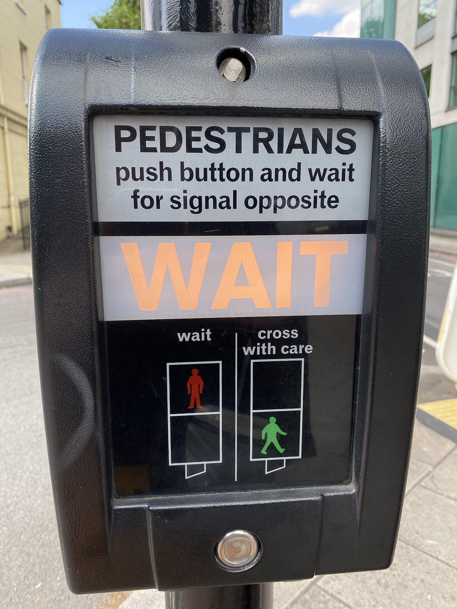

# Idempotency & safety

*Safe means a request never changes state (GET). Idempotent means repeating the identical request any number of times produces the same end state as doing it once (GET/PUT/DELETE, not POST). The single most-tested property in real API bug hunts.*

> A user's finger slips. A mobile network drops a response before the client sees it, so the client
> retries. A test script has a bug and accidentally sends the same request twice. All three are the
> exact same real-world event from the server's point of view: an identical request, arriving more
> than once. Whether that's harmless or catastrophic depends entirely on ONE property of the endpoint
> being hit - and it's a property you can test for directly, on purpose, in about thirty seconds.

> **In real life**
>
> A pedestrian crossing button. The sign above it is explicit: "PEDESTRIANS push button and wait for
> signal opposite." Nowhere does it say "push twice for a faster walk signal" or "push ten times to
> cross ten times." Mash that button as many times as you like - once, five times, fifty times in a
> panic - and the outcome is identical: one walk signal, on its own timer, whenever it was already
> going to arrive. The button doesn't queue up your presses into five separate crossings. That's
> idempotency in physical form: repeating the identical action any number of times produces the exact
> same end result as doing it once.

**Idempotency & safety**: A request is SAFE if it never changes server-side state, no matter how many times it's sent - GET is the canonical safe method (also HEAD, OPTIONS). A request is IDEMPOTENT if sending it once has the same end EFFECT as sending it N times - GET, PUT, and DELETE are all idempotent (PUT replacing a resource with the same data twice leaves it in the same final state; DELETE-ing an already-deleted resource just stays deleted). POST is neither safe nor (by default) idempotent - sending the same 'create a resource' POST twice is expected, spec-correct behavior to create TWO resources, unless the API specifically layers an idempotency mechanism (like a client-supplied idempotency key) on top. Every safe method is automatically idempotent, but not every idempotent method is safe (PUT and DELETE both change state, but repeating them doesn't change it FURTHER).

## The property, method by method

- **GET — safe AND idempotent.** Never changes anything, and repeating it any number of times
  changes nothing further. The one method a tester can retry freely without a second thought.
- **PUT — idempotent, not safe.** It DOES change state (replaces a resource) - but doing it 1 time
  or 100 times with the identical body leaves the resource in the exact same final state. Safe to
  retry after a network hiccup.
- **DELETE — idempotent, not safe.** Removes a resource - but deleting an already-deleted resource
  is still "deleted" either way. (Whether the SECOND delete returns `204` again or a `404` is an API
  design choice, not an idempotency violation either way - the RESOURCE'S final state is what
  idempotency is actually about, not the exact response code on repeat.)
- **POST — neither safe nor idempotent, by default.** Sending an identical "create" POST twice is
  expected to create two separate resources. This is the one method where blindly retrying after a
  timeout or dropped response is genuinely risky - "did that payment actually go through the first
  time?" is exactly this problem.
- **The real-world fix for risky POSTs: idempotency keys.** A client generates a unique key per
  logical operation and sends it on every attempt (including retries); the server recognizes a
  repeated key and returns the ORIGINAL result instead of creating a second resource. This is how
  payment APIs make "retry a POST safely" possible without changing POST's fundamental semantics.

> **Tip**
>
> When investigating a "duplicate records" bug, ask one question first: was the duplicated action a
> POST? If yes, check whether the client had any retry logic (network timeout, user double-click) and
> whether the API offers (or the client is using) an idempotency key. If the duplicated action was a
> PUT or DELETE, that's a genuine idempotency VIOLATION worth filing as a real bug - those methods are
> supposed to make repeats harmless.

> **Common mistake**
>
> Assuming "idempotent" means "doesn't change anything" - that's SAFE, a stricter, different property.
> PUT and DELETE are idempotent precisely because they're allowed to change state on the first call;
> the guarantee is only that a SECOND identical call doesn't change it AGAIN. Conflating the two
> properties leads to testing PUT/DELETE as if they should be no-ops, which they aren't.


*Pedestrian crossing button — Wikimedia Commons, CC BY-SA 4.0. [Source](https://commons.wikimedia.org/wiki/Category:Pedestrian_push_buttons)*
- **The button itself — send the request as many times as you like** — Pressing it once queues the walk signal. Pressing it fifty times in the next ten seconds does NOT queue fifty walk signals - the end state (one pending signal change) is identical either way. This is idempotency, physically.
- **The WAIT panel — the state hasn't finished changing yet** — The state transition (WAIT to WALK) takes its own time regardless of how many presses triggered it. Idempotency is about the EVENTUAL end state matching, not that the change happens instantly on every call.
- **The 'wait / cross with care' diagram — two DIFFERENT, non-idempotent-feeling states** — Note this is a two-state system (wait, cross) not a counter - there's no 'crossed twice as safely' state from pressing twice. A counter that incremented per press would be the un-idempotent version of this exact button.

**Sending the same request three times, four different ways - press Play**

1. **GET /flights/42, sent 3 times** — Safe: nothing changes on the server at all, any of the three times. Idempotent as an automatic consequence of being safe.
2. **PUT /flights/42 with the same body, sent 3 times** — Not safe (the resource's data IS being written) - but idempotent: after all three calls, flight 42 holds exactly the same data as after just the first call.
3. **DELETE /flights/42, sent 3 times** — Not safe (a resource genuinely gets removed) - but idempotent: after all three calls, flight 42 is gone, exactly as it would be after just the first successful delete.
4. **POST /flights with a body, sent 3 times** — Neither safe nor idempotent by default: three separate flight resources get created, each with its own new ID - this is the one method where a blind retry is a real risk.
5. **Verdict** — GET: always safe to retry. PUT/DELETE: safe to retry because the END STATE won't drift further. POST: only safe to retry if the API and client both support an idempotency key - otherwise, retries can multiply real-world effects.

A tiny simulation - firing each method three times in a row against the same tiny store, to show the
end-state difference directly instead of just asserting it:

*Run it - repeating GET/PUT/DELETE/POST three times each (Python)*

```python
store = {42: {"flight": "AI202", "status": "ON_TIME"}}
next_id = [43]

def get(rid):
    return store.get(rid)

def put(rid, body):
    store[rid] = body
    return "replaced"

def delete(rid):
    store.pop(rid, None)
    return "deleted (or already gone)"

def post(body):
    rid = next_id[0]
    next_id[0] += 1
    store[rid] = body
    return f"created id {rid}"

# GET x3 - safe, idempotent
for _ in range(3):
    get(42)
print("After 3x GET, store size:", len(store))

# PUT x3, same body - idempotent (end state identical after 1 or 3 calls)
for _ in range(3):
    put(42, {"flight": "AI202", "status": "CANCELLED"})
print("After 3x identical PUT, flight 42:", store[42])

# DELETE x3 - idempotent (still gone, however many times)
for _ in range(3):
    result = delete(42)
print("After 3x DELETE, is 42 still in store?", 42 in store)

# POST x3, same body - NOT idempotent, 3 distinct resources
for _ in range(3):
    post({"flight": "6E345", "status": "ON_TIME"})
print("After 3x identical POST, store size:", len(store), "- three separate new resources")

# After 3x GET, store size: 1
# After 3x identical PUT, flight 42: {'flight': 'AI202', 'status': 'CANCELLED'}
# After 3x DELETE, is 42 still in store? False
# After 3x identical POST, store size: 3 - three separate new resources
```

Same experiment in Java, same store, same four methods, three repeats each:

*Run it - repeating GET/PUT/DELETE/POST three times each (Java)*

```java
import java.util.*;

public class Main {
    static Map<Integer, String> store = new LinkedHashMap<>();
    static int nextId = 43;

    public static void main(String[] args) {
        store.put(42, "{flight: AI202, status: ON_TIME}");

        for (int i = 0; i < 3; i++) get(42);
        System.out.println("After 3x GET, store size: " + store.size());

        for (int i = 0; i < 3; i++) put(42, "{flight: AI202, status: CANCELLED}");
        System.out.println("After 3x identical PUT, flight 42: " + store.get(42));

        for (int i = 0; i < 3; i++) delete(42);
        System.out.println("After 3x DELETE, is 42 still in store? " + store.containsKey(42));

        for (int i = 0; i < 3; i++) post("{flight: 6E345, status: ON_TIME}");
        System.out.println("After 3x identical POST, store size: " + store.size() + " - three separate new resources");
    }

    static String get(int id) { return store.get(id); }
    static String put(int id, String body) { store.put(id, body); return "replaced"; }
    static String delete(int id) { store.remove(id); return "deleted (or already gone)"; }
    static String post(String body) {
        int id = nextId++;
        store.put(id, body);
        return "created id " + id;
    }
}

// After 3x GET, store size: 1
// After 3x identical PUT, flight 42: {flight: AI202, status: CANCELLED}
// After 3x DELETE, is 42 still in store? false
// After 3x identical POST, store size: 3 - three separate new resources
```

### Your first time: Your mission: prove idempotency (or its absence) with real repeated requests

- [ ] Pick a safe practice target (BuggyAPI or a sandbox you can freely mutate) — Never repeat-fire mutating requests against a production system you don't own.
- [ ] Send the same GET three times, confirm nothing about the resource changes — This one should feel almost too obvious - that's the point, it's the baseline.
- [ ] Send the same PUT (identical body) three times, then GET the resource once — Confirm its final state matches what a SINGLE PUT would have produced - not some cumulative or different result.
- [ ] Send the same DELETE three times in a row — Note what each of the three responses actually returns (204 the first time, then maybe 404 or 204 again) - and separately, confirm the resource itself stays deleted throughout, which is the actual idempotency claim.
- [ ] Send the same POST (identical body) three times, then list the collection — Confirm you now have three separate new resources, not one - this is the expected, correct outcome for POST, not a bug.

You've directly demonstrated safety and idempotency instead of reasoning about them abstractly - the
single most useful hands-on test in this entire module.

- **Sending the identical PUT request twice in a row (same ID, same body) results in a different final state than sending it once.**
  This is a genuine idempotency violation and a real, filable bug - PUT is documented to be idempotent by HTTP's own semantics. Look for hidden server-side state that isn't part of the request (a 'last updated' timestamp affecting some OTHER field, a counter that increments on every write) - that's usually the actual root cause.
- **A payment-creation POST gets retried after a client timeout, and the user is charged twice for what they experienced as one action.**
  This is exactly the risky-POST-retry scenario this note describes - check whether the API supports an idempotency key and whether the CLIENT is actually using it on retries. If the API has no idempotency-key mechanism at all for a money-moving endpoint, that's a significant design gap worth escalating, not just a client bug.
- **DELETE-ing an already-deleted resource returns a 500 Internal Server Error instead of a 404 or a repeat 204.**
  This IS worth filing, though the framing matters: idempotency doesn't strictly require the EXACT same status code on repeat (204 then 404 is commonly acceptable), but a 500 signals the server crashed trying to handle an expected, normal condition (deleting something already gone) rather than handling it gracefully - that's a real robustness bug regardless of which idempotency angle you file it under.

### Where to check

- **Send the exact same request multiple times, deliberately, and diff the end state** — the only truly convincing way to confirm idempotency; reasoning about it from the docs alone isn't a substitute for actually trying it.
- **The API's documentation for an idempotency-key mechanism** — a header like `Idempotency-Key` on POST endpoints that matter (payments, bookings); its presence and correct behavior under retry is directly testable.
- **Server-side hidden state** — timestamps, counters, or audit logs that update on every write even when the visible resource fields don't change; a subtle way idempotency can look violated when the CORE data is actually fine.
- **BuggyAPI (TaskFlight)** — safe to fire repeated PUT/DELETE/POST sequences against without real-world consequences, ideal for this note's exact StepChecklist exercise.

### Worked example: a double-booking bug traced to a missing idempotency key

1. A booking API's `POST /bookings` occasionally produces two identical bookings for the same
   customer, same flight, same timestamp - support tickets describe it as "randomly doubled."
2. A tester reproduces it deliberately: simulate a slow network by sending the POST, then, before
   the response returns, sending the EXACT same POST again (mimicking a client-side retry-on-timeout
   policy).
3. Result: two bookings created, confirming this is POST behaving exactly as POST is specified to
   behave - not a random glitch, but a deterministic consequence of retrying a non-idempotent
   request.
4. Checking the client's retry logic: it retries any request that doesn't respond within 3 seconds,
   with no idempotency key attached and no check for "did this already succeed?"
5. Checking the API's docs: no `Idempotency-Key` support exists on this endpoint at all - there's no
   mechanism available even if the client wanted to use one.
6. Finding: "`POST /bookings` has no idempotency-key mechanism; the client's blind retry-on-timeout
   policy produces duplicate bookings under slow-network conditions - reproducible on demand.
   Recommend adding idempotency-key support server-side AND wiring the client to use it before
   retrying." Found by deliberately recreating a real retry, not by waiting for it to happen randomly
   in production.

**Quiz.** A tester sends `DELETE /flights/42` twice in a row. The first response is `204 No Content`. The second response is `404 Not Found`. Is this a violation of DELETE's idempotency guarantee?

- [ ] Yes - idempotent methods must return the exact same status code every time they're repeated
- [x] No - idempotency is about the resource's END STATE matching after 1 call or N calls, not about the response status code being identical each time; flight 42 is gone after the first DELETE and still gone after the second, which is exactly the idempotent outcome
- [ ] Yes, because 404 indicates an error and any error on a repeated request breaks idempotency
- [ ] No, but only because DELETE is a safe method and safe methods are exempt from this rule

*This note is explicit that idempotency is a claim about the resource's final state, not about the HTTP response being byte-identical on every repeat. After the first DELETE, flight 42 no longer exists; after the second DELETE, flight 42 still doesn't exist - the state is identical both times, which is the actual guarantee. A 404 on the second call is a completely reasonable, common way for an API to communicate 'this is already gone,' and doesn't violate anything. Option one and three both mistake 'identical status code' for the actual definition. Option four is simply incorrect - DELETE is idempotent, not safe (it does change state on the first call), and that distinction doesn't exempt it from anything here.*

- **Safe** — Never changes server-side state, no matter how many times it's sent. GET (also HEAD/OPTIONS).
- **Idempotent** — Sending the request once has the same END EFFECT as sending it N times. GET, PUT, DELETE. NOT POST by default.
- **Every safe method is idempotent, but...** — ...not every idempotent method is safe. PUT and DELETE change state on the first call - the guarantee is only that repeats don't change it FURTHER.
- **Why POST is the risky one to retry blindly** — It's neither safe nor idempotent by default - an identical 'create' POST sent twice is expected to create two separate resources, which is correct POST behavior, not a bug.
- **The real-world fix for retrying risky POSTs safely** — An idempotency key: a client-generated unique ID sent with every attempt (including retries) so the server can recognize a repeat and return the original result instead of creating a duplicate.

### Challenge

Using BuggyAPI or a safe sandbox, deliberately simulate a client retry: send an identical POST
request twice in quick succession (as if a timeout triggered a retry) against an endpoint that
creates a resource. Confirm whether you get one resource or two. Then check whether the API
documents any idempotency-key mechanism, and if it does, repeat the experiment WITH the same key
attached both times - write down whether the behavior changes.

### Ask the community

> I sent the same `[method]` request to `[endpoint]` `[N]` times in a row. The end state after all `[N]` calls was `[what you observed]`. Given `[method]`'s expected safety/idempotency, does this look correct, or does it look like a violation worth filing?

The most useful replies check the END STATE claim specifically (not just whether status codes
matched) and ask whether the method involved is even supposed to be idempotent in the first place -
POST-related "duplicates" get a very different answer than a PUT/DELETE idempotency violation would.

- [MDN — Idempotent, glossary definition](https://developer.mozilla.org/en-US/docs/Glossary/Idempotent)
- [RFC 9110 — HTTP Semantics, Section 9.2: Common Method Properties (safe/idempotent)](https://www.rfc-editor.org/rfc/rfc9110.html#name-common-method-properties)
- [Bee tester — Day#18: API Idempotency MASTER in 11 Minutes!](https://www.youtube.com/watch?v=Dcz4Pk00RvM)

🎬 [Bee tester — Day#18: API Idempotency MASTER in 11 Minutes!](https://www.youtube.com/watch?v=Dcz4Pk00RvM) (11 min)

- Safe means never changes state (GET). Idempotent means repeating it produces the same END STATE as doing it once (GET/PUT/DELETE, not POST by default).
- Every safe method is automatically idempotent, but PUT and DELETE are idempotent without being safe - they do change state on the first call.
- POST is the risky one to retry blindly: an identical 'create' request sent twice is expected, correct behavior to create two resources.
- Idempotency-key mechanisms are the real-world fix for safely retrying POSTs that matter (payments, bookings) - their presence and correctness are directly testable.
- The only convincing way to confirm idempotency is to actually send the same request multiple times and diff the resulting state - not to reason about it from the method name alone.


## Related notes

- [[Notes/api-testing-fundamentals/http-for-testers/http-methods|Methods (GET/POST/PUT/DELETE)]]
- [[Notes/api-testing-fundamentals/status-codes-and-rest/rest-in-plain-words|REST in plain words]]
- [[Notes/api-testing-fundamentals/finding-api-bugs/negative-api-tests|Negative API tests]]


---
_Source: `packages/curriculum/content/notes/api-testing-fundamentals/status-codes-and-rest/idempotency-and-safety.mdx`_
