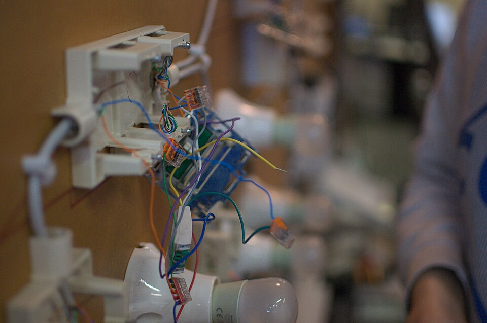

# Flaky tests

*A flaky test produces different verdicts without a relevant product change; treat it as a diagnosable reliability defect in timing, state, data, environment, or oracle—not as normal CI weather.*

> The checkout test is red, rerun is green, and the team merges. That feels efficient until a real checkout
> regression arrives on a day when "red means rerun" is muscle memory. Flake taxes more than minutes: it
> destroys the information content of the gate.

> **In real life**
>
> Loose wiring on a demonstration board can connect when nudged and disconnect when temperature or tension
> changes. Replacing the bulb because it flickered hides the cause. A flaky test has the same intermittent
> circuit: shared data, an unobserved transition, an order dependency, a drifting environment, or an oracle
> that accepts more than one meaning.

**Test flakiness**: A flaky test is one whose pass/fail result changes across equivalent runs without a relevant change to the system under test. Common causal families are synchronization races, leaked/shared state, colliding test data, environment or dependency instability, nondeterministic product behavior, and weak or ambiguous assertions. A retry measures or contains flake; it does not repair the cause.

## Diagnose by evidence, not folklore

Current official guidance converges on two controls. Selenium's waiting guide calls browser/application
race conditions a primary cause and explains why fixed sleeps can be both too short and wastefully long.
Playwright uses actionability, web-first assertions, and per-test browser contexts. Cypress enables test
isolation by default and warns that leaked state makes later tests order-dependent. None can isolate a
shared backend record unless the suite creates unique data.

First preserve the first failure: trace, screenshot, DOM, console, network, test seed, worker, browser,
environment revision, and timestamps. Classify it. Reproduce by repeating alone, reversed in order, in
parallel, and under constrained latency. Fix the smallest causal boundary. Quarantine only with owner,
ticket, expiry, and visibility; never convert the test to unconditional green.

> **Tip**
>
> Track first-attempt pass rate separately from eventual pass after retries. A 100%
> eventual pass can hide a suite that fails first attempt 20% of the time.

> **Common mistake**
>
> Increasing every timeout. It may reduce one timing symptom while multiplying
> runtime and preserving leaked state or a bad oracle. Change a wait only when captured evidence names the
> state being awaited.


*Loose wiring — Altoscroll, Wikimedia Commons, CC BY-SA 4.0. [Source](https://commons.wikimedia.org/wiki/File:Loose_wiring.jpg)*
- **Loose connector cluster** — A state dependency can make contact in one run and fail in the next.
- **Unterminated wire** — An unobserved precondition leaves the verdict sensitive to timing.
- **Bulb** — The visible failure is downstream; replacing or rerunning it does not repair the circuit.

**A flake triage loop**

1. **Preserve first failure** — Keep artifacts and exact environment before a retry overwrites the scene.
2. **Classify** — Timing, state, data, environment, product nondeterminism, or oracle.
3. **Stress the hypothesis** — Repeat alone, reordered, parallel, and latency-constrained.
4. **Fix and prove** — Run enough repetitions to make the prior failure mode observable; keep first-attempt metrics.

*Expose an order-dependent test (Python)*

```python
def run_suite(order):
    state = {"logged_in": False}
    results = []
    for test in order:
        if test == "login": state["logged_in"] = True; results.append(True)
        if test == "checkout": results.append(state["logged_in"])
    return results

forward = run_suite(["login", "checkout"])
reversed_order = run_suite(["checkout", "login"])
independent = forward == [True, True] and reversed_order == [False, True]
assert independent, "oracle must expose order dependence"
print("forward:", str(forward).lower())
print("reversed:", str(reversed_order).lower())
print("verdict:", "FLAKY-DEPENDENCY" if independent else "MISSED")
```

*Expose an order-dependent test (Java)*

```java
import java.util.*;
public class Main {
    static List<Boolean> runSuite(List<String> order) {
        boolean loggedIn = false; var results = new ArrayList<Boolean>();
        for (String test : order) {
            if (test.equals("login")) { loggedIn = true; results.add(true); }
            if (test.equals("checkout")) results.add(loggedIn);
        }
        return results;
    }
    public static void main(String[] args) {
        var forward = runSuite(List.of("login", "checkout"));
        var reversed = runSuite(List.of("checkout", "login"));
        boolean independent = forward.equals(List.of(true, true)) && reversed.equals(List.of(false, true));
        if (!independent) throw new AssertionError("oracle must expose order dependence");
        System.out.println("forward: " + forward.toString().toLowerCase());
        System.out.println("reversed: " + reversed.toString().toLowerCase());
        System.out.println("verdict: " + (independent ? "FLAKY-DEPENDENCY" : "MISSED"));
    }
}
```

### Your first time: Investigate one tolerated flake

- [ ] Disable automatic retry for diagnosis — Keep the first failure and all artifacts.
- [ ] Run alone and reordered — Order changes expose shared-state assumptions.
- [ ] Run repeated and parallel — Record seed, worker, data identity, and environment.
- [ ] Fix one causal boundary — Use unique data, isolation, or an observable condition, then repeat the former trigger.

- **Passes alone, fails in the suite.**
  Search for shared account/data, storage, clock, and cleanup; randomize order and log resource identities.
- **Fails only under CI load.**
  Capture timing and resource signals; wait on an observable result rather than elapsed time and remove cross-worker collisions.

### Where to check

- First-attempt versus retry pass metrics, by test and failure signature.
- Trace/DOM/network/console at the first divergence.
- Shared data identifiers, test order, worker, seed, browser, and deployed revision.

### Worked example: The reused customer account

Eight parallel checkout tests pick the same seeded customer. One changes the address while another asserts
the old address. Retries often pass after the writes settle. Increasing timeouts cannot fix ownership.
Creating a unique customer per test and deleting by that identifier removes the collision; running the
old parallel trigger 200 times demonstrates the causal repair.

**Quiz.** What does a retry prove?

- [ ] The test is fixed
- [ ] The product is correct
- [x] The outcome changed on another attempt
- [ ] The oracle is complete

*A retry supplies evidence of instability or transient recovery; it does not identify or repair the cause.*

- **First-attempt pass rate** — The reliability signal before retries hide instability.
- **Core flake families** — Timing, state, data, environment/dependency, product nondeterminism, and oracle.
- **Safe quarantine** — Visible skip with owner, ticket, expiry, preserved evidence, and a repair deadline.

### Challenge

Change the reversed order to login-then-checkout. The assertion must reject the mutation
because the experiment no longer exposes the dependency.

### Ask the community

> A retry makes our CI green, but first-attempt pass rate is falling. What should block merges?

Good replies preserve first-failure artifacts, set an explicit flake budget, fail or quarantine known
offenders visibly, and keep genuine product failures distinct from infrastructure incidents.

- [Selenium — Waiting strategies](https://www.selenium.dev/documentation/webdriver/waits/)
- [Playwright — Assertions and isolation](https://playwright.dev/docs/writing-tests)
- [Cypress — Test isolation](https://docs.cypress.io/app/core-concepts/test-isolation)

🎬 [Retries and Test Flakiness in Playwright](https://www.youtube.com/watch?v=B2xvEk-EEvk) (10 min)

- Flake is a reliability defect that erodes the meaning of CI red.
- Retries measure or contain instability; they do not repair it.
- Preserve first-failure evidence and classify timing, state, data, environment, product, or oracle causes.
- Isolation includes backend data ownership, not only browser storage.


## Related notes

- [[Notes/automation-foundations/pitfalls/maintenance-cost|Maintenance cost]]
- [[Notes/automation-foundations/pitfalls/false-confidence|False confidence]]
- [[Notes/automation-foundations/the-tool-landscape/playwright-tool|Playwright]]


---
_Source: `packages/curriculum/content/notes/automation-foundations/pitfalls/flaky-tests.mdx`_
