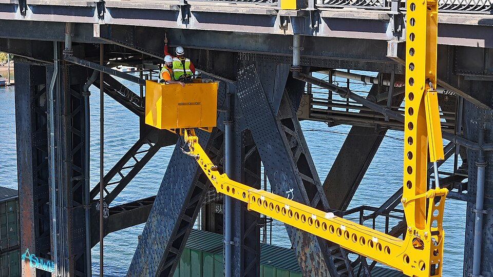

# Maintenance cost

*Automation cost continues after the first green run: product changes, browser/tool upgrades, data and environment care, triage, and evidence quality determine whether a test remains an asset.*

> The first 100 tests took a month. Six months later, every UI change breaks 30 selectors, browser updates
> stall CI, and two engineers spend Mondays sorting red. The purchase price was one month; the ownership
> cost is now recurring. Automation that nobody budgets to maintain becomes an alert system trained to lie.

> **In real life**
>
> A steel bridge is valuable because it keeps carrying traffic, not because construction once finished.
> Inspectors, lift equipment, closures, paint, fasteners, and records are part of the bridge. Tests are the
> same: upgrades, fixtures, selectors, artifacts, pruning, and triage are not "extra" work—they are the
> work that keeps the asset trustworthy.

**Maintenance cost**: Automation maintenance cost is the recurring effort and infrastructure required to keep a check relevant, deterministic, diagnosable, compatible, and fast enough for its feedback gate. It includes product-driven updates, test-code refactoring, data/environment care, tool and browser upgrades, failure triage, artifact storage, execution capacity, and deletion or demotion of low-value checks.

## Measure the whole ownership loop

Count weekly authoring and repair hours, first-failure triage, runtime/compute, flaky reruns, environment
incidents, upgrade work, and review overhead. Divide by useful detections, not test count. A small test with
a durable user-facing locator and a specific assertion may cost less than a recorder-generated flow with
ten DOM-position selectors.

Official guidance points to maintainability levers: Cypress recommends stable `data-*` selectors and
independent state control; Playwright recommends resilient user-facing locators and trace-backed failure
diagnosis; Selenium says its tools do not architect the suite for you and recommends isolation. Keep
helpers thin, ownership named, and every failure actionable. Delete checks whose risk moved elsewhere.

> **Tip**
>
> Add a maintenance ledger to CI: minutes to first diagnosis, files touched per product
> change, first-attempt pass rate, runtime trend, and defects uniquely caught. Review the worst five monthly.

> **Common mistake**
>
> Using test count as output. Counts reward duplication and make deletion look like
> failure. Reward protected risks, fast trustworthy feedback, and defects caught at the cheapest layer.


*Steel Bridge Inspection — Oregon Department of Transportation, Wikimedia Commons, CC BY 4.0. [Source](https://commons.wikimedia.org/wiki/File:Steel_Bridge_Inspection_-_Inspecting_under_the_upper_deck.jpg)*
- **Inspectors** — Skilled triage and review are recurring ownership, not an exceptional event.
- **Access lift** — CI capacity, environments, and artifacts are infrastructure required to reach the evidence.
- **Steel joints** — Interfaces and selectors are change seams that deserve durable contracts.

**A monthly maintenance review**

1. **Measure** — Collect triage hours, runtime, flake, touched files, and unique detections.
2. **Rank** — Find checks with high cost and low information value.
3. **Refactor or demote** — Stabilize seams, move checks lower, merge duplicates, or delete.
4. **Reinvest** — Spend recovered time on uncovered current risks.

*Rank tests by monthly ownership cost (Python)*

```python
tests = [
    ("checkout", 3, 40, 4),
    ("theme-toggle", 5, 20, 0),
    ("contract-total", 1, 5, 3),
]

def cost(repairs, triage_minutes): return repairs * 30 + triage_minutes
rows = [(name, cost(repairs, triage), catches) for name, repairs, triage, catches in tests]
worst = max(rows, key=lambda row: (row[1] / max(row[2], 1), row[1]))
assert worst[0] == "theme-toggle" and worst[1] == 170, "cost oracle rejected"
print("monthly-costs:", ",".join(name + "=" + str(c) for name, c, _ in rows))
print("worst-value:", worst[0])
print("verdict:", "REVIEW" if worst[0] == "theme-toggle" else "MISSED")
```

*Rank tests by monthly ownership cost (Java)*

```java
import java.util.*;
public class Main {
    record TestCost(String name, int repairs, int triage, int catches) { int cost(){ return repairs * 30 + triage; } }
    public static void main(String[] args) {
        var rows = List.of(new TestCost("checkout",3,40,4), new TestCost("theme-toggle",5,20,0), new TestCost("contract-total",1,5,3));
        var worst = rows.stream().max(Comparator.comparingDouble(r -> (double)r.cost()/Math.max(r.catches(),1))).orElseThrow();
        if (!worst.name().equals("theme-toggle") || worst.cost()!=170) throw new AssertionError("cost oracle rejected");
        System.out.println("monthly-costs: " + String.join(",", rows.stream().map(r -> r.name()+"="+r.cost()).toList()));
        System.out.println("worst-value: " + worst.name());
        System.out.println("verdict: " + (worst.name().equals("theme-toggle") ? "REVIEW" : "MISSED"));
    }
}
```

### Your first time: Build a maintenance ledger

- [ ] Select ten tests — Include critical, flaky, old, and recently changed examples.
- [ ] Recover one month of cost — Triage, repair, rerun, runtime, and environment time.
- [ ] Map unique detections — Separate genuine product findings from duplicate or test-only failures.
- [ ] Choose one action each — Keep, refactor, move lower, merge, quarantine-with-expiry, or delete.

- **Every redesign touches dozens of tests.**
  Move intent behind component/page helpers and durable user-facing or test-contract locators; avoid mirroring the DOM tree.
- **Nobody deletes tests because coverage might fall.**
  Require each test to name a protected risk and unique signal; preserve the risk at a cheaper layer before removing duplicates.

### Where to check

- Git churn by test/helper and product component.
- CI triage time, first-attempt pass rate, runtime, and artifact storage trends.
- Defect history mapped to which check uniquely detected each issue.

### Worked example: A selector contract pays rent

A redesign changes CSS classes across 40 flows. Thirty raw `.card:nth-child()` selectors break. Ten tests
using roles and a documented `data-testid` contract survive. The team replaces duplicated raw locators
with component helpers and adds selector-contract review to UI changes. Test count stays constant, but
future touched files and diagnosis time fall sharply—the real ROI improvement.

**Quiz.** Which metric best exposes ownership cost?

- [ ] Total green tests
- [ ] Lines of test code
- [x] Recurring triage, repair, runtime, and upgrade effort per useful signal
- [ ] Number of framework folders

*Maintenance is recurring work relative to information value, not inventory size.*

- **Maintenance ledger** — Recurring cost and useful-detection evidence per test or suite area.
- **Deletion is healthy when...** — The protected risk disappeared, moved lower, or is duplicated and the remaining signal is verified.
- **Durable selector** — A locator tied to user-visible semantics or an explicit test contract rather than incidental DOM styling.

### Challenge

Change theme-toggle repairs from 5 to 0. Both oracles must reject the now-stale expected worst
test, forcing the decision to follow evidence rather than reputation.

### Ask the community

> Our suite catches bugs, but maintenance absorbs a full engineer. How do we decide what to cut?

Good replies rank recurring cost against unique risk signal, move checks to cheaper layers, consolidate
duplicates, and protect critical flows before pruning by count.

- [Selenium — Test practices](https://www.selenium.dev/documentation/test_practices/)
- [Playwright — Best practices](https://playwright.dev/docs/best-practices)
- [Cypress — Best practices](https://docs.cypress.io/app/core-concepts/best-practices)

🎬 [Selenium Page Object Model Explained In 5 Minutes | Page Object Model tutorial for beginners](https://www.youtube.com/watch?v=GKDJk4s_T-s) (6 min)

- Automation is an owned product with recurring cost after first green.
- Measure cost per useful signal, not test count.
- Durable seams, isolated data, thin helpers, and strong artifacts lower maintenance.
- Pruning and moving checks lower are maintenance successes when risk remains protected.


## Related notes

- [[Notes/automation-foundations/pitfalls/flaky-tests|Flaky tests]]
- [[Notes/automation-foundations/pitfalls/over-automation|Over-automation]]
- [[Notes/automation-foundations/the-automation-pyramid/roi|ROI]]


---
_Source: `packages/curriculum/content/notes/automation-foundations/pitfalls/maintenance-cost.mdx`_
