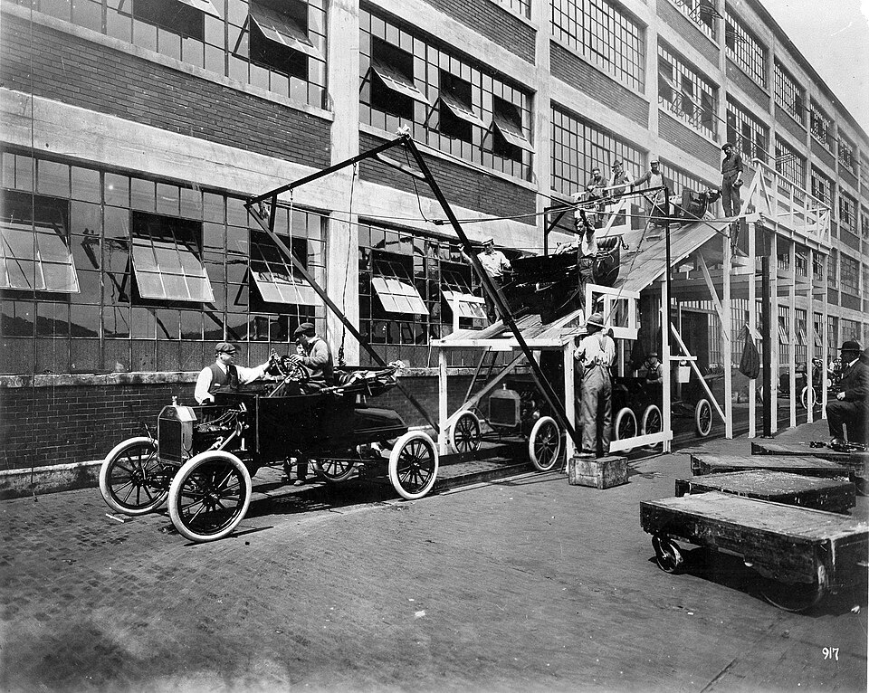

# Over-automation

*Over-automation happens when scripted checks expand beyond their economic and epistemic fit, consuming maintenance while crowding out exploration, lower-layer tests, and human judgment.*

> A team celebrates automating 100% of its regression cases. Releases are slower, exploratory sessions were
> cancelled to repair scripts, and customers find confusing workflows the scripts never questioned. The
> achievement optimized conversion of old instructions into code, not discovery of current risk.

> **In real life**
>
> The early assembly line moved cars efficiently because work was standardized. Sending every repair,
> prototype, and design decision down the same line would jam it. Automation is a production line for
> stable, repeatable, machine-decidable checks. Novel investigation, ambiguous quality, and one-off change
> need different stations.

**Over-automation**: Over-automation is the condition where the marginal scripted check costs more to build, run, diagnose, and maintain than the risk signal it provides, or where automation displaces more suitable lower-layer checks, exploratory testing, accessibility/usability judgment, production observation, or human review. It is about portfolio fit, not an arbitrary maximum percentage.

## Automate decisions a machine can honestly make

Selenium's official automation overview says browser tests are expensive, recommends asking whether a
lighter approach can test the behavior, and notes that automation is not always advantageous—especially
for changing UI or urgent short-term work. Cypress's own reference implementation combines E2E with
component, visual, API, and unit tests. Tool vendors themselves do not recommend turning every concern
into one giant browser suite.

Before adding a check, name its decision, frequency, stability, oracle, cheapest effective layer, unique
signal, owner, and retirement trigger. Reserve humans for investigation and value judgments. A machine
can assert contrast ratio; it cannot fully judge whether a workflow explains a frightening medical result
with appropriate clarity and empathy.

> **Tip**
>
> Use a "one in, one reviewed" rule for expensive E2E checks: every addition triggers
> review of an existing test for demotion, merging, or deletion.

> **Common mistake**
>
> Automating a manual case word-for-word. Manual cases often contain observation
> and judgment. Extract deterministic assertions; keep the exploratory question human rather than faking
> certainty with screenshot existence.


*Ford assembly line, 1913 — unknown author/National Archives source, Wikimedia Commons, public domain. [Source](https://commons.wikimedia.org/wiki/File:AssemblyLine.jpg)*
- **Standardized line** — Repeatable work flows efficiently when inputs and decisions are stable.
- **Workers at stations** — Human judgment and intervention remain part of a healthy operating system.
- **Finished car** — Output count is visible, but usefulness and hidden defects still require broader evidence.

**Triage one automation candidate**

1. **Name the decision** — What exact pass/fail claim will this check make?
2. **Find cheapest layer** — Can unit, contract, API, static analysis, or monitoring answer it sooner?
3. **Price ownership** — Frequency, stability, data, runtime, triage, and maintenance.
4. **Choose mode** — Automate, keep exploratory/manual, combine, defer, or reject.

*Reject poor automation candidates (Python)*

```python
candidates = [
    ("checkout-total", 20, True, True, 5, 2),
    ("new-layout-feels-clear", 4, False, False, 2, 5),
    ("annual-migration", 1, True, True, 2, 4),
]

def verdict(name, frequency, stable, objective, value, cost):
    score = frequency + value * 3 - cost * 4
    return "AUTOMATE" if stable and objective and score >= 10 else "HUMAN_OR_DEFER"

results = [(row[0], verdict(*row)) for row in candidates]
expected = [("checkout-total", "AUTOMATE"), ("new-layout-feels-clear", "HUMAN_OR_DEFER"), ("annual-migration", "HUMAN_OR_DEFER")]
assert results == expected, "portfolio oracle rejected"
print("decisions:", ",".join(name + "=" + decision for name, decision in results))
print("automated:", sum(d == "AUTOMATE" for _, d in results), "of", len(results))
print("verdict:", "BALANCED" if results == expected else "OVER")
```

*Reject poor automation candidates (Java)*

```java
import java.util.*;
public class Main {
    record Candidate(String name,int frequency,boolean stable,boolean objective,int value,int cost) {}
    static String verdict(Candidate c) {
        int score=c.frequency()+c.value()*3-c.cost()*4;
        return c.stable()&&c.objective()&&score>=10 ? "AUTOMATE" : "HUMAN_OR_DEFER";
    }
    public static void main(String[] args) {
        var rows=List.of(new Candidate("checkout-total",20,true,true,5,2),new Candidate("new-layout-feels-clear",4,false,false,2,5),new Candidate("annual-migration",1,true,true,2,4));
        var results=rows.stream().map(c->c.name()+"="+verdict(c)).toList();
        var expected=List.of("checkout-total=AUTOMATE","new-layout-feels-clear=HUMAN_OR_DEFER","annual-migration=HUMAN_OR_DEFER");
        if(!results.equals(expected)) throw new AssertionError("portfolio oracle rejected");
        System.out.println("decisions: "+String.join(",",results));
        System.out.println("automated: "+results.stream().filter(x->x.endsWith("=AUTOMATE")).count()+" of "+results.size());
        System.out.println("verdict: "+(results.equals(expected)?"BALANCED":"OVER"));
    }
}
```

### Your first time: Audit the automation boundary

- [ ] Sample twenty checks — Include browser, API, unit, visual, and manual/exploratory work.
- [ ] Name each decision and oracle — Mark subjective or ambiguous decisions explicitly.
- [ ] Find the cheapest effective layer — Demote checks whose risk can be protected earlier.
- [ ] Restore displaced learning — Reserve time for exploration, accessibility, usability, and incident-driven risks.

- **Automation maintenance cancels exploratory sessions.**
  Cap the expensive layer, prune low-signal checks, and make exploratory charters part of the release plan.
- **A screenshot test passes an obviously confusing page.**
  Separate deterministic visual regressions from usability judgment; a stable picture is not a good experience.

### Where to check

- Time allocation across automation repair, new risk coverage, and exploration.
- Duplicate decisions across browser/API/unit layers.
- Tests with subjective names but weak machine oracles such as visibility alone.

### Worked example: The 400-case browser migration

A team converts 400 manual cases into browser scripts. Analysis shows 230 are calculation combinations
better covered by parameterized unit/API tests, 70 are exploratory prompts, 60 duplicate flows, and 40
are critical E2E keepers. Moving the first group lower, preserving the prompts as charters, merging
duplicates, and automating 40 produces faster feedback and more—not less—meaningful coverage.

**Quiz.** Which is the clearest sign of over-automation?

- [ ] A critical smoke flow runs on every build
- [x] A subjective usability judgment is replaced by a visibility assertion while exploration is cancelled
- [ ] An API contract has parameterized checks
- [ ] A stable calculation has unit tests

*The automation cannot honestly make the displaced judgment, so activity increased while information fell.*

- **Over-automation** — Marginal scripted checks cost more than their signal or displace a better testing mode.
- **Cheapest effective layer** — The lowest-cost layer that can detect the target risk with a trustworthy oracle.
- **Human territory** — Exploration, novelty, ambiguity, usability, meaning, and value judgments.

### Challenge

Change the layout candidate to stable and objective without changing what its name asks.
The oracle must still reject automation; explain why data labels cannot make a subjective decision objective.

### Ask the community

> Leadership wants a 100% automation target. What alternative target keeps ambition without rewarding waste?

Good replies propose risk coverage, feedback time, first-attempt reliability, escaped-defect learning,
maintenance budget, and protected exploratory capacity.

- [Selenium — Overview of test automation](https://www.selenium.dev/documentation/test_practices/overview/)
- [Cypress — Layered real-world test strategy](https://docs.cypress.io/app/core-concepts/best-practices)
- [Playwright — Best practices](https://playwright.dev/docs/best-practices)

🎬 [This is Why You SHOULD NOT Automate Your Test Cases | Serenity Dojo TV](https://www.youtube.com/watch?v=2SKEqGxWnrI) (4 min)

- Automation percentage is not a quality objective.
- Automate stable, frequent, machine-decidable risks at the cheapest effective layer.
- Preserve exploration and human judgment where the oracle is ambiguous or novelty matters.
- Review the marginal check's ownership cost and retirement trigger before adding it.


## Related notes

- [[Notes/automation-foundations/pitfalls/maintenance-cost|Maintenance cost]]
- [[Notes/automation-foundations/pitfalls/false-confidence|False confidence]]
- [[Notes/automation-foundations/why-and-when-to-automate/what-not-to-automate|What NOT to]]


---
_Source: `packages/curriculum/content/notes/automation-foundations/pitfalls/over-automation.mdx`_
