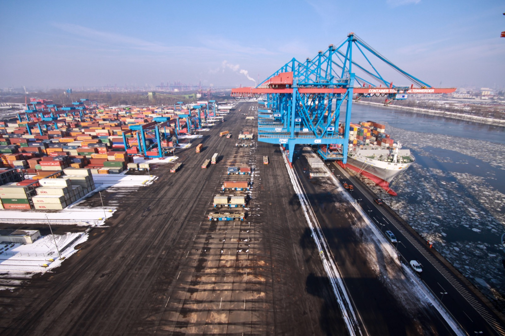

# Balancing the suite

*The pyramid is a starting shape, not a law: balance means every layer fits its CI gate's time budget, seams get covered where your architecture actually risks them, and the expensive top stays reserved for true keepers - with ratios like 70/20/10 as a sanity check, not a quota.*

> A team reads about the pyramid, counts their tests - 62% unit, 23% integration, 15% E2E - and
> declares victory: the shape is right. But their unit layer is thousands of trivial getter tests
> that have never failed; the seams where their microservices actually break have four tests; and
> their fifteen percent E2E takes three hours because nobody prunes it. The ratios are textbook and
> the suite is useless. Balance was never a percentage - it's whether each layer is doing its own
> job, within its own time budget, against the risks YOUR system actually has.

> **In real life**
>
> Stand on a crane above a container terminal and the balance is visible. The yard: thousands of
> identical containers, stacked dense and cheap - handled by the hundreds per hour, nobody thinks
> twice about moving one. The automated carts: a smaller fleet shuttling between yard and quay,
> keeping the two connected - fewer than the containers, busier per unit. The berth: one enormous
> crane complex, one ship at a time - scarce, expensive, scheduled to the minute, and never wasted on
> work the yard could do. The terminal moves mountains because each tier handles the volume it's
> economical for, and the scarce tier is reserved. Re-balance it wrong - route everything through the
> berth, or empty the yard - and the same equipment gridlocks. A test suite balances exactly the
> same way: not by percentages, but by each tier doing the work it's cheapest at, with the expensive
> one protected from misuse.

**Balancing the suite**: Balancing a suite means allocating checks across the layers so that: (1) every layer FITS ITS GATE - the unit layer runs in seconds on every save, integration in minutes pre-merge, E2E within its nightly window, because a layer that outgrows its gate stops protecting anything; (2) coverage follows YOUR risk - integration gets heavier where your architecture has more seams (microservices, third-party APIs), lighter in a monolith with simple boundaries; (3) the top stays curated - E2E is a fixed small budget of true keepers, where adding one means arguing its case, not a place scenarios accumulate; and (4) counts stay honest - a thousand trivial tests at the bottom don't balance anything. Rules of thumb like Google's 70/20/10 are sanity checks for drift, not quotas to hit: the pyramid describes cost gradients, and shapes legitimately vary - a stack with cheap, fast integration tests can healthily carry more of its weight there.

## What balance actually consists of

- **Time budgets first, ratios second.** Each layer serves a feedback gate: every-save (seconds),
  pre-merge (minutes), nightly (a window). Balance means every layer FITS its gate - the moment the
  unit layer takes two minutes or E2E outgrows the night, that layer has left its post, whatever
  the ratios say. Budgets are also what makes 'can we add another E2E test?' a real question with
  a real answer: what gets removed to pay for it?
- **Follow your architecture's seams.** A monolith with a database has few seams - modest
  integration, heavy unit. Twelve microservices and three third-party APIs is MADE of seams -
  integration carries far more of that suite's weight, legitimately. The trophy shape (fat middle)
  isn't a rebellion against the pyramid; it's the same cost logic applied to a stack where the
  middle got cheap. Count YOUR seams before adopting anyone's ratios.
- **Curate the top like a scarce berth.** The E2E budget is fixed and small: the flows whose
  breakage is an incident (sign-in, purchase, the data path customers live on). Adding one means
  making the case; every one earns its slot in review, quarterly. The cone from
  [[automation-foundations/the-automation-pyramid/ice-cream-cone-anti-pattern]] is what an
  uncurated top drifts into - curation is the steering.
- **Honest counts only.** A bottom bloated with tests that can't fail (getters, framework
  behavior, mocks asserting mocks) fakes the shape without the protection. The balance question
  per layer isn't 'how many tests' but 'which bugs would this layer catch that it currently
  doesn't' - and its mirror, 'which tests here have never caught anything and never could.'
- **Watch the hourglass.** The third common mis-shape after cone and false-pyramid: healthy top
  and bottom, hollow middle - logic well covered, keepers in place, and every seam bug (schema
  drift, contract mismatch, serialization) escaping to production. If your escaped bugs cluster
  at boundaries, the middle is where the next quarter of test effort goes.

> **Tip**
>
> The quarterly balance review fits on one page: per layer - test count, wall-clock, gate it runs
> in, bugs caught this quarter, false reds this quarter. Then three questions: is any layer
> outgrowing its gate (prune or parallelize)? did escaped bugs cluster at a layer that should have
> caught them (invest there)? did any E2E test go a year without catching anything a lower layer
> missed (demote it)? That one page, quarterly, is the steering the cone note said was missing.

> **Common mistake**
>
> Enforcing ratios as quotas - "PRs must keep the suite at 70/20/10" - which teams game instantly:
> trivial unit tests to pump the denominator, integration tests relabeled unit, a needed E2E flow
> rejected because 'the budget'. The ratio was a fire alarm, not a thermostat: when it drifts hard
> (15/15/70), investigate WHY coverage is flowing uphill; when a team hits perfect numbers with a
> useless suite, the numbers were never the thing. Budgets and honest per-layer jobs, not
> percentages, are the enforceable rules.


*HHLA Container Terminal Altenwerder, Hamburg — Frank Grunwald (Frankenwagen), Wikimedia Commons, CC BY-SA 3.0. [Source](https://commons.wikimedia.org/wiki/File:HHLA_Container_Terminal_Altenwerder_(CTA)_in_Hamburg_-_Winter_2010_-_05.jpg)*
- **The block yard: thousands of cheap, standard units** — Dense, uniform, handled by the hundreds per hour without ceremony - the unit layer carrying the bulk of the volume precisely because each move costs almost nothing.
- **The AGV fleet shuttling between yard and quay** — Fewer vehicles, each one connecting two subsystems that must agree on every handoff - the integration layer: sized to the seams, busier per unit, where mismatches between tiers would surface.
- **The berth: one ship, one giant crane complex** — The scarcest, most expensive station in the terminal - scheduled to the minute and never wasted on work the yard could do. The E2E budget: few, curated, reserved for what genuinely needs the whole system.
- **The ordinary road running alongside** — Cars and a van moving on their own rules next to all that automation - the manual lane: exploration and judgment still driving alongside the suite, part of the same traffic system, never displaced by it.

**One quarterly balance review, start to finish - press Play**

1. **Pull the one-page numbers** — Per layer: count, wall-clock, gate, bugs caught, false reds. This quarter: unit 1400 tests/40 s, integration 90/6 min, e2e 45/85 min nightly. Escaped to production: 7 bugs.
2. **Check gates** — Unit fits every-save. Integration fits pre-merge. E2E fits the night - but grew 15 minutes this quarter; at this rate it leaves the window within a year. Flag: curation debt.
3. **Map the escaped bugs** — Of 7 escapes, 5 were seam bugs - a schema drift, two contract mismatches, a timezone serialization, a webhook payload change. The middle layer is underweight for this architecture. That's the invest signal.
4. **Audit the top** — Of 45 e2e flows, 9 haven't failed in a year and duplicate integration coverage - demoted. 36 keepers remain; the 15-minute growth reverses. Two seam areas get 12 new integration tests instead.
5. **Verdict** — No ratio was ever mentioned. Gates, escaped-bug clustering, and top-curation made every decision - the shape that results is 'balanced' by construction, whatever its percentages turn out to be.

Balance, compressed: every layer inside its time budget, the middle sized to your seams, the top
curated like the scarce resource it is, and the counts honest.

*Run it - three suite shapes against the same CI gates (Python)*

```python
# 300 behaviors, three allocation strategies. Speeds: unit 0.05s, integration 3s, e2e 100s.
# Gates: unit on-every-save (30s), integration pre-merge (10 min), e2e nightly (2h).

def check(name, count, secs_each, budget_s, gate):
    total = count * secs_each
    status = "fits" if total <= budget_s else "BLOWS"
    return "  " + name + str(count).rjust(4) + " tests -> " + str(round(total / 60, 1)).rjust(6) + " min (" + status + " " + gate + ")"

def shape(title, unit, integration, e2e, seams_covered, note):
    print(title)
    print(check("unit:        ", unit, 0.05, 30, "every-save"))
    print(check("integration: ", integration, 3, 600, "pre-merge"))
    print(check("e2e:         ", e2e, 100, 7200, "nightly"))
    print("  architecture seams covered:", seams_covered, "of 40 |", note)
    print()

print("Same 300 behaviors, same gates - three shapes:")
print()
shape("PYRAMID (a monolith's shape):", 220, 50, 30, 32,
      "healthy for few-seam architectures")
shape("TROPHY (a microservices shape):", 110, 160, 30, 40,
      "the middle is where THIS stack's risk lives - still balanced")
shape("HOURGLASS (the quiet failure):", 200, 8, 92, 6,
      "top+bottom fine, seams naked: schema/contract bugs sail through")
```

Same comparison in Java:

*Run it - three suite shapes against the same CI gates (Java)*

```java
public class Main {
    static String check(String name, int count, double secsEach, int budgetS, String gate) {
        double total = count * secsEach;
        String status = total <= budgetS ? "fits" : "BLOWS";
        String c = String.valueOf(count);
        while (c.length() < 4) c = " " + c;
        String m = String.valueOf(Math.round(total / 60.0 * 10) / 10.0);
        while (m.length() < 6) m = " " + m;
        return "  " + name + c + " tests -> " + m + " min (" + status + " " + gate + ")";
    }

    static void shape(String title, int unit, int integration, int e2e, int seams, String note) {
        System.out.println(title);
        System.out.println(check("unit:        ", unit, 0.05, 30, "every-save"));
        System.out.println(check("integration: ", integration, 3, 600, "pre-merge"));
        System.out.println(check("e2e:         ", e2e, 100, 7200, "nightly"));
        System.out.println("  architecture seams covered: " + seams + " of 40 | " + note);
        System.out.println();
    }

    public static void main(String[] args) {
        System.out.println("Same 300 behaviors, same gates - three shapes:");
        System.out.println();
        shape("PYRAMID (a monolith's shape):", 220, 50, 30, 32,
                "healthy for few-seam architectures");
        shape("TROPHY (a microservices shape):", 110, 160, 30, 40,
                "the middle is where THIS stack's risk lives - still balanced");
        shape("HOURGLASS (the quiet failure):", 200, 8, 92, 6,
                "top+bottom fine, seams naked: schema/contract bugs sail through");
    }
}
```

### Your first time: Your mission: run a balance review on a real suite

- [ ] Pick a suite you can inspect - any open-source project with CI, or your team's — You need: test counts per layer (directory listing or CI summary), rough wall-clock per layer, and which gate each layer runs in.
- [ ] Check the gates first — Does the unit layer actually run in seconds? Does anything that should gate merges run only nightly? A layer outside its gate is finding number one - before any ratio talk.
- [ ] Count the architecture's seams and compare to the middle layer — List the real boundaries: services, databases, third-party APIs, queues. Ten seams with four integration tests is an hourglass forming, whatever the totals say.
- [ ] Audit five E2E tests as berth-time — For each: what incident does it prevent, and when did it last catch anything a lower layer missed? Write keep/demote for each - you've just done top-curation.

You've now judged a suite the way this note says to - budgets, seams, curation, honesty - without
computing a single ratio.

- **The suite's ratios look textbook, but escaped bugs keep clustering in one category - integration-style failures at service boundaries.**
  Ratios averaged over the whole suite hide per-seam gaps - inventory the actual boundaries (each service pair, each third-party API, each queue) and map existing integration tests onto them. The uncovered seams, not the global percentages, are the work list; a dozen targeted contract tests routinely beat a hundred more anywhere else.
- **Every balance discussion turns into a ratio argument - one camp quotes 70/20/10, another the testing trophy, and nothing changes between quarters.**
  Swap the debate's currency from percentages to the two measurable things this note runs on: does each layer fit its gate, and where did last quarter's escaped bugs cluster? Both camps' shapes are legitimate for different architectures - your escaped-bug map says which one YOURS is, and it ends the argument with data instead of doctrine.

### Where to check

- **CI wall-clock per layer, trended over quarters** — the earliest drift signal; a layer that grew 20% toward its budget this quarter leaves its gate next year.
- **Escaped bugs from the last quarter, tagged by which layer should have caught each** — the invest signal: balance follows where YOUR failures actually cluster, not where a diagram says.
- **The E2E suite's per-test last-caught date** — the demote list writes itself; a flow that hasn't uniquely caught anything in a year is berth-time being wasted.
- **[[automation-foundations/the-automation-pyramid/roi]]** — next note: the same balancing logic in money - what each layer's coverage costs to build and maintain versus what it returns.

### Worked example: two teams, same ratios, opposite verdicts

1. Two teams both run '65/25/10' suites and both cite it as proof of health. A new QA lead audits
   both with the balance questions instead of the ratios.
2. Team one - a payments monolith: unit layer runs in 30 seconds on save and its tests exercise
   real pricing/ledger logic; the 25% integration maps one-to-one onto its actual seams (DB, two
   banking APIs, a webhook); the 10% E2E is eleven curated flows, each tied to a named incident
   type, reviewed quarterly. Verdict: balanced - the percentages are a byproduct.
3. Team two - twelve microservices: the 65% unit is heavily getter tests and mock-asserting-mock
   (a third have never failed); the 25% integration covers six of thirty-one service seams; the
   10% E2E is forty accumulated scenarios, twelve flaky, none reviewed since anyone remembers.
   Escaped bugs: overwhelmingly contract mismatches - exactly the uncovered seams. Verdict: an
   hourglass wearing a pyramid's ratios.
4. Team two's fix never mentions percentages: honest-count purge at the bottom (delete what cannot
   fail), a seam inventory driving twenty new contract tests in the middle, the top curated down
   to fourteen keepers. The resulting shape is closer to a trophy - and the escapes stop.
5. Finding: identical ratios described a healthy suite and a failing one. The gates, the seam map,
   and the curation audit told them apart in an afternoon - percentages never could.

**Quiz.** A microservices team's suite: strong unit layer (fits every-save), 40 curated E2E flows (fit nightly), but escaped bugs are almost all contract mismatches between services - the integration layer is 15 tests over 30+ seams. Applying this note, what's the right move?

- [ ] Add more unit tests - they're the cheapest layer, and more bottom weight always improves a pyramid
- [ ] Add more E2E flows - contract mismatches show up when the whole system runs, so test the whole system more
- [x] Grow the integration layer against the actual seam inventory - this stack's risk lives at its boundaries, and the resulting fatter-middle shape is balanced FOR this architecture
- [ ] Rebalance to 70/20/10 by trimming whichever layers are over their percentage

*The escaped bugs have already voted: they cluster at service boundaries, and the layer whose job is boundaries is 15 tests over 30+ seams - this is the hourglass, and the fix is targeted middle-layer growth mapped to the real seam inventory (contract tests per service pair, per third-party API). The resulting trophy-ish shape is legitimate balance for a seam-heavy architecture - the pyramid's cost logic, applied to this stack. More unit tests polish a layer that isn't leaking; more E2E catches contract breaks slowly, vaguely, and at 100 seconds a run when a 3-second seam test names the mismatch; and rebalancing to someone else's percentages is the quota mistake - ratios are drift alarms, not targets.*

- **The four components of suite balance** — Every layer fits its CI gate's time budget; integration weight follows YOUR architecture's seams; the E2E top is a small curated budget of keepers; counts are honest (no tests that can't fail padding a layer).
- **The container-terminal analogy** — Bulk volume through the cheap yard (unit), a sized fleet connecting tiers (integration), the scarce expensive berth reserved and scheduled (E2E), ordinary traffic alongside (manual) - rebalance it wrong and the same equipment gridlocks.
- **What 70/20/10 is for** — A sanity check for drift, not a quota - hard drift toward the top warrants investigation; hitting perfect numbers proves nothing (a bottom full of unfailable tests fakes the shape). Budgets and per-layer jobs are the enforceable rules.
- **When a fat middle (trophy) is healthy** — When the architecture is made of seams - microservices, third-party APIs, queues - and integration tests are cheap and fast, the middle legitimately carries more weight: same cost logic, different stack.
- **The hourglass anti-shape** — Healthy top and bottom, hollow middle - logic covered, keepers in place, and every seam bug (schema drift, contract mismatch) escaping. Tell: escaped bugs clustering at boundaries.

### Challenge

Build a seam inventory for a system you know (or BuggyShop + BuggyAPI): list every boundary -
app-to-database, service-to-service, every third-party API, every queue or webhook. For each seam
write: covered by a test today (yes/no), and the worst realistic bug at that seam. Then mark the
three naked seams with the worst bugs - that's a balance work list derived from architecture, and
no ratio could have produced it.

### Ask the community

> My team of five owns a monolith plus two external APIs, and we're arguing between the classic pyramid and the testing trophy for our suite. How do we pick without religious wars?

Useful replies usually dissolve the choice: count the seams (a monolith plus two APIs has few -
the pyramid's shape will emerge naturally), set the three gate budgets first, and let placement
follow the push-down rule - the shape that results IS the right one for that architecture, and
neither camp's diagram needed to win.

- [Software Engineering at Google — Ch. 12: Unit Testing (test sizes and suite shape)](https://abseil.io/resources/swe-book/html/ch12.html)
- [Kent C. Dodds — The Testing Trophy and Testing Classifications](https://kentcdodds.com/blog/the-testing-trophy-and-testing-classifications)
- [Baytech Consulting — Testing Pyramid vs. Testing Trophy](https://www.youtube.com/watch?v=Ojfl0GP7cIQ)

🎬 [Baytech Consulting — Testing Pyramid vs. Testing Trophy](https://www.youtube.com/watch?v=Ojfl0GP7cIQ) (7 min)

- Balance is budgets, seams, curation, and honesty - not percentages: every layer inside its CI gate, the middle sized to your architecture's boundaries, a small argued-over E2E budget, and no unfailable tests padding counts.
- Ratios like 70/20/10 are drift alarms, not quotas - teams hit perfect numbers with useless suites the moment percentages become targets.
- Shapes legitimately vary: monoliths trend pyramid, seam-heavy stacks trend trophy - same cost logic, different architecture; the hourglass (hollow middle) is the shape that's always wrong.
- Escaped bugs are the balance signal money can't buy: wherever they cluster is the layer that's underweight, whatever the diagram says.
- A one-page quarterly review - gates, escaped-bug map, top-curation audit - is all the steering a suite's shape needs.


## Related notes

- [[Notes/automation-foundations/the-automation-pyramid/unit-integration-e2e|Unit / integration / E2E]]
- [[Notes/automation-foundations/the-automation-pyramid/ice-cream-cone-anti-pattern|Ice-cream-cone anti-pattern]]
- [[Notes/automation-foundations/the-automation-pyramid/roi|ROI]]


---
_Source: `packages/curriculum/content/notes/automation-foundations/the-automation-pyramid/balancing-the-suite.mdx`_
