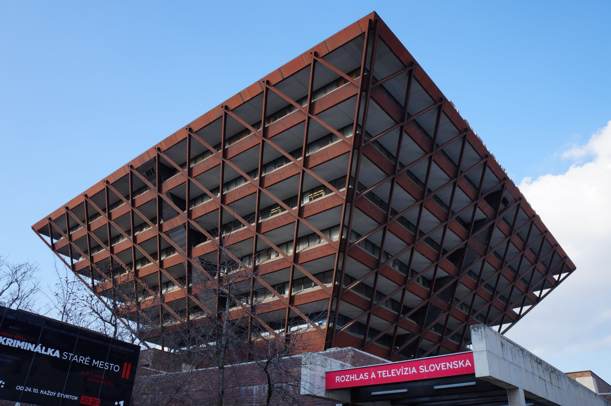

# Ice-cream-cone anti-pattern

*The inverted pyramid: a huge slow E2E layer on top, thin integration in the middle, almost no unit tests at the base - the most common suite shape in the wild, why teams drift into it, what it costs every single day, and how to right it without a rewrite.*

> Nobody plans an ice-cream cone. It happens one reasonable decision at a time: the QA team can write
> browser tests without touching the codebase, so that's where automation starts. Each new feature
> gets a few more browser scenarios. Unit tests are "the developers' job," and the developers are
> busy. Three years later: 700 E2E tests that take five hours and fail somewhere every run, 40
> integration tests, a handful of units - and a team meeting about "what to do about the suite."
> That shape has a name, it is the single most common automation failure in the industry, and this
> note is its anatomy.

> **In real life**
>
> Bratislava's Slovak Radio Building is a pyramid balanced on its point - the widest, heaviest floors
> at the TOP, the whole mass narrowing down to a base a fraction of the roof's size. It stands - but
> look at what standing costs: a heroic steel exoskeleton, massive trusses doing work a normal
> building's walls would do for free, decades of maintenance headaches, and a structure famous mostly
> as a cautionary landmark. An inverted test suite is the same feat of unnecessary engineering: the
> heaviest, most expensive layer (E2E) sits where the smallest should be, the base that should carry
> everything (unit) is nearly empty, and keeping the thing upright consumes retries, wait-tweaks,
> rerun buttons, and engineer-hours that a right-way-up structure simply wouldn't need.

**The ice-cream-cone anti-pattern**: The ice-cream-cone anti-pattern is the automation pyramid inverted: the bulk of automated coverage lives in slow, brittle end-to-end UI tests (the wide scoop on top), integration coverage is thin, and unit tests - the layer meant to carry most of the load - are nearly absent (the narrow tip), often with a thick layer of scripted manual regression testing under it all. Suites drift into this shape for organizational reasons, not technical ones: UI tests can be written without access to (or knowledge of) the codebase, they demo well, and they map one-to-one onto manual test cases. The costs compound daily: multi-hour feedback loops, flake noise that trains the team to distrust and rerun reds, diagnosis archaeology for every failure, and a maintenance bill that grows with every UI change - until the suite is quietly abandoned. Righting the cone is a migration, not a rewrite: push each check down to the lowest layer that can catch its failure, one at a time.

## How the cone forms, and what it costs

- **The drift is organizational, not stupid.** UI automation is the only layer testers can build
  without code access; it demos beautifully ("watch it click through checkout!"); and it converts
  manual test cases one-to-one, which makes progress easy to report. Every force pushes coverage to
  the top; nothing pushes it down. The cone is what a suite looks like when nobody is steering.
- **The math stops working at scale.** Ninety seconds per test is fine for 20 tests (half an hour)
  and catastrophic for 500 (twelve and a half hours). The suite falls out of the pre-merge gate,
  then out of nightly, then runs 'before releases' - and a check that runs rarely protects rarely.
- **Flake noise compounds with count.** Give each browser test a mere 1% chance of a false red -
  timing, animations, a slow environment - and a 500-test run is virtually never clean even when
  the product is perfect. Reds stop meaning 'bug'; the team learns to hit rerun; and one morning a
  RED that was real gets rerun-until-green too. That's how cones ship regressions while having more
  tests than anyone.
- **Every failure is an archaeology dig.** A cone catches a pricing bug as 'checkout flow: total
  incorrect' - the diagnosis the pyramid gets free from a unit test's failure message must now be
  excavated from screenshots, videos, and network logs, one engineer-hour at a time.
- **The bottom being empty is the actual disease.** The E2E count is the symptom everyone sees; the
  killer is what's absent - thousands of millisecond-fast checks that would catch most of those
  same bugs at the keystroke. The cone doesn't just pay too much on top; it forfeits the cheapest
  protection that exists at the bottom.

> **Tip**
>
> Righting a cone is a migration with a simple loop, run continuously: next time an E2E test catches
> (or flakes on) something, ask the push-down question from
> [[automation-foundations/the-automation-pyramid/unit-integration-e2e]] - what's the lowest layer
> that could have caught this? Write that lower test (the E2E failure already identified the exact
> logic and inputs - the expensive part is paid), then delete or demote the E2E version unless it
> guards genuinely assembled behavior. A cone rights itself in months of this loop, with zero
> big-bang rewrite.

> **Common mistake**
>
> Reading this note as "E2E tests are bad" and swinging to the opposite failure: deleting the top of
> the pyramid entirely. The cone's problem was never that E2E tests exist - it's that they're doing
> jobs lower layers do better, at 4500x the runtime. The handful of full-stack flows that guard 'a
> real user can actually sign in and buy' are the most valuable tests in the suite - keep them, run
> them nightly, and let the OTHER five hundred migrate down.


*Slovak Radio Building, Bratislava — Kiwiev, Wikimedia Commons, CC0. [Source](https://commons.wikimedia.org/wiki/File:Slovak_Radio_Building,_Bratislava,_Slovakia.JPG)*
- **The widest, heaviest floors - at the top** — Maximum mass exactly where a structure can least afford it: the cone's giant E2E layer - the slowest, most expensive tests, in the position that should hold the fewest.
- **The floors shrinking toward the ground** — Each level down is smaller than the one above - the cone's thin integration layer, squeezed between a bloated top and a missing base instead of carrying its share of the seams.
- **The tiny footprint at street level** — The whole building meets the ground on almost nothing - the near-empty unit layer: the base meant to carry thousands of fast, pinpoint checks, carrying almost none.
- **The external steel truss grid** — Heroic engineering whose only job is keeping a top-heavy structure standing - the cone's equivalent: retries, waits, rerun buttons, quarantine lists, and flake-triage rotas. Effort a right-way-up suite simply never spends.

**Three years of reasonable decisions becoming a cone - press Play**

1. **Year 1: automation begins where access is** — The QA team can script the UI without touching the codebase - 40 browser tests convert straight from the manual regression checklist. Visible progress, applauded in the sprint review.
2. **Year 2: every feature adds scenarios on top** — The suite hits 250 tests and 2 hours; it leaves the pre-merge gate and moves to nightly. Unit tests remain 'the developers' job' - the developers remain busy.
3. **Year 3: the suite is 700 tests, 5 hours, never green** — A handful of tests flake every run. Reds get rerun by default. Failures take an hour each to diagnose from screenshots. New scenarios still get added - the process says they must.
4. **The quiet abandonment** — The nightly run gets a 'known failures' list. Releases stop waiting for it. The suite still runs - it just no longer decides anything. Everyone privately knows; nobody says it in the meeting.
5. **Verdict** — No single decision was wrong-headed, and nobody chose this shape - which is exactly the warning: a suite's shape must be STEERED. Left to organizational gravity, coverage flows uphill to the most expensive layer there is.

The one-line version: the cone isn't too many E2E tests - it's an empty foundation with the whole
building resting on the roof.

*Run it - what 1% flake does to a cone vs a pyramid (Python)*

```python
# Same product, two suite shapes. Every browser (e2e) test has a 1% false-red rate
# (timing, animations, environment) - real behavior is PERFECT in this scenario.

def all_green_probability(e2e_count, flake_rate):
    return (1 - flake_rate) ** e2e_count

def report(name, e2e_count, seconds_each, flake_rate):
    hours = e2e_count * seconds_each / 3600
    p_green = all_green_probability(e2e_count, flake_rate)
    expected_false_reds = e2e_count * flake_rate
    print(name)
    print("  e2e tests:", e2e_count, "| full e2e run:", round(hours, 1), "hours")
    print("  expected FALSE reds per run:", round(expected_false_reds, 1))
    print("  chance a run is all-green (with ZERO real bugs):",
          str(round(p_green * 100, 2)) + " %")
    print()

print("Product has no bugs today. Each e2e test: 90 s runtime, 1 % flake rate.")
print()
report("ICE-CREAM CONE (500 e2e):", 500, 90, 0.01)
report("PYRAMID TOP (20 e2e):", 20, 90, 0.01)

print("The cone is red nearly every run on flake alone - so the team learns")
print("that red means 'rerun it', and the one morning red means 'real bug',")
print("it gets rerun too. The pyramid's rare red still means: investigate.")
```

Same arithmetic in Java:

*Run it - what 1% flake does to a cone vs a pyramid (Java)*

```java
public class Main {
    static double allGreenProbability(int e2eCount, double flakeRate) {
        return Math.pow(1 - flakeRate, e2eCount);
    }

    static void report(String name, int e2eCount, int secondsEach, double flakeRate) {
        double hours = e2eCount * secondsEach / 3600.0;
        double pGreen = allGreenProbability(e2eCount, flakeRate);
        double expectedFalseReds = e2eCount * flakeRate;
        System.out.println(name);
        System.out.println("  e2e tests: " + e2eCount + " | full e2e run: "
                + Math.round(hours * 10) / 10.0 + " hours");
        System.out.println("  expected FALSE reds per run: "
                + Math.round(expectedFalseReds * 10) / 10.0);
        System.out.println("  chance a run is all-green (with ZERO real bugs): "
                + Math.round(pGreen * 100 * 100) / 100.0 + " %");
        System.out.println();
    }

    public static void main(String[] args) {
        System.out.println("Product has no bugs today. Each e2e test: 90 s runtime, 1 % flake rate.");
        System.out.println();
        report("ICE-CREAM CONE (500 e2e):", 500, 90, 0.01);
        report("PYRAMID TOP (20 e2e):", 20, 90, 0.01);

        System.out.println("The cone is red nearly every run on flake alone - so the team learns");
        System.out.println("that red means 'rerun it', and the one morning red means 'real bug',");
        System.out.println("it gets rerun too. The pyramid's rare red still means: investigate.");
    }
}
```

### Your first time: Your mission: diagnose a suite's shape in fifteen minutes

- [ ] Get the three counts for any suite you can see (or ask about one in an interview) — How many unit, integration, and e2e/UI tests - approximations are fine; the SHAPE is what matters, and a CI config or test directory listing gives it away.
- [ ] Get the three runtimes — Seconds for the unit layer, minutes for integration, and the full e2e wall-clock. Note which CI gate each layer actually runs in - every save, pre-merge, nightly, or 'before releases.'
- [ ] Ask the two cone-symptom questions — How often is the e2e run red for non-bug reasons? And what does the team DO when it's red - investigate, or rerun? 'Rerun' is the cone's tell.
- [ ] Sketch the shape and name it — Pyramid, cone, or hourglass (fat top and bottom, missing middle). If it's a cone, pick the one e2e test you'd migrate down first - the flakiest one that checks pure logic.

You've just run the diagnostic this note's whole anatomy is built on - the same fifteen minutes
works on any team's suite, including one you're interviewing with.

- **The team agrees the suite is a cone, but righting it stalls - nobody has time to write hundreds of unit tests 'on top of' feature work.**
  Stop framing it as a backfill project; wire the migration into work already happening. Two standing rules do it: every e2e failure gets its push-down twin written during the fix (the failure already found the exact logic - twenty minutes, not a project), and every new feature's checks get placed bottom-first. The cone rights itself as a side effect of normal work - the backfill project that never starts is how cones stay cones.
- **E2E count is going down, unit count is going up - but releases aren't getting safer and the team is losing confidence in the migration.**
  Check WHAT was migrated: the easy wins (stable e2e tests of pure logic) move first and fast, but the value is in moving the FLAKY ones and the ones that catch real bugs - each migrated with its e2e version deleted, not kept 'just in case.' A migration that only shrinks the healthy part of the top changes the numbers without changing the suite's actual behavior. Track 'minutes from red to diagnosed cause' rather than counts - that's the number the cone was hurting.

### Where to check

- **Test counts and wall-clock per layer in CI** — the shape diagnosis in two numbers per layer; a five-hour top and a five-second bottom is the cone in its purest form.
- **The rerun statistics on your e2e pipeline** — how many runs pass only on retry; that's the flake noise quantified, and the direct measure of how much 'red' has stopped meaning 'bug.'
- **Where automation effort goes organizationally** — who writes tests at each layer and who CAN; if one team can only contribute at the top, the cone has a standing tailwind no strategy doc will beat.
- **[[automation-foundations/the-automation-pyramid/balancing-the-suite]]** — the next note: what the right shape looks like in practice and how to keep a healthy suite from drifting.

### Worked example: righting one cone, one failure at a time

1. A team inherits a 600-test browser suite: 4.5 hours nightly, red 9 runs out of 10, a
   'known-flaky' list nobody reads. Twelve unit tests exist. They declare no rewrite - just two
   standing rules and a quarterly measurement.
2. Rule one: every e2e failure - real or flake - gets the push-down question during its fix. Week
   one delivers a pricing flake's logic to a unit test (22 minutes, including deleting the e2e
   assertion it replaces), a cart-count race to an integration test on the API, and two genuinely
   assembled flows confirmed as keepers.
3. Rule two: new features place checks bottom-first - the discount feature that quarter ships with
   16 unit, 3 integration, 1 e2e (instead of the historical 12 browser scenarios).
4. Quarter's end: e2e count 410, unit count 380, nightly run 2.8 hours and green most mornings.
   More telling: median time from a red to a diagnosed cause fell from 70 minutes to 9 - most
   failures now arrive as a named function with failing inputs.
5. Two more quarters land the suite at 60 e2e flows (the real keepers), integration in the
   hundreds, units in the thousands. No sprint was ever 'the migration sprint' - the cone was
   righted entirely inside work that was happening anyway.

**Quiz.** A suite has 550 browser tests (5 h nightly, usually red somewhere), 60 integration tests, and 25 unit tests. The team's first instinct is 'we need to fix our flaky E2E tests.' Per this note, what's the more accurate diagnosis?

- [ ] Correct as stated - with better waits and retries, a 550-test browser suite can be made stable, and stability is the real problem
- [ ] The suite has too many tests overall - cut the total count and the noise falls proportionally
- [x] The flake is the symptom; the disease is the shape - most of those 550 checks are doing jobs lower layers do in milliseconds with pinpoint failures, and the empty bottom is forfeiting the cheapest protection available
- [ ] The team lacks E2E expertise - hiring a dedicated automation engineer to own the browser suite would resolve the failures

*Flake-fighting a 550-test browser layer treats the symptom: even at an excellent 1% false-red rate, a run of 550 is almost never clean - the arithmetic, not the waits, makes the top unreliable at that size, and meanwhile every logic bug is being caught 90 seconds late and diagnosed by archaeology. The note's anatomy says the real defect is placement: most of those checks belong at unit or integration, where they'd run in milliseconds and name their failures, and the near-empty base means the cheapest layer of protection isn't happening at all. Option one polishes the wrong layer; option two cuts blindly when the migration should MOVE checks down (total coverage should grow, not shrink); option four staffs the anti-pattern - making it easier to keep building at the top is the drift that created the cone.*

- **The ice-cream-cone anti-pattern, in one sentence** — The pyramid inverted: bulk of coverage in slow, brittle E2E UI tests on top, thin integration, near-empty unit base - often with heavy scripted manual testing underneath.
- **Why teams drift into the cone (three forces)** — UI tests need no code access (testers can build them independently), they demo impressively, and they convert one-to-one from manual test cases - every force pushes coverage up, none pushes it down.
- **The flake arithmetic that kills big E2E layers** — At just 1% false-red per test, a 500-test run is almost never all-green even with zero real bugs - so red stops meaning 'bug', reruns become culture, and real failures get rerun away too.
- **The cone's real disease (vs its visible symptom)** — The symptom is the bloated, flaky top; the disease is the empty bottom - forfeiting thousands of millisecond checks that would catch most of the same bugs at the keystroke, with the failure named.
- **How to right a cone** — A continuous migration, not a rewrite: every e2e failure gets its push-down twin written during the fix (and the e2e version deleted unless it guards assembled behavior), and new features place checks bottom-first.

### Challenge

Find one real E2E or UI-level test you can read (any open-source project's e2e folder works - or
recall one from work). Write its push-down analysis: what does it actually assert, what's the lowest
layer that could catch each assertion failing, and what - if anything - remains that genuinely needs
the full stack? Then write the verdict in one line: 'migrate entirely', 'split: X down, keep the
flow', or 'keeper as-is'. That one-line verdict, written a few hundred times, is how cones get
righted in practice.

### Ask the community

> Our QA team owns a big browser-test suite and can't write unit tests (no codebase access, and the developers say they have no time). Everyone agrees we have an ice-cream cone - but the org structure seems to guarantee it. How do teams actually break this?

Useful replies usually target the structure, not the suite: pairing testers with developers on
push-down twins (the tester brings the failing scenario, the developer writes the unit test - both
learn), making 'checks placed bottom-first' part of a feature's definition of done, and giving QA
integration-layer access (API tests need no UI and no full codebase knowledge) as the middle ground
that starts draining the top.

- [Martin Fowler — Test Pyramid (and the ice-cream cone)](https://martinfowler.com/bliki/TestPyramid.html)
- [Thoughtworks — The Software Testing Cupcake (Anti-Pattern)](https://www.thoughtworks.com/insights/blog/introducing-software-testing-cupcake-anti-pattern)
- [Interview DOT — Test Pyramid & Ice Cream Cone Anti Pattern](https://www.youtube.com/watch?v=Re4anDcHSwA)

🎬 [Interview DOT — Test Pyramid & Ice Cream Cone Anti Pattern](https://www.youtube.com/watch?v=Re4anDcHSwA) (2 min)

- The ice-cream cone is the pyramid inverted - coverage concentrated in slow, brittle E2E tests with a near-empty unit base - and it's the most common suite shape in the wild.
- Nobody chooses it: organizational gravity (code access, demo value, one-to-one manual conversion) pushes coverage to the top unless the shape is actively steered.
- Its costs compound: multi-hour feedback, flake arithmetic that makes big runs red on noise alone, rerun culture that eventually reruns away real bugs, and archaeology per failure.
- The visible symptom is the bloated top; the actual disease is the forfeited bottom - the cheapest, fastest, most precise protection not existing.
- Right it by migration inside normal work: push-down twins for every e2e failure, bottom-first placement for every new feature, measure minutes-from-red-to-cause - never a big-bang rewrite, and never by deleting the genuine full-stack keepers.


## Related notes

- [[Notes/automation-foundations/the-automation-pyramid/unit-integration-e2e|Unit / integration / E2E]]
- [[Notes/automation-foundations/the-automation-pyramid/balancing-the-suite|Balancing the suite]]
- [[Notes/automation-foundations/pitfalls/flaky-tests|Flaky tests]]


---
_Source: `packages/curriculum/content/notes/automation-foundations/the-automation-pyramid/ice-cream-cone-anti-pattern.mdx`_
