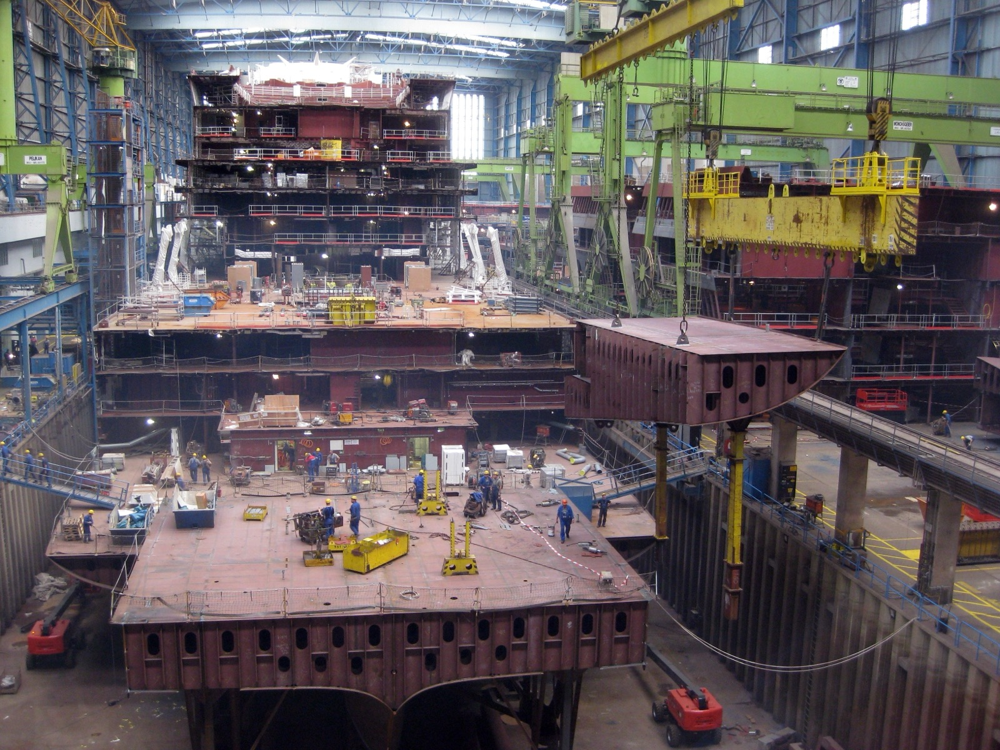

# Unit / integration / E2E

*The pyramid's three layers: unit tests check one piece in isolation (fast, precise, thousands), integration tests check the seams where pieces meet (slower, hundreds), E2E tests drive the whole assembled system (slowest, fragile, few) - and a check's layer decides how fast and precisely it fails.*

> Two teams automate the same check: "a discount code reduces the total correctly." Team A writes it
> as a browser test - launch the app, sign up, add items, apply the code, read the total off the
> screen: 90 seconds, and when it fails, the report says "total was wrong." Team B writes it as a unit
> test on the pricing function - call it with a cart and a code, compare numbers: 20 milliseconds, and
> when it fails, the report names the exact function and inputs. Same check. The difference between
> "somewhere in checkout, something's off" and "applyDiscount rounds half-cents wrong" is not the
> tool - it's the LAYER the check runs at. That choice of layer is what this chapter is about.

> **In real life**
>
> A cruise ship isn't built as one piece and then inspected once at sea. In the building dock, every
> steel block is welded and checked ALONE first - X-ray the welds, measure the plate, reject or fix on
> the spot, cheaply. Then blocks are craned together and the SEAMS get checked: do the deck lines
> meet, do the pipe runs and cable trays line up across the joint? Only at the very end does the
> finished ship do sea trials - the whole vessel, engines, steering, everything at once, out on the
> water. Sea trials are essential and irreplaceable - and so expensive and late that no shipyard would
> dream of using them to find a bad weld. Unit tests are the block checks. Integration tests are the
> seam checks. E2E is the sea trial - and the pyramid exists because a yard that skips block checks
> finds its bad welds at sea.

**Unit, integration, and E2E tests**: The automation pyramid's three layers, bottom to top: UNIT TESTS exercise one small piece of code (a function, a class) in complete isolation from everything else - they run in milliseconds, pinpoint failures to exact code, and you can afford thousands. INTEGRATION TESTS exercise the seams where pieces meet - your code against a real database, two modules together, an API endpoint through its HTTP surface - catching the mismatches isolation hides; they cost more setup and run slower, so you keep hundreds. END-TO-END (E2E) TESTS drive the fully assembled system the way a user would - real browser, real backend, real data flow - proving the whole thing hangs together; they are the slowest, most brittle, and most expensive to diagnose, so you keep few, reserved for the flows that matter most. The pyramid shape IS the advice: many at the bottom, fewer in the middle, fewest on top.

## What each layer actually buys and costs

- **Unit: speed and precision.** Milliseconds per test means the whole layer runs on every save.
  Isolation means a failure names the exact function and inputs - diagnosis is reading the assertion.
  The blind spot: perfect pieces can still fail to fit; a unit test can't see that your code and the
  database disagree about a column name.
- **Integration: the seams.** Real database, real HTTP, two real modules - this layer catches
  exactly what isolation hides: schema drift, serialization mismatches, wrong assumptions about
  another module's contract. Costs: environment setup, seconds per test, and a failure that points
  to a seam rather than a line.
- **E2E: the whole assembly.** One flow through browser, backend, and data proves what no lower
  layer can - the system, as deployed, works for a user. Costs: minutes per run, sensitivity to
  timing and environment (the flakiness lives here), and failures that say "checkout broke" and
  leave the where to you.
- **The gradient to remember.** Going up the pyramid: confidence-per-test rises, but speed,
  precision, and stability all fall, and cost rises. That's why count goes DOWN as you go up -
  thousands, hundreds, a handful - and why each check belongs at the LOWEST layer that can catch
  its failure.
- **The push-down rule.** Before writing any automated check, ask: what's the lowest layer that
  would catch this bug? Price logic - unit. Code-vs-database agreement - integration. "A signed-in
  user can actually buy a thing" - E2E, and nothing lower will do.

> **Tip**
>
> The layers answer different questions, and the sharpest way to keep them straight: unit answers
> "is this piece right?", integration answers "do these pieces fit?", E2E answers "does the whole
> thing work?" A failure at any layer should send you to exactly that question - if your E2E suite is
> your main way of finding wrong PIECES, checks are running two layers too high.

> **Common mistake**
>
> Treating E2E as "the real tests" and lower layers as developer busywork - because E2E "tests what
> the user sees." The user-realism is genuine; the mistake is concluding more realism is always
> better. Realism is exactly what makes E2E slow, fragile, and vague when it fails - spending it on
> checks a unit test would catch means feedback in minutes instead of milliseconds and archaeology
> instead of a pointed failure. Realism is a scarce budget: spend it only where nothing cheaper works.


*AIDAmar under construction, Meyer Werft Baudock 1, Papenburg — Sir James, Wikimedia Commons, CC BY 3.0. [Source](https://commons.wikimedia.org/wiki/File:2011-08-26_Papenburg_Meyer-Werft_Baudock_1_AIDAmar.JPG)*
- **One block, alone on the crane hook** — Built and inspected as a single unit before it ever touches the ship - welds X-rayed, dimensions measured, defects fixed cheaply right here. A unit test: one piece, in isolation, failures pinpointed while they're still trivial to fix.
- **Sections being fitted together, workers on the seams** — Each block was fine alone - now the checks are about the JOINTS: do deck lines meet, do pipe runs align across the boundary? Integration tests live exactly here, catching what isolation can't see.
- **The superstructure, decks already stacked** — The assembled whole taking shape - and the only place questions like 'does the ship actually sail' can ever be answered. E2E: the full system exercised as one, essential and late and expensive, which is why it verifies flows, not welds.
- **The gantry crane spanning the dock** — Working at whole-ship scale takes heavy, expensive infrastructure - like E2E's browsers, environments, seeded data, and minutes-long runs. The higher the layer, the more machinery every single check drags behind it.

**The same bug, caught at each of the three layers - press Play**

1. **A developer edits rounding in the pricing function - and gets it wrong** — Classic regression: applyDiscount now drops half-cents. Three suites are waiting for it at three layers.
2. **Unit layer: 40 milliseconds later** — The pricing test fails on save: 'applyDiscount(29.99, SAVE10) expected 26.99, got 26.98.' Exact function, exact inputs, fixed before the code is even committed.
3. **Integration layer: 8 seconds, on the pre-merge run** — The orders-API test fails: 'POST /orders returned total 26.98, expected 26.99.' The seam is named - somewhere behind that endpoint - but the search inside it is yours.
4. **E2E layer: 4 minutes, on the nightly run** — 'Checkout flow: displayed total incorrect.' True - and now the suspect list is the browser, the API, the pricing module, the database, and the seed data. Diagnosis becomes a project.
5. **Verdict** — All three layers CAN catch it. The pyramid's point is where it should be caught: at the lowest layer that can see it - fastest feedback, sharpest pointer, cheapest fix. Each layer above is the safety net, not the net.

The push-down rule, one more time, because it's the whole chapter: every check belongs at the
lowest layer that can catch its failure - and the layers above it exist for what genuinely can't
be pushed down.

*Run it - what a suite's layer mix does to feedback time (Python)*

```python
# Two suites, same 600 behaviors covered. Layer speeds: unit 0.02s, integration 2s, e2e 90s.
# Each layer runs at its own gate: unit on every save, integration pre-merge, e2e nightly.

def layer_report(count, seconds_each, gate, budget_s):
    total = count * seconds_each
    fits = "fits" if total <= budget_s else "BLOWS"
    mins = round(total / 60, 1)
    return str(count).rjust(3) + " tests, " + str(mins).rjust(6) + " min - " + fits + " the " + gate + " budget"

def describe(name, unit, integration, e2e):
    print(name)
    print("  unit        " + layer_report(unit, 0.02, "on-every-save (30 s)", 30))
    print("  integration " + layer_report(integration, 2, "pre-merge (10 min)", 600))
    print("  e2e         " + layer_report(e2e, 90, "nightly (2 h)", 7200))
    print()

print("Same 600 behaviors, two layer mixes:")
print()
describe("PYRAMID SUITE (500 unit / 80 integration / 20 e2e):", 500, 80, 20)
describe("INVERTED SUITE (30 unit / 70 integration / 500 e2e):", 30, 70, 500)

print("Consequences when a pricing-logic bug lands:")
print("  pyramid:  a unit test fails 0.02 s after save and names the function")
print("  inverted: nothing fires until the nightly e2e run - which no longer even")
print("            finishes in its window - then names... 'checkout'")
```

Same arithmetic in Java:

*Run it - what a suite's layer mix does to feedback time (Java)*

```java
public class Main {
    static String layerReport(int count, double secondsEach, String gate, int budgetS) {
        double total = count * secondsEach;
        String fits = total <= budgetS ? "fits" : "BLOWS";
        double mins = Math.round(total / 60.0 * 10) / 10.0;
        String c = String.valueOf(count);
        while (c.length() < 3) c = " " + c;
        String m = String.valueOf(mins);
        while (m.length() < 6) m = " " + m;
        return c + " tests, " + m + " min - " + fits + " the " + gate + " budget";
    }

    static void describe(String name, int unit, int integration, int e2e) {
        System.out.println(name);
        System.out.println("  unit        " + layerReport(unit, 0.02, "on-every-save (30 s)", 30));
        System.out.println("  integration " + layerReport(integration, 2, "pre-merge (10 min)", 600));
        System.out.println("  e2e         " + layerReport(e2e, 90, "nightly (2 h)", 7200));
        System.out.println();
    }

    public static void main(String[] args) {
        System.out.println("Same 600 behaviors, two layer mixes:");
        System.out.println();
        describe("PYRAMID SUITE (500 unit / 80 integration / 20 e2e):", 500, 80, 20);
        describe("INVERTED SUITE (30 unit / 70 integration / 500 e2e):", 30, 70, 500);

        System.out.println("Consequences when a pricing-logic bug lands:");
        System.out.println("  pyramid:  a unit test fails 0.02 s after save and names the function");
        System.out.println("  inverted: nothing fires until the nightly e2e run - which no longer even");
        System.out.println("            finishes in its window - then names... 'checkout'");
    }
}
```

### Your first time: Your mission: sort ten checks onto the pyramid

- [ ] Write down 10 things worth verifying about an app you know (BuggyShop works) — Mix them deliberately: some pure logic (price math, validation rules), some data plumbing (saving, loading, searching), some full user flows (sign up and buy).
- [ ] For each, ask the push-down question: what's the LOWEST layer that would catch this failing? — Pure logic with no I/O - unit. Anything about two parts agreeing (code and DB, client and API) - integration. Only 'the whole assembled flow works for a user' - e2e.
- [ ] Count your three piles — A healthy sort of a real feature usually lands most in unit, several in integration, one or two in e2e - the pyramid emerges from honest push-down, it isn't imposed.
- [ ] For every check you put in e2e, write the one-line reason nothing lower could catch it — If you can't write that line, the check just found its way one layer down - which is the skill this note exists to build.

You've just done test placement - the layer decision that, made well or badly a few hundred times,
becomes the difference between the pyramid and next note's ice-cream cone.

- **The E2E suite regularly catches bugs that are pure logic errors - wrong totals, bad validation - and each one takes an hour to trace back to a function.**
  Those checks are running two layers too high. For each such catch, write the unit test that would have caught it (you now know the exact function and inputs - the E2E failure paid for that knowledge), and keep the E2E flow only if it also guards something assembled. Over a quarter this migration is exactly how inverted suites get righted.
- **Unit and integration layers are green, releases still break - failures are always about deployed parts not talking to each other: wrong URLs, missing env vars, misconfigured services.**
  That failure class lives ABOVE your coverage: nothing is exercising the assembled system. You don't need many - add a handful of E2E smoke flows through the deployed stack (sign in, one core transaction, one read path). The pyramid's top being small was never license for it to be empty.

### Where to check

- **Your suite's own runtime report** — count tests and total seconds per layer; the shape (and whether the bottom actually runs in seconds) tells you more than any strategy doc.
- **Where the last five real bugs were CAUGHT vs where they COULD have been** — each gap between those two layers is a concrete push-down candidate with the evidence already in hand.
- **The failure message of a recent red at each layer** — does the unit failure name a function, the integration failure name a seam, the e2e failure name a flow? If all three read the same, the layers aren't doing their separate jobs.
- **[[automation-foundations/the-automation-pyramid/ice-cream-cone-anti-pattern]]** — the next note: what happens to teams that build this structure upside down, and why it's the most common suite shape in the wild.

### Worked example: placing the checks for one feature: 'apply a discount code at checkout'

1. A tester sits down to automate coverage for the discount-code feature and lists what could
   break: the percentage math, half-cent rounding, expired codes rejected, code case-insensitivity,
   the code surviving a page refresh, the API rejecting a code for the wrong region, and 'a user
   can actually apply a code and pay the discounted total.'
2. Push-down pass, math first: percentage, rounding, expiry logic, case handling - all pure
   functions of cart and code. Four unit tests... then twelve more as edge cases surface (zero-item
   cart, 100% code, stacking rules). Milliseconds each. Nobody hesitates to add the twelfth.
3. The seams next: 'API rejects wrong-region codes' needs the real endpoint and real region data -
   integration, two tests. 'Code survives refresh' is client state meeting server session -
   integration, one test through the API surface.
4. Last: one E2E flow - sign in, add items, apply SAVE10, complete purchase, assert the charged
   total. Not because it re-proves the math (sixteen unit tests own that), but because nothing
   lower proves a real user, in a real browser, gets the discounted charge end to end.
5. Final shape for one feature: 16 unit, 3 integration, 1 e2e - a pyramid, arrived at by nothing
   fancier than asking 'what's the lowest layer that catches this?' seven times.

**Quiz.** A bug report: the app's password-strength meter marks 'abc123' as strong because the scoring function weighs length wrong. Which layer should the regression test for this live at, and why?

- [ ] E2E - drive the real signup page, type 'abc123', and assert the meter shows 'weak', since that's what the user sees
- [ ] Integration - test the signup API with the weak password and assert it's rejected
- [x] Unit - call the scoring function with 'abc123' and assert the returned score, because the defect is pure logic in one function and no lower layer exists
- [ ] All three layers equally, for defense in depth

*The defect lives entirely inside one function's logic - a scoring calculation with no I/O, no seam, no assembly involved - so the push-down rule lands it at unit: milliseconds to run, and a failure that names the function and input. The E2E version spends 90 browser-bound seconds and a fragile selector to check what one function call proves, and its failure message ('meter looked wrong') restarts the diagnosis this bug already paid for once. The integration option tests a different behavior (rejection policy at the API seam - worth having if that's a real rule, but it wouldn't pinpoint the scoring logic). 'All three equally' ignores the entire cost gradient - duplicating a logic check up the pyramid buys almost no confidence and triples the maintenance.*

- **The three layers and their questions** — Unit: is this piece right? (one function/class in isolation). Integration: do these pieces fit? (real seams - DB, HTTP, module boundaries). E2E: does the whole assembled thing work for a user? (real browser, real stack).
- **The shipyard analogy** — Blocks are X-rayed alone (unit), seams checked as blocks join (integration), sea trials prove the whole ship (E2E) - and no yard uses sea trials to find bad welds, which is exactly the pyramid's advice.
- **The gradient going UP the pyramid** — Confidence-per-test rises; speed, precision, and stability fall; cost rises. Hence the counts: thousands / hundreds / a handful.
- **The push-down rule** — Every check belongs at the LOWEST layer that can catch its failure - logic at unit, seam agreements at integration, only genuinely assembled behavior at E2E.
- **Why 'E2E is most realistic' doesn't mean 'mostly E2E'** — Realism is exactly what costs speed, stability, and diagnostic precision - it's a scarce budget, spent only on checks that need the whole assembly, not on logic a millisecond unit test pinpoints.

### Challenge

Take the last bug you personally found, fixed, or read a report about. Write the check that would
have caught it at each of the three layers - one line each: what it exercises, what it asserts,
roughly what it costs to run. Then circle the lowest layer that catches it, and note what each
higher layer's version would have added (honestly - often it's 'nothing but runtime'). That circle
is the push-down rule, applied to a bug you actually know.

### Ask the community

> My team's suite is 400 browser tests and 12 unit tests, and management sees the browser tests as 'the real testing' since they cover what users do. What's the strongest argument for investing at the bottom of the pyramid?

Useful replies usually skip theory and price out one week of failures: total minutes from each red
to its diagnosed cause, split by layer - browser-test failures cost hours of archaeology each while
unit failures cost minutes, and that ledger (plus 'we can only run the browser suite nightly, so
bugs age a day before we hear') tends to argue better than any diagram.

- [Ham Vocke (martinfowler.com) — The Practical Test Pyramid](https://martinfowler.com/articles/practical-test-pyramid.html)
- [Google Testing Blog — Just Say No to More End-to-End Tests](https://testing.googleblog.com/2015/04/just-say-no-to-more-end-to-end-tests.html)
- [Automation Nation — Test Automation Pyramid Explained](https://www.youtube.com/watch?v=_v_fRNou2mQ)

🎬 [Automation Nation — Test Automation Pyramid Explained](https://www.youtube.com/watch?v=_v_fRNou2mQ) (7 min)

- Unit tests check one piece in isolation (milliseconds, pinpoint failures, thousands); integration tests check the seams where pieces meet (seconds, hundreds); E2E tests drive the assembled system (minutes, fragile, few).
- Going up the pyramid, confidence-per-test rises while speed, precision, and stability fall - which is why counts shrink toward the top.
- The push-down rule decides placement: every check goes to the lowest layer that can catch its failure.
- E2E's realism is a scarce budget - spend it on flows only the whole assembly can prove, never on logic a unit test pinpoints.
- A healthy pyramid isn't imposed - it emerges from asking 'what's the lowest layer that catches this?' honestly, check after check.


## Related notes

- [[Notes/automation-foundations/the-automation-pyramid/ice-cream-cone-anti-pattern|Ice-cream-cone anti-pattern]]
- [[Notes/automation-foundations/the-automation-pyramid/balancing-the-suite|Balancing the suite]]
- [[Notes/automation-foundations/why-and-when-to-automate/what-to-automate|What to automate]]


---
_Source: `packages/curriculum/content/notes/automation-foundations/the-automation-pyramid/unit-integration-e2e.mdx`_
