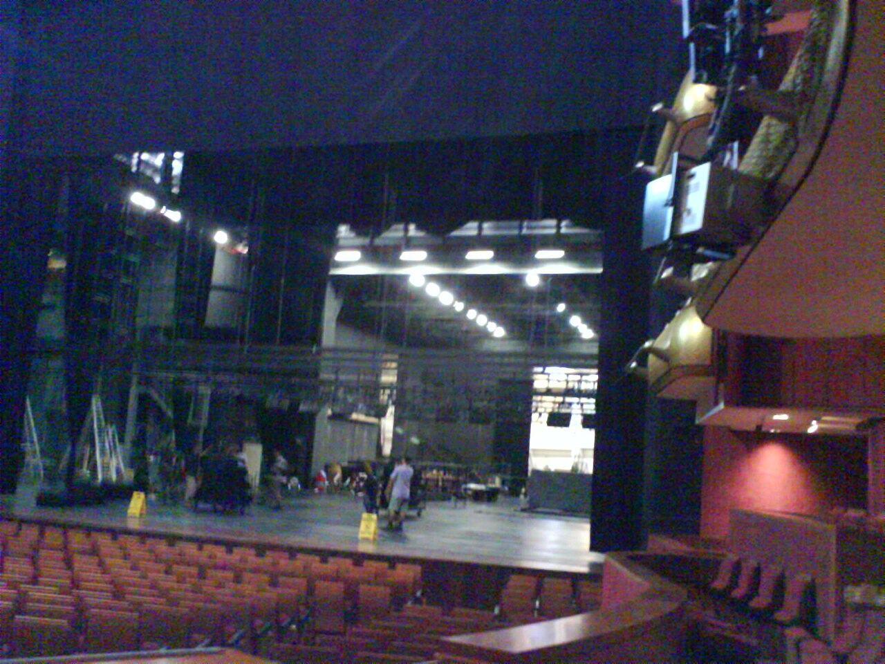

# Playwright

*Playwright combines browser automation with web-first waiting, isolation, tracing, parallelism, and a strong test runner—especially compelling for modern web teams that want one integrated stack.*

> A checkout test fails only in CI. The useful question is not "can the tool click?" Every serious tool
> can. It is "what did the browser see, what was it waiting for, which network call finished, and can a
> developer replay the exact moment?" Playwright's appeal is the amount of that workflow delivered as one
> coherent system rather than assembled afterward.

> **In real life**
>
> A theatre rehearsal brings stage, actors, cues, lighting, and a stage manager into one controlled run.
> Playwright is similar: browser contexts isolate casts, locators wait for actionable cues, the runner
> schedules performances, and traces preserve the prompt book. Integration reduces handoff gaps, but the
> script still needs a meaningful story and an honest final judgment.

**Playwright**: Playwright is an open-source browser automation library available for TypeScript/JavaScript, Python, Java, and .NET. Playwright Test, its Node.js test runner, bundles fixtures, isolation, parallelism, assertions, reporting, and tracing. It drives Playwright-managed Chromium, Firefox, and WebKit builds; those are not identical to every branded browser release.

## The integrated modern-web workload

As checked on **2026-07-18**, official docs say core browser automation is available in TypeScript,
Python, Java, and .NET, while runner integration differs by language. Playwright Test provides its
richest bundled experience for Node.js. It installs specific Chromium, Firefox, and WebKit builds per
release and can also target installed Chrome and Edge channels. Its patched Firefox is not branded
Firefox, and its WebKit build is not branded Safari; for closest Safari-like media behavior, official
docs recommend WebKit on macOS.

Auto-waiting checks visibility, stability, event reception, and enabled state before actions. Web-first
assertions retry observable conditions. Browser contexts cheaply isolate sessions, and traces combine
DOM snapshots, actions, network, console, and attachments. These features remove common plumbing—not
the need for stable data, user-facing locators, and specific assertions.

> **Tip**
>
> Choose the language experience deliberately. "Playwright supports Java" and
> "Playwright Test's Node runner bundles tracing and fixtures" are both true, but they are not the same
> developer experience. Prototype in the language you will maintain.

> **Common mistake**
>
> Treating auto-wait as permission to ignore state. It waits for actionability,
> not business completion. A button can be clickable while the order is still processing; assert the
> specific receipt or API-visible result.


*Stage of the Theatre, Esplanade, during rehearsals — I luv erky, Wikimedia Commons, public domain. [Source](https://commons.wikimedia.org/wiki/File:Stage_of_the_Theatre,_Esplanade_%E2%80%93_Theatres_on_the_Bay,_Singapore,_during_rehearsals_-_20070119.jpg)*
- **Controlled stage** — A browser context is a fresh stage: isolated storage and session state for one test.
- **Lighting cues** — Actionability checks wait for the visible, stable moment instead of sleeping a guessed duration.
- **Backstage monitors** — Trace, console, network, screenshots, and video turn a failed run into inspectable evidence.

**A web-first Playwright action**

1. **Resolve locator** — A user-facing locator must identify exactly one intended element.
2. **Check actionability** — Playwright waits for visible, stable, enabled, and event-receiving state as required.
3. **Perform action** — The click happens once the preconditions pass, or times out with evidence.
4. **Assert outcome** — A retrying assertion waits for the business-visible result; a trace records the path.

*Model actionability before a click (Python)*

```python
snapshots = [
    (0, False, False, True),
    (120, True, False, True),
    (240, True, True, True),
]

def actionable(visible, stable, enabled):
    return visible and stable and enabled

ready_at = next((ms for ms, v, s, e in snapshots if actionable(v, s, e)), None)
assert ready_at == 240, "actionability oracle rejected: " + str(ready_at)
print("snapshots:", len(snapshots))
print("ready-at-ms:", ready_at)
print("verdict:", "PASS" if ready_at == 240 else "FAIL")
```

*Model actionability before a click (Java)*

```java
import java.util.*;

public class Main {
    record Snapshot(int ms, boolean visible, boolean stable, boolean enabled) {}
    static boolean actionable(Snapshot s) { return s.visible() && s.stable() && s.enabled(); }
    public static void main(String[] args) {
        var snapshots = List.of(new Snapshot(0, false, false, true),
                new Snapshot(120, true, false, true), new Snapshot(240, true, true, true));
        int readyAt = snapshots.stream().filter(Main::actionable).mapToInt(Snapshot::ms).findFirst().orElse(-1);
        if (readyAt != 240) throw new AssertionError("actionability oracle rejected: " + readyAt);
        System.out.println("snapshots: " + snapshots.size());
        System.out.println("ready-at-ms: " + readyAt);
        System.out.println("verdict: " + (readyAt == 240 ? "PASS" : "FAIL"));
    }
}
```

### Your first time: Evaluate the integrated workflow

- [ ] Install with the official starter — Record generated runner, browser, and CI choices.
- [ ] Write one user-facing locator flow — Prefer role, label, or test id; avoid DOM-position selectors.
- [ ] Force one real failure — Open the trace and judge whether a teammate could diagnose it without rerunning.
- [ ] Run the required projects — Separate managed browser engines from branded-browser commitments.

- **The click succeeds but the next assertion races.**
  Assert the business outcome with a web-first assertion; actionability covers the click target, not downstream completion.
- **WebKit passes on Linux but Safari customers still report a media bug.**
  Treat Playwright WebKit as coverage, not branded Safari identity; reproduce on the committed macOS/Safari environment.

### Where to check

- Trace Viewer for action, DOM, network, console, and attachment evidence.
- The browser/version installation log after every Playwright upgrade.
- Project configuration for device, channel, locale, permissions, and retries.

### Worked example: A TypeScript product team shipping weekly

The frontend is TypeScript, CI is Linux, required coverage is Chromium/Firefox/WebKit engine behavior,
and developers need fast local debugging. Playwright Test is a strong fit because runner, contexts,
parallel projects, traces, and web-first assertions arrive together. If the release instead promises
old vendor versions on a corporate Grid, that same convenience would not erase Selenium's matrix fit.

**Quiz.** What does Playwright auto-waiting NOT prove?

- [ ] The target was visible and enabled for the action
- [ ] The target received events
- [x] The business transaction completed correctly
- [ ] The locator resolved before timeout

*Actionability prepares an interaction. Only a specific outcome assertion can prove the business transaction.*

- **Browser context** — A cheap isolated browser session with separate cookies/storage, useful per test.
- **Web-first assertion** — An assertion that retries an observable browser condition until it passes or times out.
- **Important browser caveat** — Managed Firefox/WebKit builds provide engine coverage but are not every branded Firefox/Safari release.

### Challenge

Change the last snapshot's `stable` value to false. Verify both playground oracles reject
the mutation, then explain why clicking anyway would turn a timing defect into a random test result.

### Ask the community

> Our team likes Playwright's runner, but production support says Safari. What matrix should we run?

Strong replies separate fast engine coverage from release acceptance: managed WebKit in ordinary CI,
then the committed branded Safari/macOS combinations in a smaller compatibility gate.

- [Playwright — Installation and bundled runner](https://playwright.dev/docs/intro)
- [Playwright — Auto-waiting and actionability](https://playwright.dev/docs/actionability)
- [Playwright — Browsers](https://playwright.dev/docs/browsers)

🎬 [Get Started with Playwright and VS Code (2025 edition)](https://www.youtube.com/watch?v=WvsLGZnHmzw) (20 min)

- Playwright's advantage is an integrated modern-web workflow, not merely browser clicking.
- Auto-waiting covers action preconditions; web-first assertions must prove outcomes.
- Language bindings share core automation, but runner ecosystems differ.
- Managed engines and branded browsers must not be silently treated as identical support claims.


## Related notes

- [[Notes/automation-foundations/the-tool-landscape/selenium|Selenium]]
- [[Notes/automation-foundations/the-tool-landscape/cypress|Cypress]]
- [[Notes/automation-foundations/the-tool-landscape/choosing-a-tool|Choosing a tool]]


---
_Source: `packages/curriculum/content/notes/automation-foundations/the-tool-landscape/playwright-tool.mdx`_
